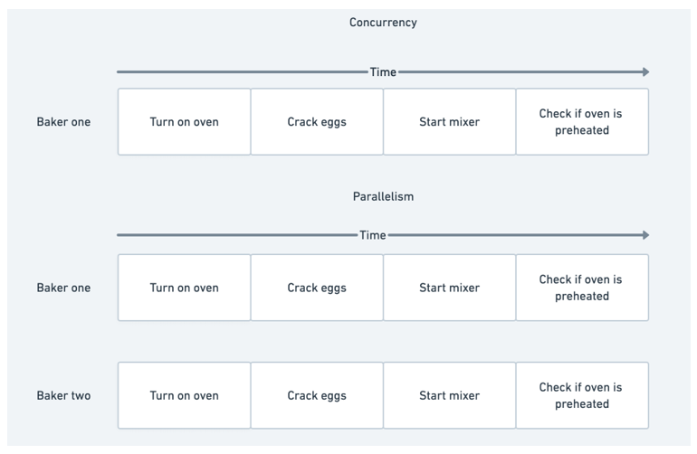
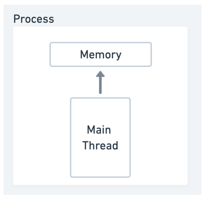
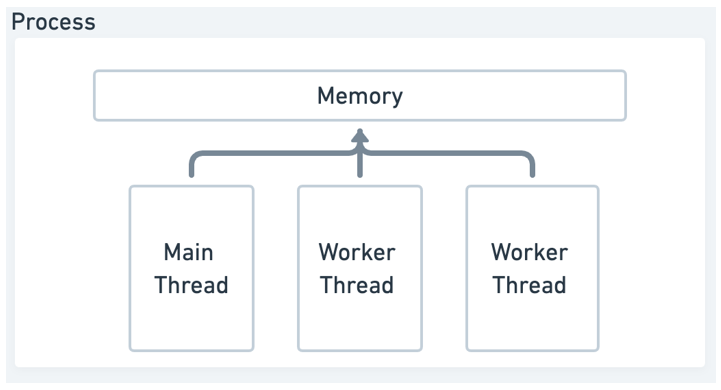
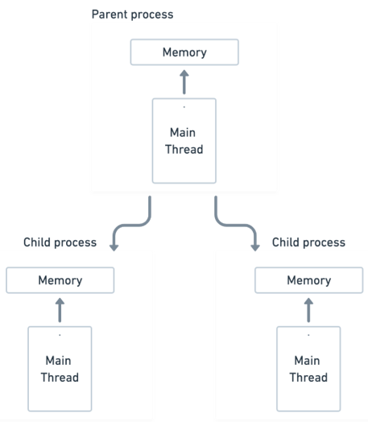
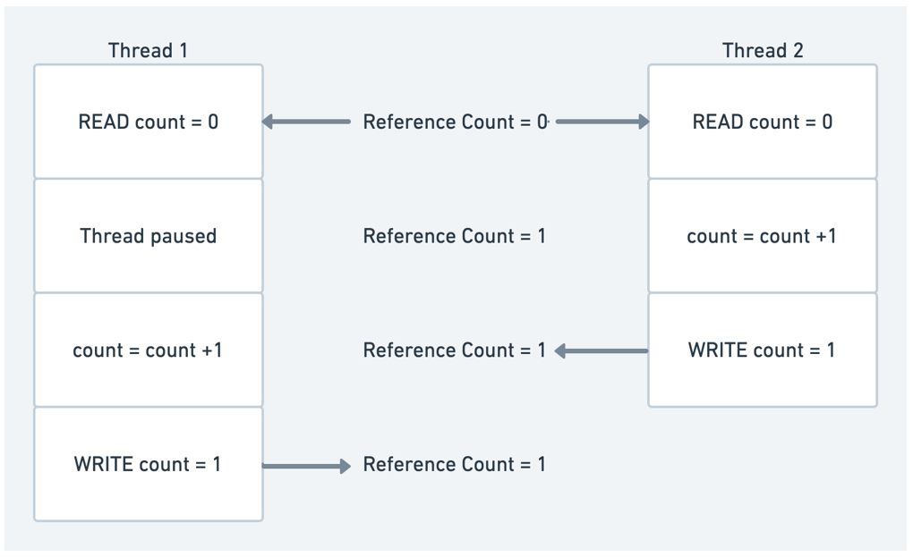
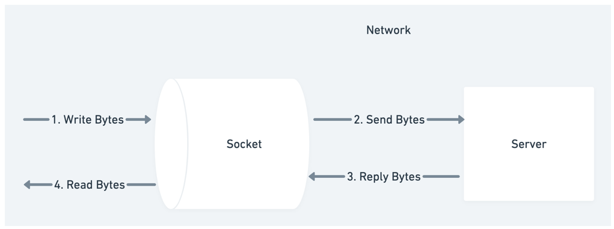
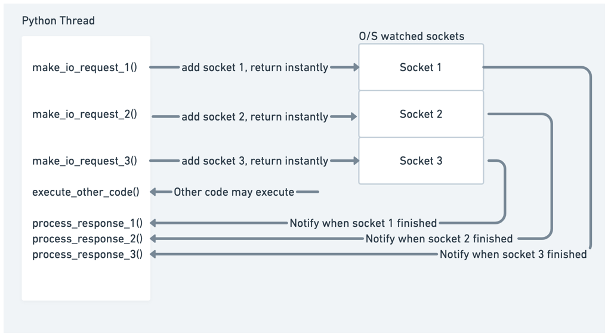
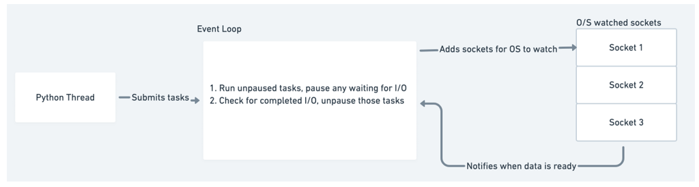
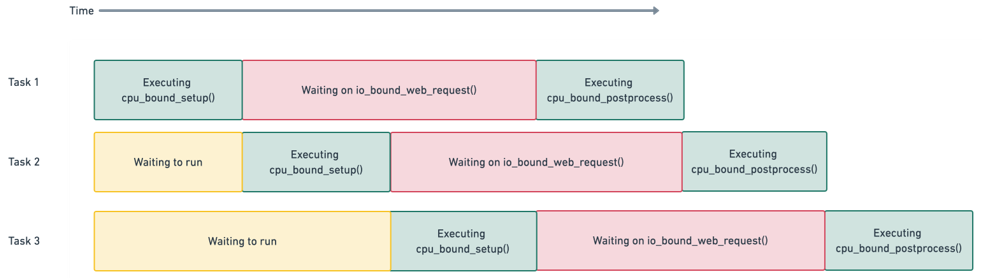

# 了解 ASYNCIO

本章涵盖

- asyncio 是什么以及它提供的好处
- 并发、并行、线程和进程
- 全局解释器锁及其对并发性的挑战
- 非阻塞套接字如何仅用一个线程实现并发
- 围绕基于事件循环的并发如何工作的基础知识

许多应用程序，尤其是在当今的 Web 应用程序世界中，严重依赖 I/O 操作。这些类型的操作包括从 Internet 下载网页内容、通过网络与一组微服务进行通信，或者针对 MySQL 或 Postgres 等数据库运行多个查询。 Web 请求或与微服务的通信可能需要数百毫秒，如果网络很慢，甚至可能需要几秒钟。数据库查询可能会很昂贵，尤其是在该数据库处于高负载或查询很复杂的情况下。 Web 服务器可能需要同时处理数百个甚至数千个请求。这些操作在时间方面可能很昂贵。

同时发出许多这样的 I/O 请求会导致严重的性能问题。如果我们像在顺序的、非并发的应用程序中那样一个接一个地运行这些请求，我们将看到复合的性能影响。例如，如果我们正在编写一个需要下载一百个网页或运行一百个查询的应用程序，每个查询需要一秒钟的时间来执行，那么我们的应用程序将至少需要一百秒才能运行。但是，如果我们要利用并发性，同时开始下载，同时等待，理论上我们可以在短短 1 秒内完成这些操作。

Asyncio 最初是在 Python 3.4 中引入的，作为处理这些高并发工作负载的一种方式。正确使用这个库可以显着提高使用 I/O 操作的应用程序的性能和资源利用率，因为它允许我们同时启动许多这些长时间运行的任务。

在本章中，我们将介绍并发的基础知识，以便更好地理解如何使用 Python 和 asyncio 库来实现它。我们将探索 CPU 密集型工作和 I/O 密集型工作之间的差异，以了解哪种并发模型最适合我们的特定需求。我们还将了解进程和线程的基础知识，并了解 Python 中由其全局解释器锁引起的并发性的独特挑战。最后，我们将了解如何利用一个称为非阻塞 I/O 的概念和事件循环来仅使用一个 Python 进程和线程来实现并发。这是 asyncio 的主要并发模型。

## 1.1 什么是 asyncio？
在同步应用程序中，代码按顺序运行。下一行代码在前一行代码完成后立即运行，并且一次只发生一件事。该模型适用于许多（如果不是大多数）应用程序。但是，如果一行代码特别慢怎么办？在这种情况下，我们慢行之后的所有其他代码都将被卡住，等待该行完成。这些可能很慢的代码行称为阻塞，因为它们会阻止应用程序运行任何其他代码。我们中的许多人以前在有问题的用户界面中看到过这种情况，我们很欢快地四处点击，直到应用程序卡死，给我们留下一个微调器或无响应的用户界面。这是一个应用程序被阻止导致糟糕的用户体验的示例。

如果任何操作都需要足够长的时间，则可能会阻塞，但许多应用程序会阻塞 I/O(输入/输出)。 I/O 是指计算机的输入和输出设备，例如键盘、硬盘驱动器或最常见的网卡。这些操作例如等待用户输入或从基于 Web 的 API 检索内容。在同步应用程序中，我们将一直等待这些操作完成，直到我们可以运行其他任何操作。这可能会导致性能和响应问题，因为我们在任何给定时间只能运行一个长时间的操作，并且该操作将阻止我们的应用程序执行任何其他操作。

此问题的一种解决方案是引入并发性。用最简单的术语来说，并发意味着允许同时处理多个任务。在并发 I/O 的情况下，一些示例是允许同时发出多个 Web 请求或允许同时连接到 Web 服务器。

有几种方法可以在 Python 中实现这种并发性。 Python 生态系统中最近添加的内容之一是 asyncio 库。 Asyncio 是异步 I/O 的缩写，是一个 Python 库，它允许我们使用异步编程模型运行代码。这让我们可以同时处理多个 I/O 操作，同时仍然允许我们的应用程序保持响应。

那么，什么是异步编程？异步编程意味着一个特定的长时间运行的任务可以在后台运行，与主应用程序分开。与其阻塞所有其他应用程序代码等待该长时间运行的任务完成，我们可以自由地做其他不依赖于该任务的工作。然后，一旦长时间运行的任务完成，我们会收到通知它已完成，以便我们处理结果。

在 Python 3.4 版本中，首先引入了 asyncio，其中包含装饰器以及生成器 yield from 语法以定义协程。协程是一种方法，当我们有一个长时间运行的任务时可以暂停，然后在该任务完成时恢复。在 Python 3.5 版中，当关键字 async 和 await 显式添加到语言中时，该语言获得了对协程和异步编程的一流支持。这种语法在 C# 和 Javascript 等其他编程语言中很常见，它允许我们使我们的异步代码看起来像是同步运行的。这使得异步代码易于阅读和理解，因为它看起来像大多数软件工程师熟悉的顺序流程。 Asyncio 是一个使用称为单线程事件循环的并发模型以异步方式执行这些协程的库。

虽然 asyncio 的名称可能会让我们认为这个库只适用于 I/O 操作，但它还具有处理其他类型操作的功能，以及通过与多线程和多处理进行互操作。通过这种互操作性，我们可以将 async 和 await 语法与线程和进程一起使用，从而使这些工作流更易于理解。这意味着这个库不仅适用于基于 I/O 的并发，而且还可以用于 CPU 密集型代码。

为了更好地了解 asyncio 可以帮助我们处理哪些类型的工作负载，以及哪种并发模型最适合每种类型的并发，让我们来探讨 I/O 和 CPU 绑定操作之间的区别。

## 1.2 什么是 I/O 限制，什么是 CPU 限制？
当我们将操作称为 I/O 限制或 CPU 限制时，我们指的是阻止该操作更快运行的限制因素。这意味着，如果我们提高操作所限制的性能，该操作将在更短的时间内完成。

在 CPU 受限操作的情况下，如果我们的 CPU 更强大，它会更快地完成，例如通过将其时钟速度从 2 GHZ 提高到 3 GHZ。在 I/O 限制操作的情况下，如果我们的 I/O 设备可以在更短的时间内处理更多数据，它会变得更快。这可以通过我们的 ISP 增加我们的网络带宽或升级到更快的网卡来实现。

CPU 限制操作通常是 Python 世界中的计算和处理代码。这方面的一个例子是计算 pi 的数字或循环字典的内容，应用业务逻辑。在 I/O 限制操作中，我们大部分时间都在等待网络或其他 I/O 设备。 I/O 限制操作的一个示例是向 Web 服务器发出请求或从我们机器的硬盘驱动器中读取文件。

```python
import requests
 
response = requests.get('https://www.example.com')
 
headers = [f'{key}: {response.headers[key]}' for key in response.headers]
 
formatted_headers = '\n'.join(headers)
 
with open('headers.txt', 'w') as file:
    file.write(formatted_headers)
```

I/O 绑定和 CPU 绑定操作通常并存。清单 1.1 向我们展示了一个例子。我们首先发出一个 I/O 绑定请求来下载 https://www.example.com 的内容。一旦我们得到响应，我们将执行一个 CPU 绑定循环来格式化响应的标头并将它们转换为由换行符分隔的字符串。然后我们打开一个文件并将字符串写入该文件，这两个都是 I/O 绑定操作。

异步 I/O 允许我们在进行 I/O 操作时“暂停”特定方法的执行并等待该 I/O 完成。虽然我们已经“暂停”了该方法，但我们可以在后台等待初始 I/O 完成时运行其他代码。这允许我们同时执行许多 I/O 操作，从而潜在地加速我们的应用程序。

## 1.3 理解并发、并行和多任务
为了更好地理解并发如何帮助我们的应用程序更好地执行，首先重要的是学习并充分理解并发编程的术语。特别是，我们将更多地了解并发的含义以及 asyncio 如何使用称为多任务的概念来实现它。

### 1.3.1 什么是并发和并行？
#### 并发

当我们说两个任务同时发生时，我们的意思是这些任务同时发生。以烤蛋糕为例。为了烤蛋糕，我们需要预热烤箱。预热可能需要几十分钟，具体取决于我们的烤箱和烘烤温度，但我们不需要等待烤箱预热后再开始其他任务，例如将面粉和糖与鸡蛋混合在一起。如果我们打开烤箱预热然后开始制作面糊，我们的行为是同时进行的。

#### 并行

虽然并发仅仅意味着多个任务同时发生，但并不意味着它们同时运行。当我们说某事并行运行时，我们的意思是不仅有两个或多个任务同时发生，而且它们同时执行。回到我们的蛋糕烘焙示例，想象一下我们用不同的食谱而不是一个来烘焙两个蛋糕。鉴于这两种食谱不同，我们一次只能制作一种面糊。但是，如果我们有另一个人来帮助我们，我们可以在他们开始处理第二个击球手的同时处理第一个击球手。两个人同时制作面糊是并行的，因为我们有两个任务同时运行。



并发性和并行性的概念是相似的，并且在区分方面有些混乱，但对我们来说了解是什么使它们彼此不同是很重要的。

### 1.3.2 并发和并行的区别
并发性是指有多个可以独立发生的任务。我们可以在只有一个内核的 CPU 上实现并发，因为该操作将利用抢占式多任务（在下一节中定义）在任务之间切换。然而，并行性意味着我们必须同时执行两个任务。在具有一个核心的机器上，这是不可能的。为了使这成为可能，我们需要一个具有多个内核的 CPU，它可以同时运行两个东西。

虽然并行意味着并发，但并发并不总是意味着并行。在多核机器上运行的多线程应用程序既是并发的又是并行的。在这个设置中，我们都有多个任务同时运行，并且有两个内核独立执行与这些任务相关的代码。但是，通过多任务处理，我们可以同时执行多个任务，但在给定时间只有一个在执行。

### 1.3.3 什么是多任务处理？
多任务处理在当今世界无处不在。我们一边做早餐，一边接听电话或接听短信，一边等待水烧开。我们甚至在上下班途中同时处理多项任务，在火车带我们去办公室时看书。多任务处理主要有两种，抢占式多任务处理和协作多任务处理。

#### 抢先式多任务处理
在这个模型中，我们让操作系统决定如何通过一个称为时间片的进程在当前正在执行的工作之间切换。当操作系统在工作之间切换时，它被称为抢占。这种机制如何在幕后工作取决于操作系统本身。这主要是通过使用多个线程或多个进程来实现的。

#### 合作多任务
在这个模型中，我们不是依靠操作系统来决定何时在当前正在执行的工作之间切换，而是在我们的应用程序中显式地编写代码点，我们可以让其他任务运行。我们应用程序中的任务在它们“合作”的模型中运行，明确表示“我正在暂停我的任务一段时间，继续运行其他任务”。

### 1.3.4 协同多任务的好处
Asyncio 使用协作多任务来实现并发。当我们的应用程序达到可以等待一段时间返回结果的程度时，我们在代码中显式地标记它。这允许其他代码在我们等待结果返回后台时运行。一旦我们标记的任务完成，我们实际上“唤醒”并继续执行任务。这为我们提供了一种并发形式，因为我们可以同时启动多个任务，但重要的是不是并行性，因为它们不会同时执行任何代码。

协作式多任务处理比抢占式多任务处理有一些好处。首先是它的资源密集度较低。当操作系统需要在运行线程或进程之间切换时，它涉及到所谓的上下文切换。上下文切换是相当密集的操作，因为操作系统必须保存有关正在运行的进程或线程的信息才能重新加载它。第二个好处是粒度。操作系统知道应该根据它使用的调度算法暂停线程或任务，但这可能不是暂停的最佳时间。通过协作式多任务处理，我们明确标记了最适合暂停任务的区域。这给我们带来了一些效率提升，因为我们只有在明确知道是时候切换任务时才会切换任务。

现在我们了解了并发、并行和多任务处理，我们将使用这些概念来了解如何在 Python 中使用线程和进程来实现它们。

## 1.4 理解进程、线程、多线程和多处理
为了更好地了解 Python 世界中并发的工作原理，我们首先需要了解线程和进程如何工作的基础知识。然后，我们将研究如何将它们用于多线程和多处理以同时进行工作。让我们首先从有关进程和线程的一些定义开始。

#### 进程
进程是我们运行的应用程序，它有自己的内存空间，其他应用程序无法访问。创建 Python 进程的一个例子是运行一个简单的“hello world”应用程序或在命令行输入 python 来启动 REPL（读取 eval 打印循环）。多个进程可以在一台机器上运行。如果我们在一台拥有多核 CPU 的机器上，我们可以同时执行多个进程。如果我们在只有一个内核的 CPU 上，我们仍然可以通过一种称为“时间片”的操作系统结构同时运行多个应用程序。当操作系统使用时间片时，它会在一段时间后自动切换哪个进程正在运行。确定何时发生此切换的算法因操作系统而异。

#### 线程
线程可以被认为是轻量级的进程，它们是操作系统可以管理的最小结构。它们不像进程那样拥有自己的内存，而是共享创建它们的进程的内存。线程与创建它们的进程相关联，并且一个进程将始终至少有一个与之关联的线程，通常称为主线程。一个进程还可以创建其他线程，通常称为工作线程或后台线程。这些线程可以与主线程同时执行其他工作。线程，就像进程一样，可以在多核 CPU 上并排运行，操作系统也可以通过利用时间片在它们之间切换。当我们运行一个普通的 Python 应用程序时，我们会创建一个进程以及一个负责运行我们的 Python 应用程序的主线程。



```python
import os
import threading
 
print(f'Python process running with process id: {os.getpid()}')
 
total_threads = threading.active_count()
thread_name = threading.current_thread().getName()
 
print(f'Python is currently running {total_threads} thread(s)')
print(f'The current thread is {thread_name}')
```

在清单 1.2 中，我们创建了一个简单的应用程序来向我们展示主线程的基础知识。我们首先获取进程 ID 并打印它以证明我们确实有一个专用进程在运行。然后，我们获取正在运行的线程的活动计数以及当前线程的名称，以表明我们正在运行一个线程，即主线程。虽然每次运行此代码时进程 ID 都会有所不同，但运行清单 1.2 将给出类似于以下内容的输出。

```python
Python process running with process id: 98230
Python currently running 1 thread(s)
The current thread is MainThread
```

进程还可以创建共享主进程内存的其他线程。这些线程可以在所谓的多线程中同时为我们做其他工作。



```python
import threading
 
 
def hello_from_thread():
    thread_name = threading.current_thread()
    print(f'Hello from thread {thread_name}!')
 
 
hello_thread = threading.Thread(target=hello_from_thread)
hello_thread.start()
 
total_threads = threading.active_count()
thread_name = threading.current_thread().getName()
 
print(f'Python is currently running {total_threads} thread(s)')
print(f'The current thread is {thread_name}')
 
hello_thread.join()
```

在清单 1.3 中，我们创建了一个方法来打印当前线程的名称，然后创建一个线程来运行该方法。然后我们调用线程的 start 方法开始运行它。最后，我们调用join方法。 join 将导致程序暂停，直到我们开始的线程完成。如果我们运行上面的代码，我们将看到类似于以下的输出

```python
Hello from thread <Thread(Thread-1, started 123145541312512)>!
Python is currently running 2 thread(s)
The current thread is MainThread
```

多线程应用程序是在许多语言中实现并发的常用方法。然而，在 Python 中利用线程的并发性存在一些挑战。特别是，多线程只适用于 I/O 密集型工作，因为我们受到全局解释器锁的限制，我们将在 1.5 节深入讨论。

多线程并不是我们实现并发的唯一方式；我们还可以创建多个进程来为我们同时工作。这称为多处理。在多处理中，父进程创建一个或多个由它管理的子进程。然后它可以将工作分配给这些子进程。



Python 为我们提供了多处理模块来处理这个问题。 API 类似于 threading 模块的 API。我们首先创建一个带有目标函数的进程。然后我们调用它的 start 方法来执行它，最后调用它的 join 方法来等待它完成运行。

```python
import multiprocessing
import os
 
 
def hello_from_process():
    print(f'Hello from child process {os.getpid()}!')
 
 
if __name__ == '__main__':
    hello_process = multiprocessing.Process(target=hello_from_process)
    hello_process.start()
 
    print(f'Hello from parent process {os.getpid()}')
 
    hello_process.join()
```

在清单 1.x 中，我们创建了一个打印其进程 id 的子进程，我们还打印出父进程 id 以证明我们正在运行不同的进程。当我们有 CPU 密集型工作时，多处理通常是最好的。

多线程和多处理似乎是启用 Python 并发的灵丹妙药。但是，这些并发模型的强大功能受到 Python 的一个实现细节的阻碍，即全局解释器锁。

## 1.5 理解全局解释器锁
全局解释器锁，缩写为 GIL，发音为“gill”，是 Python 社区中一个有争议的话题。简而言之，GIL 阻止任何 Python 进程在任何给定时间执行多个 Python 字节码指令。这意味着即使我们在多核机器上有多个线程，我们一次也只能有一个线程运行 Python 代码。在我们拥有多核 CPU 的世界中，这对于希望利用并发性来提高应用程序性能的 Python 开发人员来说可能构成重大挑战。

那么为什么 GIL 会存在呢？答案在于 CPython 如何管理内存。在 CPython 中，内存主要由称为引用计数的进程管理。引用计数通过跟踪当前需要访问特定 Python 对象（例如整数、字典或列表）的人员来工作。引用计数只是一个整数，用于跟踪有多少地方“引用”了该特定对象。当某人不再需要该引用的对象时，引用计数会减少，当其他人需要它时，它会增加。当引用计数达到零时，没有人引用该对象，可以将其从内存中删除。

> 什么是 CPYTHON？
> CPython 是 Python 的参考实现。通过参考实现，我们的意思是它是语言的标准实现，并被用作语言正确行为的“参考”。 Python 还有其他实现，例如 Jython 和 IronPython。

与线程的冲突源于 CPython 中的实现不是线程安全的。当我们说 CPython 不是线程安全的时，我们的意思是如果两个或多个线程修改一个共享变量，该变量可能会以一种意外状态结束。这种意外状态取决于线程访问变量的顺序，通常称为竞争条件。当两个线程需要同时引用一个 Python 对象时，可能会出现竞争条件。



如果两个线程同时增加引用计数，我们可能会遇到这样一种情况：一个线程导致引用计数为零，而对象仍在被另一个线程使用。当我们尝试读取可能被删除的内存时，可能的结果是应用程序崩溃。

为了演示 GIL 对多线程编程的影响，让我们来看看计算斐波那契数列中第 n 个数的 CPU 密集型任务。我们将使用一个相当慢的算法实现来演示一个时间密集型操作。一个适当的解决方案将利用记忆或数学技术来提高性能。

```python
import time


def print_fib(number: int) -> None:
    def fib(n: int) -> int:
        if n == 1:
            return 0
        elif n == 2:
            return 1
        else:
            return fib(n - 1) + fib(n - 2)
 
    print(f'fib({number}) is {fib(number)}')


def fibs_no_threading():
    print_fib(40)
    print_fib(41)


start = time.time()
 
fibs_no_threading()

end = time.time()

print(f'Completed in {end - start} seconds.')
```

此实现利用递归，总体上是一个相当慢的算法，需要指数 O(2^N) 时间来完成。如果我们需要打印两个斐波那契数，很容易同步调用它们并对结果进行计时，就像我们在清单 1.4 中所做的那样。

根据我们运行的 CPU 的速度，我们会看到不同的时序，但运行清单 1.4 中的代码将产生类似于以下的输出：

```python
fib(40) is 63245986
fib(41) is 102334155
Completed in 65.15168905258179 seconds.
```

这是一个相当长的计算，但我们对 print_fibs 的每个函数调用都是完全独立的。这意味着它们可以放在多个线程中，理论上我们的 CPU 可以在多个内核上同时运行，从而加快我们的应用程序。

```python
import threading
import time


def fibs_with_threads():
    fortieth_thread = threading.Thread(target=print_fib, args=(40,))
    forty_first_thread = threading.Thread(target=print_fib, args=(41,))

    fortieth_thread.start()
    forty_first_thread.start()

    fortieth_thread.join()
    forty_first_thread.join()


start_threads = time.time()

fibs_with_threads()

end_threads = time.time()

print(f'Threads took {end_threads - start_threads} seconds.')
```

在清单 1.5 中，我们创建了两个线程，一个用于计算 fib(40)，一个用于计算 fib(41)，并通过在每个线程上调用 start() 来同时启动它们。然后我们调用 join() ，这将导致我们的主程序等待线程完成。鉴于我们同时开始计算 fib(40) 和 fib(41) 并同时运行它们，人们会认为我们可以看到合理的加速，但是，即使在多线程上，我们也会看到如下所示的多核机器上。

```python
fib(40) is 63245986
fib(41) is 102334155
Threads took 66.10594320297241 seconds.
```

我们的线程版本几乎完全相同。事实上，它甚至慢了一点！这几乎完全是由于 GIL 以及创建和管理线程的开销。虽然线程确实是并发运行的，但由于锁定，一次只允许其中一个运行 Python 代码。这使另一个线程处于等待状态，直到第一个线程完成，这完全否定了多个线程的值。

### 1.5.1 GIL 释放？
基于前面的示例，你可能想知道 Python 中的并发是否可以在线程中发生，因为 GIL 阻止我们同时运行两行 Python。 GIL 不会永远持有，因此我们不能使用多个线程来发挥我们的优势。

当 I/O 操作发生时，全局解释器锁被释放。这让我们可以利用线程在 I/O 方面进行并发工作，但不能用于 CPU 绑定的 Python 代码本身。为了说明这一点，让我们举一个读取网页状态码的例子。

```python
import time
import requests


def read_example() -> None:
    response = requests.get('https://www.example.com')
    print(response.status_code)


sync_start = time.time()

read_example()
read_example()

sync_end = time.time()

print(f'Running synchronously took {sync_end - sync_start} seconds.')
```

在清单 1.6 中，我们检索了 example.com 的内容并打印了两次状态码。根据我们的网络连接速度和我们的位置，在运行此代码时，我们将看到类似于以下的输出：

```python
200
200
Running synchronously took 0.23061609268188477 seconds.
```

现在我们有了一个同步版本的基线，我们可以编写一个多线程版本来进行比较。在我们的多线程版本中，我们将为对 example.com 的每个请求创建一个线程，以尝试同时运行它们。

```python
import time
import threading
import requests


def read_example() -> None:
    response = requests.get('https://www.example.com')
    print(response.status_code)


thread_1 = threading.Thread(target=read_example)
thread_2 = threading.Thread(target=read_example)

thread_start = time.time()

thread_1.start()
thread_2.start()

print('All threads running!')

thread_1.join()
thread_2.join()

thread_end = time.time()

print(f'Running with threads took {thread_end - thread_start} seconds.')
```

当我们执行清单 1.7 时，我们将看到类似于以下的输出，这再次取决于我们的网络连接和位置：

```python
All threads running!
200
200
Running with threads took 0.0977330207824707 seconds.
```

这大约比我们不使用线程的原始版本快两倍，因为我们几乎同时运行了两个请求！当然，根据你的互联网连接和机器规格，你会看到不同的结果，但数字应该在方向上相似。

那么为什么我们可以为 I/O 释放 GIL 但不能用于 CPU 绑定操作呢？答案在于幕后进行的系统调用。在 I/O 的情况下，低级系统调用在 Python 运行时之外。这允许 GIL 被释放，因为它不直接与 Python 对象交互。在这种情况下，仅当接收到的数据被转换回 Python 对象时才会重新获取 GIL。然后在操作系统级别，I/O 操作同时执行。该模型为我们提供了并发性，但没有提供并行性。在 Java 或 C++ 等其他语言中，我们将在多核机器上获得真正的并行性，因为我们没有 GIL 并且可以同时执行。然而，在 Python 中，由于 GIL，我们能做的最好的事情就是 I/O 操作的并发，但是在给定的时间只有一段 Python 代码在执行。

### 1.5.2 Asyncio 和 GIL
Asyncio 利用 I/O 操作释放 GIL 为我们提供并发性这一事实，即使只有一个线程。当我们使用 asyncio 时，我们创建了称为协程的对象。协程可以被认为是执行轻量级线程。就像我们可以同时运行多个线程一样，每个线程都有自己的并发 I/O 操作，我们可以让许多协程一起运行。当我们等待 I/O 绑定的协程完成时，我们仍然可以执行其他 Python 代码，从而为我们提供并发性。重要的是要注意 asyncio 并没有规避 GIL，我们仍然受制于它。如果我们有一个 CPU 密集型任务，我们仍然需要使用多个进程来并发执行它（这可以通过 asyncio 本身来完成），否则会导致我们的应用程序出现性能问题。

既然我们知道只用一个线程就可以实现 I/O 的并发性，让我们深入了解它如何与非阻塞套接字一起工作的细节。

## 1.6 单线程并发是如何工作的
在上一节中，我们介绍了多线程作为实现 I/O 操作并发的机制。但是，我们不需要多个线程来实现这种并发性，我们可以在一个进程和一个线程的范围内完成这一切。我们通过利用系统级别的 I/O 操作可以同时完成这一事实来做到这一点。为了更好地理解这一点，我们需要深入研究套接字是如何工作的，特别是非阻塞套接字是如何工作的。

### 1.6.1 什么是套接字？
套接字是用于通过网络发送和接收数据的低级抽象。它是数据传输到服务器和从服务器传输的基础。套接字支持两种主要操作，发送字节和接收字节。我们将字节写入套接字，然后将其发送到远程地址，通常是某种类型的服务器。然后，一旦我们发送了这些字节，我们就等待服务器将其响应写回我们的套接字。一旦这些字节被发送回我们的套接字，我们就可以读取结果。

虽然套接字是一个低级概念，但如果你将它们视为邮箱，它们就很容易理解。你可以将一封信放入你的邮箱中，然后你的邮递员会取走该信并将其递送到收件人的邮箱。收件人打开他们的邮箱和你的信，根据内容可能会给你回信。在这个类比中，你可能会将字母视为我们要发送的数据或字节。假设将一封信放入邮箱的行为是将字节写入套接字并打开邮箱以从套接字读取字节来读取字母。邮递员可以被认为是互联网上的传输机制，将数据路由到正确的地址。

如前所述，在从 example.com 获取内容的情况下，我们打开一个连接到 example.com 的服务器的套接字。然后我们编写一个请求以获取该套接字的内容并等待服务器回复结果，在本例中为网页的 HTML。



默认情况下，套接字是阻塞的。套接字阻塞是什么意思？简而言之，这意味着当我们等待服务器回复数据时，我们会暂停我们的应用程序或阻塞，直到我们获得要读取的数据。因此，我们的应用程序会停止运行任何其他任务，直到我们从服务器获取数据、发生错误或超时。

在操作系统级别，我们不需要做这个阻塞。套接字可以在非阻塞模式下运行。在非阻塞模式下，当我们向套接字写入字节时，我们可以触发并忘记写入或读取，我们的应用程序可以继续执行其他任务。稍后，我们可以让操作系统告诉我们我们收到了字节并在那时处理它。这允许应用程序在我们等待字节返回给我们时做任何其他数量的事情。我们不再阻塞和等待数据来到我们身边，而是变得更加被动，让操作系统在有数据可供我们采取行动时通知我们。

在底层，这是由几个不同的事件通知系统执行的，具体取决于我们运行的操作系统。 Asyncio 已经足够抽象，它可以根据我们的操作系统支持的通知系统在不同的通知系统之间切换。

- kqueue – FreeBSD 和 MacOS
- epoll——Linux
- IOCP（I/O 完成端口）- Windows

这些系统将跟踪我们的非阻塞套接字，并在它们准备好让我们对它们做某事时通知我们。这个通知系统是 asyncio 如何实现并发的基础。在 asyncio 的并发模型中，我们只有一个线程在任何给定时间执行 Python。当我们遇到一个 I/O 操作时，我们会将其交给操作系统的事件通知系统来为我们跟踪它。一旦我们完成了这个移交，我们的 Python 线程就可以自由地继续运行其他 Python 代码或为操作系统添加更多非阻塞套接字来为我们跟踪。当我们的 I/O 操作完成时，我们“唤醒”正在等待结果的任务，然后继续运行该 I/O 操作之后出现的任何其他 Python 代码。



但是，我们如何跟踪哪些任务正在等待 I/O，而不是那些因为它们是常规 Python 代码而可以运行的任务呢？答案在于称为事件循环的构造。

## 1.7 理解 asyncio 事件循环
事件循环是每个 asyncio 应用程序的核心。事件循环是许多系统中相当常见的设计模式，并且已经存在了相当长的一段时间。如果你曾经在浏览器中使用 JavaScript 发出异步 Web 请求，那么你已经在事件循环上创建了一个任务。幕后的 Windows GUI 应用程序使用所谓的“消息循环”作为处理键盘输入等事件的主要机制，同时仍允许 UI 进行绘制。

最基本的事件循环非常简单。我们创建一个包含事件或消息列表的队列。然后我们永远循环，在消息进入队列时一次处理一条消息。在 Python 中，一个基本的事件循环可能看起来像这样：

```python
from collections import deque


messages = deque()

while True:
    if messages:
        message = messages.pop()
        process_message(message)
```

在 asyncio 中，事件循环保留任务队列而不是消息。任务是围绕称为协程的构造的包装器。协程是一种可以在遇到 I/O 绑定操作时暂停执行并让事件循环运行其他不等待 I/O 操作完成的任务的方法。

当我们创建一个事件循环时，我们会创建一个空的任务队列。然后我们可以将任务放入队列中运行。事件循环的每次迭代都会检查需要运行的任务，并一次运行一个，直到任务遇到 I/O 操作。那时任务将被“暂停”，我们将指示我们的操作系统监视任何套接字以完成 I/O。然后我们将寻找下一个要运行的任务。在事件循环的每次迭代中，我们将检查是否有任何 I/O 已完成，如果已完成，我们将“唤醒”任何暂停的任务并让它们完成运行。



为了说明这一点，让我们假设我们有三个任务，每个任务都发出一个异步 Web 请求。想象一下，这些任务有一些代码要做设置，这是 CPU 密集型的，然后它们发出 Web 请求，然后是一些 CPU 密集型的后处理代码。现在让我们将这些任务同时提交给事件循环。在伪代码中，我们会这样写：

```python
def make_request():
    cpu_bound_setup()
    io_bound_web_request()
    cpu_bound_postprocess()


task_one = make_request()
task_two = make_request()
task_three = make_request()
```

由于所有三个任务都以 CPU 密集型工作开始并且我们是单线程的，因此只有第一个任务开始执行代码，其他两个任务等待运行。一旦任务一中的 CPU 绑定设置工作完成，它会触发 I/O 绑定操作并暂停自己说，“我正在等待 I/O，任何其他等待运行的任务都可以运行”。

一旦发生这种情况，任务二就可以开始执行了。任务二启动其 CPU 绑定代码，然后暂停等待 I/O。此时任务一和任务二都在同时等待他们的网络请求完成。由于任务一和任务二都暂停等待 I/O，我们开始运行任务三。

现在想象一下，一旦任务 3 暂停以等待其 I/O 完成，任务 1 的 Web 请求就完成了。现在，我们的操作系统的事件通知系统会提醒我们此 I/O 已完成。我们现在可以在任务二和任务三都在等待它们的 I/O 完成时继续执行任务一。



如果我们查看该图的任何垂直部分，我们可以看到在任何给定时间只有一个 CPU 绑定的工作正在运行，但是，我们最多同时发生两个 I/O 绑定操作。每个任务等待 I/O 的重叠是 asyncio 真正节省时间的地方。

## 1.8 总结
Asyncio 是一个库，它允许我们异步处理 I/O 和其他操作，允许我们利用并发来加速我们的应用程序。在本章中，我们介绍了一些对异步和并发都很重要的重要概念。

- CPU 绑定工作是主要利用计算机处理器的工作，而 I/O 绑定工作主要利用我们的网络或其他输入/输出设备。 Asyncio 主要帮助我们使 I/O 绑定工作并发，但它也公开了用于使 CPU 绑定工作并发的 API。
- 进程和线程是操作系统级别最基本的并发单元。进程可用于 I/O 和 CPU 绑定的工作负载，线程只能用于有效管理 I/O 绑定的工作，这主要是由于 GIL 阻止了 Python 代码并行执行。
- 我们已经看到如何使用非阻塞套接字而不是在等待数据进入时停止我们的应用程序，我们可以指示我们的操作系统在数据进入时告诉我们。利用这一点是允许 asyncio 实现并发性的一部分只有一个线程。
- 我们已经介绍了事件循环，它是异步应用程序的核心。事件循环永远循环，寻找具有 CPU 绑定工作的任务来运行，同时暂停等待 I/O 的任务。

在下一章中，我们将更多地介绍如何编写代码来处理这些 I/O 绑定操作，并了解更多关于如何创建我们可以暂停的称为协程的方法。