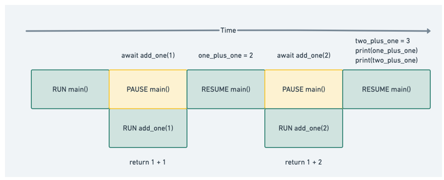
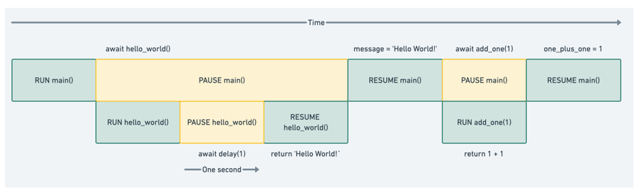
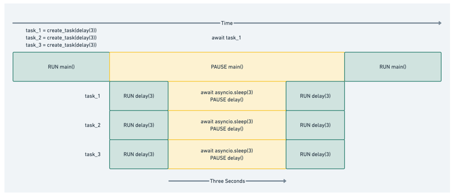
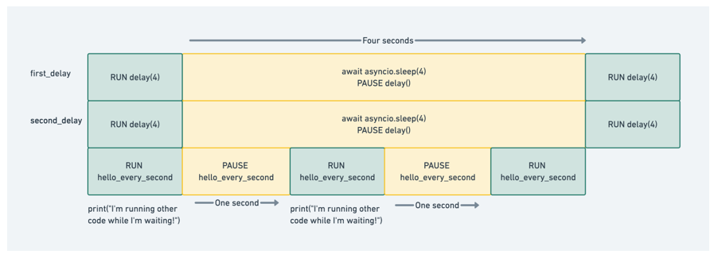
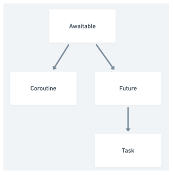

# ASYNCIO 基础

本章涵盖

- 什么是协程以及如何创建它们
- 异步等待语法的基础
- 如何模拟长时间运行的操作
- 如何与任务同时运行协程
- 如何取消任务
- 如何手动创建事件循环
- 如何测量协程的执行时间
- 如何在调试模式下运行以获取信息日志消息
- 运行协程时需要注意的问题

在上一章中，我们深入探讨了并发性，看看我们如何使用进程和线程来实现它。我们还介绍了如何利用非阻塞 I/O 和事件循环来实现仅使用一个线程的并发。在本章中，我们将介绍如何使用带有 asyncio 的单线程并发模型编写程序的基础知识。使用本章中的技术，你将能够执行长时间运行的操作，例如 Web 请求、数据库查询和网络连接，并串联执行它们。

我们将学习更多关于称为协程的构造以及如何使用 async await 语法来定义和运行协程。我们还将研究如何通过使用任务来并发运行协程，并通过创建可重用的计时器来检查我们从并发运行中节省的时间。最后，我们将看看软件工程师在使用 asyncio 时常犯的错误，以及如何使用调试模式来发现这些问题。

## 2.1 介绍协程

将协程想象成一个普通的 Python 函数，但它具有在遇到可能需要一段时间才能完成的操作时暂停执行的超能力。当那个长时间运行的操作完成时，我们可以“唤醒”我们暂停的协程并完成执行该协程中的任何其他代码。当一个暂停的协程正在等待它暂停的操作完成时，我们可以运行其他代码。等待时其他代码的运行是我们应用程序并发的原因。我们还可以同时运行多个耗时的操作，这可以大大提高我们的应用程序的性能。

要创建和暂停协程，我们需要学习使用 Python 的 async 和 await 关键字。 async 关键字将让我们定义一个协程；当我们有一个长时间运行的操作时，await 关键字可以让我们暂停我们的协程。

> 我应该使用哪个 Python 版本？
>
> 本书中的代码假设你使用的是 Python 的最新版本，即 Python 3.10。运行早于此版本的代码可能会缺少某些 API 方法、功能可能不同或可能存在错误。

### 2.1.1 使用 async 关键字创建协程

创建协程很简单，与创建普通 Python 函数没有太大区别。唯一的区别是，我们不使用 def 关键字，而是使用 async def。 async 关键字将函数标记为协程，而不是普通的 Python 函数。

清单 2.1 使用 async 关键字

```python
async def my_coroutine() -> None
    print(‘Hello world!’)
```

上面清单中的协程除了打印“Hello world！”之外什么也没做。 还值得注意的是，这个协程不执行任何长时间运行的操作。 它只是打印我们的信息并返回。 这意味着，当我们将协程放在事件循环上时，它将立即执行，因为我们没有任何阻塞 I/O，并且没有任何东西暂停执行。

这种语法很简单，但我们正在创建与普通 Python 函数非常不同的东西。 为了说明这一点，让我们创建一个将整数加一的函数以及一个执行相同操作并比较调用结果的协程。 与调用我们的普通函数相比，我们还将使用类型便利函数来查看调用协程返回的类型。

清单 2.2 协程与普通函数的比较

```python
async def coroutine_add_one(number: int) -> int:
    return number + 1
 
 
def add_one(number: int) -> int:
    return number + 1
 
 
function_result = add_one(1)
coroutine_result = coroutine_add_one(1)
 
print(f'Function result is {function_result} and the type is {type(function_result)}')
print(f'Coroutine result is {coroutine_result} and the type is {type(coroutine_result)}')
```

当我们运行这段代码时，我们会看到如下输出：

```python
Method result is 2 and the type is <class 'int'>
Coroutine result is <coroutine object coroutine_add_one at 0x1071d6040> and the type is <class 'coroutine'>
```

请注意，当我们调用普通的 add_one 函数时，它会立即执行并返回我们期望的另一个整数。但是，当我们调用 coroutine_add_one 时，我们根本不会执行协程中的代码。我们得到一个协程对象。

这一点很重要，因为当我们直接调用协程时，协程不会被执行。相反，我们创建了一个可以稍后运行的协程对象。要运行协程，我们需要在事件循环中显式运行它。那么我们如何创建一个事件循环并运行我们的协程呢？

在 Python 3.7 之前的版本中，如果不存在事件循环，我们必须创建一个事件循环。但是，asyncio 库添加了几个抽象事件循环管理的函数。有一个方便的函数 asyncio.run，我们可以使用它来运行我们的协程。这在以下清单中进行了说明。

清单 2.3 运行协程

```python
import asyncio
 
 
async def coroutine_add_one(number: int) -> int:
    return number + 1
 
 
result = asyncio.run(coroutine_add_one(1))
 
print(result)
```

运行清单 2.3 将打印“2”，正如我们期望返回的下一个整数一样。我们已经正确地将协程放在了事件循环中，并且我们已经执行了它！

asyncio.run 在这种情况下做了一些重要的事情。首先，它创造了一个全新的事件。一旦它成功地这样做了，它就会接受我们传递给它的任何协程并运行它直到它完成，并返回结果。此函数还将对主协程完成后可能继续运行的任何内容进行一些清理。一切完成后，它会关闭并关闭事件循环。

可能关于 asyncio.run 最重要的一点是，它旨在成为我们创建的 asyncio 应用程序的主要入口点。它只执行一个协程，并且该协程应该启动我们应用程序的所有其他方面。随着我们的进一步发展，我们将使用这个函数作为几乎所有应用程序的入口点。 asyncio.run 执行的协程将创建和运行其他协程，使我们能够利用 asyncio 的并发特性。

### 2.1.2 使用 await 关键字暂停执行
我们在清单 2.3 中看到的示例不需要是协程，因为它只执行非阻塞 Python 代码。 asyncio 的真正好处是能够暂停执行，让事件循环在长时间运行的操作期间运行其他任务。要暂停执行，我们使用 await 关键字。 await 关键字之后通常会调用一个协程（更具体地说，一个称为可等待对象的对象，它并不总是协程；我们将在本章后面了解更多关于等待对象的内容）。

使用 await 关键字会导致它后面的协程运行，不像直接调用协程，它会产生一个协程对象。 await 表达式还将暂停包含它的协程，直到我们等待的协程完成并返回结果。当我们等待的协程完成时，我们将可以访问它返回的结果，并且包含的协程将“唤醒”以处理结果。

我们可以通过将 await 关键字放在协程调用前面来使用它。扩展我们之前的程序，我们可以编写一个程序，在“main”异步函数中调用 add_one 函数并获取结果。

清单 2.4 使用 await 等待协程的结果

```python
import asyncio
 
async def add_one(number: int) -> int:
    return number + 1
 
 
async def main() -> None:
    one_plus_one = await add_one(1)    ❶
    two_plus_one = await add_one(2)    ❷
    print(one_plus_one)
    print(two_plus_one)
 
asyncio.run(main())
```

❶ 暂停，等待 add_one(1) 的结果。
❷ 暂停，等待 add_one(2) 的结果。
在清单 2.4 中，我们暂停了两次执行。 我们首先等待对 add_one(1) 的调用。 一旦我们得到结果，主函数将“取消暂停”，我们会将 add_one(1) 的返回值分配给变量 one_plus_one，在本例中为 2。 然后我们对 add_one(2) 执行相同的操作，然后打印结果。 我们可以将应用程序的执行流程可视化，如图 2.1 所示。 图中的每个块代表一行或多行代码在任何给定时刻发生的事情。



图 2.1 当我们遇到 await 表达式时，我们暂停父协程并在 await 表达式中运行协程。完成后，我们恢复父协程并分配返回值。

就目前而言，此代码的操作与正常的顺序代码没有什么不同。实际上，我们是在模仿普通的调用堆栈。接下来，让我们看一个简单的示例，说明如何通过在等待时引入虚拟睡眠操作来运行其他代码。

## 2.2 引入带睡眠的长时间运行的协程

我们之前的例子没有使用任何慢操作，是用来帮助我们学习协程的基本语法的。为了充分了解好处并展示我们如何同时运行多个事件，我们需要介绍一些长时间运行的操作。我们不会立即进行 Web API 或数据库查询，这对于它们将花费多少时间是不确定的，我们将通过指定我们想要等待的时间来模拟长时间运行的操作。我们将使用 asyncio.sleep 函数来做到这一点。

我们可以使用 asyncio.sleep 让协程“休眠”给定的秒数。这将在我们给它的时间内暂停我们的协程，模拟如果我们对数据库或 Web API 进行长时间运行的调用会发生什么。

asyncio.sleep 本身就是一个协程，所以我们必须将它与 await 关键字一起使用。如果我们单独调用它，我们会得到一个协程对象。由于 asyncio.sleep 是一个协程，这意味着当协程等待它时，其他代码将能够运行。

让我们看一个简单的例子，如下面的清单所示，它休眠 1 秒，然后打印一个“Hello World！”信息。

清单 2.5 第一个带睡眠的应用程序

```python
import asyncio
 
async def hello_world_message() -> str:
    await asyncio.sleep(1)                  ❶
    return ‘Hello World!’
 
async def main() -> None:
hello_world_message()   ❷
    print(message)
 
asyncio.run(main())
```

❶ 暂停 hello_world_message 1 秒。
❷ 暂停 main 直到 hello_world_message 完成。
当我们运行这个应用程序时，我们的程序将等待 1 秒钟，然后打印我们的“Hello World！”信息。由于 hello_world_message 是一个协程，我们使用 asyncio.sleep 将其暂停 1 秒，因此我们现在有 1 秒的时间可以同时运行其他代码。

在接下来的几个示例中，我们将大量使用 sleep，所以让我们花时间创建一个可重用的协程，它会为我们休眠并打印出一些有用的信息。我们称之为协程延迟。这显示在以下清单中。

清单 2.6 一个可重用的延迟函数

```python
import asyncio
 
 
async def delay(delay_seconds: int) -> int:
    print(f'sleeping for {delay_seconds} second(s)')
    await asyncio.sleep(delay_seconds)
    print(f'finished sleeping for {delay_seconds} second(s)')
    return delay_seconds
```

delay 将采用我们希望函数睡眠的持续时间的整数（以秒为单位），并在它完成睡眠后将该整数返回给调用者。我们还将打印睡眠开始和结束的时间。这将帮助我们查看在我们的协程暂停时同时运行的其他代码（如果有的话）。

为了在以后的代码清单中更容易引用这个实用函数，我们将创建一个模块，我们将在需要时在本书的其余部分中导入该模块。当我们创建额外的可重用函数时，我们还将添加到这个模块中。我们将此模块称为 util，并将延迟函数放在名为 delay_functions.py 的文件中。我们还将添加一个带有以下行的 __init__.py 文件，因此我们可以很好地导入计时器：

```python
from util.delay_functions import delay
```

从现在开始在本书中，我们将在需要使用延迟功能时使用 from util import delay。现在我们有了一个可重用的延迟协程，让我们将它与早期的协程 add_one 结合起来，看看我们是否可以让我们的简单加法在 hello_world_message 暂停时并发运行。

清单 2.7 运行两个协程

```python
import asyncio
from util import delay
 
async def add_one(number: int) -> int:
    return number + 1
 
async def hello_world_message() -> str:
    await delay(1)
    return ‘Hello World!’
 
async def main() -> None:
    message = await hello_world_message()    ❶
    one_plus_one = await add_one(1)          ❷
    print(one_plus_one)
    print(message)
 
asyncio.run(main())
```

❶ 暂停 main 直到 hello_world_message 返回。
❷ 暂停 main 直到 add_one 返回。
当我们运行它时，在打印两个函数调用的结果之前经过 1 秒。我们真正想要的是在 hello_world_message() 并发运行时立即打印 add_one(1) 的值。那么为什么这段代码没有发生这种情况呢？答案是 await 暂停我们当前的协程，并且在 await 表达式给我们一个值之前不会执行该协程中的任何其他代码。因为我们的 hello_world_message 函数需要 1 秒才能给我们一个值，所以主协程将暂停 1 秒。在这种情况下，我们的代码表现得好像它是连续的。这种行为如图 2.2 所示。



图 2.2 清单 2.7 的执行流程

在我们等待 delay(1) 完成时，main 和 hello_world 都暂停了。完成后，main 恢复并可以执行 add_one。

我们想摆脱这种顺序模型，同时运行 add_one 和 hello_world。为此，我们需要引入一个称为任务的概念。

## 2.3 与任务并发运行
前面我们看到，当我们直接调用协程时，并没有把它放在事件循环中运行。相反，我们得到一个协程对象，然后我们需要对其使用 await 关键字或将其传递给 asyncio.run 以运行并获取一个值。只有这些工具我们可以编写异步代码，但我们不能同时运行任何东西。要同时运行协程，我们需要引入任务。

任务是协程的包装器，它安排协程尽快在事件循环上运行。这种调度和执行以非阻塞方式发生，这意味着一旦我们创建了一个任务，我们就可以在任务运行时立即执行其他代码。这与使用以阻塞方式起作用的 await 关键字形成对比，这意味着我们暂停整个协程，直到 await 表达式的结果返回。

我们可以创建任务并安排它们在事件循环上立即运行，这意味着我们可以大致同时执行多个任务。当这些任务包装一个长时间运行的操作时，它们所做的任何等待都将同时发生。为了说明这一点，让我们创建两个任务并尝试同时运行它们。

### 2.3.1 创建任务的基础

创建任务是通过使用 asyncio.create_task 函数来实现的。当我们调用这个函数时，我们给它一个协程来运行，它会立即返回一个任务对象。一旦我们有了一个任务对象，我们就可以把它放在一个等待表达式中，一旦它完成就会提取返回值。

清单 2.8 创建一个任务

```python
import asyncio
from util import delay
 
 
async def main():
    sleep_for_three = asyncio.create_task(delay(3))
    print(type(sleep_for_three))
    result = await sleep_for_three
    print(result)
 
asyncio.run(main())
```

在前面的清单中，我们创建了一个需要 3 秒才能完成的任务。我们还打印出任务的类型，在本例中为 <class '_asyncio.Task'>，以表明它与协程不同。

这里要注意的另一件事是，我们的 print 语句在我们运行任务后立即执行。如果我们只是在延迟协程上使用 await，我们将在输出消息之前等待 3 秒。

打印完消息后，我们将 await 表达式应用于任务 sleep_for_three。这将暂停我们的主协程，直到我们从任务中得到结果。

重要的是要知道，我们通常应该在应用程序的某个时间点对我们的任务使用 await 关键字。在清单 2.8 中，如果我们不使用 await，我们的任务将被安排运行，但当 asyncio.run 关闭事件循环时，它几乎会立即停止并“清理”。在我们的应用程序中对我们的任务使用 await 也会影响如何处理异常，我们将在第 3 章中看到。现在我们已经了解了如何创建任务并允许其他代码同时运行，我们可以了解如何同时运行多个长时间运行的操作。

### 2.3.2 同时运行多个任务

鉴于任务是立即创建并计划尽快运行，这允许我们同时运行许多长时间运行的任务。我们可以通过使用长期运行的协程按顺序启动多个任务来做到这一点。

清单 2.9 同时运行多个任务

```python
import asyncio
from util import delay
 
async def main():
    sleep_for_three = asyncio.create_task(delay(3))
    sleep_again = asyncio.create_task(delay(3))
    sleep_once_more = asyncio.create_task(delay(3))
 
    await sleep_for_three
    await sleep_again
    await sleep_once_more
 
 
asyncio.run(main())
```

在前面的清单中，我们启动了三个任务，每个任务需要 3 秒才能完成。对 create_task 的每次调用都会立即返回，因此我们会立即到达 await sleep_for_three 语句。之前，我们提到任务计划“尽快”运行。通常，这意味着我们在创建任务后第一次点击 await 语句时，任何待处理的任务都会运行，因为 await 会触发事件循环的迭代。

由于我们点击了 await sleep_for_three，所有三个任务都开始运行，并将同时执行任何睡眠操作。这意味着清单 2.9 中的程序将在大约 3 秒内完成。我们可以将并发可视化，如图 2.3 所示，注意所有三个任务都在同时运行它们的睡眠协程。



图 2.3 清单 2.9 的执行流程

请注意，在图 2.3 中，标记为 RUN delay(3) 的任务中的代码（在这种情况下是一些打印语句）不会与其他任务同时运行；只有睡眠协程同时运行。如果我们按顺序运行这些延迟操作，我们的应用程序运行时间将超过 9 秒。通过同时执行此操作，我们将该应用程序的总运行时间减少了三倍！

注意随着我们添加更多任务，这种好处会更加复杂；如果我们启动了其中的 10 个任务，我们仍然需要大约 3 秒，从而使我们的速度提高了 10 倍。

并发执行这些长时间运行的操作是 asyncio 真正发挥作用的地方，并为我们的应用程序性能提供了巨大的改进，但好处并不止于此。在清单 2.9 中，我们的应用程序在等待 3 秒以等待我们的延迟协程完成时主动什么都不做。当我们的代码在等待时，我们可以执行其他代码。例如，假设我们想在运行一些长任务时每秒打印一条状态消息。

清单 2.10 在其他操作完成时运行代码

```python
import asyncio
from util import delay
 
 
async def hello_every_second():
    for i in range(2):
        await asyncio.sleep(1)
        print("I'm running other code while I'm waiting!")
 
 
async def main():
    first_delay = asyncio.create_task(delay(3))
    second_delay = asyncio.create_task(delay(3))
    await hello_every_second()
    await first_delay
    await second_delay
```

在前面的清单中，我们创建了两个任务，每个任务需要 3 秒才能完成。当这些任务在等待时，我们的应用程序处于空闲状态，这让我们有机会运行其他代码。在本例中，我们运行一个协程 hello_every_second，它每秒打印一条消息 2 次。当我们的两个任务正在运行时，我们将看到正在输出的消息，为我们提供以下信息：

```python
sleeping for 3 second(s)
sleeping for 3 second(s)
I'm running other code while I'm waiting!
I'm running other code while I'm waiting!
finished sleeping for 3 second(s)
finished sleeping for 3 second(s)
```

我们可以想象如图 2.4 所示的执行流程。



图 2.4 清单 2.10 的执行流程

首先，我们启动两个休眠 3 秒的任务；然后，当我们的两个任务空闲时，我们开始看到我在等待时正在运行其他代码！每秒打印一次。这意味着即使我们正在运行耗时的操作，我们的应用程序仍然可以执行其他任务。

任务的一个潜在问题是它们可能需要无限的时间才能完成。如果需要太长时间才能完成，我们可能会发现自己想要停止一项任务。任务通过允许取消来支持此用例。

## 2.4 取消任务和设置超时

网络连接可能不可靠。由于网络速度变慢，用户的连接可能会断开，或者 Web 服务器可能会崩溃并使现有请求陷入困境。在提出这些请求之一时，我们需要特别小心，不要无限期地等待。这样做可能会导致我们的应用程序挂起，永远等待可能永远不会出现的结果。它还可能导致糟糕的用户体验；如果我们允许用户发出一个耗时过长的请求，他们不太可能永远等待响应。此外，如果任务继续运行，我们可能希望允许我们的用户选择。用户可能会主动决定事情花费的时间太长，或者他们可能想要停止他们错误地完成的任务。

在我们之前的示例中，如果我们的任务一直持续下去，我们将被困在等待等待语句完成而没有反馈的情况下。如果我们愿意，我们也没有办法阻止事情。 asyncio 通过允许取消任务以及允许它们指定超时来支持这两种情况。

### 2.4.1 取消任务

取消任务很简单。每个任务对象都有一个名为 cancel 的方法，我们可以在想要停止任务时调用它。取消任务将导致该任务在我们等待它时引发 CancelledError，然后我们可以根据需要进行处理。

为了说明这一点，假设我们启动了一个不想运行超过 5 秒的长时间运行的任务。如果任务没有在 5 秒内完成，我们想停止该任务，向用户报告它花费了太长时间并且我们正在停止它。我们还希望每秒打印一次状态更新，以向我们的用户提供最新信息，这样他们就不会在几秒钟内没有信息。

清单 2.11 取消任务

```python
import asyncio
from asyncio import CancelledError
from util import delay
 
 
async def main():
    long_task = asyncio.create_task(delay(10))
 
    seconds_elapsed = 0
 
    while not long_task.done():
        print('Task not finished, checking again in a second.')
        await asyncio.sleep(1)
        seconds_elapsed = seconds_elapsed + 1
        if seconds_elapsed == 5:
            long_task.cancel()
 
    try:
        await long_task
    except CancelledError:
        print('Our task was cancelled')
 
asyncio.run(main())
```

在前面的清单中，我们创建了一个需要 10 秒才能运行的任务。然后我们创建一个while循环来检查该任务是否完成。如果任务完成，则任务的 done 方法返回 True，否则返回 False。每一秒，我们都会检查任务是否完成，记录到目前为止我们检查了多少秒。如果我们的任务花费了 5 秒，我们取消该任务。然后，我们将继续等待 long_task，我们会看到我们的任务被取消打印出来，表明我们已经捕获了一个 CancelledError。

关于取消需要注意的一点是 CancelledError 只能从 await 语句中抛出。这意味着如果我们在任务执行纯 Python 代码时调用取消，该代码将一直运行直到完成，直到我们点击下一个等待语句（如果存在）并且可能会引发 CancelledError。调用取消不会神奇地停止任务；只有当你当前处于等待点或其下一个等待点时，它才会停止任务。

### 2.4.2 使用wait_for设置超时和取消

每秒或在其他时间间隔检查，然后取消任务，就像我们在前面的示例中所做的那样，并不是处理超时的最简单方法。理想情况下，我们应该有一个帮助函数，它允许我们指定这个超时并为我们处理取消。

asyncio 通过名为 asyncio.wait_for 的函数提供此功能。该函数接受协程或任务对象，以及以秒为单位指定的超时。然后它返回一个我们可以等待的协程。如果任务完成所需的时间超过了我们给它的超时时间，则会引发 TimeoutException。一旦我们达到超时阈值，任务将自动取消。

为了说明 wait_for 的工作原理，我们将看一个案例，我们有一个任务需要 2 秒才能完成，但我们只允许它 1 秒完成。当我们得到一个 TimeoutError 引发时，我们将捕获异常并检查任务是否被取消。

清单 2.12 使用 wait_for 为任务创建超时

```python
import asyncio
from util import delay
 
async def main():
    delay_task = asyncio.create_task(delay(2))
    try:
        result = await asyncio.wait_for(delay_task, timeout=1)
        print(result)
    except asyncio.exceptions.TimeoutError:
        print('Got a timeout!')
        print(f'Was the task cancelled? {delay_task.cancelled()}')
 
asyncio.run(main())
```

当我们运行前面的清单时，我们的应用程序大约需要 1 秒才能完成。 1 秒后，我们的 wait_for 语句将引发 TimeoutError，然后我们对其进行处理。然后我们会看到我们原来的延迟任务被取消了，输出如下：

```python
sleeping for 2 second(s)
Got a timeout!
Was the task cancelled? True
```

如果任务花费的时间比预期的要长，则自动取消任务通常是个好主意。否则，我们可能会有一个协程无限期地等待，占用可能永远不会释放的资源。但是，在某些情况下，我们可能希望保持协程运行。例如，我们可能想通知用户某事在一定时间后花费的时间比预期的要长，但在超过超时时不取消任务。

为此，我们可以使用 asyncio.shield 函数包装我们的任务。这个函数将防止我们传入的协程被取消，给它一个“屏蔽”，取消请求然后忽略它。

清单 2.13 屏蔽任务不被取消

```python
import asyncio
from util import delay
 
 
async def main():
    task = asyncio.create_task(delay(10))
 
    try:
        result = await asyncio.wait_for(asyncio.shield(task), 5)
        print(result)
    except TimeoutError:
        print("Task took longer than five seconds, it will finish soon!")
        result = await task
        print(result)
 
 
asyncio.run(main())
```


在前面的清单中，我们首先创建一个任务来包装我们的协程。这与我们的第一个取消示例不同，因为我们需要访问 except 块中的任务。如果我们传入了一个协程，wait_for 会将它包装在一个任务中，但我们将无法引用它，因为它是函数内部的。

然后，在 try 块中，我们调用 wait_for 并将任务包装在 shield 中，这将防止任务被取消。在我们的异常块中，我们向用户打印一条有用的消息，让他们知道任务仍在运行，然后我们等待我们最初创建的任务。这将让它完整地完成，程序的输出将如下所示：

```python
sleeping for 10 second(s)
Task took longer than five seconds!
finished sleeping for 10 second(s)
finished <function delay at 0x10e8cf820> in 10 second(s)
```

取消和屏蔽是有些棘手的主题，有几个值得注意的案例。我们将在下面介绍基础知识，但随着我们进入更复杂的案例，我们将更深入地探讨取消的工作原理。

我们现在已经介绍了任务和协程的基础知识。这些概念相互交织。在下一节中，我们将了解任务和协程如何相互关联，并进一步了解 asyncio 的结构。

## 2.5 任务、协程、futures 和 awaitables
协程和任务都可以在 await 表达式中使用。那么他们之间的共同点是什么？要理解，我们需要了解未来和可等待的情况。你通常不需要使用期货，但了解它们是了解 asyncio 内部工作原理的关键。由于一些 API 返回期货，我们将在本书的其余部分引用它们。

### 2.5.1 futures介绍

未来是一个 Python 对象，它包含一个你希望在未来某个时间点获得但可能还没有的值。通常，当你创建futures时，它没有任何价值，因为它还不存在。在这种状态下，它被认为是不完整的、未解决的或根本没有完成的。然后，一旦你得到一个结果，你就可以设置futures的价值。这将完成未来；那时，我们可以认为它已经完成并从未来提取结果。要了解futures的基础知识，让我们尝试创建一个，设置它的值并提取该值。

清单 2.14 futures的基础

```python
from asyncio import Future
 
my_future = Future()
 
print(f'Is my_future done? {my_future.done()}')
 
my_future.set_result(42)
 
print(f'Is my_future done? {my_future.done()}')
print(f'What is the result of my_future? {my_future.result()}')
```


我们可以通过调用其构造函数来创建未来。此时，future 上将没有结果集，因此调用其 done 方法将返回 False。然后我们用它的 set_result 方法设置 future 的值，这将把 future 标记为完成。或者，如果我们想在未来设置一个异常，我们可以调用 set_exception。

注意我们不会在设置结果之前调用结果方法，因为如果我们这样做，结果方法将抛出无效状态异常。

futures也可以用在等待表达式中。如果我们等待一个未来，我们是在说“暂停，直到未来有一个我可以使用的值集，一旦我有了一个值，醒来让我处理它。”

为了理解这一点，让我们考虑一个返回未来的 Web 请求的示例。发出一个返回未来的请求应该立即完成，但由于请求需要一些时间，所以futures还没有定义。然后，稍后，一旦请求完成，结果将被设置，然后我们可以访问它。如果你过去使用过 JavaScript，那么这个概念类似于 Promise。在 Java 世界中，这些被称为可完成的futures。

清单 2.15 等待futures

```python
from asyncio import Future
import asyncio
 
 
def make_request() -> Future:
    future = Future()
    asyncio.create_task(set_future_value(future))    ❶
    return future
 
 
async def set_future_value(future) -> None:
    await asyncio.sleep(1)                           ❷
    future.set_result(42)
 
 
async def main():
    future = make_request()
    print(f'Is the future done? {future.done()}')
    value = await future                             ❸
    print(f'Is the future done? {future.done()}')
    print(value)
 
 
asyncio.run(main())
```

❶ 创建一个任务来异步设置未来的值。
❷ 等待 1 秒后再设置未来的值。
❸ 暂停 main 直到设置未来的值。
在前面的清单中，我们定义了一个函数 make_request。在该函数中，我们创建一个futures并创建一个任务，该任务将在 1 秒后异步设置未来的结果。然后，在主函数中，我们调用 make_request。当我们调用它时，我们将立即得到一个没有结果的futures；因此，它被撤消了。然后，我们等待futures。等待这个futures将暂停 main 1 秒钟，同时我们等待futures的值被设置。一旦完成，价值将是 42 并且futures完成。

在 asyncio 的世界中，你应该很少需要处理futures。也就是说，你将遇到一些返回futures的异步 API，并且你可能需要使用基于回调的代码，这可能需要futures。你可能还需要自己阅读或调试一些 asyncio API 代码。这些 asyncio API 的实现很大程度上依赖于 future，因此最好对它们的工作原理有一个基本的了解。

### 2.5.2 future、task、协程的关系
任务和未来之间有很强的关系。事实上，task 直接继承自 future。未来可以被认为代表了我们暂时不会拥有的价值。一个任务可以被认为是一个协程和一个未来的组合。当我们创建一个任务时，我们正在创建一个空的未来并运行协程。然后，当协程以异常或结果完成时，我们设置未来的结果或异常。

鉴于futures和tasks之间的关系，tasks和coroutines之间是否存在类似的关系？毕竟，所有这些类型都可以在 await 表达式中使用。

它们之间的共同点是 Awaitable 抽象基类。这个类定义了一个抽象的双下划线方法__await__。我们不会详细介绍如何创建我们自己的可等待对象，但任何实现 __await__ 方法的东西都可以在 await 表达式中使用。协程直接继承自 Awaitable，future 也是如此。然后任务扩展期货，这给了我们如图 2.5 所示的继承图。



图 2.5 Awaitable 的类继承层次结构

展望未来，我们将开始将可在 await 表达式中使用的对象称为可等待对象。你会经常在 asyncio 文档中看到可等待的术语，因为许多 API 方法并不关心你是否传入协程、任务或期货。

现在我们了解了协程、任务和期货的基础知识，我们如何评估它们的性能？到目前为止，我们只推测了它们需要多长时间。为了使事情更严格，让我们添加一些功能来测量执行时间。

## 2.6 用装饰器测量协程执行时间
到目前为止，我们已经大致讨论了我们的应用程序在不计时的情况下运行需要多长时间。为了真正理解和描述事物，我们需要引入一些代码来为我们跟踪这一点。

作为第一次尝试，我们可以包装每个 await 语句并跟踪协程的开始和结束时间：

```python
import asyncio
import time
 
async def main():
    start = time.time()
    await asyncio.sleep(1)
    end = time.time()
    print(f'Sleeping took {end - start} seconds')
 
asyncio.run(main())
```

但是，当我们有多个等待语句和任务要跟踪时，这将很快变得混乱。更好的方法是提出一种可重用的方法来跟踪任何协程完成所需的时间。我们可以通过创建一个为我们运行 await 语句的装饰器来做到这一点（清单 2.16）。我们称这个装饰器为 async_timed。

> 什么是装饰器？
>
> 装饰器是 Python 中的一种模式，它允许我们向现有函数添加功能，而无需更改该函数的代码。我们可以在调用函数时“拦截”它，并在调用之前或之后应用我们想要的任何装饰器代码。装饰器是解决横切关注点的一种方法。下面的清单展示了一个示例装饰器。
> 清单 2.16 定时协程的装饰器

```python
import functools
import time
from typing import Callable, Any
 
 
def async_timed():
    def wrapper(func: Callable) -> Callable:
        @functools.wraps(func)
        async def wrapped(*args, **kwargs) -> Any:
            print(f'starting {func} with args {args} {kwargs}')
            start = time.time()
            try:
                return await func(*args, **kwargs)
            finally:
                end = time.time()
                total = end - start
                print(f'finished {func} in {total:.4f} second(s)')
 
        return wrapped
 
    return wrapper
```

在这个装饰器中，我们创建了一个名为 Wrapped 的新协程。这是我们原始协程的包装器，它接受它的参数 *args 和 **kwargs，调用 await 语句，然后返回结果。我们在开始运行函数时用一条消息包围该等待语句，在结束运行函数时用另一条消息包围该等待语句，以与我们之前的开始时间和结束时间大致相同的方式跟踪开始和结束时间例子。现在，如清单 2.17 所示，我们可以将此注解放在任何协程上，并且任何时候运行它，我们都会看到它运行了多长时间。

清单 2.17 使用装饰器定时两个并发任务

```python
import asyncio
 
@async_timed()
async def delay(delay_seconds: int) -> int:
    print(f'sleeping for {delay_seconds} second(s)')
    await asyncio.sleep(delay_seconds)
    print(f'finished sleeping for {delay_seconds} second(s)')
    return delay_seconds
 
 
@async_timed()
async def main():
    task_one = asyncio.create_task(delay(2))
    task_two = asyncio.create_task(delay(3))
 
    await task_one
    await task_two
 
 
asyncio.run(main())
```

当我们运行上述清单时，我们将看到类似于以下内容的控制台输出：

```python
starting <function main at 0x109111ee0> with args () {}
starting <function delay at 0x1090dc700> with args (2,) {}
starting <function delay at 0x1090dc700> with args (3,) {}
finished <function delay at 0x1090dc700> in 2.0032 second(s)
finished <function delay at 0x1090dc700> in 3.0003 second(s)
finished <function main at 0x109111ee0> in 3.0004 second(s)
```

我们可以看到我们的两个延迟调用分别在大约 2 秒和 3 秒内开始和结束，总共 5 秒。但是请注意，我们的主协程只需要 3 秒即可完成，因为我们正在同时等待。

我们将在接下来的几章中使用这个装饰器和结果输出来说明我们的协程执行需要多长时间以及它们何时开始和完成。这将使我们清楚地了解通过并发执行我们的操作来获得性能提升的地方。

为了在以后的代码清单中更容易引用这个实用装饰器，让我们将它添加到我们的 util 模块中。我们将把计时器放在一个名为 async_timer.py 的文件中。我们还将使用以下行在模块的 \_\_init\_\_.py 文件中添加一行，以便我们可以很好地导入计时器：

```python
from util.async_timer import async_timed
```

在本书的其余部分，我们将在需要使用计时器时使用 from util import async_timed。

现在我们可以使用我们的装饰器来了解异步在并发运行任务时可以提供的性能提升，我们可能会尝试在我们现有的应用程序中使用异步。这可以工作，但我们需要小心，不要遇到任何可能降低应用程序性能的 asyncio 常见陷阱。

## 2.7 协程和任务的陷阱
当看到我们可以通过同时运行一些较长的任务来获得性能改进时，我们可能会开始在我们的应用程序中到处使用协程和任务。虽然这取决于你正在编写的应用程序，但简单地将函数标记为异步并将它们包装在任务中可能无助于应用程序性能。在某些情况下，这可能会降低应用程序的性能。

尝试将应用程序异步化时会出现两个主要错误。第一种是尝试在不使用多处理的情况下在任务或协程中运行受 CPU 限制的代码；第二个是使用阻塞 I/O-bound API 而不使用多线程。

### 2.7.1 运行 CPU 绑定代码
我们可能有执行计算量大的计算的函数，例如循环一个大字典或进行数学计算。如果我们有几个可能同时运行的函数，我们可能会想到在单独的任务中运行它们。从概念上讲，这是一个好主意，但请记住 asyncio 具有单线程并发模型。这意味着我们仍然受到单线程和全局解释器锁的限制。

为了向我们自己证明这一点，让我们尝试同时运行一些 CPU 密集型函数。

清单 2.18 尝试同时运行受 CPU 限制的代码

```python
import asyncio
from util import delay
 
 
@async_timed()
async def cpu_bound_work() -> int:
    counter = 0
    for i in range(100000000):
        counter = counter + 1
    return counter
 
 
@async_timed()
async def main():
    task_one = asyncio.create_task(cpu_bound_work())
    task_two = asyncio.create_task(cpu_bound_work())
    await task_one
    await task_two
 
 
asyncio.run(main())
```


当我们运行前面的清单时，我们会看到，尽管创建了两个任务，我们的代码仍然按顺序执行。首先，我们运行任务 1，然后运行任务 2，这意味着我们的总运行时间将是对 cpu_bound_work 的两次调用的总和：

```python
starting <function main at 0x10a8f6c10> with args () {}
starting <function cpu_bound_work at 0x10a8c0430> with args () {}
finished <function cpu_bound_work at 0x10a8c0430> in 4.6750 second(s)
starting <function cpu_bound_work at 0x10a8c0430> with args () {}
finished <function cpu_bound_work at 0x10a8c0430> in 4.6680 second(s)
finished <function main at 0x10a8f6c10> in 9.3434 second(s)
```

查看上面的输出，我们可能会认为让我们的所有代码都使用 async 和 await 没有任何缺点。毕竟，它最终花费的时间就像我们按顺序运行一样。但是，通过这样做，我们可能会遇到应用程序性能下降的情况。当我们有其他具有等待表达式的协程或任务时尤其如此。考虑在一个长时间运行的任务旁边创建两个 CPU 密集型任务，例如我们的延迟协程。

清单 2.19 带有任务的 CPU 绑定代码

```python
import asyncio
from util import async_timed, delay
 
 
@async_timed()
async def cpu_bound_work() -> int:
    counter = 0
    for i in range(100000000):
        counter = counter + 1
    return counter
 
 
@async_timed()
async def main():
    task_one = asyncio.create_task(cpu_bound_work())
    task_two = asyncio.create_task(cpu_bound_work())
    delay_task = asyncio.create_task(delay(4))
    await task_one
    await task_two
    await delay_task
 
 
asyncio.run(main())
```

运行前面的清单，我们可能会花费与清单 2.18 相同的时间。毕竟，delay_task 不会与 CPU 密集型工作同时运行吗？在这种情况下它不会，因为我们首先创建了两个 CPU 密集型任务，这实际上阻止了事件循环运行其他任何东西。这意味着我们的应用程序的运行时间将是我们的两个 cpu_bound_work 任务完成所花费的时间加上我们的延迟任务所花费的 4 秒的总和。

如果我们需要执行 CPU 密集型工作并且仍想使用 async / await 语法，我们可以这样做。为此，我们仍然需要使用多处理，并且我们需要告诉 asyncio 在进程池中运行我们的任务。我们将在第 6 章学习如何做到这一点。

### 2.7.2 运行阻塞 API
我们也可能想通过将现有库包装在协程中来将它们用于 I/O 绑定操作。但是，这将产生与 CPU 绑定操作相同的问题。这些 API 会阻塞主线程。因此，当我们在协程中运行阻塞 API 调用时，我们正在阻塞事件循环线程本身，这意味着我们停止执行任何其他协程或任务。阻塞 API 调用的示例包括请求或 time.sleep 等库。通常，任何执行非协程的 I/O 或执行耗时的 CPU 操作的函数都可以被视为阻塞。

例如，让我们尝试使用 requests 库同时获取 www.example.com 的状态码 3 次。当我们运行它时，由于我们同时运行，我们期望这个应用程序在大约需要一次获得状态码所需的时间长度内完成。

清单 2.20 在协程中错误地使用阻塞 API

```python
import asyncio
import requests
from util import async_timed
 
 
@async_timed()
async def get_example_status() -> int:
    return requests.get('http:/ / www .example .com').status_code
 
 
@async_timed()
async def main():
    task_1 = asyncio.create_task(get_example_status())
    task_2 = asyncio.create_task(get_example_status())
    task_3 = asyncio.create_task(get_example_status())
    await task_1
    await task_2
    await task_3
 
asyncio.run(main())
```

运行上述清单时，我们将看到类似于以下内容的输出。注意主协程的总运行时间大致是所有任务获得我们运行状态的时间总和，这意味着我们没有任何并发优势：

```
starting <function main at 0x1102e6820> with args () {}
starting <function get_example_status at 0x1102e6700> with args () {}
finished <function get_example_status at 0x1102e6700> in 0.0839 second(s)
starting <function get_example_status at 0x1102e6700> with args () {}
finished <function get_example_status at 0x1102e6700> in 0.0441 second(s)
starting <function get_example_status at 0x1102e6700> with args () {}
finished <function get_example_status at 0x1102e6700> in 0.0419 second(s)
finished <function main at 0x1102e6820> in 0.1702 second(s)
```

这又是因为 requests 库是阻塞的，这意味着它将阻塞它运行的任何线程。由于 asyncio 只有一个线程，因此 requests 库会阻止事件循环同时执行任何操作。

通常，你现在使用的大多数 API 都是阻塞的，并且无法与 asyncio 一起使用。你需要使用支持协程并利用非阻塞套接字的库。这意味着，如果你使用的库不返回协程并且你没有在自己的协程中使用 await，那么你可能会进行阻塞调用。

在上面的示例中，我们可以使用 aiohttp 之类的库，它使用非阻塞套接字并返回协程以获得适当的并发性。我们将在第 4 章稍后介绍这个库。

如果你需要使用 requests 库，你仍然可以使用 async 语法，但你需要明确告诉 asyncio 使用线程池执行器的多线程。我们将在第 7 章看到如何做到这一点。

我们现在已经看到了使用 asyncio 时需要注意的一些事项，并构建了一些简单的应用程序。到目前为止，我们还没有自己创建或配置事件循环，而是依靠方便的方法来为我们完成。接下来，我们将学习创建事件循环，这将允许我们访问较低级别的异步功能和事件循环配置属性。

## 2.8 访问和手动管理事件循环
到目前为止，我们已经使用方便的 asyncio.run 来运行我们的应用程序并在幕后为我们创建事件循环。考虑到易用性，这是创建事件循环的首选方法。但是，在某些情况下，我们不想要 asyncio.run 提供的功能。例如，我们可能希望执行自定义逻辑来停止与 asyncio.run 所做的不同的任务，例如让任何剩余的任务完成而不是停止它们。

此外，我们可能希望访问事件循环本身可用的方法。这些方法通常是较低级别的，因此应谨慎使用。但是，如果你想要执行任务，例如直接使用套接字或安排任务在未来的特定时间运行，你将需要访问事件循环。虽然我们不会也不应该广泛地管理事件循环，但这有时是必要的。

### 2.8.1 手动创建事件循环
我们可以使用 asyncio.new_event_loop 方法创建一个事件循环。这将返回一个事件循环实例。有了这个，我们可以访问事件循环必须提供的所有低级方法。通过事件循环，我们可以访问一个名为 run_until_complete 的方法，该方法接受一个协程并运行它直到它完成。一旦我们完成了我们的事件循环，我们需要关闭它以释放它正在使用的任何资源。这通常应该在 finally 块中，这样抛出的任何异常都不会阻止我们关闭循环。使用这些概念，我们可以创建一个循环并运行一个 asyncio 应用程序。

清单 2.21 手动创建事件循环

```python
import asyncio
 
async def main():
    await asyncio.sleep(1)
 
loop = asyncio.new_event_loop()
 
try:
    loop.run_until_complete(main())
finally:
    loop.close()
```

此清单中的代码类似于我们调用 asyncio.run 时发生的情况，不同之处在于这不会取消任何剩余的任务。如果我们想要任何特殊的清理逻辑，我们会在 finally 子句中这样做。

### 2.8.2 访问事件循环
有时，我们可能需要访问当前正在运行的事件循环。 asyncio 公开了允许我们获取当前事件循环的 asyncio.get_running_loop 函数。例如，让我们看一下 call_soon，它将安排一个函数在事件循环的下一次迭代中运行。

清单 2.22 访问事件循环

```python
import asyncio
 
def call_later():
    print("I'm being called in the future!")
async def main():
    loop = asyncio.get_running_loop()
    loop.call_soon(call_later)
    await delay(1)
 
asyncio.run(main())
```

在前面的清单中，我们的主协程使用 asyncio.get _running_loop 获取事件循环，并告诉它运行 call_later，它接受一个函数并将在事件循环的下一次迭代中运行它。此外，还有一个 asyncio.get_event _loop 函数可让你访问事件循环。

如果在尚未运行时调用此函数，则可能会创建一个新的事件循环，从而导致奇怪的行为。建议使用 get_running_loop，因为如果事件循环没有运行，这将抛出异常，避免任何意外。

虽然我们不应该在应用程序中频繁使用事件循环，但有时我们需要在事件循环上配置设置或使用低级函数。我们将在下一节调试模式中看到配置事件循环的示例。

## 2.9 使用调试模式

在前面的部分中，我们提到了应该如何在应用程序的某个时刻始终等待协程。我们还看到了在协程和任务中运行受 CPU 限制的代码和其他阻塞代码的缺点。但是，很难判断协程是否在 CPU 上占用了太多时间，或者我们是否在应用程序的某个地方不小心忘记了等待。幸运的是，asyncio 为我们提供了调试模式来帮助我们诊断这些情况。

当我们在调试模式下运行时，当协程或任务的运行时间超过 100 毫秒时，我们会看到一些有用的日志消息。此外，如果我们不等待协程，则会抛出异常，因此我们可以查看在何处正确添加等待。在调试模式下运行有几种不同的方法。

### 2.9.1 使用 asyncio.run
我们一直用来运行协程的 asyncio.run 函数公开了一个调试参数。默认情况下，这设置为 False，但我们可以将其设置为 True 以启用调试模式：

```python
asyncio.run(coroutine(), debug=True)
```

### 2.9.2 使用命令行参数
当我们启动 Python 应用程序时，可以通过传递命令行参数来启用调试模式。为此，我们应用 -X dev：

```sh
python3 -X dev program.py
```

### 2.9.3 使用环境变量
我们还可以通过将 PYTHONASYNCIODEBUG 变量设置为 1 来使用环境变量来启用调试模式：

```sh
PYTHONASYINCIODEBUG=1 python3 program.py
```

注意 在 3.9 之前的 Python 版本中，调试模式存在错误。使用 asyncio.run 时，只有布尔调试参数有效。命令行参数和环境变量仅在手动管理事件循环时才有效。

在调试模式下，当协程耗时过长时，我们会看到记录的信息性消息。让我们通过尝试在任务中运行受 CPU 限制的代码来测试这一点，看看我们是否收到警告，如下面的清单所示。

清单 2.23 在调试模式下运行 CPU 密集型代码

```python
import asyncio
from util import async_timed
 
 
@async_timed()
async def cpu_bound_work() -> int:
    counter = 0
    for i in range(100000000):
        counter = counter + 1
    return counter
 
 
async def main() -> None:
    task_one = asyncio.create_task(cpu_bound_work())
    await task_one
 
asyncio.run(main(), debug=True)
```

运行它时，我们会看到一条有用的消息，即 task_one 花费了太长时间，因此阻止了事件循环运行任何其他任务：

```python
Executing <Task finished name='Task-2' coro=<cpu_bound_work() done, defined at listing_2_9.py:5> result=100000000 created at tasks.py:382> took 4.829 seconds
```

这有助于调试我们可能无意中进行阻塞的调用的问题。如果协程花费的时间超过 100 毫秒，默认设置将记录警告，但这可能比我们想要的更长或更短。要改变这个值，我们可以通过访问事件循环来设置慢回调持续时间，就像我们在清单 2.24 中所做的那样，并设置 slow_callback_duration。这是一个浮点值，表示我们希望慢速回调持续时间的秒数。

清单 2.24 改变慢回调持续时间

```python
import asyncio
 
async def main():
    loop = asyncio.get_event_loop()
    loop.slow_callback_duration = .250
 
 
asyncio.run(main(), debug=True)
```

前面的清单将慢回调持续时间设置为 250 毫秒，这意味着如果任何协程运行的 CPU 时间超过 250 毫秒，我们将得到一条消息打印出来。

## 概括

- 我们已经学习了如何使用 async 关键字创建协程。协程可以在阻塞操作上暂停执行。这允许其他协程运行。一旦协程暂停的操作完成，我们的协程将唤醒并从中断的地方恢复。
- 我们学会了在调用协程之前使用 await 来运行它并等待它返回一个值。为此，内部带有 await 的协程将暂停执行，同时等待结果。这允许其他协程在第一个协程等待其结果时运行。
- 我们已经学习了如何使用 asyncio.run 来执行单个协程。我们可以使用这个函数来运行作为我们应用程序主要入口点的协程。
- 我们已经学习了如何使用任务同时运行多个长时间运行的操作。任务是围绕协程的包装器，然后将在事件循环上运行。当我们创建一个任务时，它会尽快安排在事件循环上运行。
- 我们已经学习了如何在想要停止任务时取消任务，以及如何为任务添加超时以防止它们永远占用。取消任务将使其在我们等待时引发 CancelledError。如果我们对任务需要多长时间有时间限制，我们可以使用 asycio.wait_for 设置超时。
- 我们已经学会了避免新手在使用 asyncio 时遇到的常见问题。第一个是在协程中运行受 CPU 限制的代码。由于我们仍然是单线程的，CPU 绑定的代码将阻止事件循环运行其他协程。第二个是阻塞 I/O，因为我们不能使用带有 asyncio 的普通库，你必须使用返回协程的特定于 asyncio 的库。如果你的协程中没有 await，你应该认为它可疑。仍然有一些方法可以通过 asyncio 使用 CPU-bound 和阻塞 I/O，我们将在第 6 章和第 7 章中讨论。
- 我们已经学习了如何使用调试模式。调试模式可以帮助我们诊断异步代码中的常见问题，例如在协程中运行 CPU 密集型代码。