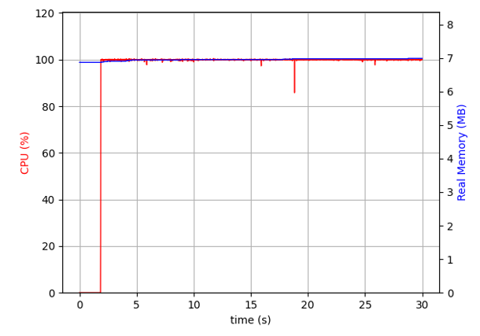

# 第一个 Asyncio 应用程序

本章涵盖

- 使用套接字通过网络传输数据
- 使用 telnet 与基于套接字的应用程序通信
- 使用selector为非阻塞套接字构建一个简单的事件循环
- 创建允许多个连接的非阻塞回显服务器
- 处理任务中的异常
- 向异步应用程序添加自定义关闭逻辑

在第 1 章和第 2 章中，我们介绍了协程、任务和事件循环。我们还研究了如何同时运行长时操作，并探索了一些促进此操作的 asyncio API。然而，到目前为止，我们只用 sleep 函数模拟了长时间的操作。

由于我们想要构建的不仅仅是演示应用程序，我们将使用一些真实的阻塞操作来演示如何创建一个可以同时处理多个用户的服务器。我们将只使用一个线程来执行此操作，与涉及线程或多个进程的其他解决方案相比，这会产生更节省资源和更简单的应用程序。我们将利用我们所学到的关于协程、任务和异步 API 方法的知识来构建一个使用套接字的命令行回显服务器应用程序来演示这一点。在本章结束时，你将能够使用 asyncio 构建基于套接字的网络应用程序，该应用程序可以使用一个线程同时处理多个用户。

首先，我们将学习如何使用阻塞套接字发送和接收数据的基础知识。然后，我们将使用这些套接字来尝试构建一个多客户端回显服务器。在这样做的过程中，我们将证明我们无法构建一个只有一个线程同时为多个客户端正常工作的回显服务器。然后，我们将学习如何通过使我们的套接字非阻塞并使用操作系统的事件通知系统来解决这些问题。这将帮助我们了解 asyncio 事件循环的底层机制是如何工作的。然后我们将使用 asyncio 的非阻塞套接字协程来允许多个客户端正确连接。此应用程序将允许多个用户同时连接，让他们同时发送和接收消息。最后，我们将向我们的应用程序添加自定义关闭逻辑，因此当我们的服务器关闭时，我们会给运行中的消息一些时间来完成。

## 3.1 使用阻塞套接字

在第 1 章中，我们介绍了套接字的概念。回想一下，套接字是一种通过网络读取和写入数据的方法。我们可以把一个套接字想象成一个邮箱：我们把一封信放进去，然后它就会被送到收件人的地址。然后收件人可以阅读该消息，并可能向我们发送另一条消息。

首先，我们将创建主邮箱套接字，我们将其称为服务器套接字。这个套接字将首先接受来自想要与我们通信的客户端的连接消息。一旦我们的服务器套接字确认了该连接，我们将创建一个可用于与客户端通信的套接字。这意味着我们的服务器开始看起来更像是一个有多个邮政信箱的邮局，而不仅仅是一个邮箱。客户端仍然可以被认为有一个邮箱，因为他们将有一个套接字与我们通信。当客户端连接到我们的服务器时，我们会为他们提供一个邮政信箱。然后，我们使用该邮政信箱向该客户端发送和接收消息（见图 3.1）。


图 3.1 一个客户端连接到我们的服务器套接字。然后服务器创建一个新的套接字来与客户端通信。

我们可以使用 Python 的内置套接字模块创建这个服务器套接字。该模块提供读取、写入和操作套接字的功能。为了开始创建套接字，我们将创建一个简单的服务器，它监听来自客户端的连接并在连接成功时打印一条消息。此套接字将绑定到主机名和端口，并将成为任何客户端将与之通信的主要“服务器套接字”。

创建套接字需要几个步骤。我们首先使用socket函数来创建一个socket：

```python
import socket
 
server_socket = socket.socket(socket.AF_INET, socket.SOCK_STREAM)
server_socket.setsockopt(socket.SOL_SOCKET, socket.SO_REUSEADDR, 1)
```

在这里，我们为 socket 函数指定了两个参数。第一个是 socket.AF_INET——它告诉我们我们的套接字将能够与哪种类型的地址进行交互；在这种情况下，主机名和端口号。第二个是socket.SOCK_STREAM；这意味着我们使用 TCP 协议进行通信。

> TCP协议是什么？
>
> TCP 或传输控制协议是一种旨在通过网络在应用程序之间传输数据的协议。该协议的设计考虑了可靠性。它执行错误检查，按顺序传递数据，并且可以在需要时重新传输数据。这种可靠性是以一些开销为代价的。绝大多数网络都是建立在 TCP 之上的。 TCP 与 UDP 或用户数据报协议相反，后者的可靠性较低，但开销比 TCP 少得多，而且性能往往更高。在本书中，我们将只关注 TCP 套接字。
> 我们还调用 setsockopt 将 SO_REUSEADDR 标志设置为 1。这将允许我们在停止并重新启动应用程序后重用端口号，避免任何地址已在使用中的错误。如果我们不这样做，操作系统可能需要一些时间才能取消绑定此端口并让我们的应用程序正常启动。

调用 socket.socket 可以让我们创建一个套接字，但我们还不能开始与它通信，因为我们还没有将它绑定到客户端可以通信的地址（我们的邮局需要一个地址！）。在本例中，我们将套接字绑定到我们自己计算机上的地址 127.0.0.1，我们将选择任意端口号 8000：

```python
address = (127.0.0.1, 8000)
server_socket.bind(server_address)
```

现在我们已经在地址 127.0.0.1:8000 设置了我们的套接字。这意味着客户端将能够使用此地址将数据发送到我们的服务器，如果我们将数据写入客户端，他们会将其视为数据的来源地址。

接下来，我们需要主动监听来自想要连接到我们服务器的客户端的连接。为此，我们可以在我们的套接字上调用监听方法。这告诉套接字监听传入的连接，这将允许客户端连接到我们的服务器套接字。然后，我们通过调用 socket 上的 accept 方法来等待连接。此方法将阻塞，直到我们获得连接，当我们这样做时，它将返回一个连接和连接的客户端的地址。连接只是我们可以用来从客户端读取数据和向客户端写入数据的另一个套接字：

```python
server_socket.listen()
connection, client_address = server_socket.accept()
```

有了这些部分，我们就拥有了创建基于套接字的服务器应用程序所需的所有构建块，该应用程序将等待连接并在获得连接后打印一条消息。

清单 3.1 启动服务器并监听连接

```python
import socket
 
server_socket = socket.socket(socket.AF_INET, socket.SOCK_STREAM)    ❶
server_socket.setsockopt(socket.SOL_SOCKET, socket.SO_REUSEADDR, 1)
 
server_address = ('127.0.0.1', 8000)                                 ❷
server_socket.bind(server_address)                                   ❸
server_socket.listen()
 
connection, client_address = server_socket.accept()                  ❹
print(f'I got a connection from {client_address}!')
```

❶ 创建一个 TCP 服务器套接字。
❷ 设置socket的地址为127.0.0.1:8000。
❸ 监听连接或“打开连接”。
❹ 等待连接并为客户分配一个地址。
在前面的清单中，当客户端连接时，我们获取他们的连接套接字以及他们的地址并打印我们获得了连接。

那么现在我们已经构建了这个应用程序，我们如何连接到它来测试它呢？虽然有很多工具可以做到这一点，但在本章中，我们将使用 telnet 命令行应用程序。

## 3.2 使用 Telnet 连接到服务器
我们接受连接的简单示例使我们无法连接。有许多命令行应用程序可以从服务器读取数据和从服务器写入数据，但是已经存在很长时间的流行应用程序是 Telnet。

Telnet 于 1969 年首次开发，是“电传网络”的缩写。 Telnet 与我们指定的服务器和主机建立 TCP 连接。一旦我们这样做了，就建立了一个终端，我们可以自由地发送和接收字节，所有这些都将显示在终端中。

在 Mac OS 上，你可以使用命令 brew install telnet 使用 Homebrew 安装 telnet（请参阅 https://brew.sh/ 以安装 Homebrew）。在 Linux 发行版上，你需要使用系统包管理器进行安装（apt-get install telnet 或类似的）。在 Windows 上，PuTTy 是最佳选择，你可以从 https://putty.org 下载。

注意 使用 PuTTY，你需要打开本地行编辑才能使本书中的代码示例正常工作。为此，请转到 PuTTy 配置窗口左侧的终端并将本地行编辑设置为强制打开。

要连接到我们在清单 3.1 中构建的服务器，我们可以在命令行上使用 Telnet 命令并指定我们要连接到端口 8000 上的 localhost：

```sh
telnet localhost 8000
```

完成此操作后，我们将在终端上看到一些输出，告诉我们已成功连接。 Telnet 然后会显示一个光标，它允许我们键入并选择 [Enter] 以将数据发送到服务器。

```sh
telnet localhost 8000
Trying 127.0.0.1...
Connected to localhost.
Escape character is '^]'.
```

在我们的服务器应用程序的控制台输出中，我们现在应该看到如下输出，表明我们已经与 Telnet 客户端建立了连接：

```sh
I got a connection from ('127.0.0.1', 56526)!
```


当服务器代码退出时，你还会看到 Connection closed by foreign host 消息，表明服务器已关闭与我们客户端的连接。我们现在有一种方法可以连接到服务器并在其中写入和读取字节，但是我们的服务器本身不能读取或发送任何数据。我们可以使用客户端套接字的 sendall 和 recv 方法来做到这一点。

### 3.2.1 从套接字读取和写入数据
现在我们已经创建了一个能够接受连接的服务器，让我们来看看如何从我们的连接中读取数据。套接字类有一个名为 recv 的方法，我们可以使用它从特定套接字获取数据。此方法采用一个整数，表示我们希望在给定时间读取的字节数。这很重要，因为我们不能一次从套接字读取所有数据；我们需要缓冲，直到我们到达输入的末尾。

在这种情况下，我们会将输入的结尾视为回车加换行符或“\r\n”。这是当用户在 telnet 中按 [Enter] 时附加到输入的内容。为了演示缓冲如何处理小消息，我们将故意设置一个缓冲区大小。在实际应用中，我们会使用更大的缓冲区大小，例如 1024 字节。我们通常需要更大的缓冲区大小，因为这将利用在操作系统级别发生的缓冲，这比在你的应用程序中更有效。

清单 3.2 从套接字读取数据

```python
import socket
 
server_socket = socket.socket(socket.AF_INET, socket.SOCK_STREAM)
server_socket.setsockopt(socket.SOL_SOCKET, socket.SO_REUSEADDR, 1)
 
server_address = ('127.0.0.1', 8000)
server_socket.bind(server_address)
server_socket.listen()
 
try:
    connection, client_address = server_socket.accept()
    print(f'I got a connection from {client_address}!')
 
    buffer = b''
 
    while buffer[-2:] != b'\r\n':
        data = connection.recv(2)
        if not data:
            break
        else:
            print(f'I got data: {data}!')
            buffer = buffer + data
 
    print(f"All the data is: {buffer}")
finally:
    server_socket.close()
```

在前面的清单中，我们像以前一样等待与 server_socket.accept 的连接。一旦我们得到一个连接，我们就会尝试接收两个字节并将其存储在我们的缓冲区中。然后，我们进入一个循环，检查每次迭代以查看我们的缓冲区是否以回车和换行结束。如果没有，我们再获得两个字节并打印出我们收到的字节并将其附加到缓冲区。如果我们得到'\r\n'，那么我们结束循环并打印出我们从客户端得到的完整消息。我们还在 finally 块中关闭服务器套接字。这确保即使在读取数据时发生异常，我们也会关闭连接。如果我们使用 telnet 连接到该应用程序并发送消息“testing123”，我们将看到以下输出：

```sh
I got a connection from ('127.0.0.1', 49721)!
I got data: b'te'!
I got data: b'st'!
I got data: b'in'!
I got data: b'g1'!
I got data: b'23'!
I got data: b'\r\n'!
All the data is: b'testing123\r\n'
```

现在，我们可以从套接字读取数据，但是我们如何将数据写回客户端呢？套接字有一个名为 sendall 的方法，它将接收一条消息并为我们将其写回客户端。我们可以修改清单 3.2 中的代码，在缓冲区填满后通过调用 connection.sendall 来回显客户端发送给我们的消息：

```python
while buffer[-2:] != b'\r\n':
    data = connection.recv(2)
    if not data:
        break
    else:
        print(f'I got data: {data}!')
        buffer = buffer + data

print(f"All the data is: {buffer}")
connection.sendall(buffer)
```

现在，当我们连接到这个应用程序并从 Telnet 向它发送一条消息时，我们应该会在我们的 telnet 终端上看到该消息打印回来。我们已经创建了一个非常基本的带有套接字的回显服务器！

此应用程序现在一次处理一个客户端，但多个客户端可以连接到单个服务器套接字。让我们修改这个示例以允许多个客户端同时连接。在此过程中，我们将演示我们如何无法正确支持具有阻塞套接字的多个客户端。

### 3.2.2 允许多个连接和阻塞的危险
侦听模式下的套接字允许同时进行多个客户端连接。这意味着我们可以重复调用 socket.accept，并且每次客户端连接时，我们都会获得一个新的连接套接字来读取和写入该客户端的数据。有了这些知识，我们可以直接调整前面的示例来处理多个客户端。我们永远循环，调用 socket.accept 来监听新的连接。每次我们得到一个，我们将它附加到我们到目前为止的连接列表中。然后，我们遍历每个连接，接收传入的数据并将该数据写回客户端连接。

清单 3.3 允许多个客户端连接

```python
import socket
 
server_socket = socket.socket(socket.AF_INET, socket.SOCK_STREAM)
server_socket.setsockopt(socket.SOL_SOCKET, socket.SO_REUSEADDR, 1)
 
server_address = ('127.0.0.1', 8000)
server_socket.bind(server_address)
server_socket.listen()
 
connections = []
 
try:
    while True:
        connection, client_address = server_socket.accept()
        print(f'I got a connection from {client_address}!')
        connections.append(connection)
        for connection in connections:
            buffer = b''
 
            while buffer[-2:] != b'\r\n':
                data = connection.recv(2)
                if not data:
                    break
                else:
                    print(f'I got data: {data}!')
                    buffer = buffer + data
 
            print(f"All the data is: {buffer}")
 
            connection.send(buffer)
finally:
    server_socket.close()
```

我们可以通过使用 telnet 建立一个连接并输入一条消息来尝试此操作。然后，一旦如此，我们就可以连接第二个 telnet 客户端并发送另一条消息。但是，如果我们这样做，我们会立即注意到一个问题。我们的第一个客户端可以正常工作，并且会像我们预期的那样回显消息，但我们的第二个客户端不会得到任何回显。这是由于套接字的默认阻塞行为。方法 accept 和 recv 阻塞，直到它们接收到数据。这意味着一旦第一个客户端连接，我们将阻止等待它向我们发送它的第一个回显消息。这会导致其他客户端卡住等待循环的下一次迭代，直到第一个客户端向我们发送数据时才会发生这种情况（图 3.2）。


图 3.2 使用阻塞套接字时，客户端 1 连接，但客户端 2 被阻塞，直到客户端 1 发送数据。

这显然不是令人满意的用户体验；当我们拥有多个用户时，我们创建了一些无法正确扩展的东西。我们可以通过将套接字置于非阻塞模式来解决这个问题。当我们将套接字标记为非阻塞时，它的方法在继续执行下一行代码之前不会阻塞等待接收数据。

### 3.3 使用非阻塞套接字

我们之前的回显服务器允许多个客户端连接；然而，当不止一个连接时，我们遇到了一个客户端可能导致其他客户端等待它发送数据的问题。我们可以通过将套接字置于非阻塞模式来解决这个问题。当我们这样做时，任何时候我们调用一个会阻塞的方法，比如recv，它都保证会立即返回。如果套接字有数据准备好处理，那么我们将像使用阻塞套接字一样返回数据。如果没有，套接字会立即让我们知道它没有准备好任何数据，我们可以自由地继续执行其他代码。

清单 3.4 创建一个非阻塞套接字

```python
import socket
 
server_socket = socket.socket(socket.AF_INET, socket.SOCK_STREAM)
server_socket.setsockopt(socket.SOL_SOCKET, socket.SO_REUSEADDR, 1)
server_socket.bind(('127.0.0.1', 8000))
server_socket.listen()
server_socket.setblocking(False)
```

从根本上说，创建一个非阻塞套接字与创建一个阻塞套接字没有什么不同，只是我们必须用 False 调用 setblocking。默认情况下，套接字会将此值设置为 True，表示它是阻塞的。现在让我们看看当我们在原始应用程序中执行此操作时会发生什么。这能解决问题吗？

清单 3.5 在非阻塞服务器上的第一次尝试

```python
import socket
 
server_socket = socket.socket(socket.AF_INET, socket.SOCK_STREAM)
server_socket.setsockopt(socket.SOL_SOCKET, socket.SO_REUSEADDR, 1)
 
server_address = ('127.0.0.1', 8000)
server_socket.bind(server_address)
server_socket.listen()
server_socket.setblocking(False)                             ❶
 
connections = []
 
try:
    while True:
        connection, client_address = server_socket.accept()
        connection.setblocking(False)                        ❷
        print(f'I got a connection from {client_address}!')
        connections.append(connection)
 
        for connection in connections:
            buffer = b''
 
            while buffer[-2:] != b'\r\n':
                data = connection.recv(2)
                if not data:
                    break
                else:
                    print(f'I got data: {data}!')
                    buffer = buffer + data
 
            print(f"All the data is: {buffer}")
            connection.send(buffer)
finally:
    server_socket.close()
```

❶ 将服务器套接字标记为非阻塞。
❷ 将客户端套接字标记为非阻塞。
当我们运行清单 3.5 时，我们会立即注意到一些不同的东西。我们的应用程序几乎立即崩溃！我们将被抛出 BlockingIOError 因为我们的服务器套接字还没有连接，因此没有要处理的数据：

```python
Traceback (most recent call last):
  File "echo_server.py", line 14, in <module>
    connection, client_address = server_socket.accept()
  File " python3.8/socket.py", line 292, in accept
    fd, addr = self._accept()
BlockingIOError: [Errno 35] Resource temporarily unavailable
```

这是套接字告诉我们的有点不直观的方式，“我没有任何数据，请稍后再给我打电话。”我们没有简单的方法来判断一个套接字现在是否有数据，所以一种解决方案是捕获异常，忽略它，并继续循环直到我们有数据。通过这种策略，我们将不断地尽可能快地检查新的连接和数据。这应该可以解决我们阻塞套接字回显服务器的问题。

清单 3.6 捕获和忽略阻塞 IO 错误

```python
import socket
 
server_socket = socket.socket(socket.AF_INET, socket.SOCK_STREAM)
server_socket.setsockopt(socket.SOL_SOCKET, socket.SO_REUSEADDR, 1)
 
server_address = ('127.0.0.1', 8000)
server_socket.bind(server_address)
server_socket.listen()
server_socket.setblocking(False)
 
connections = []
 
try:
    while True:
        try:
            connection, client_address = server_socket.accept()
            connection.setblocking(False)
            print(f'I got a connection from {client_address}!')
            connections.append(connection)
        except BlockingIOError:
            pass
 
        for connection in connections:
            try:
                buffer = b''
 
                while buffer[-2:] != b'\r\n':
                    data = connection.recv(2)
                    if not data:
                        break
                    else:
                        print(f'I got data: {data}!')
                        buffer = buffer + data
 
                print(f"All the data is: {buffer}")
                connection.send(buffer)
            except BlockingIOError:
                pass
 
finally:
    server_socket.close()
```

每次我们经历无限循环的迭代时，我们都没有调用接受或接收每个块，我们要么立即抛出一个我们忽略的异常，要么我们准备好处理数据并处理它。这个循环的每次迭代都发生得很快，我们从不依赖任何人向我们发送数据来继续下一行代码。这解决了我们阻塞服务器的问题，并允许多个客户端同时连接和发送数据。

这种方法有效，但它是有代价的。首先是代码质量。在我们可能还没有数据的任何时候捕获异常会很快变得冗长并且可能容易出错。二是资源问题。如果你在笔记本电脑上运行此程序，你可能会注意到几秒钟后你的风扇声音开始变大。该应用程序将始终使用近 100% 的 CPU 处理能力（图 3.3）。这是因为我们在应用程序中不断循环并尽可能快地获取异常，从而导致 CPU 负载过重。



图 3.3 当循环和捕获异常时，CPU 使用率会飙升至 100% 并保持在那里。

早些时候，我们提到了特定于操作系统的事件通知系统，当套接字有我们可以操作的数据时，它可以通知我们。这些系统依赖于硬件级别的通知，而不像我们刚才所做的那样使用 while 循环进行轮询。 Python 有一个内置的用于使用此事件通知系统的库。接下来，我们将使用它来解决我们的 CPU 利用率问题并为套接字事件构建一个迷你事件循环。

## 3.4 使用selector模块构建套接字事件循环
操作系统有高效的 API，可以让我们观察套接字的传入数据和其他内置事件。虽然实际的 API 依赖于操作系统（kqueue、epoll 和 IOCP 是一些常见的），但所有这些 I/O 通知系统以类似的概念运行。我们给他们一个我们想要监视事件的套接字列表，而不是不断地检查每个套接字以查看它是否有数据，操作系统会明确地告诉我们套接字何时有数据。

因为这是在硬件级别实现的，所以在此监视期间使用的 CPU 利用率非常低，从而可以有效地使用资源。这些通知系统是 asyncio 如何实现并发的核心。了解它是如何工作的，可以让我们了解 asyncio 的底层机制是如何工作的。

事件通知系统因操作系统而异。幸运的是，Python 的selector模块是抽象的，因此我们可以在运行代码的任何地方获得正确的事件。这使得我们的代码可以跨不同的操作系统移植。

这个库公开了一个名为 BaseSelector 的抽象基类，它对每个事件通知系统都有多个实现。它还包含一个 DefaultSelector 类，它会自动选择对我们的系统最有效的实现。

BaseSelector 类具有重要的概念。首先是注册。当我们有一个我们有兴趣获取通知的套接字时，我们将它注册到selector并告诉它我们感兴趣的事件。这些是诸如读取和写入之类的事件。相反，我们也可以取消注册不再感兴趣的套接字。

第二个主要概念是select。 select 将阻塞，直到事件发生，一旦发生，调用将返回一个准备好处理的套接字列表以及触发它的事件。它还支持超时，它将在指定的时间后返回一组空的事件。

有了这些构建块，我们就可以创建一个不会给 CPU 带来压力的非阻塞回显服务器。创建服务器套接字后，我们将使用默认selector注册它，该selector将监听来自客户端的任何连接。然后，每当有人连接到我们的服务器套接字时，我们将使用selector注册客户端的连接套接字以监视任何发送的数据。如果我们从不是我们的服务器套接字的套接字中获取任何数据，我们就知道它来自已发送数据的客户端。然后我们接收该数据并将其写回客户端。我们还将添加一个超时来证明我们可以在等待事情发生时执行其他代码。

清单 3.7 使用selector构建非阻塞服务器

```python
import selectors
import socket
from selectors import SelectorKey
from typing import List, Tuple
 
selector = selectors.DefaultSelector()
 
server_socket = socket.socket()
server_socket.setsockopt(socket.SOL_SOCKET, socket.SO_REUSEADDR, 1)
 
server_address = ('127.0.0.1', 8000)
server_socket.setblocking(False)
server_socket.bind(server_address)
server_socket.listen()
 
selector.register(server_socket, selectors.EVENT_READ)
 
while True:
    events: List[Tuple[SelectorKey, int]] = selector.select(timeout=1)  ❶
 
    if len(events) == 0:                                                ❷
        print('No events, waiting a bit more!')
 
    for event, _ in events:
        event_socket = event.fileobj                                    ❸
 
        if event_socket == server_socket:                               ❹
            connection, address = server_socket.accept()
            connection.setblocking(False)
            print(f"I got a connection from {address}")
            selector.register(connection, selectors.EVENT_READ)         ❺
        else:
            data = event_socket.recv(1024)                              ❻
            print(f"I got some data: {data}")
            event_socket.send(data)
```

❶ 创建一个将在 1 秒后超时的selector。
❷ 如果没有事件，打印出来。发生超时时会发生这种情况。
❸ 获取事件的套接字，存储在 fileobj 字段中。
❹ 如果事件套接字与服务器套接字相同，我们就知道这是一次连接尝试。
❺ 注册与我们的selector连接的客户端。
❻ 如果事件套接字不是服务器套接字，则从客户端接收数据，并将其回显。
当我们运行清单 3.7 时，我们会看到“没有事件，再等一会儿！”除非我们收到连接事件，否则大约每秒打印一次。一旦获得连接，我们就注册该连接以侦听读取事件。然后，如果客户端向我们发送数据，我们的selector将返回一个我们已准备好数据的事件，我们可以使用 socket.recv 读取它。

这是支持多个客户端的功能齐全的回声服务器。该服务器没有阻塞问题，因为我们只有在有数据要处理时才读取或写入数据。由于我们使用操作系统的高效事件通知系统（图 3.4），它的 CPU 利用率也很低。


图 3.4 带有selector的回显服务器的 CPU 图。使用这种方法，利用率徘徊在 0% 和 1% 左右。

我们构建的内容类似于 asyncio 的事件循环在后台所做的大部分工作。在这种情况下，重要的事件是套接字接收数据。我们的事件循环和 asyncio 事件循环的每次迭代都由发生的套接字事件或触发循环迭代的超时触发。在 asyncio 事件循环中，当这两种情况中的任何一种发生时，正在等待运行的协程都会这样做，直到它们完成或遇到下一个 await 语句。当我们在使用非阻塞套接字的协程中点击等待时，它将向系统的selector注册该套接字并跟踪协程暂停等待结果。我们可以将其转换为演示该概念的伪代码：

```python
paused = []
ready = []
 
while True:
    paused, new_sockets = run_ready_tasks(ready)
selector.register(new_sockets)
    timeout = calculate_timeout()
    events = selector.select(timeout)
    ready = process_events(events)
```

我们运行任何准备运行的协程，直到它们在 await 语句上暂停，并将它们存储在 paused 数组中。我们还跟踪运行这些协程时需要观察的任何新套接字，并将它们注册到selector中。然后，我们计算调用 select 时所需的超时时间。虽然这个超时计算有点复杂，但它通常会查看我们计划在特定时间或特定持续时间运行的事情。 asyncio.sleep 就是一个例子。然后我们调用 select 并等待任何套接字事件或超时。一旦其中任何一个发生，我们就会处理这些事件并将其转换为准备运行的协程列表。

虽然我们构建的事件循环仅用于套接字事件，但它展示了使用selector注册我们关心的套接字的主要概念，只有在我们想要处理的事情发生时才会被唤醒。在本书的最后，我们将更深入地了解如何构建自定义事件循环。

现在，我们了解了使 asyncio 运行的大部分机制。但是，如果我们只是使用selector来构建我们的应用程序，我们将求助于实现我们自己的事件循环来实现与 asyncio 提供的相同功能。要了解如何使用 asyncio 来实现这一点，让我们将我们学到的知识转化为 async / await 代码，并使用已经为我们实现的事件循环。

## 3.5 asyncio 事件循环上的回显服务器

对于大多数应用程序来说，使用 select 有点太低级了。我们可能希望在等待套接字数据进入时让代码在后台运行，或者我们可能希望让后台任务按计划运行。如果我们只用selector来做这件事，我们可能会构建自己的事件循环，而 asyncio 有一个很好实现的可以使用的循环。此外，协程和任务在selector之上提供了抽象，这使得我们的代码更容易实现和维护，因为我们根本不需要考虑selector。

现在我们对 asyncio 事件循环的工作原理有了更深入的了解，让我们使用我们在上一节中构建的 echo 服务器，并使用协程和任务再次构建它。我们仍将使用较低级别的套接字来完成此操作，但我们将使用返回协程的基于异步的 API 来管理它们。我们还将向我们的 echo 服务器添加更多功能，以演示一些关键概念来说明 asyncio 的工作原理。

### 3.5.1 套接字的事件循环协程
鉴于套接字是一个相对低级的概念，处理它们的方法是在 asyncio 的事件循环本身上。我们要使用三个主要的协程：sock_accept、sock_recv 和 sock_sendall。这些类似于我们之前使用的套接字方法，除了它们接受一个套接字作为参数并返回我们可以等待的协程，直到我们有数据要执行。

让我们从 sock_accept 开始。这个协程类似于我们在第一个实现中看到的 socket.accept 方法。此方法将返回套接字连接和客户端地址的元组（存储有序值序列的数据结构）。我们将它传递到我们感兴趣的套接字中，然后我们可以等待它返回的协程。一旦该协程完成，我们将拥有我们的连接和地址。这个套接字必须是非阻塞的，并且应该已经绑定到一个端口：

```python
connection, address = await loop.sock_accept(socket)
```

sock_recv 和 sock_sendall 的调用方式与 sock_accept 类似。他们接受一个套接字，然后我们可以等待结果。 sock_recv 将等待，直到套接字有我们可以处理的字节。 sock_sendall 接收一个套接字和我们要发送的数据，并等待我们要发送到套接字的所有数据都发送完毕，成功时返回 None：

```python
data = await loop.sock_recv(socket)
success = await loop.sock_sendall(socket, data)
```

有了这些构建块，我们将能够将我们以前的方法转化为使用协程和任务的方法。

### 3.5.2 设计一个异步回显服务器
在第 2 章中，我们介绍了协程和任务。那么我们什么时候应该只使用协程，什么时候应该将协程包装到我们的 echo 服务器的任务中呢？让我们检查一下我们希望我们的应用程序如何表现来做出这个决定。

我们将从我们希望如何在应用程序中侦听连接开始。当我们监听连接时，我们一次只能处理一个连接，因为 socket.accept 只会给我们一个客户端连接。在幕后，如果我们同时获得多个连接，传入的连接将被存储在一个称为 backlog 的队列中，但在这里，我们不会讨论它是如何工作的。

因为我们不需要同时处理多个连接，所以一个永远循环的协程是有意义的。这将允许其他代码在我们暂停等待连接时同时运行。我们将定义一个名为 listen_for_connections 的协程，它将永远循环并监听任何传入的连接：

```python
async def listen_for_connections(server_socket: socket, loop: AbstractEventLoop):
    while True:
        connection, address = await loop.sock_accept(server_socket)
        connection.setblocking(False)
        print(f"Got a connection from {address}")
```

现在我们有了一个用于监听连接的协程，那么如何向已连接的客户端读取和写入数据呢？那应该是协程，还是我们包装在任务中的协程？在这种情况下，我们将有多个连接，每个连接都可以随时向我们发送数据。我们不想等待来自一个连接的数据阻塞另一个连接，所以我们需要同时从多个客户端读取和写入数据。因为我们需要同时处理多个连接，所以为每个连接创建一个任务来读写数据是有意义的。在我们获得的每个连接上，我们将创建一个任务来从该连接读取数据并将数据写入该连接。

我们将创建一个名为 echo 的协程，负责处理来自连接的数据。这个协程将永远循环监听来自我们客户端的数据。一旦它接收到数据，它就会将其发送回客户端。

然后，在 listen_for_connections 中，我们将创建一个新任务，为我们获得的每个连接包装我们的 echo 协程。定义了这两个协程后，我们现在拥有构建异步回显服务器所需的一切。

清单 3.8 构建一个异步回显服务器

```python
import asyncio
import socket
from asyncio import AbstractEventLoop
async def echo(connection: socket,
               loop: AbstractEventLoop) -> None:
    while data := await loop.sock_recv(connection, 1024):                ❶
        await loop.sock_sendall(connection, data)                        ❷
 
 
async def listen_for_connection(server_socket: socket,
                                loop: AbstractEventLoop):
    while True:
        connection, address = await loop.sock_accept(server_socket)
        connection.setblocking(False)
        print(f"Got a connection from {address}")
        asyncio.create_task(echo(connection, loop))                      ❸
 
 
async def main():
    server_socket = socket.socket(socket.AF_INET, socket.SOCK_STREAM)
    server_socket.setsockopt(socket.SOL_SOCKET, socket.SO_REUSEADDR, 1)
 
    server_address = ('127.0.0.1', 8000)
    server_socket.setblocking(False)
    server_socket.bind(server_address)
    server_socket.listen()
 
    await listen_for_connection(server_socket, asyncio.get_event_loop()) ❹
 
asyncio.run(main())
```

❶ 永远循环等待来自客户端连接的数据
❷ 一旦我们有了数据，就将它发送回那个客户端。
❸ 每当我们获得连接时，创建一个回显任务来监听客户端数据。
❹ 启动协程监听连接。
上述清单的架构如图 3.5 所示。我们有一个协程，listen_for_connection，监听连接。一旦客户端连接，我们的协程为每个客户端生成一个回显任务，然后监听数据并将其写回客户端。


图 3.5 侦听连接的协程在它获得的每个连接中生成一个任务。

当我们运行这个应用程序时，我们将能够同时连接多个客户端并向它们同时发送数据。在幕后，这一切都使用了我们之前看到的selector，因此我们的 CPU 利用率仍然很低。

我们现在已经完全使用 asyncio 构建了一个功能齐全的 echo 服务器！那么我们的实现是否没有错误？事实证明，当我们的 echo 任务失败时，我们设计这个 echo 服务器的方式确实存在我们需要处理的问题。

### 3.5.3 处理任务中的错误
网络连接通常是不可靠的，我们可能会在应用程序代码中遇到意想不到的异常。如果读取或写入客户端失败并抛出异常，我们的应用程序将如何表现？为了测试这一点，让我们更改 echo 的实现，以便在客户端向我们传递特定关键字时抛出异常：

```python
async def echo(connection: socket, loop: AbstractEventLoop) -> None:
    while data := await loop.sock_recv(connection, 1024):
        if data == b'boom\r\n':
            raise Exception("Unexpected network error")
        await loop.sock_sendall(connection, data)
```

现在，每当客户端向我们发送“boom”时，我们都会引发异常并且我们的任务将崩溃。那么，当我们将客户端连接到服务器并发送此消息时会发生什么？我们将看到带有如下警告的回溯：

```python
Task exception was never retrieved
future: <Task finished name='Task-2' coro=<echo() done, defined at asyncio_echo.py:5> exception=Exception('Unexpected network error')>
Traceback (most recent call last):
  File "asyncio_echo.py", line 9, in echo
    raise Exception("Unexpected network error")
Exception: Unexpected network error
```

这里重要的部分是从未检索到任务异常。这是什么意思？当任务内部抛出异常时，任务被视为已完成，其结果为异常。这意味着没有异常被抛出调用堆栈。此外，我们这里没有清理。如果抛出此异常，我们将无法对任务失败做出反应，因为我们从未检索到异常。

为了让异常到达我们，我们必须在等待表达式中使用任务。当我们等待失败的任务时，将在我们执行等待的地方抛出异常，并且回溯将反映这一点。如果我们在应用程序中的某个时间点不等待任务，我们就会冒着永远看不到任务引发的异常的风险。虽然我们确实在示例中看到了异常输出，这可能使我们认为这不是什么大问题，但我们可以通过一些微妙的方式来更改我们的应用程序，这样我们就永远不会看到这个消息。

作为对此的演示，假设我们没有忽略我们在 listen_for_connections 中创建的回显任务，而是在一个列表中跟踪它们，如下所示：

```python
tasks = []
 
async def listen_for_connection(server_socket: socket, loop: AbstractEventLoop):
    while True:
        connection, address = await loop.sock_accept(server_socket)
        connection.setblocking(False)
        print(f"Got a connection from {address}")
        tasks.append(asyncio.create_task(echo(connection, loop)))
```

人们会期望它的行为方式与以前相同。如果我们发送“boom”消息，我们将看到打印的异常以及我们从未检索到任务异常的警告。然而，情况并非如此，因为在我们强制终止我们的应用程序之前，我们实际上不会看到任何打印内容！

这是因为我们保留了对任务的引用。当任务被垃圾回收时，asyncio 只能打印此消息和失败任务的回溯。这是因为它无法判断该任务是否会在应用程序的其他点等待，因此会引发异常。由于这些复杂性，我们要么需要等待我们的任务，要么处理我们的任务可能抛出的所有异常。那么我们如何在我们的回声服务器中做到这一点呢？

我们可以做的第一件事就是将代码包装在我们的 echo 协程中的 try/catch 语句中，记录异常，然后关闭连接：

```python
import logging
 
async def echo(connection: socket,
               loop: AbstractEventLoop) -> None:
    try:
        while data := await loop.sock_recv(connection, 1024):
            print('got data!')
            if data == b'boom\r\n':
                raise Exception("Unexpected network error")
            await loop.sock_sendall(connection, data)
    except Exception as ex:
        logging.exception(ex)
    finally:
        connection.close()
```

这将解决异常的直接问题，该异常导致我们的服务器抱怨从未检索到任务异常，因为我们在协程本身中处理它。它还将在 finally 块中正确关闭套接字，因此在发生故障时我们不会留下悬空的未关闭异常。

请务必注意，此实现将正确关闭与我们在应用程序关闭时打开的客户端的任何连接。为什么是这样？在第 2 章中，我们注意到 asyncio.run 将在我们的应用程序关闭时取消我们剩余的任何任务。我们还了解到，当我们取消任务时，每当我们尝试等待它时都会引发 CancelledError。

这里重要的是注意引发异常的位置。如果我们的任务正在等待诸如 await loop.sock_recv 之类的语句，并且我们取消了该任务，则会从 await loop.sock_recv 行抛出 CancelledError。这意味着在上述情况下，我们的 finally 块将被执行，因为当我们取消任务时，我们在 await 表达式上抛出了一个异常。如果我们更改异常块以捕获并记录这些异常，你将看到每个创建的任务都有一个 CancelledError。

我们现在已经处理了当我们的回显任务失败时处理错误的直接问题。如果我们想在应用程序关闭时对任何错误或剩余任务进行清理怎么办？我们可以使用 asyncio 的信号处理程序来做到这一点。

## 3.6 优雅关机
现在，我们创建了一个回显服务器，它可以处理多个并发连接，还可以正确记录错误并在遇到异常时进行清理。如果我们需要关闭我们的应用程序会发生什么？如果我们可以在关闭之前允许任何飞行中的消息完成，那不是很好吗？我们可以通过向我们的应用程序添加自定义关闭逻辑来做到这一点，该逻辑允许任何正在进行的任务在几秒钟内完成发送他们可能想要发送的任何消息。虽然这不会是一个具有生产价值的实现，但我们将学习有关关闭和取消 asyncio 应用程序中所有正在运行的任务的概念。

> Windows 上的信号
>
> Windows 不支持信号。因此，本节仅适用于基于 Unix 的系统。 Windows 使用不同的系统来处理这个问题，在编写本书时，它还不能用 Python 执行。要了解有关如何使此代码以跨平台方式工作的更多信息，请参阅 Stack Overflow 上的以下答案：https://stackoverflow.com/questions/35772001。

### 3.6.1 监听信号
信号是基于 Unix 的操作系统中的一个概念，用于异步通知进程发生在操作系统级别的事件。虽然这听起来很低级，但你可能对某些信号很熟悉。例如，一个常见的信号是 SIGINT，是信号中断的缩写。当你按 CTRL-C 终止命令行应用程序时会触发此事件。在 Python 中，我们通常可以通过捕获 KeyboardInterrupt 异常来处理这个问题。另一个常见的信号是 SIGTERM，是信号终止的缩写。当我们在特定进程上运行 kill 命令以停止其执行时，就会触发这种情况。

为了实现自定义关闭逻辑，我们将在我们的应用程序中为 SIGINT 和 SIGTERM 信号实现监听器。然后，在这些侦听器中，我们将实现逻辑以允许我们在几秒钟内完成任何回显任务。

我们如何在应用程序中监听信号？ asyncio 事件循环让我们可以直接监听我们使用 add_signal_handler 方法指定的任何事件。这与你可以使用 signal .signal 函数在信号模块中设置的信号处理程序不同，因为 add_signal_handler 可以安全地与事件循环交互。这个函数接收一个我们想要监听的信号和一个我们将在应用程序接收到该信号时调用的函数。为了演示这一点，让我们看一下添加一个取消所有当前正在运行的任务的信号处理程序。 asyncio 有一个方便的函数，它返回一组名为 asyncio.all_tasks 的所有正在运行的任务。

清单 3.9 添加一个信号处理程序以取消所有任务

```python
import asyncio, signal
from asyncio import AbstractEventLoop
from typing import Set
 
from util.delay_functions import delay
 
 
def cancel_tasks():
    print('Got a SIGINT!')
    tasks: Set[asyncio.Task] = asyncio.all_tasks()
    print(f'Cancelling {len(tasks)} task(s).')
    [task.cancel() for task in tasks]
 
 
async def main():
    loop: AbstractEventLoop = asyncio.get_running_loop()
 
    loop.add_signal_handler(signal.SIGINT, cancel_tasks)
 
    await delay(10)
 
 
asyncio.run(main())
```

当我们运行这个应用程序时，我们会看到我们的延迟协程立即启动并等待 10 秒。如果我们在这 10 秒内按 CTRL-C，我们应该会看到收到了 SIGINT！打印出来，然后是我们正在取消任务的消息。我们还应该看到从 asyncio.run(main()) 抛出的 CancelledError，因为我们已经取消了该任务。

### 3.6.2 等待挂起的任务完成
在最初的问题陈述中，我们希望在关闭之前给我们的 echo 服务器的 echo 任务几秒钟以保持运行。我们这样做的一种方法是将所有的 echo 任务包装在 wait_for 中，然后等待这些包装的任务。一旦超时过去，这些任务将抛出 TimeoutError，我们可以终止我们的应用程序。

关于我们的关闭处理程序，你会注意到的一件事是，这是一个普通的 Python 函数，因此我们不能在其中运行任何 await 语句。这给我们带来了一个问题，因为我们提出的解决方案涉及等待。一种可能的解决方案是创建一个协程来执行我们的关闭逻辑，并在我们的关闭处理程序中，将其包装在一个任务中：

```python
async def await_all_tasks():
    tasks = asyncio.all_tasks()
    [await task for task in tasks]
 
 
async def main():
    loop = asyncio.get_event_loop()
    loop.add_signal_handler(
        signal.SIGINT,
        lambda: asyncio.create_task(await_all_tasks())
    )
```

这样的方法会起作用，但缺点是如果 await_all_tasks 中的某些内容抛出异常，我们将留下一个失败的孤立任务和“从未检索到异常”警告。那么，有没有更好的方法来做到这一点？

我们可以通过引发自定义异常来阻止我们的主协程运行来处理这个问题。然后，我们可以在运行主协程并运行任何关闭逻辑时捕获此异常。为此，我们需要自己创建一个事件循环，而不是使用 asyncio.run。这是因为在异常时 asyncio.run 将取消所有正在运行的任务，这意味着我们无法将 echo 任务包装在 wait_for 中：

```python
class GracefulExit(SystemExit):
    pass
 
def shutdown():
    raise GracefulExit()
 
loop = asyncio.get_event_loop()
 
loop.add_signal_handler(signal.SIGINT, shutdown)
 
try:
    loop.run_until_complete(main())
except GracefulExit:
    loop.run_until_complete(close_echo_tasks(echo_tasks))
finally:
    loop.close()
```

考虑到这种方法，让我们编写关闭逻辑：

```python
async def close_echo_tasks(echo_tasks: List[asyncio.Task]):
    waiters = [asyncio.wait_for(task, 2) for task in echo_tasks]
    for task in waiters:
        try:
            await task
        except asyncio.exceptions.TimeoutError:
            # We expect a timeout error here
            pass
```

在 close_echo_tasks 中，我们获取一个 echo 任务列表，并将它们全部包装在一个 wait_for 任务中，超时时间为 2 秒。这意味着任何回显任务在我们取消它们之前都将有 2 秒的时间完成。完成此操作后，我们将遍历所有这些包装的任务并等待它们。我们捕获任何 TimeoutErrors，因为我们希望它会在 2 秒后从我们的任务中抛出。将所有这些部分放在一起，我们的带有关闭逻辑的回显服务器看起来像下面的清单。

清单 3.10 优雅关闭

```python
import asyncio
from asyncio import AbstractEventLoop
import socket
import logging
import signal
from typing import List
 
 
async def echo(connection: socket,
               loop: AbstractEventLoop) -> None:
    try:
        while data := await loop.sock_recv(connection, 1024):
            print('got data!')
            if data == b'boom\r\n':
                raise Exception("Unexpected network error")
            await loop.sock_sendall(connection, data)
    except Exception as ex:
        logging.exception(ex)
    finally:
        connection.close()
 
echo_tasks = []
 
 
async def connection_listener(server_socket, loop):
    while True:
        connection, address = await loop.sock_accept(server_socket)
        connection.setblocking(False)
        print(f"Got a connection from {address}")
        echo_task = asyncio.create_task(echo(connection, loop))
        echo_tasks.append(echo_task)
 
 
class GracefulExit(SystemExit):
    pass
 
 
def shutdown():
    raise GracefulExit()
 
 
async def close_echo_tasks(echo_tasks: List[asyncio.Task]):
    waiters = [asyncio.wait_for(task, 2) for task in echo_tasks]
    for task in waiters:
        try:
            await task
        except asyncio.exceptions.TimeoutError:
            # We expect a timeout error here
            pass
 
 
async def main():
    server_socket = socket.socket()
    server_socket.setsockopt(socket.SOL_SOCKET, socket.SO_REUSEADDR, 1)
 
    server_address = ('127.0.0.1', 8000)
    server_socket.setblocking(False)
    server_socket.bind(server_address)
    server_socket.listen()
 
    for signame in {'SIGINT', 'SIGTERM'}:
        loop.add_signal_handler(getattr(signal, signame), shutdown)
    await connection_listener(server_socket, loop)
 
 
loop = asyncio.new_event_loop()
 
try:
    loop.run_until_complete(main())
except GracefulExit:
    loop.run_until_complete(close_echo_tasks(echo_tasks))
finally:
    loop.close()
```

假设我们至少连接了一个客户端，如果我们使用 CTRL-C 停止此应用程序，或者我们向进程发出终止命令，我们的关闭逻辑将执行。我们将看到应用程序等待 2 秒，同时它允许我们的 echo 任务在停止运行之前完成一些时间。

有几个原因表明这不是一个值得生产的停工。首先是我们在等待回显任务完成时不会关闭连接监听器。这意味着，当我们关闭时，可能会出现新连接，然后我们将无法添加 2 秒关闭。另一个问题是，在我们的关闭逻辑中，我们等待每个正在关闭的 echo 任务，并且只捕获 TimeoutExceptions。这意味着，如果我们的一个任务抛出了除此之外的东西，我们将捕获该异常，并且任何其他可能有异常的后续任务都将被忽略。在第 4 章中，我们将看到一些用于更优雅地处理来自一组可等待对象的故障的 asyncio 方法。

虽然我们的应用程序并不完美并且只是一个玩具示例，但我们已经使用 asyncio 构建了一个功能齐全的服务器。该服务器可以同时处理多个用户——所有用户都在一个线程中。使用我们之前看到的阻塞方法，我们需要转向线程来处理多个客户端，这增加了应用程序的复杂性和资源利用率。

## 概括
在本章中，我们了解了阻塞和非阻塞套接字，并更深入地探索了异步事件循环的功能。我们还使用 asyncio 制作了我们的第一个应用程序，这是一个高度并发的回显服务器。我们已经研究了如何处理任务中的错误并在我们的应用程序中添加自定义关闭逻辑。

- 我们已经学习了如何使用阻塞套接字创建简单的应用程序。阻塞套接字将在等待数据时停止整个线程。这阻止了我们实现并发，因为我们一次只能从一个客户端获取数据。
- 我们已经学习了如何使用非阻塞套接字构建应用程序。这些套接字总是会立即返回，要么是因为我们已经准备好数据，要么是因为我们没有数据而出现异常。这些套接字让我们实现并发，因为它们的方法从不阻塞并立即返回。
- 我们已经学习了如何使用selector模块以有效的方式监听套接字上的事件。这个库让我们可以注册我们想要跟踪的套接字，并告诉我们非阻塞套接字何时准备好数据。
- 如果我们将 select 置于无限循环中，我们就复制了 asyncio 事件循环的核心功能。我们注册我们感兴趣的套接字，并且我们永远循环，一旦套接字有数据可用于操作，就运行我们想要的任何代码。
- 我们学习了如何使用 asyncio 的事件循环方法来构建具有非阻塞套接字的应用程序。这些方法接受一个套接字并返回一个协程，然后我们可以在等待表达式中使用它。这将暂停我们的父协程，直到套接字有数据。在引擎盖下，这是使用selector库。
- 我们已经了解了如何使用任务来实现基于异步的回显服务器的并发，其中多个客户端同时发送和接收数据。我们还研究了如何处理这些任务中的错误。
- 我们已经学习了如何将自定义关闭逻辑添加到 asyncio 应用程序。在我们的例子中，我们决定当我们的服务器关闭时，我们会给它几秒钟的时间让任何剩余的客户端完成发送数据。使用这些知识，我们可以在应用程序关闭时添加应用程序所需的任何逻辑。