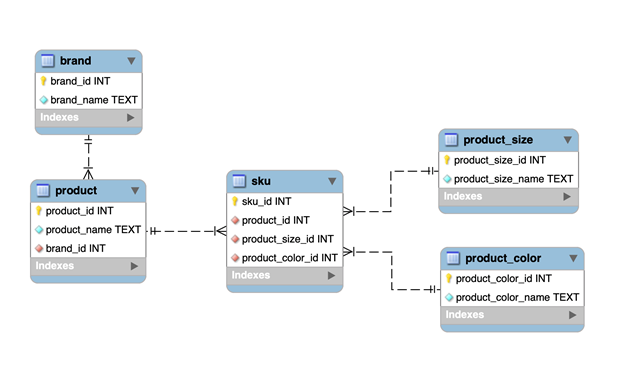
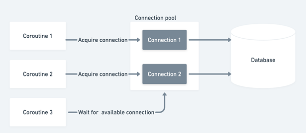

# 非阻塞数据库驱动程序

本章涵盖

- 使用 asyncpg 运行异步友好的数据库查询
- 创建同时运行多个 SQL 查询的数据库连接池
- 管理异步数据库事务
- 使用异步生成器流式传输查询结果

第 4 章探讨了使用 aiohttp 库发出非阻塞 Web 请求，并且还讨论了使用几种不同的异步 API 方法来同时运行这些请求。通过结合 asyncio API 和 aiohttp 库，我们可以同时运行多个长时间运行的 Web 请求，从而改善应用程序的运行时间。我们在第 4 章中学到的概念不仅仅适用于 Web 请求。它们也适用于运行 SQL 查询，并且可以提高数据库密集型应用程序的性能。

与 Web 请求非常相似，我们需要使用对异步友好的库，因为典型的 SQL 库会阻塞主线程，因此会阻塞事件循环，直到检索到结果。在本章中，我们将学习更多关于使用 asyncpg 库进行异步数据库访问的知识。我们将首先创建一个简单的模式来跟踪电子商务店面的产品，然后我们将使用它来异步运行查询。然后，我们将研究如何管理数据库中的事务和回滚，以及设置连接池。

## 5.1 介绍 asyncpg
正如我们之前提到的，我们现有的阻塞库无法与协程无缝协作。要对数据库同时运行查询，我们需要使用一个使用非阻塞套接字的异步友好库。为此，我们将使用一个名为 asyncpg 的库，它可以让我们异步连接到 Postgres 数据库并对它们运行查询。

在本章中，我们将专注于 Postgres 数据库，但我们在这里学到的内容也将适用于 MySQL 和其他数据库。 aiohttp 的创建者还创建了 aiomysql 库，它可以连接和运行对 MySQL 数据库的查询。虽然存在一些差异，但 API 是相似的，并且知识是可转移的。值得注意的是，asyncpg 库没有实现 PEP-249 中定义的 Python 数据库 API 规范（可在 https://www.python.org/dev/peps/pep-0249 获得）。这是库实现者有意识的选择，因为并发实现本质上不同于同步实现。然而，aiomysql 的创建者采取了不同的路线并实现了 PEP-249，因此在 Python 中使用过同步数据库驱动程序的人会觉得这个库的 API 很熟悉。

asynpg 的当前文档可在 https://magicstack.github.io/asyncpg/current/ 获得。现在我们已经了解了一些我们将要使用的驱动程序，让我们连接到我们的第一个数据库。

## 5.2 连接到 Postgres 数据库
要开始使用 asyncpg，我们将使用为电子商务店面创建产品数据库的真实场景。我们将在整章中使用这个示例数据库来演示这个领域中我们可能需要解决的数据库问题。

开始创建我们的产品数据库和运行查询的第一件事是建立数据库连接。对于本节和本章的其余部分，我们假设你在本地计算机上运行一个 Postgres 数据库，默认端口为 5432，并且我们假设默认用户 postgres 的密码为“password”。

警告我们将在这些代码示例中对密码进行硬编码，以提高透明度和学习目的；但请注意，你不应该在代码中硬编码密码，因为这违反了安全原则。始终将密码存储在环境变量或其他一些配置机制中。

你可以从 https://www.postgresql.org/download/ 下载并安装 Postgres 的副本；只需选择你正在使用的适当操作系统。你也可以考虑使用 Docker Postgres 镜像；更多信息可以在 https://hub.docker.com/_/postgres/ 找到。

设置好数据库后，我们将安装 asyncpg 库。我们将使用 pip3 来执行此操作，并且我们将安装在撰写本文时的最新版本 0.0.23：

```
pip3 install -Iv asyncpg==0.23.0
```

安装后，我们现在可以导入库并建立与数据库的连接。 asyncpg 通过 asyncpg.connect 函数提供了这个。让我们用它来连接并打印出数据库版本号。

清单 5.1 以默认用户身份连接到 Postgres 数据库

```python
import asyncpg
import asyncio
 
async def main():
    connection = await asyncpg.connect(host='127.0.0.1',
                                       port=5432,
                                       user='postgres',
                                       database='postgres',
                                       password='password')
    version = connection.get_server_version()
    print(f'Connected! Postgres version is {version}')
    await connection.close()
 
asyncio.run(main())
```

在前面的清单中，我们作为默认 postgres 用户和默认 postgres 数据库创建到 Postres 实例的连接。假设我们的 Postgres 实例已启动并正在运行，我们应该会在控制台上看到类似“已连接！Postgres 版本为 ServerVersion(major=12, minor=0, micro=3, releaselevel='final' serial=0)”的信息，表明我们已经成功连接到我们的数据库。最后，我们使用 await connection.close() 关闭与数据库的连接。

现在我们已经连接，但我们的数据库中目前没有存储任何内容。下一步是创建一个我们可以与之交互的产品模式。在创建此模式时，我们将学习如何使用 asyncpg 执行基本查询。

## 5.3 定义数据库模式
要开始对我们的数据库运行查询，我们需要创建一个数据库模式。我们将选择一个简单的模式，我们将其称为产品，对在线店面可能有库存的真实产品进行建模。让我们定义一些不同的实体，然后我们可以将它们转换为数据库中的表。

> 品牌
>
> 品牌是许多不同产品的制造商。例如，福特是一个生产许多不同型号汽车的品牌（例如，福特 F150、福特嘉年华等）。

> 产品
>
> 产品与一个品牌相关联，品牌和产品之间存在一对多的关系。为简单起见，在我们的产品数据库中，产品只有一个产品名称。在福特的例子中，产品是一款名为 Fiesta 的紧凑型汽车；品牌是福特。此外，我们数据库中的每种产品都有多种尺寸和颜色。我们将可用的尺寸和颜色定义为 SKU。

> 库存单位
>
> SKU代表库存单位。 SKU 代表店面出售的不同商品。例如，牛仔裤可能是待售产品，SKU 可能是牛仔裤，尺寸：中号，颜色：蓝色；或牛仔裤，尺码：小号，颜色：黑色。产品和 SKU 之间存在一对多的关系。

> 产品尺寸
>
> 一个产品可以有多种尺寸。对于此示例，我们将考虑只有三种尺寸可用：小号、中号和大号。每个 SKU 都有一个与之关联的产品尺寸，因此产品尺寸和 SKU 之间存在一对多的关系。

> 产品颜色
>
> 一个产品可以有多种颜色。对于这个例子，我们会说我们的库存只包含两种颜色：黑色和蓝色。产品颜色和 SKU 之间存在一对多的关系。



图 5.1 products 数据库的实体图

综上所述，我们将对数据库模式进行建模，如图 5.1 所示。

现在，让我们使用创建此模式所需的 SQL 定义一些变量。使用 asyncpg，我们将执行这些语句来创建我们的产品数据库。由于我们的尺寸和颜色是提前知道的，我们还将在 product_size 和 product_color 表中插入一些记录。我们将在接下来的代码清单中引用这些变量，因此我们不需要重复冗长的 SQL 创建语句。

清单 5.2 产品模式表创建语句

```python
CREATE_BRAND_TABLE = \
    """
    CREATE TABLE IF NOT EXISTS brand(
        brand_id SERIAL PRIMARY KEY,
        brand_name TEXT NOT NULL
    );"""
 
CREATE_PRODUCT_TABLE = \
    """
    CREATE TABLE IF NOT EXISTS product(
        product_id SERIAL PRIMARY KEY,
        product_name TEXT NOT NULL,
        brand_id INT NOT NULL,
        FOREIGN KEY (brand_id) REFERENCES brand(brand_id)
    );"""
 
CREATE_PRODUCT_COLOR_TABLE = \
    """
    CREATE TABLE IF NOT EXISTS product_color(
        product_color_id SERIAL PRIMARY KEY,
        product_color_name TEXT NOT NULL
    );"""
 
CREATE_PRODUCT_SIZE_TABLE = \
    """
    CREATE TABLE IF NOT EXISTS product_size(
        product_size_id SERIAL PRIMARY KEY,
        product_size_name TEXT NOT NULL
    );"""
 
CREATE_SKU_TABLE = \
    """
    CREATE TABLE IF NOT EXISTS sku(
       sku_id SERIAL PRIMARY KEY,
       product_id INT NOT NULL,
       product_size_id INT NOT NULL,
       product_color_id INT NOT NULL,
       FOREIGN KEY (product_id)
       REFERENCES product(product_id),
       FOREIGN KEY (product_size_id)
       REFERENCES product_size(product_size_id),
       FOREIGN KEY (product_color_id)
       REFERENCES product_color(product_color_id)
    );"""
 
COLOR_INSERT = \
    """
    INSERT INTO product_color VALUES(1, 'Blue');
    INSERT INTO product_color VALUES(2, 'Black');
    """
 
SIZE_INSERT = \
    """
    INSERT INTO product_size VALUES(1, 'Small');
    INSERT INTO product_size VALUES(2, 'Medium');
    INSERT INTO product_size VALUES(3, 'Large');
    """
```

现在我们有了创建表和插入大小和颜色的语句，我们需要一种方法来对它们运行查询。

## 5.4 使用 asyncpg 执行查询
要对我们的数据库运行查询，我们首先需要连接到 Postgres 实例并直接在 Python 之外创建数据库。以默认 Postgres 用户身份连接到数据库后，我们可以通过执行以下语句来创建数据库：

```CREATE DATABASE products;```
你可以通过命令行运行 sudo -u postgres psql -c "CREATE TABLE products;" 来执行此操作。在接下来的示例中，我们将假设你已执行此语句，因为我们将直接连接到产品数据库。

现在我们已经创建了产品数据库，我们将连接到它并执行我们的创建语句。连接类有一个名为 execute 的协程，我们可以使用它来一一运行我们的 create 语句。这个协程返回一个字符串，表示 Postgres 返回的查询的状态。让我们使用我们在上一节中创建的语句并执行它们。

清单 5.3 使用执行协程运行创建语句

```python
import asyncpg
import asyncio
 
 
async def main():
    connection = await asyncpg.connect(host='127.0.0.1',
                                       port=5432,
                                       user='postgres',
                                       database='products',
                                       password='password')
    statements = [CREATE_BRAND_TABLE,
                  CREATE_PRODUCT_TABLE,
                  CREATE_PRODUCT_COLOR_TABLE,
                  CREATE_PRODUCT_SIZE_TABLE,
                  CREATE_SKU_TABLE,
                  SIZE_INSERT,
                  COLOR_INSERT]
 
    print('Creating the product database...')
    for statement in statements:
        status = await connection.execute(statement)
        print(status)
    print('Finished creating the product database!')
    await connection.close()
 
 
asyncio.run(main())
```

我们首先创建与我们的产品数据库的连接，类似于我们在第一个示例中所做的，不同之处在于这里我们连接到产品数据库。一旦我们有了这个连接，我们就开始使用 connection.execute() 一次一个地执行我们的 CREATE TABLE 语句。请注意，execute() 是一个协程，因此要运行我们的 SQL，我们需要等待调用。假设一切正常，每个执行语句的状态应该是 CREATE TABLE，每个插入语句应该是 INSERT 0 1。最后，我们关闭与产品数据库的连接。请注意，在此示例中，我们在 for 循环中等待每个 SQL 语句，这确保我们同步运行 INSERT 语句。由于某些表依赖于其他表，因此我们不能同时运行它们。

这些语句没有任何关联的结果，所以让我们插入几条数据并运行一些简单的选择查询。我们将首先插入一些品牌，然后查询它们以确保我们已正确插入它们。我们可以像以前一样使用 execute 协程插入数据，并且可以使用 fetch 协程运行查询。

清单 5.4 插入和选择品牌

```python
import asyncpg
import asyncio
from asyncpg import Record
from typing import List
async def main():
    connection = await asyncpg.connect(host='127.0.0.1',
                                       port=5432,
                                       user='postgres',
                                       database='products',
                                       password='password')
    await connection.execute("INSERT INTO brand VALUES(DEFAULT, 'Levis')")
    await connection.execute("INSERT INTO brand VALUES(DEFAULT, 'Seven')")
 
    brand_query = 'SELECT brand_id, brand_name FROM brand'
    results: List[Record] = await connection.fetch(brand_query)
 
    for brand in results:
        print(f'id: {brand["brand_id"]}, name: {brand["brand_name"]}')
 
    await connection.close()
 
 
asyncio.run(main())
```

我们首先在品牌表中插入两个品牌。完成此操作后，我们使用 connection .fetch 从我们的品牌表中获取所有品牌。一旦这个查询完成，我们将把所有结果都保存在结果变量的内存中。每个结果都将是一个 asyncpg Record 对象。这些对象的行为类似于字典；它们允许我们通过传入带有下标语法的列名来访问数据。执行此操作将为我们提供以下输出：

```
id: 1, name: Levis
id: 2, name: Seven
```

在此示例中，我们将查询的所有数据提取到列表中。如果我们想获取单个结果，我们可以调用 connection.fetchrow()，它将从查询中返回单个记录。默认的 asyncpg 连接会将我们查询的所有结果拉入内存，因此 fetchrow 和 fetch 之间暂时没有性能差异。在本章后面，我们将看到如何使用带有游标的流式结果集。这些只会一次将一些结果拉入内存，这对于查询可能返回大量数据的时候是一种有用的技术。

这些示例一个接一个地运行查询，我们可以通过使用非异步数据库驱动程序获得类似的性能。然而，由于我们现在返回协程，我们可以使用我们在第 4 章中学习的 asyncio API 方法来并发执行查询。

## 5.5 与连接池同时执行查询
asyncio 对 I/O 绑定操作的真正好处是能够同时运行多个任务。我们需要重复进行的相互独立的查询是我们可以应用并发以使我们的应用程序性能更好的很好的例子。为了证明这一点，让我们假设我们是一个成功的电子商务店面。我们公司为 1,000 个不同的品牌提供 100,000 个 SKU。

我们还会假装我们通过合作伙伴销售我们的商品。这些合作伙伴通过我们建立的批处理在给定时间提出数千种产品的请求。按顺序运行所有这些查询可能会很慢，因此我们想创建一个同时执行这些查询的应用程序，以确保快速体验。

由于这是一个示例，并且我们手头没有 100,000 个 SKU，我们将从在我们的数据库中创建假产品和 SKU 记录开始。我们将为随机品牌和产品随机生成 100,000 个 SKU，我们将使用此数据集作为运行查询的基础。

### 5.5.1 将随机 SKU 插入产品数据库
由于我们不想自己列出品牌、产品和 SKU，我们将随机生成它们。我们将从 1,000 个最常出现的英语单词列表中选择随机名称。为了这个例子，我们假设我们有一个包含这些单词的文本文件，称为 common_words.txt。你可以从本书的 GitHub 数据存储库 https://github.com/concurrency-in-python-with-asyncio/data 下载此文件的副本。

我们要做的第一件事是插入我们的品牌，因为我们的产品表依赖于brand_id 作为外键。我们将使用 connection.executemany 协程编写参数化 SQL 来插入这些品牌。这将允许我们编写一个 SQL 查询并传入我们想要插入的参数列表，而不必为每个品牌创建一个 INSERT 语句。

executemany 协程接收一个 SQL 语句和一个包含我们想要插入的值的元组列表。我们可以使用 $1, $2 ... \$N 语法来参数化 SQL 语句。美元符号后面的每个数字代表我们想在 SQL 语句中使用的元组的索引。例如，如果我们有一个查询，我们写成“INSERT INTO table VALUES(\$1, \$2)”和一个元组列表 [('a', 'b'), ('c', 'd')] 这将为我们执行两个插入：

```
INSERT INTO table ('a', 'b')
INSERT INTO table ('c', 'd')
```

我们将首先从常用词列表中生成 100 个随机品牌名称的列表。我们将把它作为一个元组列表返回，每个元组都有一个值，所以我们可以在 executemany 协程中使用它。一旦我们创建了这个列表，就需要在这个元组列表旁边传递一个参数化的 INSERT 语句。

清单 5.5 插入随机品牌

```python
import asyncpg
import asyncio
from typing import List, Tuple, Union
from random import sample
 
 
def load_common_words() -> List[str]:
    with open('common_words.txt') as common_words:
        return common_words.readlines()
def generate_brand_names(words: List[str]) -> List[Tuple[Union[str, ]]]:
    return [(words[index],) for index in sample(range(100), 100)]
 
 
async def insert_brands(common_words, connection) -> int:
    brands = generate_brand_names(common_words)
    insert_brands = "INSERT INTO brand VALUES(DEFAULT, $1)"
    return await connection.executemany(insert_brands, brands)
 
 
async def main():
    common_words = load_common_words()
    connection = await asyncpg.connect(host='127.0.0.1',
                                       port=5432,
                                       user='postgres',
                                       database='products',
                                       password='password')
    await insert_brands(common_words, connection)
 
 
asyncio.run(main())
```


在内部，executemany 将遍历我们的品牌列表并为每个品牌生成一个 INSERT 语句。然后它将一次执行所有这些插入语句。这种参数化方法还可以防止我们受到 SQL 注入攻击，因为输入数据已经过净化。一旦我们运行它，我们的系统中应该有 100 个品牌，名称是随机的。

现在我们已经了解了如何插入随机品牌，让我们使用相同的技术插入产品和 SKU。对于产品，我们将创建一个包含 10 个随机词和一个随机品牌 ID 的描述。对于 SKU，我们将随机选择尺寸、颜色和产品。我们假设我们的品牌 ID 从 1 开始，以 100 结束。

清单 5.6 插入随机产品和 SKU

```python
import asyncio
import asyncpg
from random import randint, sample
from typing import List, Tuple
from chapter_05.listing_5_5 import load_common_words
 
 
def gen_products(common_words: List[str],
                 brand_id_start: int,
                 brand_id_end: int,
                 products_to_create: int) -> List[Tuple[str, int]]:
    products = []
    for _ in range(products_to_create):
        description = [common_words[index] for index in sample(range(1000), 10)]
        brand_id = randint(brand_id_start, brand_id_end)
        products.append((" ".join(description), brand_id))
    return products
 
 
def gen_skus(product_id_start: int,
             product_id_end: int,
             skus_to_create: int) -> List[Tuple[int, int, int]]:
    skus = []
    for _ in range(skus_to_create):
        product_id = randint(product_id_start, product_id_end)
        size_id = randint(1, 3)
        color_id = randint(1, 2)
        skus.append((product_id, size_id, color_id))
    return skus
 
 
async def main():
    common_words = load_common_words()
    connection = await asyncpg.connect(host='127.0.0.1',
                                       port=5432,
                                       user='postgres',
                                       database='products',
                                       password='password')
 
    product_tuples = gen_products(common_words,
                                  brand_id_start=1,
                                  brand_id_end=100,
                                  products_to_create=1000)
    await connection.executemany("INSERT INTO product VALUES(DEFAULT, $1, $2)",
                                 product_tuples)
 
    sku_tuples = gen_skus(product_id_start=1,
                          product_id_end=1000,
                          skus_to_create=100000)
    await connection.executemany("INSERT INTO sku VALUES(DEFAULT, $1, $2, $3)",
                                 sku_tuples)
 
    await connection.close()
 
 
asyncio.run(main())
```


当我们运行这个清单时，我们应该有一个包含 1,000 种产品和 100,000 个 SKU 的数据库。根据你的机器，这可能需要几秒钟才能运行。通过一些连接，我们现在可以查询特定产品的所有可用 SKU。让我们看看这个查询对于产品 id 100 的样子：

```python
product_query = \
"""
SELECT
p.product_id,
p.product_name,
p.brand_id,
s.sku_id,
pc.product_color_name,
ps.product_size_name
FROM product as p
JOIN sku as s on s.product_id = p.product_id
JOIN product_color as pc on pc.product_color_id = s.product_color_id
JOIN product_size as ps on ps.product_size_id = s.product_size_id
WHERE p.product_id = 100"""
```

当我们执行这个查询时，我们将为产品的每个 SKU 获取一行，并且我们还将获取尺寸和颜色的正确英文名称，而不是 ID。假设我们有很多我们想在给定时间查询的产品 ID，这为我们提供了一个应用并发的好机会。我们可能会天真地尝试将 asyncio.gather 与我们现有的连接一起应用，如下所示：

```python
async def main():
    connection = await asyncpg.connect(host='127.0.0.1',
                                       port=5432,
                                       user='postgres',
                                       database='products',
                                       password='password')
    print('Creating the product database...')
    queries = [connection.execute(product_query),
               connection.execute(product_query)]
    results = await asyncio.gather(*queries)
```

但是，如果我们运行它，我们会收到一个错误：

```python
RuntimeError: readexactly() called while another coroutine is already waiting for incoming data
```

为什么是这样？在 SQL 世界中，一个连接意味着一个到我们数据库的套接字连接。由于我们只有一个连接并且我们试图同时读取多个查询的结果，因此我们遇到了错误。我们可以通过创建到数据库的多个连接并为每个连接执行一个查询来解决此问题。由于创建连接耗费资源，因此缓存它们以便我们可以在需要时访问它们是有意义的。这通常称为连接池。

### 5.5.2 创建连接池以并发运行查询
由于我们一次只能对每个连接运行一个查询，因此我们需要一种机制来创建和管理多个连接。连接池就是这样做的。你可以将连接池视为与数据库实例的现有连接的缓存。它们包含有限数量的连接，当我们需要运行查询时可以访问这些连接。

使用连接池，我们在需要运行查询时获取连接。获取连接意味着我们询问池，“池当前是否有任何可用连接？如果是这样，给我一个，这样我就可以运行我的查询。”连接池有助于重用这些连接来执行查询。换句话说，一旦从池中获取连接以运行查询并且该查询完成，我们将其返回或“释放”到池中以供其他人使用。这很重要，因为与数据库建立连接非常耗时。如果我们必须为要运行的每个查询创建一个新连接，我们的应用程序的性能将很快下降。

由于连接池的连接数是有限的，我们可能会等待一段时间让一个可用，因为其他连接可能正在使用中。这意味着连接获取是一项可能需要时间才能完成的操作。如果池中只有 10 个连接，每个都在使用中，并且我们请求另一个，我们需要等到 10 个连接中的 1 个可用于执行查询。

为了说明这在 asyncio 方面是如何工作的，让我们假设我们有一个包含两个连接的连接池。我们还假设我们有三个协程，每个协程运行一个查询。我们将作为任务同时运行这三个协程。以这种方式设置连接池后，尝试运行查询的前两个协程将获取两个可用连接并开始运行查询。在这种情况下，第三个协程将等待连接可用。当前两个协程中的任何一个完成运行查询时，它将释放其连接并将其返回到池中。这让第三个协程获取它并开始使用它来运行它的查询（图 5.2）。



图 5.2 协程 1 和 2 获取连接以运行它们的查询，而协程 3 等待连接。一旦协程 1 或 2 完成，协程 3 将能够使用新发布的连接并能够执行其查询。

在这个模型中，我们最多可以同时运行两个查询。通常，连接池会更大一点以启用更多并发性。对于我们的示例，我们将使用 6 个连接池，但你要使用的实际数量取决于你的数据库和运行应用程序的硬件。在这种情况下，你需要对最有效的连接池大小进行基准测试。请记住，更大并不总是更好，但这是一个更大的话题。

既然我们了解了连接池是如何工作的，那么我们如何使用 asyncpg 创建一个呢？ asyncpg 公开了一个名为 create_pool 的协程来完成此操作。我们使用它而不是我们之前使用的连接函数来建立与数据库的连接。当我们调用 create_pool 时，我们将指定我们希望在池中创建的连接数。我们将使用 min_size 和 max_size 参数来做到这一点。 min_size 参数指定连接池中的最小连接数。这意味着一旦我们建立了我们的池，我们就可以保证在其中已经建立了这个数量的连接。 max_size 参数指定我们希望池中的最大连接数，确定我们可以拥有的最大连接数。如果我们没有足够的可用连接，如果新连接不会导致池大小超过 max_size 中设置的值，池将为我们创建一个新连接。对于我们的第一个示例, 我们将这两个值都设置为 6。这保证了我们总是有六个可用的连接。

asyncpg 池是异步上下文管理器，这意味着我们必须使用 async with 语法来创建池。一旦我们建立了一个池，我们就可以使用 acquire 协程来获取连接。这个协程将暂停执行，直到我们有可用的连接。一旦我们这样做了，我们就可以使用该连接来执行我们想要的任何 SQL 查询。获取连接也是一个异步上下文管理器，它在我们完成连接后将连接返回到池，因此我们需要使用 async with 语法，就像我们在创建池时所做的那样。使用它，我们可以重写我们的代码以同时运行多个查询。

清单 5.7 建立连接池并同时运行查询

```python
import asyncio
import asyncpg
 
product_query = \
    """
SELECT
p.product_id,
p.product_name,
p.brand_id,
s.sku_id,
pc.product_color_name,
ps.product_size_name
FROM product as p
JOIN sku as s on s.product_id = p.product_id
JOIN product_color as pc on pc.product_color_id = s.product_color_id
JOIN product_size as ps on ps.product_size_id = s.product_size_id
WHERE p.product_id = 100"""
 
 
async def query_product(pool):
    async with pool.acquire() as connection:
        return await connection.fetchrow(product_query)
 
 
async def main():
    async with asyncpg.create_pool(host='127.0.0.1',
                                   port=5432,
                                   user='postgres',
                                   password='password',
                                   database='products',
                                   min_size=6,
                                   max_size=6) as pool:    ❶
 
        await asyncio.gather(query_product(pool),
                             query_product(pool))          ❷
 
 
asyncio.run(main())
```

❶ 创建一个有六个连接的连接池。
❷ 同时执行两个产品查询。

在前面的清单中，我们首先创建了一个包含六个连接的连接池。然后我们创建两个查询协程对象并安排它们与 asyncio.gather 并发运行。在我们的 query_product 协程中，我们首先使用 pool.acquire() 从池中获取连接。然后，此协程将暂停运行，直到连接池中的连接可用。我们在 async with 块中执行此操作；这将确保一旦我们离开块，连接将返回到池中。这很重要，因为如果我们不这样做，我们可能会用完连接，最终会导致应用程序永远挂起，等待永远不会可用的连接。一旦我们获得了一个连接，我们就可以像前面的例子一样运行我们的查询。

我们可以通过创建 10,000 个不同的查询协程对象来扩展此示例以运行 10,000 个查询。为了让这件事变得有趣，我们将编写一个同步运行查询的版本，并比较需要多长时间。

清单 5.8 同步查询与并发

```python
import asyncio
import asyncpg
from util import async_timed
 
product_query = \
    """
SELECT
p.product_id,
p.product_name,
p.brand_id,
s.sku_id,
pc.product_color_name,
ps.product_size_name
FROM product as p
JOIN sku as s on s.product_id = p.product_id
JOIN product_color as pc on pc.product_color_id = s.product_color_id
JOIN product_size as ps on ps.product_size_id = s.product_size_id
WHERE p.product_id = 100"""
 
 
async def query_product(pool):
    async with pool.acquire() as connection:
        return await connection.fetchrow(product_query)
 
@async_timed()
async def query_products_synchronously(pool, queries):
    return [await query_product(pool) for _ in range(queries)]
 
 
@async_timed()
async def query_products_concurrently(pool, queries):
    queries = [query_product(pool) for _ in range(queries)]
    return await asyncio.gather(*queries)
 
 
async def main():
    async with asyncpg.create_pool(host='127.0.0.1',
                                   port=5432,
                                   user='postgres',
                                   password='password',
                                   database='products',
                                   min_size=6,
                                   max_size=6) as pool:
        await query_products_synchronously(pool, 10000)
        await query_products_concurrently(pool, 10000)
 
asyncio.run(main())
```

在 query_products_synchronously 中，我们在列表推导中放置了一个等待，这将强制对 query_product 的每次调用按顺序运行。然后，在 query_products_concurrently 中，我们创建了一个我们想要运行的协程列表，然后将它们与gather 并发运行。在主协程中，我们运行我们的同步和并发版本，每个都有 10,000 个查询。虽然确切的结果可能会因你的硬件而有很大差异，但并发版本的速度几乎是串行版本的五倍：

```python
starting <function query_products_synchronously at 0x1219ea1f0> with args (<asyncpg.pool.Pool object at 0x12164a400>, 10000) {}
finished <function query_products_synchronously at 0x1219ea1f0> in 21.8274 second(s)
starting <function query_products_concurrently at 0x1219ea310> with args (<asyncpg.pool.Pool object at 0x12164a400>, 10000) {}
finished <function query_products_concurrently at 0x1219ea310> in 4.8464 second(s)
```

像这样的改进是显着的，但是如果我们需要更多的吞吐量，我们还可以做出更多的改进。由于我们的查询相对较快，因此这段代码是 CPU 密集型和 I/O 密集型的混合体。在第 6 章中，我们将看到如何从这种设置中获得更多性能。

到目前为止，我们已经了解了如何在没有任何故障的情况下将数据插入数据库。但是如果我们在插入产品的过程中失败了怎么办？我们不希望数据库中出现不一致的状态，因此这就是数据库事务发挥作用的地方。接下来，我们将了解如何使用异步上下文管理器来获取和管理事务。

## 5.6 使用 asyncpg 管理事务
事务是许多满足 ACID（原子、一致、隔离、持久）属性的数据库中的核心概念。事务由作为一个原子单元执行的一个或多个 SQL 语句组成。如果在事务中执行语句时没有发生错误，我们将语句提交到数据库，使任何更改成为数据库的永久部分。如果有任何错误，我们会回滚语句，就好像它们从未发生过一样。在我们的产品数据库的上下文中，如果我们尝试插入重复的品牌，或者如果我们违反了我们设置的数据库约束，我们可能需要回滚一组更新。

在 asyncpg 中，处理事务的最简单方法是使用连接 .transaction 异步上下文管理器来启动它们。然后，如果 async with 块中出现异常，事务将自动回滚。如果一切执行成功，它将自动提交。让我们看看如何创建一个事务并执行两个简单的插入语句来添加几个品牌。

清单 5.9 创建一个事务

```python
import asyncio
import asyncpg
 
async def main():
    connection = await asyncpg.connect(host='127.0.0.1',
                                       port=5432,
                                       user='postgres',
                                       database='products',
                                       password='password')
    async with connection.transaction():                      ❶
        await connection.execute("INSERT INTO brand "
                                 "VALUES(DEFAULT, 'brand_1')")
        await connection.execute("INSERT INTO brand "
                                 "VALUES(DEFAULT, 'brand_2')")
 
    query = """SELECT brand_name FROM brand
                WHERE brand_name LIKE 'brand%'"""
    brands = await connection.fetch(query)                    ❷
    print(brands)
 
    await connection.close()
 
asyncio.run(main())
```

❶ 启动数据库事务。
❷ 选择品牌以确保我们的交易得到承诺。
假设我们的事务成功提交，我们应该看到 [<Record brand_name='brand_1'>, <Record brand_name='brand_2'>] 打印到控制台。此示例假定运行两个插入语句的错误为零，并且所有内容均已成功提交。为了演示发生回滚时会发生什么，让我们强制一个 SQL 错误。为了测试这一点，我们将尝试插入两个具有相同主键 ID 的品牌。我们的第一次插入会成功，但我们的第二次插入会引发重复键错误。

清单 5.10 处理事务中的错误

```python
import asyncio
import logging
import asyncpg
 
async def main():
    connection = await asyncpg.connect(host='127.0.0.1',
                                       port=5432,
                                       user='postgres',
                                       database='products',
                                       password='password')
    try:
        async with connection.transaction():
            insert_brand = "INSERT INTO brand VALUES(9999, 'big_brand')"
            await connection.execute(insert_brand)
            await connection.execute(insert_brand)            ❶
    except Exception:
        logging.exception('Error while running transaction')  ❷
    finally:
        query = """SELECT brand_name FROM brand
                    WHERE brand_name LIKE 'big_%'"""
        brands = await connection.fetch(query)                ❸
        print(f'Query result was: {brands}')
 
        await connection.close()
 
asyncio.run(main())
```

❶ 这个插入语句会因为主键重复而出错。
❷ 如果我们有异常，记录错误。
❸ 选择品牌以确保我们没有插入任何东西。
在下面的代码中，我们的第二个插入语句会引发错误。这导致以下输出：

```python
ERROR:root:Error while running transaction
Traceback (most recent call last):
  File "listing_5_10.py", line 16, in main
    await connection.execute("INSERT INTO brand "
  File "asyncpg/connection.py", line 272, in execute
    return await self._protocol.query(query, timeout)
  File "asyncpg/protocol/protocol.pyx", line 316, in query
asyncpg.exceptions.UniqueViolationError: duplicate key value violates unique constraint "brand_pkey"
DETAIL:  Key (brand_id)=(9999) already exists.
Query result was: []
```

我们首先检索到一个异常，因为我们试图插入一个重复的键，然后看到我们的 select 语句的结果是空的，表明我们成功回滚了事务。

### 5.6.1 嵌套事务
asyncpg 还通过称为保存点的 Postgres 功能支持嵌套事务的概念。保存点在 Postgres 中使用 SAVEPOINT 命令定义。当我们定义一个保存点时，我们可以回滚到那个保存点，并且在保存点之后执行的任何查询都将回滚，但在它之前成功执行的任何查询都不会回滚。

在 asyncpg 中，我们可以通过在现有事务中调用 connection.transaction 上下文管理器来创建保存点。然后，如果这个内部事务中有任何错误，它就会回滚，但外部事务不受影响。让我们通过在事务中插入品牌来尝试这一点，然后在嵌套事务中尝试插入数据库中已经存在的颜色。

清单 5.11 一个嵌套事务

```python
import asyncio
import asyncpg
import logging
 
 
async def main():
    connection = await asyncpg.connect(host='127.0.0.1',
                                       port=5432,
                                       user='postgres',
                                       database='products',
                                       password='password')
    async with connection.transaction():
        await connection.execute("INSERT INTO brand VALUES(DEFAULT, 'my_new_brand')")
 
        try:
            async with connection.transaction():
                await connection.execute("INSERT INTO product_color VALUES(1, 'black')")
        except Exception as ex:
            logging.warning('Ignoring error inserting product color', exc_info=ex)
 
    await connection.close()
 
 
asyncio.run(main())
```


当我们运行这段代码时，我们的第一个 INSERT 语句运行成功，因为我们的数据库中还没有这个品牌。我们的第二个 INSERT 语句因重复键错误而失败。由于第二个插入语句在事务中，我们捕获并记录异常，尽管出现错误，但我们的外部事务没有回滚，并且标记被正确插入。如果我们没有嵌套事务，第二个插入语句也会回滚我们的品牌插入。

### 5.6.2 手动管理事务
到目前为止，我们已经使用异步上下文管理器来处理提交和回滚事务。由于这比我们自己管理事情要简单，因此通常是最好的方法。也就是说，我们可能会发现自己处于需要手动管理事务的情况。例如，我们可能希望在回滚时执行自定义代码，或者我们可能希望在除异常之外的条件下回滚。

要手动管理事务，我们可以在上下文管理器之外使用 connection.transaction 返回的事务管理器。当我们这样做时，我们需要手动调用它的 start 方法来启动一个事务，然后在成功时提交并在失败时回滚。让我们通过重写我们的第一个示例来看看如何做到这一点。

清单 5.12 手动管理事务

```python
import asyncio
import asyncpg
from asyncpg.transaction import Transaction
 
 
async def main():
    connection = await asyncpg.connect(host='127.0.0.1',
                                       port=5432,
                                       user='postgres',
                                       database='products',
                                       password='password')
    transaction: Transaction = connection.transaction()          ❶
    await transaction.start()                                    ❷
    try:
        await connection.execute("INSERT INTO brand "
                                 "VALUES(DEFAULT, 'brand_1')")
        await connection.execute("INSERT INTO brand "
                                 "VALUES(DEFAULT, 'brand_2')")
    except asyncpg.PostgresError:
        print('Errors, rolling back transaction!')
        await transaction.rollback()                             ❸
    else:
        print('No errors, committing transaction!')
        await transaction.commit()                               ❹
 
    query = """SELECT brand_name FROM brand
                WHERE brand_name LIKE 'brand%'"""
    brands = await connection.fetch(query)
    print(brands)
 
    await connection.close()
 
asyncio.run(main())
```


❶ 创建一个事务实例。
❷ 开始交易。
❸ 如果有异常，回滚。
❹ 如果没有异常，则提交。
我们首先使用与异步上下文管理器语法相同的方法调用创建事务，但相反，我们存储此调用返回的事务实例。将此类视为我们事务的管理器，因为有了它，我们将能够执行我们需要的任何提交和回滚。一旦我们有了一个事务实例，我们就可以调用启动协程。这将执行一个查询以在 Postgres 中启动事务。然后，在一个 try 块中，我们可以执行我们想要的任何查询。在这种情况下，我们插入两个品牌。如果这些 INSERT 语句中的任何一个出现错误，我们将遇到 except 块并通过调用回滚协程回滚事务。如果没有错误，我们调用提交协程，它将结束事务并将我们事务中的任何更改永久保存在数据库中。

到目前为止，我们一直在以一种将所有查询结果一次拉入内存的方式运行我们的查询。这对许多应用程序来说是有意义的，因为许多查询将返回小的结果集。但是，我们可能会遇到一种情况，即我们正在处理可能无法一次全部放入内存的大型结果集。在这些情况下，我们可能希望流式传输结果以避免对系统的随机存取存储器 (RAM) 造成负担。接下来，我们将探索如何使用 asyncpg 来实现这一点，并在此过程中介绍异步生成器。

## 5.7 异步生成器和流式结果集
asynpg 提供的默认 fetch 实现的一个缺点是，它将我们执行的任何查询中的所有数据提取到内存中。这意味着如果我们有一个返回数百万行的查询，我们会尝试将整个集合从数据库传输到请求机器。回到我们的产品数据库示例，想象一下我们更加成功并且拥有数十亿种产品。我们很可能会有一些查询返回非常大的结果集，这可能会损害性能。

当然，我们可以将 LIMIT 语句应用于我们的查询并对事物进行分页，这对许多（如果不是大多数）应用程序都是有意义的。也就是说，这种方法存在开销，因为我们多次发送相同的查询，可能会给数据库带来额外的压力。如果我们发现自己受到这些问题的阻碍，那么仅在需要时才为特定查询流式传输结果是有意义的。这将节省我们应用程序层的内存消耗并节省数据库的负载。但是，它的代价是通过网络到数据库进行更多的往返。

Postgres 通过游标的概念支持流式查询结果。将游标视为指向我们当前正在遍历结果集的位置的指针。当我们从流式查询中获得单个结果时，我们将光标移动到下一个元素，依此类推，直到没有更多结果。

使用 asyncpg，我们可以直接从连接中获取游标，然后我们可以使用它来执行流式查询。 asyncpg 中的游标使用我们尚未使用的 asyncio 功能，称为异步生成器。异步生成器会一个一个地异步生成结果，类似于常规的 Python 生成器。它们还允许我们使用特殊的 for 循环样式语法来迭代我们得到的任何结果。为了完全理解这是如何工作的，我们将首先介绍异步生成器以及 async for 语法来循环这些生成器。

### 5.7.1 介绍异步发电机
许多开发人员会熟悉来自同步 Python 世界的生成器。生成器是迭代器设计模式的一种实现，该模式在“四人组”（Addison-Wesley Professional，1994）一书中著名的设计模式：可重用的面向对象软件的元素中广为人知。这种模式允许我们“懒惰地”定义数据序列，并一次遍历一个元素。这对于潜在的大数据序列很有用，我们不需要一次将所有内容都存储在内存中。

一个简单的同步生成器是一个普通的 Python 函数，它包含一个 yield 语句而不是 return 语句。例如，让我们看看创建和使用生成器如何返回正整数，从零开始直到指定的结束。

清单 5.13 一个同步生成器

```python
def positive_integers(until: int):
    for integer in range(until):
        yield integer
 
 
positive_iterator = positive_integers(2)
 
print(next(positive_iterator))
print(next(positive_iterator))
```

在前面的清单中，我们创建了一个函数，它接受一个我们想要计数的整数。然后我们开始一个循环，直到我们指定的结束整数。然后，在循环的每次迭代中，我们产生序列中的下一个整数。当我们调用 positive_integers(2) 时，我们不会返回整个列表，甚至不会在我们的方法中运行循环。事实上，如果我们检查 positive_iterator 的类型，我们会得到 <class 'generator'>。

然后我们使用下一个实用函数来迭代我们的生成器。每次我们调用 next 时，这将触发一次 for 循环在 positive_integers 中的迭代，为我们提供每次迭代的 yield 语句的结果。因此，清单 5.13 中的代码将在控制台打印 0 和 1。除了使用 next 之外，我们还可以在生成器中使用 for 循环来遍历生成器中的所有值。

这适用于同步方法，但如果我们想使用协程异步生成一系列值怎么办？使用我们的数据库示例，如果我们想要生成一系列我们“懒惰”从数据库中获取的行怎么办？我们可以使用 Python 的异步生成器和特殊的 async for 语法来做到这一点。为了演示一个简单的异步生成器，让我们从正整数示例开始，但引入对协程的调用，该调用需要几秒钟才能完成。为此，我们将使用第 2 章中的延迟函数。

清单 5.14 一个简单的异步生成器

```python
import asyncio
from util import delay, async_timed
 
 
async def positive_integers_async(until: int):
    for integer in range(1, until):
        await delay(integer)
        yield integer
 
 
@async_timed()
async def main():
    async_generator = positive_integers_async(3)
    print(type(async_generator))
    async for number in async_generator:
        print(f'Got number {number}')
 
 
asyncio.run(main())
```

运行上面的清单，我们将看到类型不再是一个普通的生成器，而是 <class 'async_generator'>，一个异步生成器。异步生成器与常规生成器的不同之处在于，它不是生成普通的 Python 对象作为元素，而是生成协程，然后我们可以等待直到得到结果。正因为如此，我们正常的 for 循环和 next 函数不适用于这些类型的生成器。相反，我们有一种特殊的语法 async for 来处理这些类型的生成器。在此示例中，我们使用此语法迭代 positive_integers_async。

此代码将打印数字 1 和 2，在返回第一个数字之前等待 1 秒，在返回第二个数字之前等待 2 秒。请注意，这不是运行同时生成的协程；相反，它在一系列中一次生成并等待它们。

### 5.7.2 使用带有流游标的异步生成器
异步生成器的概念与流式数据库游标的概念非常吻合。使用这些生成器，我们将能够使用类似 for 循环的简单语法一次获取一行。要使用 asyncpg 执行流式传输，我们首先需要启动一个事务，因为 Postgres 要求它使用游标。一旦我们开始了一个事务，我们就可以调用 Connection 类的 cursor 方法来获取一个游标。当我们调用游标方法时，我们将传入我们想要流式传输的查询。此方法将返回一个异步生成器，我们可以使用它一次流式传输一个结果。

为了熟悉如何执行此操作，让我们运行一个查询以使用游标从我们的数据库中获取所有产品。然后，我们将使用 async for 语法从结果集中一次获取一个元素。

清单 5.15 一个一个地流式传输结果

```python
import asyncpg
import asyncio
import asyncpg
 
 
async def main():
    connection = await asyncpg.connect(host='127.0.0.1',
                                       port=5432,
                                       user='postgres',
                                       database='products',
                                       password='password')
 
    query = 'SELECT product_id, product_name FROM product'
    async with connection.transaction():
        async for product in connection.cursor(query):
            print(product)
 
    await connection.close()
 
 
asyncio.run(main())
```

前面的清单将一次打印出我们所有的产品。尽管在此表中放置了 1,000 种产品，但我们一次只会将其中一些放入内存中。在撰写本文时，为了减少网络流量，游标默认一次预取 50 条记录。我们可以通过设置 prefetch 参数来改变这种行为，无论我们想要预取多少元素。

我们还可以使用这些游标来跳过我们的结果集并一次获取任意数量的行。让我们通过从刚刚使用的查询中间获取一些记录来看看如何做到这一点。

清单 5.16 移动游标并获取记录

```python
import asyncpg
import asyncio
 
 
async def main():
    connection = await asyncpg.connect(host='127.0.0.1',
                                       port=5432,
                                       user='postgres',
                                       database='products',
                                       password='password')
    async with connection.transaction():
        query = 'SELECT product_id, product_name from product'
        cursor = await connection.cursor(query)                 ❶
        await cursor.forward(500)                               ❷
        products = await cursor.fetch(100)                      ❸
        for product in products:
            print(product)
 
    await connection.close()
 
 
asyncio.run(main())
```

❶ 为查询创建一个游标。
❷ 将光标向前移动 500 条记录。
❸ 获取接下来的 100 条记录。
前面清单中的代码将首先为我们的查询创建一个游标。请注意，我们在等待语句中使用它，例如协程而不是异步生成器；这是因为在 asyncpg 中，游标既是异步生成器又是可等待对象。在大多数情况下，这类似于使用异步生成器，但是以这种方式创建游标时，预取行为有所不同。使用此方法，我们无法设置预取值。这样做会引发一个接口错误。

一旦我们有了游标，我们就使用它的前向协程方法在结果集中向前移动。这将有效地跳过我们产品表中的前 500 条记录。一旦我们将光标向前移动，我们就会获取接下来的 100 个产品并将它们打印到控制台。

这些类型的游标默认情况下是不可滚动的，这意味着我们只能在结果集中向前移动。如果你想使用可以向前和向后移动的可滚动游标，则需要使用 DECLARE ... SCROLL CURSOR 手动执行 SQL 来执行此操作（你可以在 https 的 Postgres 文档中阅读有关如何执行此操作的更多信息: www.postgresql.org/docs/current/plpgsql-cursors.html）。

如果我们有一个非常大的结果集并且不想让整个结果集驻留在内存中，这两种技术都很有用。我们在清单 5.16 中看到的 async for 循环对于循环整个集合很有用，而创建游标和使用 fetch 协程方法对于获取一大块记录或跳过一组记录很有用。

但是，如果我们只想通过预取一次检索一组固定的元素并且仍然使用异步 for 循环怎么办？我们可以在我们的异步 for 循环中添加一个计数器，并在我们看到一定数量的元素后中断，但如果我们需要在代码中经常这样做，这并不是特别可重用。我们可以做的就是构建我们自己的异步生成器来使这更容易。我们称这个生成器为 take。该生成器将采用异步生成器和我们希望提取的元素数量。让我们研究创建它并从结果集中获取前五个元素。

清单 5.17 使用异步生成器获取特定数量的元素

```python
import asyncpg
import asyncio
 
 
async def take(generator, to_take: int):
    item_count = 0
    async for item in generator:
        if item_count > to_take - 1:
            return
        item_count = item_count + 1
        yield item
 
 
async def main():
    connection = await asyncpg.connect(host='127.0.0.1',
                                       port=5432,
                                       user='postgres',
                                       database='products',
                                       password='password')
    async with connection.transaction():
        query = 'SELECT product_id, product_name from product'
        product_generator = connection.cursor(query)
        async for product in take(product_generator, 5):
            print(product)
 
        print('Got the first five products!')
 
    await connection.close()
 
 
asyncio.run(main())
```

我们的异步生成器使用 item_count 跟踪到目前为止我们看到的项目数量。然后我们进入一个 async_for 循环并产生我们看到的每条记录。一旦我们产生了，我们检查 item_count 以查看我们是否产生了调用者请求的项目数。如果有，我们返回，结束异步生成器。在我们的主协程中，我们可以在正常的异步 for 循环中使用 take。在这个例子中，我们使用它来请求光标的前五个元素，给我们以下输出：

```
<Record product_id=1 product_name='among paper foot see shoe ride age'>
<Record product_id=2 product_name='major wait half speech lake won't'>
<Record product_id=3 product_name='war area speak listen horse past edge'>
<Record product_id=4 product_name='smell proper force road house planet'>
<Record product_id=5 product_name='ship many dog fine surface truck'>
Got the first five products!
```

虽然我们自己在代码中定义了这一点，但开源库 aiostream 具有此功能以及更多用于处理异步生成器的功能。你可以在 [aiostream.readthedocs.io](aiostream.readthedocs.io) 查看此库的文档。

## 概括

在本章中，我们学习了使用异步数据库连接在 Postgres 中创建和选择记录的基础知识。你现在应该能够掌握这些知识并创建并发数据库客户端。

- 我们已经学习了如何使用 asyncpg 连接到 Postgres 数据库。
- 我们已经学习了如何使用各种 asyncpg 协程来创建表、插入记录和执行单个查询。
- 我们已经学习了如何使用 asyncpg 创建连接池。这使我们可以使用 asyncio 的 API 方法（例如收集）同时运行多个查询。使用它，我们可以通过串联运行我们的查询来潜在地加速我们的应用程序。
- 我们已经学习了如何使用 asyncpg 管理事务。事务允许我们回滚由于故障而对数据库所做的任何更改，即使发生意外情况也可以使数据库保持一致状态。
- 我们已经学习了如何创建异步生成器以及如何将它们用于流式数据库连接。我们可以结合使用这两个概念来处理无法一次全部放入内存的大型数据集。