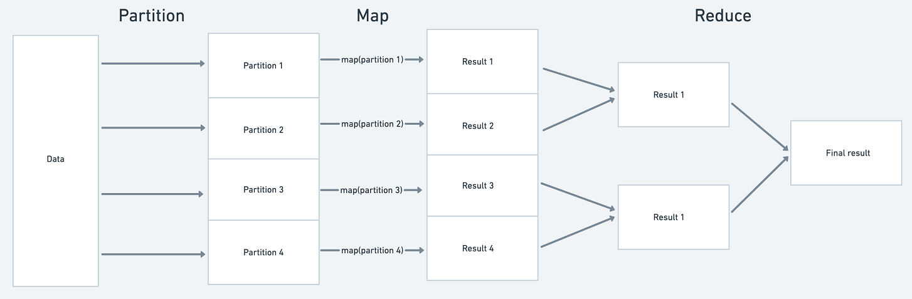
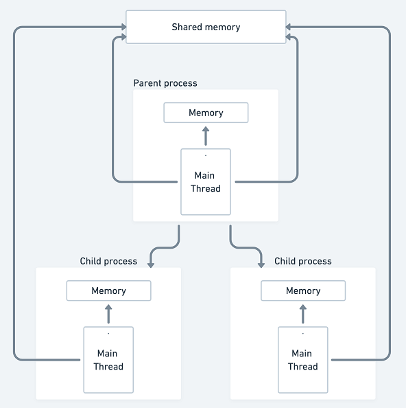
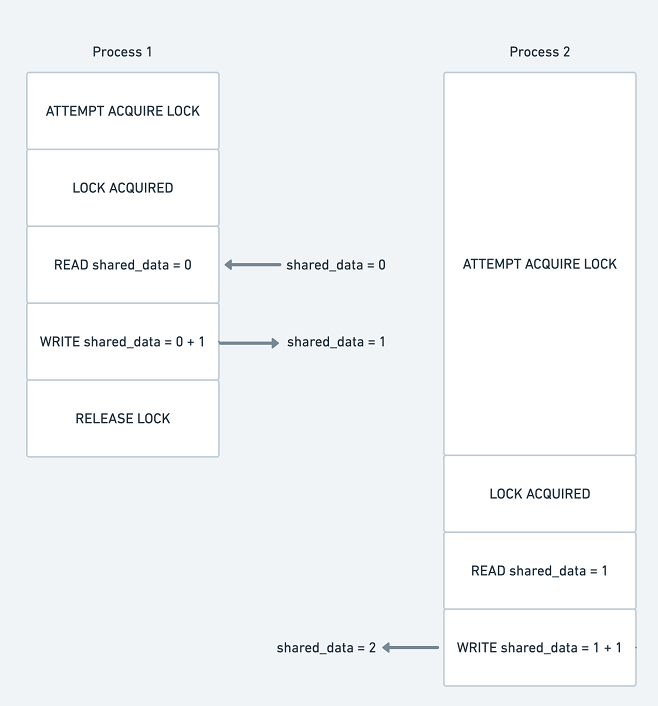
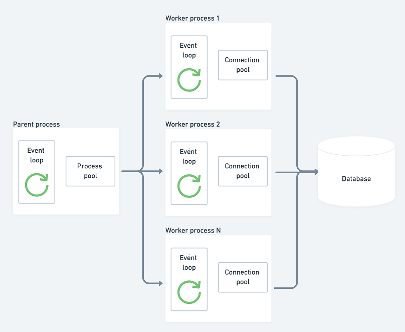
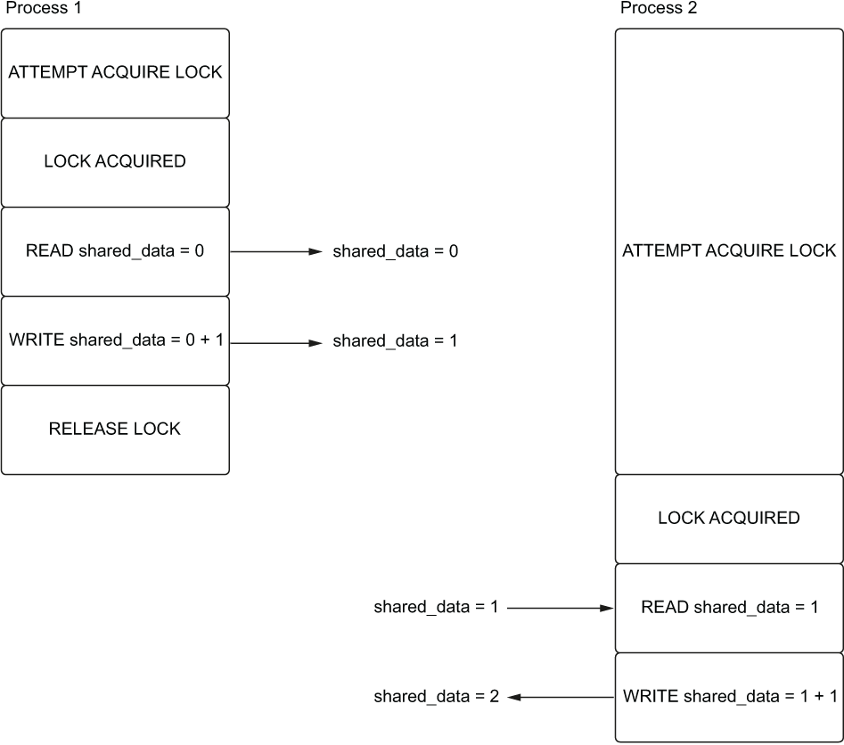
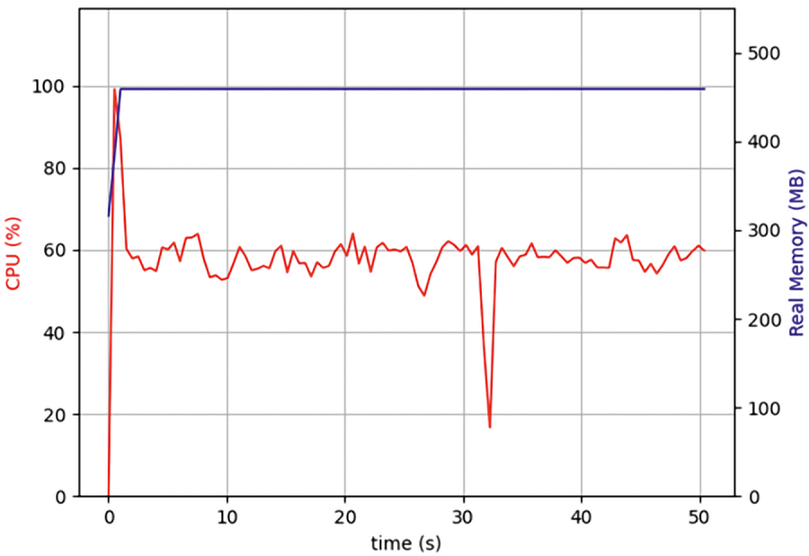
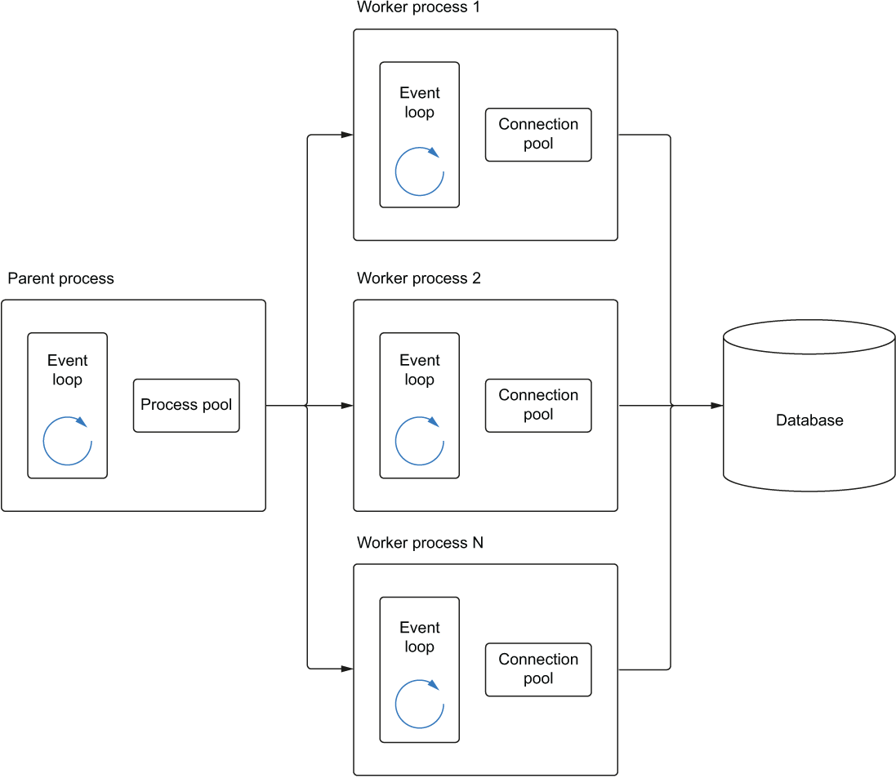

# 处理 CPU 绑定

本章涵盖

- 多处理库
- 创建进程池来处理 CPU 密集型工作
- 使用 async 和 await 管理 CPU 密集型工作
- 使用 MapReduce 通过 asyncio 解决 CPU 密集型问题
- 使用锁处理多个进程之间的共享数据
- 通过 CPU 和 I/O 密集型操作提高工作性能

到目前为止，我们一直专注于在同时运行 I/O 密集型工作时使用 asyncio 可以获得的性能提升。运行受 I/O 限制的工作是 asyncio 的主要工作，并且按照我们目前编写代码的方式，我们需要注意不要在协程中运行任何受 CPU 限制的代码。这似乎严重限制了 asyncio，但该库比仅处理 I/O 绑定工作更通用。

asyncio 有一个用于与 Python 的多处理库进行互操作的 API。这让我们可以使用 async await 语法以及具有多个进程的 asyncio API。使用它，即使使用 CPU 密集型代码，我们也可以获得 asyncio 库的好处。这使我们能够为 CPU 密集型工作（例如数学计算或数据处理）实现性能提升，让我们避开全局解释器锁定并充分利用多核机器。

在本章中，我们将首先了解多处理模块以熟悉执行多个进程的概念。然后我们将了解进程池执行器以及如何将它们挂接到 asyncio。然后，我们将利用这些知识来解决 MapReduce 的 CPU 密集型问题。我们还将学习管理多个进程之间的共享状态，并且我们将介绍锁定的概念以避免并发错误。最后，我们将看看如何使用多处理来提高我们在第 5 章中看到的 I/O 和 CPU 密集型应用程序的性能。

## 6.1 引入 multiprocessing 库

在第 1 章中，我们介绍了全局解释器锁。全局解释器锁可防止多个 Python 字节码并行运行。这意味着对于 I/O 绑定任务以外的任何任务，除了一些小的异常，使用多线程不会像在 Java 和 C++ 等语言中那样提供任何性能优势。对于 Python 中的可并行 CPU 密集型工作，似乎我们可能无法解决问题，但这是多处理库提供解决方案的地方。

我们不是父进程生成线程来并行化事物，而是生成子进程来处理我们的工作。每个子进程都有自己的 Python 解释器并受制于 GIL，但我们将拥有多个解释器而不是一个解释器，每个解释器都有自己的 GIL。假设我们在具有多个 CPU 内核的机器上运行，这意味着我们可以有效地并行化任何 CPU 密集型工作负载。即使我们的进程多于内核，我们的操作系统也会使用抢占式多任务处理来允许我们的多个任务同时运行。此设置既是并发的又是并行的。

要开始使用 multiprocessing 库，让我们从并行运行几个函数开始。我们将使用一个非常简单的 CPU 绑定函数，从零计数到一个大数来检查 API 的工作原理以及性能优势。

清单 6.1 具有多处理的两个并行进程

```python
import time
from multiprocessing import Process
 
 
def count(count_to: int) -> int:
    start = time.time()
    counter = 0
    while counter < count_to:
        counter = counter + 1
    end = time.time()
    print(f'Finished counting to {count_to} in {end-start}')
    return counter
 
 
if __name__ == "__main__":
    start_time = time.time()
 
    to_one_hundred_million = Process(target=count, args=(100000000,))  ❶
    to_two_hundred_million = Process(target=count, args=(200000000,))
 
    to_one_hundred_million.start()                                     ❷
    to_two_hundred_million.start()
 
    to_one_hundred_million.join()                                      ❸
    to_two_hundred_million.join()
 
    end_time = time.time()
    print(f'Completed in {end_time - start_time}')
```

❶ 创建一个进程来运行计数功能。

❷ 开始处理。此方法立即返回。

❸ 等待过程完成。此方法会阻塞，直到该过程完成。

在前面的清单中，我们创建了一个简单的 count 函数，它接受一个整数并运行一个循环，直到我们数到我们传入的整数。然后我们创建两个进程，一个数到 100,000,000，一个数到 200,000,000。 Process 类接受两个参数，一个 target 是我们希望在进程中运行的函数名称，而 args 表示我们希望传递给函数的参数元组。然后我们在每个进程上调用 start 方法。此方法立即返回并将开始运行该过程。在这个例子中，我们一个接一个地启动两个进程。然后我们在每个进程上调用 join 方法。这将导致我们的主进程阻塞，直到每个进程完成。没有这个，我们的程序几乎会立即退出并终止子进程，因为没有任何东西在等待它们的完成。清单 6.1 同时运行两个计数函数；假设我们在至少有两个 CPU 内核的机器上运行，我们应该会看到加速。当这段代码在 2.5 GHz 8 核机器上运行时，我们得到以下结果：

```
Finished counting down from 100000000 in 5.3844
Finished counting down from 200000000 in 10.6265
Completed in 10.8586
```

总的来说，我们的计数功能花费了 16 秒多一点，但我们的应用程序在不到 11 秒内完成。这为我们节省了大约 5 秒的顺序运行时间。当然，当你运行它时你看到的结果会根据你的机器而变化很大，但你应该看到一些与此等效的东西。

注意 if \_\_name\_\_ == "\_\_main\_\_": 添加到我们以前没有的应用程序中。这是多处理库的一个怪癖；如果你不添加它，你可能会收到以下错误：在当前进程完成其引导阶段之前，已尝试启动一个新进程。发生这种情况的原因是为了防止可能导入你的代码的其他人意外启动多个进程。

这给我们带来了不错的性能提升；但是，这很尴尬，因为我们必须为我们启动的每个进程调用 start 和 join。我们也不知道哪个过程会先完成；如果我们想做类似 asyncio.as_completed 之类的事情并在结果完成时处理它们，那么我们就不走运了。 join 方法也不返回目标函数返回的值；事实上，目前没有办法在不使用共享进程间内存的情况下获取函数返回的值！

这个 API 适用于简单的情况，但如果我们有想要获取返回值的函数或想要在结果进入时立即处理结果，它显然不起作用。幸运的是，进程池为我们提供了一种方法处理它。

## 6.2 使用进程池
在前面的示例中，我们手动创建了进程并调用它们的 start 和 join 方法来运行并等待它们。我们发现了这种方法的几个问题，从代码质量到无法访问我们的流程返回的结果。多处理模块有一个 API 可以让我们处理这个问题，称为进程池。

进程池是一个类似于我们在第 5 章中看到的连接池的概念。在这种情况下，不同之处在于，我们创建了一个 Python 进程的集合，而不是与数据库的连接集合，我们可以使用这些进程在其中运行函数。平行线。当我们希望在进程中运行一个受 CPU 限制的函数时，我们会直接请求池为我们运行它。在幕后，这将在可用进程中执行此函数，运行它并返回该函数的返回值。要了解进程池是如何工作的，让我们创建一个简单的并用它运行一些"hello world"风格的函数。

清单 6.2 创建一个进程池

```python
from multiprocessing import Pool
 
 
def say_hello(name: str) -> str:
    return f'Hi there, {name}'
 
 
if __name__ == "__main__":
    with Pool() as process_pool:                                 ❶
        hi_jeff = process_pool.apply(say_hello, args=('Jeff',))  ❷
        hi_john = process_pool.apply(say_hello, args=('John',))
        print(hi_jeff)
        print(hi_john)
```

❶ 创建一个进程池。

❷ 在单独的进程中运行带有参数 'Jeff' 的 say_hello 并获得结果。

在前面的清单中，我们使用 ```with Pool()``` 作为 process_pool 创建了一个进程池。这是一个上下文管理器，因为一旦我们创建了进程池，我们需要适当地关闭它。如果我们不这样做，就会有泄露进程的风险，这可能会导致资源泄露问题。当我们实例化这个池时，它会自动创建与你正在运行的机器上的 CPU 内核数量相等的 Python 进程。你可以通过运行 multiprocessing.cpu_count() 函数来确定 Python 中拥有的 CPU 内核数。你可以在调用 Pool() 时将 processes 参数设置为你想要的任何整数。默认值通常是一个优化过的数量(等于CPU核数)。

接下来，我们使用进程池的apply方法在一个单独的进程中运行我们的say_hello函数。这个方法看起来类似于我们之前对 Process 类所做的，我们在其中传递了一个目标函数和一个参数元组。这里的区别是我们不需要自己启动进程或调用 join 。我们还取回了函数的返回值，这在前面的例子中是做不到的。运行此代码，你应该会看到打印出以下内容：

```
Hi there, Jeff
Hi there, John
```

运行通过，但有一个问题。 apply 方法会一直阻塞，直到我们的函数完成。这意味着，如果每次调用 say_hello 需要 10 秒，我们整个程序的运行时间将是大约 20 秒，因为我们是按顺序运行的，这不是并行运行。我们可以通过使用进程池的 apply_async 方法来解决这个问题。

### 6.2.1 使用异步结果
在前面的示例中，每次调用 apply 都会阻塞，直到我们的函数完成。如果我们想构建一个真正的并行工作流，这是行不通的。为了解决这个问题，我们可以使用 apply_async 方法。此方法立即返回 AsyncResult 并将开始在后台运行该进程。一旦我们有了 AsyncResult，我们就可以使用它的 get 方法来阻塞并获取我们函数调用的结果。让我们以我们的 say_hello 示例为例，并对其进行调整以使用异步结果。

清单 6.3 在进程池中使用异步结果

```python
from multiprocessing import Pool
 
 
def say_hello(name: str) -> str:
    return f'Hi there, {name}'
 
 
if __name__ == "__main__":
    with Pool() as process_pool:
        hi_jeff = process_pool.apply_async(say_hello, args=('Jeff',))
        hi_john = process_pool.apply_async(say_hello, args=('John',))
        print(hi_jeff.get())
        print(hi_john.get())
```

当我们调用 apply_async 时，我们对 say_hello 的两个调用会立即在不同的进程中开始。然后，当我们调用 get 方法时，我们的父进程会阻塞，直到每个进程都返回一个值。这让计算可以同时运行，但是如果 hi_jeff 花了 10 秒，而 hi_john 只用了 1 秒呢？在这种情况下，因为我们首先在 hi_jeff 上调用 get，所以我们的程序会在打印 hi_john 消息之前阻塞 10 秒，即使我们只在 1 秒后就准备好了。如果我们想在事情完成后立即做出回应，我们就会遇到问题。在这种情况下，我们真正想要的是 asyncio 的 as_completed 之类的东西。接下来，让我们看看如何将进程池执行器与 asyncio 一起使用，以便我们解决这个问题。

## 6.3 通过 asyncio 使用进程池执行器
我们已经了解了如何使用进程池同时运行 CPU 密集型操作。这些进程池适用于简单的用例，但 Python 在 concurrent.futures 模块中的 ```multiprocessing``` 之上提供了一个抽象。该模块包含进程和线程的执行器，它们可以单独使用，也可以与 asyncio 互操作。首先，我们将学习 ProcessPoolExecutor 的基础知识，它类似于 ProcessPool。然后，我们将了解如何将其挂接到 asyncio 中，以便我们可以使用其 API 函数的强大功能，例如```gather```。

### 6.3.1 介绍process pool executors
Python 的进程池 API 与进程强耦合，但多处理是实现抢占式多任务的两种方式之一，另一种是多线程。如果我们需要轻松改变处理并发的方式，在进程和线程之间无缝切换怎么办？如果我们想要这样的设计，我们需要构建一个抽象，它包含将工作分配到资源池的核心，而不管这些资源是进程、线程还是其他构造。

concurrent.futures 模块通过 Executor 抽象类为我们提供了这个抽象。此类定义了两种异步运行工作的方法。第一个是提交，它将接受一个可调用对象并返回一个 Future（注意，这与 asyncio 期货不同，它是 concurrent.futures 模块的一部分）——这相当于我们在最后看到的 Pool.apply_async 方法部分。二是 ```map```。此方法将采用可调用函数和函数参数列表，然后异步执行列表中的每个参数。它返回我们调用结果的迭代器，类似于 asyncio.as_completed，因为结果一旦完成就可用。 Executor 有两个具体的实现：ProcessPoolExecutor 和 ThreadPoolExecutor。由于我们使用多个进程来处理 CPU 密集型工作，因此我们将专注于 ProcessPoolExecutor。在第 7 章中，我们将使用 ThreadPoolExecutor 检查线程。要了解 ProcessPoolExecutor 的工作原理，我们将重用我们的计数示例，其中包含几个小数字和几个大数字来显示结果是如何产生的。

清单 6.4 进程池执行器

```python
import time
from concurrent.futures import ProcessPoolExecutor
 
 
def count(count_to: int) -> int:
    start = time.time()
    counter = 0
    while counter < count_to:
        counter = counter + 1
    end = time.time()
    print(f'Finished counting to {count_to} in {end - start}')
    return counter
 
 
if __name__ == "__main__":
    with ProcessPoolExecutor() as process_pool:
        numbers = [1, 3, 5, 22, 100000000]
        for result in process_pool.map(count, numbers):
            print(result)
```

很像以前，我们在上下文管理器中创建一个 ProcessPoolExecutor。资源的数量也默认为我们机器的 CPU 核心数，就像进程池一样。然后我们将 process_pool.map 与我们的计数函数和我们想要计数的数字列表一起使用。

当我们运行它时，我们会看到我们对小数字倒计时的调用将很快完成并几乎立即打印出来。然而，我们调用 100000000 会花费更长的时间，并且会在几个小数字之后打印出来，给我们以下输出：

```python
Finished counting down from 1 in 9.5367e-07
Finished counting down from 3 in 9.5367e-07
Finished counting down from 5 in 9.5367e-07
Finished counting down from 22 in 3.0994e-06
1
3
5
22
Finished counting down from 100000000 in 5.2097
100000000
```

虽然看起来这与 asyncio.as_completed 的工作方式相同，但迭代的顺序是根据我们在数字列表中传递的顺序确定的。这意味着如果 100000000 是我们的第一个数字，我们将等待该调用完成，然后才能打印出之前完成的其他结果。这意味着我们不像 asyncio.as_completed 那样响应迅速。

### 6.3.2 带有异步事件循环的进程池执行器
现在我们已经了解了进程池执行器如何工作的基础知识，让我们看看如何将它们挂接到 asyncio 事件循环中。这将让我们使用我们在第 4 章中学习的 Gather 和 as_completed 等 API 函数来管理多个进程。

创建一个与 asyncio 一起使用的进程池执行器与我们刚刚学到的没有什么不同；也就是说，我们在上下文管理器中创建一个。一旦我们有了一个池，我们就可以在异步事件循环上使用一个特殊的方法，称为 run_in_executor。此方法将在执行程序（可以是线程池或进程池）旁边接收一个可调用对象，并将在池中运行该可调用对象。然后它返回一个 awaitable，我们可以在 await 语句中使用它或传递给一个 API 函数，例如gather。

让我们使用进程池执行器来实现我们之前的计数示例。我们将向执行器提交多个计数任务并等待它们全部完成收集。 run_in_executor 只接受一个可调用的并且不允许我们提供函数参数；因此，为了解决这个问题，我们将使用部分函数应用程序来构建带有 0 个参数的倒计时调用。

> 什么是偏函数应用？
>
> 部分功能应用在 functools 模块中实现。 部分应用程序接受一个接受一些参数的函数并将其转换为一个接受较少参数的函数。 它通过"冻结"我们提供的一些论点来做到这一点。 例如，我们的 count 函数接受一个参数。 我们可以通过使用 functools.partial 和我们想要调用它的参数将它变成一个有 0 个参数的函数。 如果我们想要调用 count(42) 但不传入任何参数，我们可以说 call_with_42 = functools.partial(count, 42)，然后我们可以调用 call_with_42()。

清单 6.5 使用 asyncio 的进程池执行器

```python
import asyncio
from asyncio.events import AbstractEventLoop
from concurrent.futures import ProcessPoolExecutor
from functools import partial
from typing import List
 
 
def count(count_to: int) -> int:
    counter = 0
    while counter < count_to:
        counter = counter + 1
    return counter
 
 
async def main():
    with ProcessPoolExecutor() as process_pool:
        loop: AbstractEventLoop = asyncio.get_running_loop()              ❶
        nums = [1, 3, 5, 22, 100000000]
        calls: List[partial[int]] = [partial(count, num) for num in nums] ❷
        call_coros = []
 
        for call in calls:
            call_coros.append(loop.run_in_executor(process_pool, call))
 
        results = await asyncio.gather(*call_coros)                       ❸
 
        for result in results:
            print(result)
 
 
if __name__ == "__main__":
    asyncio.run(main())
```

❶ 使用它的参数为倒计时创建一个部分应用的函数。

❷ 将每个调用提交到进程池并将其附加到列表中。

❸ 等待所有结果完成。

我们首先创建一个进程池执行器，就像我们之前所做的那样。一旦我们有了这个，我们就得到了 asyncio 事件循环，因为 run_in_executor 是 AbstractEventLoop 上的一个方法。然后我们将 nums 中的每个数字部分应用到 count 函数，因为我们不能直接调用 count。一旦我们有了 count 函数调用，我们就可以将它们提交给 executor。我们循环这些调用，为每个部分应用的计数函数调用 loop.run_in_executor，并跟踪它在 call_coros 中返回的等待。然后我们获取这个列表并等待一切都通过 asyncio.gather 完成。

如果我们愿意，我们还可以使用 asyncio.as_completed 从子流程完成时获取结果。这将解决我们之前在进程池的 map 方法中看到的问题，如果我们有一个任务需要很长时间。

我们现在已经看到了开始使用带有 asyncio 的进程池所需的一切。接下来，让我们看看如何使用多处理和异步来提高现实世界问题的性能。

## 6.4 使用 asyncio 解决 MapReduce 问题
为了便于理解我们可以用 MapReduce 为示例，我们将介绍一个假设的问题。然后，我们将利用这种理解并使用它来解决具有大量免费可用数据集的类似问题。

回到第 5 章中的电子商务店面示例，我们将假设我们的网站通过客户支持门户的问题和疑虑字段接收到大量文本数据。由于我们的网站很成功，这个客户反馈数据集的大小是数 TB，并且每天都在增长。

为了更好地了解我们的用户面临的常见问题，我们的任务是在这个数据集中找到最常用的词。一个简单的解决方案是使用单个进程循环每个评论并跟踪每个单词出现的次数。这么做没问题，但由于我们的数据很大，因此串行执行此操作可能需要很长时间。有没有更快的方法可以解决此类问题？

这正是 MapReduce 可以解决的问题。 MapReduce 编程模型通过首先将大型数据集划分为较小的块来解决问题。然后，我们可以针对较小的数据子集而不是整个集合来解决我们的问题——这称为映射，因为我们将数据"映射"到部分结果。

一旦解决了每个子集的问题，我们就可以将结果组合成最终答案。此步骤称为归约，因为我们将多个答案"归约"为一个。计算大型文本数据集中单词的频率是一个典型的 MapReduce 问题。如果我们有足够大的数据集，将其分成更小的块可以产生性能优势，因为每个映射操作都可以并行运行，如图 6.1 所示。



图 6.1 一大组数据被分割成多个分区，然后一个 map 函数产生中间结果。这些中间结果被组合成一个结果。

Hadoop 和 Spark 等系统的存在是为了在计算机集群中为真正的大型数据集执行 MapReduce 操作。但是，许多较小的工作负载可以在一台具有多处理功能的计算机上处理。在本节中，我们将了解如何使用多处理实现 MapReduce 工作流，以了解自 1500 年以来某些单词在文献中出现的频率。

### 6.4.1 一个简单的 MapReduce 示例
为了充分理解 MapReduce 的工作原理，让我们来看一个具体的例子。假设我们在文件的每一行都有文本数据。对于这个例子，我们假设我们有四行要处理：

```python
I know what I know.
I know that I know.
I don’t know that much.
They don’t know much.
```


我们想计算每个不同单词在该数据集中出现的次数。这个例子足够小，我们可以用一个简单的 for 循环来解决它，但让我们使用 MapReduce 模型来处理它。

首先，我们需要将此数据集划分为更小的块。为简单起见，我们将一个较小的块定义为一行文本。接下来，我们需要定义映射操作。由于我们要计算词频，我们将在空格上分割文本行。这将为我们提供字符串中每个单词的数组。然后我们可以遍历它，跟踪字典中文本行中的每个不同单词。

最后，我们需要定义一个reduce操作。这将从我们的映射操作中获取一个或多个结果，并将它们组合成一个答案。在这个例子中，我们需要从我们的 map 操作中取出两个字典并将它们组合成一个。如果两个词典中都存在一个词，我们将它们的词数相加；如果没有，我们将字数复制到结果字典中。一旦我们定义了这些操作，我们就可以对每一行文本运行 map 操作，并对 map 中的每对结果运行 reduce 操作。让我们看看如何使用我们之前介绍的四行文本在代码中执行此示例。

清单 6.6 单线程 MapReduce

```python
import functools
from typing import Dict
 
 
def map_frequency(text: str) -> Dict[str, int]:
    words = text.split(' ')
    frequencies = {}
    for word in words:
        if word in frequencies:
            frequencies[word] = frequencies[word] + 1           ❶
        else:
            frequencies[word] = 1                               ❷
    return frequencies
 
 
def merge_dictionaries(first: Dict[str, int], second: Dict[str, int]) -> Dict[str, int]:
    merged = first
    for key in second:
        if key in merged:
            merged[key] = merged[key] + second[key]             ❸
        else:
            merged[key] = second[key]                           ❹
    return merged
 
 
lines = [
    "I know what I know",
    "I know that I know",
    "I don't know much",
    "They don't know much"
]
 
mapped_results = [map_frequency(line) for line in lines]        ❺
 
for result in mapped_results:
    print(result)
 
print(functools.reduce(merge_dictionaries, mapped_results))     ❻
```

❶ 如果我们的频率词典中有这个词，请在计数中加一。

❷ 如果我们的频率词典中没有单词，请将其计数设置为 1。

❸ 如果单词在两个词典中，则合并频率计数。

❹ 如果两个字典中都没有这个词，请复制频率计数。

❺ 对于每一行文本，执行我们的映射操作。

❻ 将我们所有的中频计数减少为一个结果。

对于每一行文本，我们应用我们的映射操作，为我们提供每行文本的频率计数。一旦我们有了这些映射的部分结果，我们就可以开始组合它们。我们将合并函数 merge_dictionaries 与 functools .reduce 函数一起使用。这将获取我们的中间结果并将它们添加到一个结果中，为我们提供以下输出：

```python
Mapped results:
{'I': 2, 'know': 2, 'what': 1}
{'I': 2, 'know': 2, 'that': 1}
{'I': 1, "don't": 1, 'know': 1, 'much': 1}
{'They': 1, "don't": 1, 'know': 1, 'much': 1}
 
Final Result:
{'I': 5, 'know': 6, 'what': 1, 'that': 1, "don't": 2, 'much': 2, 'They': 1}
```

现在我们通过一个示例问题了解了 MapReduce 的基础知识，我们将了解如何将其应用于现实世界的数据集，其中多处理可以提高性能。

### 6.4.2 Google Books Ngram 数据集
我们需要足够大的数据集来处理，以了解 MapReduce 与多处理的优势。如果我们的数据集太小，我们将看不到 MapReduce 带来的任何好处，并且可能会因为管理流程的开销而导致性能下降。几个未压缩的数据集应该足以让我们显示出有意义的性能提升。

Google Books Ngram 数据集是一个足够大的数据集。为了理解这个数据集是什么，我们首先定义什么是 n-gram。

n-gram 是来自自然语言处理的概念，是来自给定文本样本的 N 个单词的短语。短语"the fast dog"有六个 n-gram。三个 1-gram 或 unigram，每个单词（the、fast 和 dog）、两个 2-gram 或 digram（fast 和 fast dog）和一个 3-gram 或 trigram（fast dog）。

Google Books Ngram 数据集是对一组超过 8,000,000 本书的 n-gram 扫描，可追溯到 1500 年，占所有已出版书籍的 6% 以上。它计算不同 n-gram 在文本中出现的次数，按出现的年份分组。该数据集以制表符分隔格式包含从 unigram 到 5-gram 的所有内容。这个数据集的每一行都有一个 n-gram，它出现的年份、出现的次数以及出现在多少本书中。让我们看一下 unigram 数据集中的前几个条目，用于单词 aardvark ：

```python
Aardvark   1822   2   1
Aardvark   1824   3   1
Aardvark   1827   10  7
```

这意味着在 1822 年，土豚一词在一本书中出现了两次。然后，在 1827 年，土豚一词在七本不同的书中出现了十次。该数据集有更多关于土豚的条目（例如，土豚在 2007 年发生了 1,200 次），展示了多年来文献中土豚的上升轨迹。

为了这个例子，我们将计算以 a 开头的单词的单个单词（unigrams）的出现次数。该数据集大小约为 1.8 GB。我们将把它汇总到自 1500 年以来每个单词在文学中出现的次数。我们将用它来回答这个问题："自 1500 年以来，土豚一词在文学中出现了多少次？"我们要使用的相关文件可在 https://storage.googleapis.com/books/ngrams/books/googlebooks-eng-all-1gram-20120701-a.gz 或 https://mattfowler.io/data/googlebooks-eng-all-1gram-20120701-a.gz。你还可以从 http://storage.googleapis.com/books/ngrams/books/datasetsv2.html 下载数据集的任何其他部分。

### 6.4.3 使用 asyncio 进行映射和归约
为了有一个基线进行比较，让我们首先编写一个同步版本来计算单词的频率。然后我们将使用这个频率词典来回答这个问题："自 1500 年以来，土豚这个词在文学中出现了多少次？"我们首先将数据集的全部内容加载到内存中。然后我们可以使用字典来跟踪单词到它们出现的总时间的映射。对于我们文件的每一行，如果该行上的单词在我们的字典中，我们将使用该单词的计数添加到字典中的计数中。如果不是，我们将该行上的单词和计数添加到字典中。

清单 6.7 计算以 asyncio 开头的单词的频率

```python
import time
 
freqs = {}
 
with open('googlebooks-eng-all-1gram-20120701-a', encoding='utf-8') as f:
    lines = f.readlines()
   
    start = time.time()
 
    for line in lines:
        data = line.split('\t')
        word = data[0]
        count = int(data[2])
        if word in freqs:
            freqs[word] = freqs[word] + count
        else:
            freqs[word] = count
 
    end = time.time()
    print(f'{end-start:.4f}')
```

为了测试受 CPU 限制的操作需要多长时间，我们将计算频率计数需要多长时间，并且不包括加载文件所需的时间长度。要使多处理成为可行的解决方案，我们需要在具有足够 CPU 内核的机器上运行，以使并行化值得付出努力。为了获得足够的收益，我们可能需要一台 CPU 比大多数笔记本电脑更多的机器。为了在这样的机器上进行测试，我们将在 Amazon Web 服务器 (AWS) 上使用一个大型 Elastic Compute Cloud (EC2) 实例。

AWS 是由亚马逊运营的云计算服务。 AWS 是一组云服务，使用户能够处理从文件存储到大规模机器学习作业的任务——所有这些都无需管理自己的物理服务器。提供的一种此类服务是 EC2。使用它，你可以在 AWS 中租用虚拟机来运行你想要的任何应用程序，指定虚拟机上需要多少 CPU 内核和内存。你可以在 https://aws.amazon.com/ec2 了解有关 AWS 和 EC2 的更多信息。

我们将在 c5ad.8xlarge 实例上进行测试。在撰写本文时，这台机器有 32 个 CPU 内核、64 GB RAM 和一个固态驱动器或 SSD。在这种情况下，清单 6.7 的脚本大约需要 76 秒。让我们看看我们是否可以在多处理和异步方面做得更好。如果你在 CPU 内核或其他资源较少的机器上运行此程序，你的结果可能会有所不同。

我们的第一步是获取我们的数据集并将其划分为一组较小的块。让我们定义一个分区生成器，它可以获取我们的大量数据并抓取任意大小的块。

```python
def partition(data: List, chunk_size: int) -> List:
    for i in range(0, len(data), chunk_size):
        yield data[i:i + chunk_size]
```

我们可以使用这个分区生成器来创建 chunk_size 长的数据切片。我们将使用它来生成数据以传递给我们的映射函数，然后我们将并行运行。接下来，让我们定义我们的映射函数。这与前面示例中的 map 函数几乎相同，经过调整以使用我们的数据集。

```python
def map_frequencies(chunk: List[str]) -> Dict[str, int]:
    counter = {}
    for line in chunk:
        word, _, count, _ = line.split('\t')
        if counter.get(word):
            counter[word] = counter[word] + int(count)
        else:
            counter[word] = int(count)
    return counter
```

现在，我们将保留我们的 reduce 操作，就像前面的示例一样。我们现在拥有并行化映射操作所需的所有块。我们将创建一个进程池，将我们的数据分成块，并为每个分区在池上的资源（"worker"）中运行 map_frequencies。我们几乎拥有所需的一切，但还有一个问题：我应该使用什么分区大小？

对此没有一个简单的答案。一个经验法则是金发姑娘方法。即分区不宜过大或过小。分区大小不应该很小的原因是，当我们创建分区时，它们会被序列化（"pickled"）并发送到我们的工作进程，然后工作进程会取消它们。序列化和反序列化这些数据的过程可能会占用大量时间，如果我们经常这样做，很快就会消耗任何性能提升。例如，大小为 2 的块将是一个糟糕的选择，因为我们将有近 1,000,000 次腌制和取消腌制操作。

我们也不希望分区大小太大；否则，我们可能无法充分利用机器的力量。例如，如果我们有 10 个 CPU 内核但只创建了两个分区，那么我们就错过了可以并行运行工作负载的 8 个内核。

对于本示例，我们将选择 60,000 的分区大小，因为这似乎为我们使用的基于基准测试的 AWS 机器提供了合理的性能。如果你正在为你的数据处理任务考虑这种方法，你将需要测试几个不同的分区大小以找到适合你的数据和正在运行的机器的分区，或者开发一种启发式算法来确定正确的分区大小。我们现在可以将所有这些部分与进程池和事件循环的 run_in_executor 协程组合在一起，以并行化我们的映射操作。

清单 6.8 带有进程池的并行 MapReduce

```python
import asyncio
import concurrent.futures
import functools
import time
from typing import Dict, List
 
 
def partition(data: List, chunk_size: int) -> List:
    for i in range(0, len(data), chunk_size):
        yield data[i:i + chunk_size]
 
 
def map_frequencies(chunk: List[str]) -> Dict[str, int]:
    counter = {}
    for line in chunk:
        word, _, count, _ = line.split('\t')
        if counter.get(word):
            counter[word] = counter[word] + int(count)
        else:
            counter[word] = int(count)
    return counter
 
 
def merge_dictionaries(first: Dict[str, int], second: Dict[str, int]) -> Dict[str, int]:
    merged = first
    for key in second:
        if key in merged:
            merged[key] = merged[key] + second[key]
        else:
            merged[key] = second[key]
    return merged
 
 
async def main(partition_size: int):
    with open('googlebooks-eng-all-1gram-20120701-a', encoding='utf-8') as f:
        contents = f.readlines()
        loop = asyncio.get_running_loop()
        tasks = []
        start = time.time()
        with concurrent.futures.ProcessPoolExecutor() as pool:
            for chunk in partition(contents, partition_size):
                tasks.append(loop.run_in_executor(pool, functools.partial(map_frequencies, chunk)))                  ❶
 
            intermediate_results = await asyncio.gather(*tasks)                                                      ❷
            final_result = functools.reduce(merge_dictionaries, intermediate_results)                                ❸
 
            print(f"Aardvark has appeared {final_result['Aardvark']} times.")
 
            end = time.time()
            print(f'MapReduce took: {(end - start):.4f} seconds')
 
 
if __name__ == "__main__":
    asyncio.run(main(partition_size=60000))
```

❶ 对于每个分区，在单独的进程中运行我们的映射操作。

❷ 等待所有映射操作完成。

❸ 将我们所有的中间映射结果归约为一个结果。

在主协程中，我们创建一个进程池并对数据进行分区。对于每个分区，我们在单独的进程中启动 map_frequencies 函数。然后我们使用 asyncio.gather 等待所有中间字典完成。一旦我们所有的 map 操作完成，我们运行我们的 reduce 操作来产生我们的结果。

在我们描述的实例上运行此代码，此代码在大约 18 秒内完成，与我们的串行版本相比，提供了显著的加速。这是一个相当不错的性能提升！你可能还希望在具有更多 CPU 内核的机器上进行试验，看看你是否可以进一步提高该算法的性能。

你可能会注意到，在这个实现中，我们的父进程中仍然有一些 CPU 密集型工作发生，这些工作是可并行的。我们的 reduce 操作需要数千个字典并将它们组合在一起。我们可以应用我们在原始数据集上使用的分区逻辑，并将这些字典拆分成块，并在多个进程中组合它们。让我们编写一个新的 reduce 函数来实现这一点。在这个函数中，我们将对列表进行分区并对工作进程中的每个块调用 reduce。一旦完成，我们将继续分区和减少，直到剩下一个字典。 （在这个清单中，为简洁起见，我们删除了 partition、map 和 merge 函数。）

清单 6.9 并行化 reduce 操作

```python
import asyncio
import concurrent.futures
import functools
import time
from typing import Dict, List
from chapter_06.listing_6_8 import partition, merge_dictionaries, map_frequencies


async def reduce(loop, pool, counters, chunk_size) -> Dict[str, int]:
    chunks: List[List[Dict]] = list(partition(counters, chunk_size))   ❶
    reducers = []
    while len(chunks[0]) > 1:
        for chunk in chunks:
            reducer = functools.partial(functools.reduce,              ❷
                merge_dictionaries, chunk)                             ❷
            reducers.append(loop.run_in_executor(pool, reducer))
        reducer_chunks = await asyncio.gather(*reducers)               ❸
        chunks = list(partition(reducer_chunks, chunk_size))           ❹
        reducers.clear()
    return chunks[0][0]
 
 
async def main(partition_size: int):
    with open('googlebooks-eng-all-1gram-20120701-a', encoding='utf-8') as f:
        contents = f.readlines()
        loop = asyncio.get_running_loop()
        tasks = []
        with concurrent.futures.ProcessPoolExecutor() as pool:
            start = time.time()
 
            for chunk in partition(contents, partition_size):
                tasks.append(loop.run_in_executor(pool, functools.partial(map_frequencies, chunk)))
 
            intermediate_results = await asyncio.gather(*tasks)
            final_result = await reduce(loop, pool, intermediate_results, 500)
 
            print(f"Aardvark has appeared {final_result['Aardvark']} times.")
 
            end = time.time()
            print(f'MapReduce took: {(end - start):.4f} seconds')
 
 
if __name__ == "__main__":
    asyncio.run(main(partition_size=60000))
```

❶ 将字典划分为可并行化的块。

❷ 将每个分区缩减为单个字典。

❸ 等待所有reduce操作完成。

❹ 再次对结果进行分区，并开始循环的新迭代。

如果我们运行这个并行化的 reduce，我们可能会看到一些小的性能提升或只有很小的提升，具体取决于你运行的机器。在这种情况下，腌制中间字典并将它们发送到子进程的开销将通过并行运行消耗掉大部分时间节省。这种优化可能对减少这个问题的麻烦没有多大作用；但是，如果我们的 reduce 操作更占用 CPU 资源，或者我们拥有更大的数据集，那么这种方法可以带来好处。

与同步方法相比，我们的多处理方法具有明显的性能优势，但目前还没有一种简单的方法可以查看我们在任何给定时间完成了多少映射操作。在同步版本中，我们只需要为我们处理的每一行添加一个递增的计数器，看看我们走了多远。由于默认情况下多个进程不共享任何内存，我们如何创建一个计数器来跟踪我们的工作进度？

## 6.5 共享数据和锁
在第 1 章中，我们讨论了这样一个事实，即在多进程中，每个进程都有自己的内存，与其他进程分开。当我们共享要跟踪的状态时，这提出了挑战。那么，如果它们的内存空间都是不同的，我们如何在进程之间共享数据呢？

```Multiprocessing```支持称为共享内存对象的概念。共享内存对象是分配给一组独立进程可以访问的一块内存。如图 6.2 所示，每个进程可以根据需要读取和写入该内存空间。



图 6.2 一个父进程有两个子进程，都共享内存

共享状态很复杂，如果操作不当，可能会导致难以重现的错误。如果可能，最好避免共享状态。也就是说，有时有必要引入共享状态。一个这样的实例是共享计数器。

要了解有关共享数据的更多信息，我们将从上面的 MapReduce 示例中获取并记录我们已经完成了多少映射操作。然后我们会定期输出这个数字来显示我们离用户有多远。

### 6.5.1 共享数据和竞态条件
多处理支持两种共享数据：值和数组。值是奇异值，例如整数或浮点数。数组是奇异值的数组。我们可以在内存中共享的数据类型受到 Python 数组模块中定义的类型的限制，该模块可在 https://docs.python.org/3/library/array.html#module-array 获得。

要创建一个值或数组，我们首先需要使用数组模块中的类型代码，它只是一个字符。让我们创建两个共享的数据——一个整数值和一个整数数组。然后，我们将创建两个进程来并行增加这些共享数据中的每一个。

清单 6.10 共享值和数组

```python
from multiprocessing import Process, Value, Array
 
 
def increment_value(shared_int: Value):
    shared_int.value = shared_int.value + 1
 
 
def increment_array(shared_array: Array):
    for index, integer in enumerate(shared_array):
        shared_array[index] = integer + 1
 
 
if __name__ == '__main__':
    integer = Value('i', 0)
    integer_array = Array('i', [0, 0])
 
    procs = [
        Process(target=increment_value, args=(integer,)),
        Process(target=increment_array, args=(integer_array,))
    ]
 
    [p.start() for p in procs]
    [p.join() for p in procs]
 
    print(integer.value)
    print(integer_array[:])
```

在前面的清单中，我们创建了两个进程——一个用于递增共享整数值，一个用于递增共享数组中的每个元素。一旦我们的两个子流程完成，我们就打印出数据。

由于我们的两条数据从未被不同的进程接触过，因此这段代码运行良好。如果我们有多个进程修改相同的共享数据，这段代码会继续工作吗？让我们通过创建两个进程来并行增加一个共享整数值来测试这一点。我们将在循环中重复运行这段代码，看看我们是否得到一致的结果。由于我们有两个进程，每个进程都将共享计数器加一，因此一旦进程完成，我们希望共享值始终为 2。

清单 6.11 并行递增共享计数器

```python
from multiprocessing import Process, Value
 
 
def increment_value(shared_int: Value):
    shared_int.value = shared_int.value + 1
 
 
if __name__ == '__main__':
    for _ in range(100):
        integer = Value('i', 0)
        procs = [
            Process(target=increment_value, args=(integer,)),
            Process(target=increment_value, args=(integer,))
        ]
 
        [p.start() for p in procs]
        [p.join() for p in procs]
        print(integer.value)
        assert(integer.value == 2)
```

虽然你会看到不同的输出，因为这个问题是不确定的，但在某些时候你应该会看到结果并不总是 2。

```python
2
2
2
Traceback (most recent call last):
  File "listing_6_11.py", line 17, in <module>
    assert(integer.value == 2)
AssertionError
1
```

有时我们的结果是 1！为什么是这样？我们遇到的称为竞态条件。当一组操作的结果取决于哪个操作先完成时，就会出现竞态条件。你可以将这些操作想象成相互竞争；如果操作以正确的顺序赢得比赛，那么一切正常。如果他们以错误的顺序赢得比赛，就会导致奇怪的行为。

那么在我们的示例中，比赛发生在哪里？问题在于增加一个值涉及读取和写入操作。要增加一个值，我们首先需要读取该值，将其加一，然后将结果写回内存。每个进程在共享数据中看到的值完全取决于它读取共享值的时间。

如果进程按以下顺序运行，则一切正常，如图 6.3 所示。

在此示例中，进程 1 在进程 2 读取该值并赢得比赛之前递增该值。由于过程 2 排在第二位，这意味着它将看到正确的值 1 并将添加到它，从而产生正确的最终值。



图 6.3 成功避免竞态条件

如果我们的虚拟比赛出现平局怎么办？参见图 6.4。



图 6.4 竞态条件

在这种情况下，进程 1 和 2 都读取初始值零。然后他们将该值增加到 1 并同时将其写回，从而产生不正确的值。

你可能会问，"但我们的代码只有一行。为什么会有两次手术！？"在幕后，递增被写为两个操作，这导致了这个问题。这使得它不是原子的或不是线程安全的。这并不容易弄清楚。 http://mng.bz/5Kj4 上提供了有关哪些操作是原子操作以及哪些操作是非原子操作的说明。

这些类型的错误很棘手，因为它们通常难以重现。它们不像普通的错误，因为它们取决于我们的操作系统运行事物的顺序，当我们使用多处理时，这是我们无法控制的。那么我们如何修复这个讨厌的错误呢？

### 6.5.2 同步锁
我们可以通过同步访问我们想要修改的任何共享数据来避免竞态条件。同步访问是什么意思？重新审视我们的比赛示例，这意味着我们控制对任何共享数据的访问，以便我们所做的任何操作都以有意义的顺序完成比赛。如果我们处于两个操作之间可能出现平局的情况，我们会明确阻止第二个操作运行，直到第一个操作完成，从而保证操作以一致的方式完成比赛。你可以将其想象为终点线的裁判，看到平局即将发生并告诉跑步者："等一下。一次一个赛车手！"并选择一名跑步者等待，而另一名选手越过终点线。

同步访问共享数据的一种机制是锁，也称为互斥锁（互斥的缩写）。这些结构允许单个进程"锁定"一段代码，防止其他进程运行该代码。代码的锁定部分通常称为临界区。这意味着如果一个进程正在执行锁定部分的代码，而第二个进程试图访问该代码，则第二个进程将需要等待（被裁判阻止），直到第一个进程完成锁定部分。

锁支持两种主要操作：获取和释放。当一个进程获得锁时，可以保证它将是运行该代码段的唯一进程。一旦需要同步访问的代码部分完成，我们就释放锁。这允许其他进程获取锁并运行关键部分中的任何代码。如果一个进程试图运行被另一个进程锁定的代码，获取锁将阻塞，直到另一个进程释放该锁。

回顾我们的反竞态条件示例，并使用图 6.5，让我们想象一下当两个进程几乎同时尝试获取锁时会发生什么。然后，让我们看看它如何防止计数器得到错误的值。



图 6.5 进程 2 被阻止读取共享数据，直到进程 1 释放锁。

在此图中，进程 1 首先成功获取锁并读取和递增共享数据。第二个进程尝试获取锁，但在第一个进程释放锁之前被阻止继续前进。一旦第一个进程释放锁，第二个进程就可以成功获取锁并增加共享数据。这可以防止竞态条件，因为锁可以防止多个进程同时读取和写入共享数据。

那么我们如何实现与共享数据的同步呢？多处理 API 的实现者考虑到了这一点，并且很好地包含了一个方法来获取值和数组的锁定。要获取锁，我们调用 get_lock().acquire()，要释放锁，我们调用 get_lock().release()。使用清单 6.12，让我们将其应用于我们之前的示例来修复我们的错误。

清单 6.12 获取和释放锁

```python
from multiprocessing import Process, Value
 
 
def increment_value(shared_int: Value):
    shared_int.get_lock().acquire()
    shared_int.value = shared_int.value + 1
    shared_int.get_lock().release()
 
 
if __name__ == '__main__':
    for _ in range(100):
        integer = Value('i', 0)
        procs = [Process(target=increment_value, args=(integer,)),
                 Process(target=increment_value, args=(integer,))]
 
        [p.start() for p in procs]
        [p.join() for p in procs]
        print(integer.value)
        assert (integer.value == 2)
```

当我们运行这段代码时，我们得到的每个值都应该是 2。我们已经修复了竞态条件！请注意，锁也是上下文管理器，为了清理我们的代码，我们可以使用 with 块编写 increment_value。这将自动为我们获取和释放锁：

```python
def increment_value(shared_int: Value):
    with shared_int.get_lock():
        shared_int.value = shared_int.value + 1
```

请注意，我们采用了并发代码，只是强制它是顺序的，否定了并行运行的价值。这是一个重要的观察结果，通常是对同步和共享数据的警告。为了避免竞态条件，我们必须使我们的并行代码在关键部分中是连续的。这会损害我们的多处理代码的性能。必须注意只锁定绝对需要它的部分，以便应用程序的其他部分可以同时执行。当面临竞态条件错误时，很容易用锁保护所有代码。这将"修复"问题，但可能会降低应用程序的性能。

### 6.5.3 与进程池共享数据
我们刚刚看到了如何在几个进程中共享数据，那么我们如何将这些知识应用到进程池中呢？进程池的运行方式与手动创建进程略有不同，这对共享数据构成了挑战。为什么是这样？

当我们将任务提交到进程池时，它可能不会立即运行，因为池中的进程可能正忙于其他任务。进程池如何处理这个问题？在后台，进程池执行器保留一个任务队列来管理它。当我们向进程池提交任务时，它的参数会被腌制（序列化）并放入任务队列。然后，每个工作进程在准备好工作时从队列中请求一个任务。当工作进程将任务从队列中拉出时，它会解开（反序列化）参数并开始执行任务。

根据定义，共享数据是在工作进程之间共享的。因此，对它进行酸洗和解酸以在进程之间来回发送它几乎没有意义。事实上，无论是 Value 还是 Array 对象都不能被pickle，所以如果我们像以前一样尝试将共享数据作为参数传递给我们的函数，我们会得到一个类似于 can't pickle Value objects 的错误。

为了处理这个问题，我们需要将我们的共享计数器放在一个全局变量中，并以某种方式让我们的工作进程知道它。我们可以使用进程池初始化器来做到这一点。这些是在我们池中的每个进程启动时调用的特殊函数。使用它，我们可以创建对父进程创建的共享内存的引用。我们可以在创建进程池时传入这个函数。为了了解它是如何工作的，让我们创建一个递增计数器的简单示例。

清单 6.13 初始化进程池

```python
from concurrent.futures import ProcessPoolExecutor
import asyncio
from multiprocessing import Value
 
shared_counter: Value
 
 
def init(counter: Value):
    global shared_counter
    shared_counter = counter
 
 
def increment():
    with shared_counter.get_lock():
        shared_counter.value += 1
 
 
async def main():
    counter = Value('d', 0)
    with ProcessPoolExecutor(initializer=init, initargs=(counter,)) as pool:                ❶
        await asyncio.get_running_loop().run_in_executor(pool, increment)
        print(counter.value)
 
 
if __name__ == "__main__":
    asyncio.run(main())
```

❶ 这告诉池为每个进程执行带有参数计数器的函数 init。

我们首先定义一个全局变量 shared_counter，它将包含对我们创建的共享值对象的引用。在我们的 init 函数中，我们接受一个 Value 并将 shared_counter 初始化为该值。然后，在主协程中，我们创建计数器并将其初始化为 0，然后在创建进程池时将我们的 init 函数和我们的计数器传递给初始化程序和 initargs 参数。将为进程池创建的每个进程调用 init 函数，将我们的 shared_ 计数器正确初始化为我们在主协程中创建的计数器。

你可能会问："为什么我们需要为这一切烦恼？我们不能将全局变量初始化为 shared_counter: Value = Value('d', 0) 而不是将其留空吗？"我们不能这样做的原因是，当创建每个进程时，我们创建它的脚本会针对每个进程再次运行。这意味着每个启动的进程都会执行 shared_counter: Value = Value('d', 0)，这意味着如果我们有 100 个进程，我们将获得 100 个 shared_counter 值，每个值都设置为 0，从而导致一些奇怪的行为。

现在我们知道如何使用进程池正确初始化共享数据，让我们看看如何将其应用于我们的 MapReduce 应用程序。我们将创建一个共享计数器，每次映射操作完成时我们都会递增该计数器。我们还将创建一个进度报告器任务，该任务将在后台运行并每秒将我们的进度输出到控制台。对于这个例子，我们将导入一些关于分区和归约的代码，以避免重复。

清单 6.14 跟踪映射操作进度

```python
from concurrent.futures import ProcessPoolExecutor
import functools
import asyncio
from multiprocessing import Value
from typing import List, Dict
from chapter_06.listing_6_8 import partition, merge_dictionaries
 
map_progress: Value
 
 
def init(progress: Value):
    global map_progress
    map_progress = progress
 
 
def map_frequencies(chunk: List[str]) -> Dict[str, int]:
    counter = {}
    for line in chunk:
        word, _, count, _ = line.split('\t')
        if counter.get(word):
            counter[word] = counter[word] + int(count)
        else:
            counter[word] = int(count)
 
    with map_progress.get_lock():
        map_progress.value += 1
 
    return counter
 
 
async def progress_reporter(total_partitions: int):
    while map_progress.value < total_partitions:
        print(f'Finished {map_progress.value}/{total_partitions} map operations')
        await asyncio.sleep(1)
 
 
async def main(partiton_size: int):
    global map_progress
 
    with open('googlebooks-eng-all-1gram-20120701-a', encoding='utf-8') as f:
        contents = f.readlines()
        loop = asyncio.get_running_loop()
        tasks = []
        map_progress = Value('i', 0)
 
        with ProcessPoolExecutor(initializer=init, initargs=(map_progress,)) as pool:
            total_partitions = len(contents) // partiton_size
            reporter = asyncio.create_task(progress_reporter(total_partitions))
 
            for chunk in partition(contents, partiton_size):
                tasks.append(loop.run_in_executor(pool, functools.partial(map_frequencies, chunk)))
 
            counters = await asyncio.gather(*tasks)
 
            await reporter
 
            final_result = functools.reduce(merge_dictionaries, counters)
 
            print(f"Aardvark has appeared {final_result['Aardvark']} times.")
 
 
if __name__ == "__main__":
    asyncio.run(main(partiton_size=60000))
```

除了初始化一个共享计数器之外，我们最初的 MapReduce 实现的主要变化是在我们的 map_frequencies 函数中。一旦我们完成了对该块中所有单词的计数，我们就获取共享计数器的锁并将其递增。我们还添加了一个 progress_reporter 协程，它将在后台运行并报告我们每秒完成了多少作业。运行此程序时，你应该会看到类似于以下内容的输出：

```python
Finished 17/1443 map operations
Finished 144/1443 map operations
Finished 281/1443 map operations
Finished 419/1443 map operations
Finished 560/1443 map operations
Finished 701/1443 map operations
Finished 839/1443 map operations
Finished 976/1443 map operations
Finished 1099/1443 map operations
Finished 1230/1443 map operations
Finished 1353/1443 map operations
Aardvark has appeared 15209 times.
```

我们现在知道如何使用 asyncio 的多处理来提高 CPU 密集型工作的性能。如果我们的工作负载同时具有大量 CPU 密集型和 I/O 密集型操作，会发生什么情况？我们可以使用多处理，但是我们有没有办法将多处理的思想和单线程并发模型结合起来，进一步提高性能呢？

## 6.6 多进程、多事件循环

虽然多处理主要用于 CPU 密集型任务，但它也可以为 I/O 密集型工作负载带来好处。让我们以上一章清单 5.8 中的并发运行多个 SQL 查询为例。我们可以使用多处理来进一步提高其性能吗？让我们看一下它在单核上的 CPU 使用率图，如图 6.6 所示。



图 6.6 清单 5.8 中代码的 CPU 利用率图

虽然这段代码主要是对我们的数据库进行 I/O 绑定查询，但仍然存在大量 CPU 使用率。为什么是这样？在这种情况下，我们需要处理从 Postgres 获得的原始结果，从而导致更高的 CPU 利用率。由于我们是单线程的，当这种受 CPU 限制的工作正在发生时，我们的事件循环不会处理来自其他查询的结果。这带来了潜在的吞吐量问题。如果我们同时发出 10,000 个 SQL 查询，但我们一次只能处理一个结果，我们最终可能会积压查询结果来处理。

有没有办法通过使用多处理来提高我们的吞吐量？使用多处理，每个进程都有自己的线程和自己的 Python 解释器。这为我们池中的每个进程创建一个事件循环提供了机会。使用此模型，我们可以将查询分布在多个进程中。如图 6.7 所示，这会将 CPU 负载分散到多个进程中。



图 6.7 父进程创建进程池。然后父进程创建worker，每个worker都有自己的事件循环。

虽然这不会增加我们的 I/O 吞吐量，但它会增加我们一次可以处理的查询结果的数量。这将增加我们应用程序的整体性。让我们以清单 5.7 中的示例为例，并使用它来创建此架构，如清单 6.15 所示。

清单 6.15 每个进程一个事件循环

```python
import asyncio
import asyncpg
from util import async_timed
from typing import List, Dict
from concurrent.futures.process import ProcessPoolExecutor
 
 
product_query = \
    """
SELECT
p.product_id,
p.product_name,
p.brand_id,
s.sku_id,
pc.product_color_name,
ps.product_size_name
FROM product as p
JOIN sku as s on s.product_id = p.product_id
JOIN product_color as pc on pc.product_color_id = s.product_color_id
JOIN product_size as ps on ps.product_size_id = s.product_size_id
WHERE p.product_id = 100"""
 
async def query_product(pool):
    async with pool.acquire() as connection:
        return await connection.fetchrow(product_query)
 
 
@async_timed()
async def query_products_concurrently(pool, queries):
    queries = [query_product(pool) for _ in range(queries)]
    return await asyncio.gather(*queries)
 
 
def run_in_new_loop(num_queries: int) -> List[Dict]:
    async def run_queries():
        async with asyncpg.create_pool(
            host='127.0.0.1',
            port=5432,
            user='postgres',
            password='password',
            database='products',
            min_size=6,
            max_size=6) as pool:
            return await query_products_concurrently(pool, num_queries)
 
    results = [dict(result) for result in asyncio.run(run_queries())]                  ❶
    return results
 
 
@async_timed()
async def main():
    loop = asyncio.get_running_loop()
    pool = ProcessPoolExecutor()
    tasks = [loop.run_in_executor(pool, run_in_new_loop, 10000) for _ in range(5)]     ❷
    all_results = await asyncio.gather(*tasks)                                         ❸
    total_queries = sum([len(result) for result in all_results])
    print(f'Retrieved {total_queries} products the product database.')
 
 
if __name__ == "__main__":
    asyncio.run(main())
```

❶ 在新的事件循环中运行查询，并将它们转换为字典。

❷ 创建五个进程，每个进程都有自己的事件循环来运行查询。

❸ 等待所有查询结果完成。

我们创建一个新函数：run_in_new_loop。这个函数有一个内部协程 run_queries，它创建一个连接池并同时运行我们指定的查询数量。然后我们用 asyncio.run 调用 run_queries，它会创建一个新的事件循环并运行协程。

这里要注意的一件事是，我们将结果转换为字典，因为 asyncpg 记录对象不能被腌制。转换为可序列化的数据结构可确保我们可以将结果发送回父进程。

在我们的主协程中，我们创建了一个进程池并对 run_in_new_loop 进行了五次调用。这将同时启动 50,000 个查询——五个进程中的每一个进程 10,000 个。运行此程序时，你应该会看到五个进程快速启动，然后每个进程大致同时完成。整个应用程序的运行时间应该比最慢的进程稍长。在八核机器上运行此脚本时，该脚本能够在大约 13 秒内完成。回到第 5 章中的前一个示例，我们在大约 6 秒内进行了 10,000 个查询。这个输出意味着我们获得了大约每秒 1,666 个查询的吞吐量。使用多处理和多事件循环方法，我们在 13 秒内完成了 50,000 个查询，或每秒大约 3,800 个查询，吞吐量增加了一倍以上。

## 概括

- 我们已经学习了如何在进程池中并行运行多个 Python 函数。
- 我们已经学习了如何创建进程池执行器并并行运行 Python 函数。进程池执行器让我们使用 asyncio API 方法（例如，gather）同时运行多个进程并等待结果。
- 我们已经学习了如何使用进程池和异步来解决 MapReduce 的问题。此工作流程不仅适用于 MapReduce，而且通常可以用于任何 CPU 密集型工作，我们可以将其拆分为多个较小的块。
- 我们已经学习了如何在多个进程之间共享状态。这让我们可以跟踪与我们启动的子流程相关的数据，例如状态计数器。
- 我们已经学会了如何通过使用锁来避免竞态条件。当多个进程几乎同时尝试访问数据时，就会出现竞态条件，并可能导致难以重现的错误。
- 我们已经学习了如何通过为每个进程创建一个事件循环来使用多处理来扩展 asyncio 的功能。这有可能提高混合了 CPU 密集型和 I/O 密集型工作的工作负载的性能。