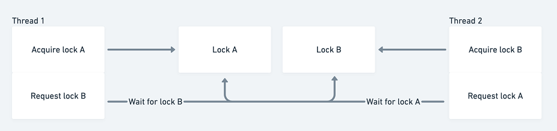
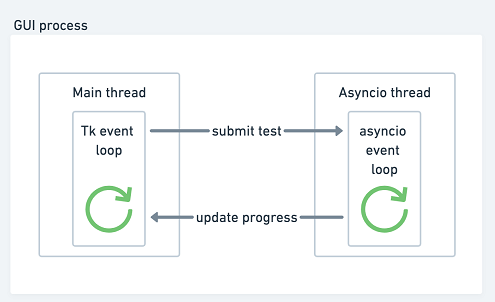

# 使用线程处理阻塞工作

本章涵盖

- 查看多线程库
- 创建线程池来处理阻塞 I/O
- 使用 async 和 await 管理线程
- 使用线程池处理阻塞 I/O 库
- 处理共享数据并使用线程锁定
- 在线程中处理 CPU 密集型工作

从头开始开发新的 I/O 绑定应用程序时，asyncio 可能是一种自然的技术选择。从一开始，你就可以在开始开发时使用与 asyncio 一起使用的非阻塞库，例如 asyncpg 和 aiohttp。然而，绿地（一个缺乏先前工作限制的项目）开发是许多软件开发人员所没有的奢侈品。我们的大部分工作可能是使用阻塞 I/O 库管理现有代码，例如 HTTP 请求的请求、Postgres 数据库的 psycopg 或任意数量的阻塞库。我们也可能处于异步友好库尚不存在的情况。在这些情况下，有没有办法在仍然使用异步 API 的同时获得并发性能的提升？

多线程是这个问题的解决方案。由于阻塞 I/O 会释放全局解释器锁，因此可以在单独的线程中同时运行 I/O。与多处理库非常相似，asyncio 为我们提供了一种利用线程池的方法，因此我们可以在仍然使用 asyncio API 的同时获得线程的好处，例如```gather```和```wait```。

在本章中，我们将学习如何使用多线程和 asyncio 在线程中运行阻塞 API，例如请求。此外，我们将学习如何像上一章那样同步共享数据，并研究更高级的锁定主题，例如可重入锁和死锁。我们还将了解如何通过构建响应式 GUI 来运行 HTTP 压力测试，从而将 asyncio 与同步代码结合起来。最后，我们将看看线程可用于 CPU 密集型工作的少数例外情况。

## 7.1 引入线程模块
Python 允许开发人员通过 threading 模块创建和管理线程。该模块公开了 Thread 类，该类在实例化时接受一个函数以在单独的线程中运行。 Python 解释器在一个进程中运行单线程，这意味着即使我们有代码在多个线程中运行，一次也只能运行一段 Python 字节码。全局解释器锁一次只允许一个线程执行代码。

这似乎是 Python 限制了我们使用多线程的任何优势，但在少数情况下全局解释器锁被释放，主要是在 I/O 操作期间。在这种情况下，Python 可以释放 GIL，因为在底层，Python 正在执行低级操作系统调用来执行 I/O。这些系统调用在 Python 解释器之外，这意味着在我们等待 I/O 完成时不需要运行任何 Python 字节码。

为了更好地了解如何在阻塞 I/O 的上下文中创建和运行线程，我们将重温第 3 章中的回显服务器示例。回想一下，要处理多个连接，我们需要将套接字切换为非-阻塞模式并使用选择模块来监视套接字上的事件。如果我们使用的是不能选择非阻塞套接字的遗留代码库怎么办？我们还能构建一个可以同时处理多个客户端的回显服务器吗？

由于套接字的 recv 和 sendall 是 I/O-bound 方法，因此释放 GIL，我们应该能够在单独的线程中同时运行它们。这意味着我们可以为每个连接的客户端创建一个线程，并在该线程中读取和写入数据。此模型是 Apache 等 Web 服务器中的常见范例，被称为每连接线程模型。让我们通过在主线程中等待连接，然后为每个连接的客户端创建一个线程来回显来尝试这个想法。

清单 7.1 一个多线程回显服务器

```python
from threading import Thread
import socket
 
 
def echo(client: socket):
    while True:
        data = client.recv(2048)
        print(f'Received {data}, sending!')
        client.sendall(data)
 
 
with socket.socket(socket.AF_INET, socket.SOCK_STREAM) as server:
    server.setsockopt(socket.SOL_SOCKET, socket.SO_REUSEADDR, 1)
    server.bind(('127.0.0.1', 8000))
    server.listen()
    while True:
        connection, _ = server.accept()                     ❶
        thread = Thread(target=echo, args=(connection,))    ❷
        thread.start()                                      ❸
```

❶ 阻止等待客户端连接。

❷ 一旦客户端连接，创建一个线程来运行我们的 echo 函数。

❸ 开始运行线程。

在前面的清单中，我们进入了一个无限循环，监听我们的服务器套接字上的连接。一旦我们连接了一个客户端，我们就创建一个新线程来运行我们的 echo 函数。我们为线程提供了一个目标，即我们要运行的 echo 函数和 args，它是传递给 echo 的参数元组。这意味着我们将在线程中调用 echo(connection)。然后，我们启动线程并再次循环，等待第二个连接。同时，在我们创建的线程中，我们一直循环监听来自客户端的数据，当我们拥有它时，我们会回显它。

你应该能够同时连接任意数量的 telnet 客户端并正确回显消息。由于每个 recv 和 sendall 在每个客户端的单独线程中运行，因此这些操作不会相互阻塞；他们只会阻塞他们正在运行的线程。

这解决了多个客户端无法通过阻塞套接字同时连接的问题，尽管该方法存在一些线程独有的问题。如果我们在连接客户端时尝试使用 CTRL-C 终止该进程会发生什么？我们的应用程序是否干净地关闭了我们创建的线程？

事实证明，事情并没有那么干净地关闭。如果你终止应用程序，你应该会在 server.accept() 上看到一个 KeyboardInterrupt 异常，但你的应用程序将挂起，因为后台线程将使程序保持活动状态。此外，任何连接的客户端仍然可以发送和接收消息！

不幸的是，Python 中用户创建的线程不会收到 KeyboardInterrupt 异常；只有主线程会接收它们。这意味着我们的线程将继续运行，愉快地从我们的客户端读取数据并阻止我们的应用程序退出。

有几种方法可以处理这个问题；具体来说，我们可以使用所谓的守护线程（发音为demon），或者我们可以想出我们自己的方式来取消或"中断"正在运行的线程。守护线程是一种用于长时间运行的后台任务的特殊线程。这些线程不会阻止应用程序关闭。事实上，当只有守护线程在运行时，应用程序会自动关闭。由于 Python 的主线程不是守护线程，这意味着，如果我们将所有连接线程都设为守护线程，我们的应用程序将在 KeyboardInterrupt 上终止。修改清单 7.1 中的代码以使用守护线程很容易；我们需要做的就是在运行thread.start()之前设置thread.daemon = True。一旦我们进行了更改，我们的应用程序将在 CTRL-C 上正确终止。

这种方法的问题是当我们的线程停止时我们无法运行任何清理或关闭逻辑，因为守护线程会突然终止。假设在关闭时，我们想向每个客户端写出服务器正在关闭的信息。有没有办法让某种类型的异常中断我们的线程并干净地关闭套接字？如果我们调用套接字的关闭方法，任何现有的对 recv 的调用都将返回零，并且 sendall 将抛出异常。如果我们从主线程调用shutdown，这将产生中断阻塞recv或sendall调用的客户端线程的效果。然后我们可以在客户端线程中处理异常并执行我们想要的任何清理逻辑。

为此，我们将通过继承 Thread 类本身来创建与以前略有不同的线程。这将让我们使用取消方法定义自己的线程，在其中我们可以关闭客户端套接字。然后，我们对 recv 和 sendall 的调用将被中断，允许我们退出 while 循环并关闭线程。

我们启动线程并再次循环，等待第二个连接。同时，在我们创建的线程中，我们一直循环监听来自客户端的数据，当我们拥有它时，我们会回显它。

你应该能够同时连接任意数量的 telnet 客户端并正确回显消息。由于每个 recv 和 sendall 在每个客户端的单独线程中运行，因此这些操作不会相互阻塞；他们只会阻塞他们正在运行的线程。

这解决了多个客户端无法通过阻塞套接字同时连接的问题，尽管该方法存在一些线程独有的问题。如果我们在连接客户端时尝试使用 CTRL-C 终止该进程会发生什么？我们的应用程序是否干净地关闭了我们创建的线程？

事实证明，事情并没有那么干净地关闭。如果你终止应用程序，你应该会在 server.accept() 上看到一个 KeyboardInterrupt 异常，但你的应用程序将挂起，因为后台线程将使程序保持活动状态。此外，任何连接的客户端仍然可以发送和接收消息！

不幸的是，Python 中用户创建的线程不会收到 KeyboardInterrupt 异常；只有主线程会接收它们。这意味着我们的线程将继续运行，愉快地从我们的客户端读取数据并阻止我们的应用程序退出。

有几种方法可以处理这个问题；具体来说，我们可以使用所谓的守护线程（发音为demon），或者我们可以想出我们自己的方式来取消或"中断"正在运行的线程。守护线程是一种用于长时间运行的后台任务的特殊线程。这些线程不会阻止应用程序关闭。事实上，当只有守护线程在运行时，应用程序会自动关闭。由于 Python 的主线程不是守护线程，这意味着，如果我们将所有连接线程都设为守护线程，我们的应用程序将在 KeyboardInterrupt 上终止。修改清单 7.1 中的代码以使用守护线程很容易；我们需要做的就是在运行thread.start()之前设置thread.daemon = True。一旦我们进行了更改，我们的应用程序将在 CTRL-C 上正确终止。

这种方法的问题是当我们的线程停止时我们无法运行任何清理或关闭逻辑，因为守护线程会突然终止。假设在关闭时，我们想向每个客户端写出服务器正在关闭的信息。有没有办法让某种类型的异常中断我们的线程并干净地关闭套接字？如果我们调用套接字的关闭方法，任何现有的对 recv 的调用都将返回零，并且 sendall 将抛出异常。如果我们从主线程调用shutdown，这将产生中断阻塞recv或sendall调用的客户端线程的效果。然后我们可以在客户端线程中处理异常并执行我们想要的任何清理逻辑。

为此，我们将通过继承 Thread 类本身来创建与以前略有不同的线程。这将让我们使用取消方法定义自己的线程，在其中我们可以关闭客户端套接字。然后，我们对 recv 和 sendall 的调用将被中断，允许我们退出 while 循环并关闭线程。

Thread 类有一个我们可以重写的 run 方法。当我们子类化 Thread 时，我们使用我们希望线程在启动时运行的代码来实现此方法。在我们的例子中，这是 recv 和 sendall 回声循环。

清单 7.2 子类化线程类以彻底关闭

```python
from threading import Thread
import socket
 
 
class ClientEchoThread(Thread):
 
    def __init__(self, client):
        super().__init__()
        self.client = client
 
    def run(self):
        try:
            while True:
                data = self.client.recv(2048)
                if not data:                                              ❶
                    raise BrokenPipeError('Connection closed!')
                print(f'Received {data}, sending!')
                self.client.sendall(data)
        except OSError as e:                                              ❷
            print(f'Thread interrupted by {e} exception, shutting down!')
 
    def close(self):
        if self.is_alive():                                               ❸
            self.client.sendall(bytes('Shutting down!', encoding='utf-8'))
            self.client.shutdown(socket.SHUT_RDWR)                        ❹
 
 
with socket.socket(socket.AF_INET, socket.SOCK_STREAM) as server:
    server.setsockopt(socket.SOL_SOCKET, socket.SO_REUSEADDR, 1)
    server.bind(('127.0.0.1', 8000))
    server.listen()
    connection_threads = []
    try:
        while True:
            connection, addr = server.accept()
            thread = ClientEchoThread(connection)
            connection_threads.append(thread)
            thread.start()
    except KeyboardInterrupt:
        print('Shutting down!')
        [thread.close() for thread in connection_threads]                 ❺
```

❶ 如果没有数据，则引发异常。当连接被客户端关闭或连接被关闭时，就会发生这种情况。

❷ 当我们有异常时，退出run方法。这将终止线程。

❸ 如果线程处于活动状态，则关闭连接；如果客户端关闭连接，线程可能不活动。

❹ 关闭客户端连接以进行读写。

❺ 在我们的线程上调用 close 方法以在键盘中断时关闭每个客户端连接。

我们首先创建一个继承自 Thread 的新类 ClientEchoThread。这个类用我们原来的 echo 函数的代码覆盖了 run 方法，但是做了一些改变。首先，我们将所有内容包装在一个 try catch 块中并拦截 OSError 异常。当我们关闭客户端套接字时，sendall 等方法会抛出此类异常。我们还检查来自 recv 的数据是否为 0。这发生在两种情况下：如果客户端关闭连接（例如，有人退出 telnet）或当我们自己关闭客户端连接时。在这种情况下，我们自己抛出一个 BrokenPipeError（OSError 的子类），在 except 块中执行 print 语句，然后退出 run 方法，该方法会关闭线程。

我们还在 ClientEchoThread 类上定义了一个 close 方法。此方法在关闭客户端连接之前首先检查线程是否处于活动状态。线程"活着"意味着什么，为什么我们需要这样做？如果它的 run 方法正在执行，则线程是活动的；在这种情况下，如果我们的 run 方法没有抛出任何异常，这是正确的。我们需要这个检查，因为客户端本身可能已经关闭了连接，导致在我们调用 close 之前的 run 方法中出现了 BrokenPipeError 异常。这意味着调用 sendall 将导致异常，因为连接不再有效。

最后，在监听新传入连接的主循环中，我们拦截 KeyboardInterrupt 异常。一旦我们有了一个，我们就在我们创建的每个线程上调用 close 方法。这将向客户端发送一条消息，假设连接仍处于活动状态并关闭连接。

总的来说，取消 Python 中正在运行的线程，一般来说，是一个棘手的问题，并且取决于你尝试处理的特定关闭情况。你需要特别注意你的线程不会阻止你的应用程序退出，并确定在哪里放置适当的中断点以退出你的线程。

我们现在已经看到了几种自己手动管理线程的方法，使用目标函数创建线程对象并继承 Thread 并覆盖 run 方法。现在我们了解了线程基础知识，让我们看看如何将它们与 asyncio 一起使用来处理流行的阻塞库。

## 7.2 使用异步线程

我们现在知道如何创建和管理多个线程来处理阻塞工作。这种方法的缺点是我们必须单独创建和跟踪线程。我们希望能够使用我们学到的所有基于异步的 API 来等待线程的结果，而无需自己管理它们。就像第 6 章中的进程池一样，我们可以使用线程池以这种方式管理线程。在本节中，我们将介绍一个流行的阻塞 HTTP 客户端库，并了解如何使用线程和 asyncio 来并发运行 Web 请求。

### 7.2.1 requests 库介绍
requests 库是一个流行的 Python HTTP 客户端库，自称为"人类的 HTTP"。你可以在 https://requests.readthedocs.io/en/master/ 查看该库的最新文档。使用它，你可以像使用 aiohttp 一样向 Web 服务器发出 HTTP 请求。我们将使用最新版本（在撰写本文时，版本 2.24.0）。你可以通过运行以下 pip 命令来安装此库：

```
pip install -Iv requests==2.24.0
```

一旦我们安装了这个库，我们就可以发出一些基本的 HTTP 请求了。让我们首先向 ```example.com``` 发出几个请求以检索状态码，就像我们之前对 aiohttp 所做的那样。

清单 7.3 请求的基本用法

```python
import requests
 
 
def get_status_code(url: str) -> int:
    response = requests.get(url)
    return response.status_code
 
 
url = 'https://www.example.com'
print(get_status_code(url))
print(get_status_code(url))
```


前面的清单依次执行两个 HTTP GET 请求。运行这个，你应该看到两个 200 输出。我们没有在这里创建 HTTP 会话，就像我们对 aiohttp 所做的那样，但是该库确实根据需要支持这一点，以使 cookie 在不同的请求中保持持久性。

requests 库是阻塞的，这意味着每次调用 requests.get 都会阻止任何线程执行其他 Python 代码，直到请求完成。这对我们如何在 asyncio 中使用这个库有影响。如果我们尝试在协程或任务中单独使用这个库，它将阻塞整个事件循环，直到请求完成。如果我们有一个需要 2 秒的 HTTP 请求，我们的应用程序除了等待这 2 秒之外什么也做不了。要在 asyncio 中正确使用这个库，我们必须在线程内运行这些阻塞操作。

### 7.2.2 线程池执行器介绍
与进程池执行器非常相似，concurrent.futures 库提供了 Executor 抽象类的实现，以使用名为 ThreadPoolExecutor 的线程。线程池执行器不会像进程池那样维护工作进程池，而是创建并维护一个线程池，然后我们可以将工作提交到该线程池。

虽然默认情况下，进程池会为我们机器可用的每个 CPU 内核创建一个工作进程，但确定要创建多少工作线程有点复杂。在内部，默认线程数的公式是 min(32, os.cpu_count() + 4)。这会导致工作线程的最大（上限）为 32，最小（下限）为 5。上限设置为 32 以避免在具有大量 CPU 内核的机器上创建数量惊人的线程（请记住, 线程的创建和维护耗费资源）。下限设置为 5，因为在较小的 1-2 核机器上，仅启动几个线程不太可能提高性能。为 I/O 密集型工作创建比可用 CPU 更多的线程通常是有意义的。例如，在 8 核机器上，上面的公式意味着我们将创建 12 个线程。虽然只有 8 个线程可以并发运行，但我们可以让其他线程暂停等待 I/O 完成，让我们的操作在 I/O 完成时恢复它们。

让我们修改清单 7.3 中的示例，使用线程池同时运行 1,000 个 HTTP 请求。我们将对结果进行计时，以了解好处是什么。

清单 7.4 使用线程池运行请求

```python
import time
import requests
from concurrent.futures import ThreadPoolExecutor
 
 
def get_status_code(url: str) -> int:
    response = requests.get(url)
    return response.status_code
 
 
start = time.time()
 
with ThreadPoolExecutor() as pool:
    urls = ['https://www.example.com' for _ in range(1000)]
    results = pool.map(get_status_code, urls)
    for result in results:
        print(result)
 
end = time.time()
 
print(f'finished requests in {end - start:.4f} second(s)')
```

在具有快速互联网连接的 8 核机器上，使用默认线程数，此代码可以在短短 8-9 秒内执行。很容易同步编写此代码，以了解线程通过执行某些操作所产生的影响，如下所示：

```python
start = time.time()
 
urls = ['https://www.example.com' for _ in range(1000)]
 
for url in urls:
    print(get_status_code(url))
 
end = time.time()
 
print(f'finished requests in {end - start:.4f} second(s)')
```

运行此代码可能需要 100 秒以上的时间！这使得我们的线程代码比我们的同步代码快 10 倍以上，给我们带来了相当大的性能提升。

虽然这显然是一个改进，但你可能还记得第 4 章关于 aiohttp 的内容，我们能够在不到 1 秒的时间内同时发出 1,000 个请求。为什么这比我们的线程版本慢得多？请记住，我们的最大工作线程数限制为 32（即 CPU 数量加 4），这意味着默认情况下我们最多只能同时运行 32 个请求。我们可以尝试通过在创建线程池时传入 max_workers=1000 来解决这个问题，如下所示：

```python
with ThreadPoolExecutor(max_workers=1000) as pool:
    urls = ['https://www.example.com' for _ in range(1000)]
    results = pool.map(get_status_code, urls)
    for result in results:
        print(result)
```

这种方法可以产生一些改进，因为我们现在每个发出的请求都有一个线程。但是，这仍然不会非常接近我们基于协程的代码。这是由于与线程相关的资源开销。线程是在操作系统级别创建的，创建起来比协程更昂贵。此外，线程在操作系统级别具有上下文切换成本。在上下文切换发生时保存和恢复线程状态会消耗掉使用线程获得的一些性能增益。

当你确定用于特定问题的线程数时，最好从小处着手（CPU 内核数量加上几个是一个很好的起点），对其进行测试和基准测试，逐渐增加线程数量线程。你通常会找到一个"最佳位置"，此后无论你添加多少线程，运行时间都会停滞不前，甚至可能会降级。相对于你要发出的请求而言，这个最佳位置通常是一个相当小的数字（明确地说，为 1,000 个请求创建 1,000 个线程可能不是对资源的最佳利用）。

### 7.2.3 使用 asyncio 的线程池执行器
使用带有异步事件循环的线程池执行器与使用 ProcessPoolExecutors 没有太大区别。这就是拥有抽象 Executor 基类的美妙之处，因为我们只需更改一行代码就可以使用相同的代码来运行线程或进程。让我们修改运行 1,000 个 HTTP 请求的示例，以使用 asyncio.gather 而不是 pool.map。

清单 7.5 使用带有 asyncio 的线程池执行器

```python
import functools
import requests
import asyncio
from concurrent.futures import ThreadPoolExecutor
from util import async_timed
 
 
def get_status_code(url: str) -> int:
    response = requests.get(url)
    return response.status_code
 
 
@async_timed()
async def main():
    loop = asyncio.get_running_loop()
    with ThreadPoolExecutor() as pool:
        urls = ['https://www.example.com' for _ in range(1000)]
        tasks = [loop.run_in_executor(pool, functools.partial(get_status_code, url)) for url in urls]
        results = await asyncio.gather(*tasks)
        print(results)
 
asyncio.run(main())
```

我们像以前一样创建线程池，但不是使用 map，而是通过使用 loop.run_in_executor 调用 get_status_code 函数来创建任务列表。一旦我们有了任务列表，我们就可以使用 asyncio.gather 或我们之前学习的任何其他 asyncio API 等待它们完成。

在内部，loop.run_in_executor 调用线程池执行器的提交方法。这会将我们传入的每个函数放入一个队列中。然后池中的工作线程从队列中拉出，运行每个工作项直到它完成。与使用没有 asyncio 的池相比，这种方法不会产生任何性能优势，但是当我们等待 await asyncio.gather 完成时，其他代码可以运行。

### 7.2.4 默认执行者

阅读 asyncio 文档，你可能会注意到 run_in_executor 方法的 executor 参数可以为 None。在这种情况下，run_in_executor 将使用事件循环的默认执行程序。什么是默认执行者？将其视为整个应用程序的可重用单例执行器。默认执行器将始终默认为 ThreadPoolExecutor ，除非我们使用 loop.set_default_executor 方法设置自定义执行器。这意味着我们可以简化清单 7.5 中的代码，如下面的清单所示。

清单 7.6 使用默认执行器

```python
import functools
import requests
import asyncio
from util import async_timed
 
 
def get_status_code(url: str) -> int:
    response = requests.get(url)
    return response.status_code
 
 
@async_timed()
async def main():
    loop = asyncio.get_running_loop()
    urls = ['https://www.example.com' for _ in range(1000)]
    tasks = [loop.run_in_executor(None, functools.partial(get_status_code, url)) for url in urls]
    results = await asyncio.gather(*tasks)
    print(results)
 
asyncio.run(main())
```

在前面的清单中，我们消除了创建自己的 ThreadPoolExecutor 并像以前一样在上下文管理器中使用它，而是将 None 作为执行程序传入。我们第一次调用 run_in_executor 时，asyncio 会为我们创建并缓存一个默认的线程池执行器。对 run_in_executor 的每个后续调用都会重用先前创建的默认执行程序，这意味着执行程序对于事件循环来说是全局的。这个池的关闭也与我们之前看到的不同。以前，当我们退出上下文管理器的 with 块时，我们创建的线程池执行器会被关闭。当使用默认执行器时，它不会关闭，直到事件循环关闭，这通常发生在我们的应用程序完成时。当我们想要使用线程时使用默认的线程池执行器可以简化事情，但是我们可以让这更简单吗？

在 Python 3.9 中，引入了 asyncio.to_thread 协程以进一步简化将工作放在默认线程池执行程序上。它接受一个在线程中运行的函数和一组要传递给该函数的参数。以前，我们必须使用 functools.partial 来传递参数，所以这使我们的代码更加简洁。然后它在默认线程池执行器和当前运行的事件循环中运行带有参数的函数。这让我们可以进一步简化我们的线程代码。使用 to_thread 协程消除了使用 functools.partial 和我们对 asyncio.get_running_loop 的调用，从而减少了我们的总代码行数。

清单 7.7 使用 to_thread 协程

```python
import requests
import asyncio
from util import async_timed
 
 
def get_status_code(url: str) -> int:
    response = requests.get(url)
    return response.status_code
 
 
@async_timed()
async def main():
    urls = ['https://www.example.com' for _ in range(1000)]
    tasks = [asyncio.to_thread(get_status_code, url) for url in urls]
    results = await asyncio.gather(*tasks)
    print(results)
 
asyncio.run(main())
```

到目前为止，我们只看到了如何在线程内运行阻塞代码。将线程与 asyncio 相结合的强大之处在于，我们可以在等待线程完成时运行其他代码。要了解如何在线程运行时运行其他代码，我们将重温第 6 章中关于定期输出长时间运行任务状态的示例。

## 7.3 锁、共享数据和死锁
就像多处理代码一样，当我们共享数据时，多线程代码也容易受到竞态条件的影响，因为我们不控制执行顺序。每当你有两个线程或进程可以修改共享的非线程安全数据时，你都需要使用锁来正确同步访问。从概念上讲，这与我们采用多处理的方法没有什么不同。但是，线程的内存模型稍微改变了方法。

回想一下，对于多处理，默认情况下我们创建的进程不共享内存。这意味着我们需要创建特殊的共享内存对象并正确初始化它们，以便每个进程都可以读取和写入该对象。由于线程确实可以访问其父进程的相同内存，我们不再需要这样做，线程可以直接访问共享变量。

这稍微简化了一些事情，但由于我们不会使用内置锁的共享值对象，我们需要自己创建它们。为此，我们需要使用 threading 模块的 Lock 实现，这与我们在多处理中使用的不同。这就像从线程模块导入 Lock 并围绕代码的关键部分调用其获取和释放方法或在上下文管理器中使用它一样简单。

要了解如何在线程中使用锁，让我们重温第 6 章中的任务，即跟踪和显示长任务的进度。我们将采用之前发出数千个 Web 请求的示例，并使用共享计数器来跟踪到目前为止我们已经完成了多少请求。

清单 7.8 请求的打印状态

```python
import functools
import requests
import asyncio
from concurrent.futures import ThreadPoolExecutor
from threading import Lock
from util import async_timed
 
counter_lock = Lock()
counter: int = 0
 
 
def get_status_code(url: str) -> int:
    global counter
    response = requests.get(url)
    with counter_lock:
        counter = counter + 1
    return response.status_code
 
 
async def reporter(request_count: int):
    while counter < request_count:
        print(f'Finished {counter}/{request_count} requests')
        await asyncio.sleep(.5)
 
 
@async_timed()
async def main():
    loop = asyncio.get_running_loop()
    with ThreadPoolExecutor() as pool:
        request_count = 200
        urls = ['https://www.example.com' for _ in range(request_count)]
        reporter_task = asyncio.create_task(reporter(request_count))
        tasks = [loop.run_in_executor(pool, functools.partial(get_status_code, url)) for url in urls]
        results = await asyncio.gather(*tasks)
        await reporter_task
        print(results)
 
 
asyncio.run(main())
```

这应该看起来很熟悉，因为它就像我们在第 6 章中编写的用于输出 map 操作进度的代码。我们创建了一个全局计数器变量以及一个 counter_lock 来同步对临界区的访问。在我们的 get_status_code 函数中，我们在增加计数器时获取锁。然后，在我们的主协程中，我们启动了一个记者后台任务，该任务输出我们每 500 毫秒完成了多少请求。运行此程序，你应该会看到类似于以下内容的输出：

```
Finished 0/200 requests
Finished 48/200 requests
Finished 97/200 requests
Finished 163/200 requests
```

我们现在知道了多线程和多处理锁的基础知识，但是关于锁还有很多东西需要学习。接下来，我们将看一下可重入的概念。

### 7.3.1 可重入锁
简单的锁可以很好地协调跨多个线程对共享变量的访问，但是当一个线程试图获取它已经获取的锁时会发生什么呢？这安全吗？由于同一个线程正在获取锁，这应该没问题，因为根据定义这是单线程的，因此是线程安全的。

虽然这种访问应该没问题，但它确实会导致我们迄今为止使用的锁出现问题。为了说明这一点，假设我们有一个递归求和函数，它接受一个整数列表并产生列表的总和。我们想要求和的列表可以从多个线程中修改，因此我们需要使用锁来确保我们求和的列表在求和操作期间不会被修改。让我们尝试用一个普通的锁来实现它，看看会发生什么。我们还将添加一些控制台输出来查看我们的函数是如何执行的。

清单 7.9 带锁的递归

```python
from threading import Lock, Thread
from typing import List
 
list_lock = Lock()
 
 
def sum_list(int_list: List[int]) -> int:
    print('Waiting to acquire lock...')
    with list_lock:
        print('Acquired lock.')
        if len(int_list) == 0:
            print('Finished summing.')
            return 0
        else:
            head, *tail = int_list
            print('Summing rest of list.')
            return head + sum_list(tail)
 
 
thread = Thread(target=sum_list, args=([1, 2, 3, 4],))
thread.start()
thread.join()
```

如果你运行此代码，你将看到以下几条消息，然后应用程序将永远挂起：

```python
Waiting to acquire lock...
Acquired lock.
Summing rest of list.
Waiting to acquire lock...
```

为什么会这样？如果我们遍历这个，我们第一次获得 list_lock 就完美了。然后我们解包列表并递归调用列表剩余部分的 sum_list。这会导致我们再次尝试获取 list_lock。这是我们的代码挂起的地方，因为因为我们已经获得了锁，所以我们会永远阻止尝试第二次获得锁。这也意味着我们永远不会退出第一个 with 块并且不能释放锁；我们正在等待一个永远不会被释放的锁！

由于此递归来自发起它的同一线程，因此多次获取锁应该不是问题，因为这不会导致竞态条件。为了支持这些用例，线程库提供了**可重入锁**。**可重入锁**是一种特殊的锁，可以由同一个线程多次获取，允许该线程"重新进入"临界区。 threading 模块在 RLock 类中提供可重入锁。我们可以使用上面的代码并通过仅修改两行代码来解决问题——import 语句和 list_lock 的创建：

```python
from threading import Rlock
 
list_lock = RLock()
```

如果我们修改这些行，我们的代码将正常工作，并且单个线程将能够多次获取锁。在内部，可重入锁通过保持递归计数来工作。每次我们从第一个获得锁的线程中获得锁时，计数就会增加，而每次我们释放锁时，计数就会减少。当计数为 0 时，锁最终被释放，以供其他线程获取。

让我们检查一个更真实的应用程序，以真正理解带锁的递归概念。想象一下，我们正在尝试构建一个线程安全的整数列表类，该类使用一种方法来查找具有某个值的所有元素并将其替换为不同的值。这个类将包含一个普通的 Python 列表和一个我们用来防止竞态条件的锁。我们假设我们现有的类已经有一个名为 indices_of(to_find: int) 的方法，它接受一个整数并返回列表中与 to_find 匹配的所有索引。由于我们要遵循 DRY（不要重复自己）规则，我们将在定义查找和替换方法时重用此方法（请注意，这在技术上不是最有效的方法，但我们我会这样做来说明这个概念）。这意味着我们的类和方法将类似于以下清单。

清单 7.10 一个线程安全的列表类

```python
from threading import Lock
from typing import List
 
 
class IntListThreadsafe:
 
    def __init__(self, wrapped_list: List[int]):
        self._lock = Lock()
        self._inner_list = wrapped_list
 
    def indices_of(self, to_find: int) -> List[int]:
        with self._lock:
            enumerator = enumerate(self._inner_list)
            return [index for index, value in enumerator if value == to_find]
 
    def find_and_replace(self, to_replace: int, replace_with: int) -> None:
        with self._lock:
            indices = self.indices_of(to_replace)
            for index in indices:
                self._inner_list[index] = replace_with
 
 
threadsafe_list = IntListThreadsafe([1, 2, 1, 2, 1])
threadsafe_list.find_and_replace(1, 2)
```

如果另一个线程的某个人在我们的 indices_of 调用期间修改了列表，我们可能会获得错误的返回值，因此我们需要在搜索匹配的索引之前获取锁。出于同样的原因，我们的 find_and_replace 方法必须获取锁。然而，对于普通锁，当我们调用 find_and_replace 时，我们最终会永远挂起。 find-and-replace 方法首先获取锁，然后调用另一个方法，该方法尝试获取相同的锁。在这种情况下切换到 RLock 将解决此问题，因为对 find_and_replace 的调用将始终从同一线程获取任何锁。这说明了何时需要使用可重入锁的通用公式。如果你正在开发一个线程安全的类，该类具有获取锁的方法 A 和也需要获取锁并调用方法 A 的方法 B，你可能需要使用可重入锁。

### 7.3.2 死锁
你可能熟悉新闻政治谈判中的僵局概念，即一方向另一方提出要求，另一方提出反要求。双方在下一步问题上存在分歧，谈判陷入僵局。计算机科学中的概念是相似的，因为我们达到了一个没有解决方案的共享资源争用状态，我们的应用程序永远挂起。

我们在上一节中看到的问题是不可重入锁可能导致我们的程序永远挂起，这就是死锁的一个例子。在这种情况下，我们会陷入与自己的谈判停滞不前的状态，要求获得一个永远不会释放的锁。当我们有两个线程使用多个锁时，也会出现这种情况。图 7.1 说明了这种情况：如果线程 A 请求线程 B 已获得的锁，而线程 B 正在请求 A 已获得的锁，我们将陷入停顿和死锁。在这种情况下，使用可重入锁将无济于事，因为我们有多个线程卡在等待另一个线程持有的资源上。




图 7.1 线程 1 和 2 大致同时获得锁 A 和 B。然后，线程 1 等待线程 2 持有的锁 B；同时，线程 2 正在等待线程 1 持有的 A。这种循环依赖会导致死锁，并将挂起应用程序。

让我们看看如何在代码中创建这种类型的死锁。我们将创建两个锁，锁 A 和 B，以及需要获取这两个锁的两个方法。一种方法是先获取 A，然后是 B，另一种方法是先获取 B，然后是 A。

清单 7.11 代码中的死锁

```python
from threading import Lock, Thread
import time
 
lock_a = Lock()
lock_b = Lock()
 
 
def a():
    with lock_a:                                         ❶
        print('Acquired lock a from method a!')
        time.sleep(1)                                    ❷
        with lock_b:                                     ❸
            print('Acquired both locks from method a!')
 
 
def b():
    with lock_b:                                         ❸
        print('Acquired lock b from method b!')
        with lock_a:                                     ❶
            print('Acquired both locks from method b!')
thread_1 = Thread(target=a)
thread_2 = Thread(target=b)
thread_1.start()
thread_2.start()
thread_1.join()
thread_2.join()
```

❶ 获取锁 A。

❷ 休眠 1 秒；这确保我们为死锁创造了正确的条件。

❸ 获取锁 B。

当我们运行这段代码时，我们将看到以下输出，我们的应用程序将永远挂起：

```python
Acquired lock a from method a!
Acquired lock b from method b!
```

我们首先调用方法 A 并获取锁 A，然后我们引入了人为的延迟，让方法 B 有机会获取锁 B。这使我们处于方法 A 持有锁 A 而方法 B 持有锁 B 的状态。接下来，方法 A尝试获取锁 B，但方法 B 持有该锁。同时，方法 B 尝试获取锁 A，但方法 A 持有它，卡住等待 B 释放它的锁。两种方法都被卡住了，彼此等待释放资源，我们陷入了停顿。

我们如何处理这种情况？一种解决方案是所谓的"鸵鸟算法"，它以鸵鸟在感觉到危险时将头伸入沙子的情况命名（尽管鸵鸟实际上并没有这种行为）。使用这种策略，我们忽略了问题并设计了一种策略来在遇到问题时重新启动我们的应用程序。这种方法背后的驱动理念是，如果问题很少发生，那么投资修复是不值得的。如果你从上面的代码中去掉 sleep，你很少会看到死锁发生，因为它依赖于一个非常特定的操作序列。这并不是真正的修复，也不是理想的，而是用于很少发生死锁的策略。

但是，在我们的情况下，有一个简单的解决方法，我们将两种方法中的锁更改为始终以相同的顺序获取。例如，方法 A 和 B 都可以先获取锁 A，然后再获取锁 B。这解决了问题，因为我们永远不会按照可能发生死锁的顺序获取锁。另一种选择是重构锁，因此我们只使用一个而不是两个。一个锁不可能出现死锁（不包括我们之前看到的可重入死锁）。总的来说，在处理需要获取的多个锁时，问问自己："我获取这些锁的顺序是否一致？有没有办法我可以将它重构为只使用一个锁？"

我们现在已经了解了如何通过 asyncio 有效地使用线程，并研究了更复杂的锁定场景。接下来，让我们看看如何使用线程将 asyncio 集成到现有的同步应用程序中，这些应用程序可能无法使用 asyncio 顺利运行。

## 7.4 单独线程中的事件循环
我们主要专注于构建完全使用协程和异步自下而上实现的应用程序。当我们有任何不适合单线程并发模型的工作时，我们会在线程或进程中运行它。并非所有应用程序都适合这种范式。如果我们在现有的同步应用程序中工作并且想要合并 asyncio 怎么办？

我们可以遇到这种情况的一种情况是构建桌面用户界面。构建 GUI 的框架通常会运行自己的事件循环，而事件循环会阻塞主线程。这意味着任何长时间运行的操作都可能导致用户界面冻结。此外，这个 UI 事件循环会阻止我们创建异步事件循环。在本节中，我们将通过在 Tkinter 中构建响应式 HTTP 压力测试用户界面来学习如何使用多线程同时运行多个事件循环。

### 7.4.1 介绍 Tkinter
Tkinter 是默认 Python 安装中提供的独立于平台的桌面图形用户界面 (GUI) 工具包。 "Tk interface"的缩写，它是用 tcl 语言编写的低级 Tk GUI 工具包的接口。随着 Tkinter Python 库的创建，Tk 已经成长为 Python 开发人员构建桌面用户界面的流行方式。

Tkinter 有一组"小部件"，例如标签、文本框和按钮，我们可以将它们放置在桌面窗口中。当我们与小部件交互时，例如输入文本或按下按钮，我们可以触发一个函数来执行代码。响应用户操作而运行的代码可以像更新另一个小部件或触发另一个操作一样简单。

Tkinter 和许多其他 GUI 库通过自己的事件循环绘制它们的小部件并处理小部件交互。事件循环不断地重新绘制应用程序、处理事件并检查是否有任何代码应该运行以响应小部件事件。为了熟悉 Tkinter 及其事件循环，让我们创建一个基本的 hello world 应用程序。我们将创建一个带有"say hello"按钮的应用程序，该按钮将输出"Hello there！"当我们点击控制台时。

清单 7.12 Tkinter 的"Hello world"

```python
import tkinter
from tkinter import ttk
 
window = tkinter.Tk()
window.title('Hello world app')
window.geometry('200x100')
 
 
def say_hello():
    print('Hello there!')
 
 
hello_button = ttk.Button(window, text='Say hello', command=say_hello)
hello_button.pack()
 
window.mainloop()
```

此代码首先创建一个 Tkinter 窗口（见图 7.2）并设置应用程序标题和窗口大小。然后我们在窗口上放置一个按钮并将其命令设置为 say_hello 函数。当用户按下此按钮时，say_hello 函数将执行，打印出我们的消息。然后我们调用 window.mainloop() 来启动 Tk 事件循环，运行我们的应用程序。


图 7.2 清单 7.12 中的"hello world"应用程序

这里要注意的一件事是我们的应用程序将阻塞 window.mainloop()。在内部，此方法运行 Tk 事件循环。这是一个无限循环，它正在检查窗口事件并不断重绘窗口，直到我们关闭它。 Tk 事件循环与 asyncio 事件循环有有趣的相似之处。例如，如果我们尝试在按钮的命令中运行阻塞工作会发生什么？如果我们使用 time.sleep(10) 为 say_hello 函数添加 10 秒的延迟，我们将开始看到一个问题：我们的应用程序将冻结 10 秒！

与 asyncio 非常相似，Tkinter 在其事件循环中运行所有内容。这意味着如果我们有一个长时间运行的操作，例如发出一个 Web 请求或加载一个大文件，我们将阻塞 tk 事件循环，直到该操作完成。对用户的影响是 UI 挂起并变得无响应。用户不能点击任何按钮，我们不能更新任何带有状态或进度的小部件，并且操作系统可能会显示一个微调器（如图 7.3 中的示例）以指示应用程序正在挂起。这显然是一个不受欢迎的、无响应的用户界面。


图 7.3 当我们在 Mac 上阻塞事件循环时，会发生可怕的"海滩末日之球"。

这是一个异步编程在理论上可以帮助我们的例子。如果我们可以发出不阻塞 tk 事件循环的异步请求，我们就可以避免这个问题。这比看起来更棘手，因为 Tkinter 不支持 asyncio，而且你无法传入协程以在单击按钮时运行。我们可以尝试在同一个线程中同时运行两个事件循环，但这行不通。 Tkinter 和 asyncio 都是单线程的——这个想法就像试图在同一个线程中同时运行两个无限循环一样，这是做不到的。如果我们在 Tkinter 事件循环之前启动 asyncio 事件循环，则 asyncio 事件循环将阻止 Tkinter 循环运行，反之亦然。有没有办法让我们在单线程应用程序旁边运行 asyncio 应用程序？

事实上，我们可以通过在单独的线程中运行 asyncio 事件循环来组合这两个事件循环来创建一个正常运行的应用程序。让我们看看如何使用一个应用程序来执行此操作，该应用程序将使用进度条响应式地更新用户关于长时间运行任务的状态。

### 7.4.2 使用 asyncio 和线程构建响应式 UI

首先，让我们介绍一下我们的应用程序并勾勒出一个基本的 UI。我们将构建一个 URL 压力测试应用程序。此应用程序将接收一个 URL 和许多请求作为输入发送。当我们按下提交按钮时，我们将使用 aiohttp 尽快发送 Web 请求，向我们选择的 Web 服务器提供预定义的负载。由于这可能需要很长时间，我们将添加一个进度条来可视化我们在测试中的进度。每完成 1% 的总请求，我们将更新进度条以显示进度。此外，如果用户愿意，我们会让他们取消请求。我们的 UI 将包含一些小部件，包括用于测试 URL 的文本输入、用于我们希望发出的请求数量的文本输入、开始按钮和进度条。我们将设计一个如图 7.4 所示的 UI。


图 7.4 URL 请求者 GUI

现在我们已经勾勒出了我们的 UI，我们需要考虑如何让两个事件循环并排运行。基本思想是我们将在主线程中运行 Tkinter 事件循环，并在单独的线程中运行 asyncio 事件循环。然后，当用户点击"提交"时，我们将向 asyncio 事件循环提交一个协程来运行压力测试。随着压力测试的运行，我们将从 asyncio 事件循环发出命令返回到 Tkinter 事件循环以更新我们的进度。这给了我们一个如图 7.5 所示的架构。



图 7.5 tk 事件循环向 asyncio 事件循环提交任务，该循环在单独的线程中运行。

这种新架构包括跨线程通信。在这种情况下，我们需要小心竞态条件，特别是因为异步事件循环不是线程安全的！ Tkinter 在设计时考虑了线程安全，因此从单独的线程调用它的问题更少（至少在 Python 3+ 中；我们很快会更仔细地研究）。

我们可能很想使用 asyncio.run 从 Tkinter 提交协程，但是这个函数会阻塞，直到我们传入的协程完成并导致 Tkinter 应用程序挂起。我们需要一个函数，它可以将协程提交到事件循环而不会阻塞。有一些新的 asyncio 函数需要学习，它们既是非阻塞的，又具有内置的线程安全性，可以正确提交此类工作。第一个是异步事件循环中名为 call_soon_threadsafe 的方法。这个函数接受一个 Python 函数（不是协程）并安排它在 asyncio 事件循环的下一次迭代中以线程安全的方式执行它。第二个函数是 asyncio.run_coroutine_threadsafe。这个函数接受一个协程并提交它以线程安全的方式运行，立即返回一个未来，我们可以使用它来访问协程的结果。重要且令人困惑的是，这个未来不是 asyncio 未来，而是来自 concurrent.futures 模块。这背后的逻辑是 asyncio 期货不是线程安全的，但 concurrent.futures 期货是。然而，这个 future 类确实具有与 asyncio 模块中的 future 相同的功能。

让我们开始定义和实现一些类，以根据我们上面描述的内容构建我们的压力测试应用程序。我们将构建的第一件事是压力测试类。此类将负责启动和停止一项压力测试并跟踪已完成的请求数量。它的构造函数将接收一个 URL、一个异步事件循环、要发出的所需请求的数量以及一个进度更新器回调。当我们想要触发进度条更新时，我们会调用这个回调。当我们开始实现 UI 时，此回调将触发对进度条的更新。在内部，我们将计算一个刷新率，这是我们执行回调的频率。我们会将这个比率默认为我们计划发送的总请求的每 1%。

清单 7.13 压测类

```python
import asyncio
from concurrent.futures import Future
from asyncio import AbstractEventLoop
from typing import Callable, Optional
from aiohttp import ClientSession
 
 
class StressTest:
 
    def __init__(self,
                 loop: AbstractEventLoop,
                 url: str,
                 total_requests: int,
                 callback: Callable[[int, int], None]):
        self._completed_requests: int = 0
        self._load_test_future: Optional[Future] = None
        self._loop = loop
        self._url = url
        self._total_requests = total_requests
        self._callback = callback
        self._refresh_rate = total_requests // 100
 
    def start(self):                                                       ❶
        future = asyncio.run_coroutine_threadsafe(self._make_requests(), self._loop)
        self._load_test_future = future
 
    def cancel(self):
        if self._load_test_future:
            self._loop.call_soon_threadsafe(self._load_test_future.cancel) ❷
 
    async def _get_url(self, session: ClientSession, url: str):
        try:
            await session.get(url)
        except Exception as e:
            print(e)
        self._completed_requests = self._completed_requests + 1 
        if self._completed_requests % self._refresh_rate == 0 \            ❸
                or self._completed_requests == self._total_requests:
            self._callback(self._completed_requests, self._total_requests)
 
    async def _make_requests(self):
        async with ClientSession() as session:
            reqs = [self._get_url(session, self._url) for _ in range(self._total_requests)]
            await asyncio.gather(*reqs)
```

❶ 开始发出请求，并存储未来，以便我们以后可以在需要时取消。

❷如果我们想取消，在负载测试future上调用取消函数。

❸ 一旦我们完成了 1% 的请求，调用回调函数并提供已完成的请求数和总请求数。

在我们的 start 方法中，我们使用 _make_requests 调用 run_coroutine_threadsafe，它将开始在 asyncio 事件循环上发出请求。我们还在 _load_test_future 中跟踪返回的未来。跟踪这个未来可以让我们在取消方法中取消负载测试。在我们的 _make_requests 方法中，我们创建了一个列表协程来发出我们所有的 Web 请求，并将它们传递给 asyncio.gather 以运行它们。我们的 _get_url 协程发出请求，递增 the_completed_requests 计数器，并在必要时使用已完成请求的总数调用回调。我们可以通过简单地实例化它并调用 start 方法来使用这个类，也可以通过调用 cancel 方法来取消。

需要注意的一件有趣的事情是，尽管多个协程对其进行了更新，但我们没有在_已完成请求计数器周围使用任何锁定。请记住，asyncio 是单线程的，并且 asyncio 事件循环在任何给定时间只运行一段 Python 代码。这具有在与 asyncio 一起使用时使计数器原子递增的效果，尽管它在多个线程之间发生时是非原子的。 asyncio 使我们免于我们在多线程中看到的多种竞态条件，但不是全部。我们将在后面的章节中对此进行更多研究。

接下来，让我们实现我们的 Tkinter GUI 来使用这个负载测试器类。为了代码简洁，我们将直接继承 TK 类并在构造函数中初始化我们的小部件。当用户单击开始按钮时，我们将创建一个新的 StressTest 实例并启动它。现在的问题变成了我们将什么作为回调传递给我们的 StressTest 实例？线程安全在这里成为一个问题，因为我们的回调将在工作线程中调用。如果我们的回调从我们的主线程也可以修改的工作线程修改共享数据，这可能会导致竞态条件。在我们的例子中，由于 Tkinter 内置了线程安全，我们所做的只是更新进度条，我们应该没问题。但是，如果我们需要对共享数据做些什么呢？锁定是一种方法，但如果我们可以在主线程中运行回调，我们将避免任何竞态条件。我们将使用通用模式来演示如何做到这一点，尽管直接更新进度条应该是安全的。

实现此目的的一种常见模式是使用队列模块中的共享线程安全队列。我们的 asyncio 线程可以将进度更新放入此队列。然后，我们的 Tkinter 线程可以在其线程中检查此队列的更新，在正确的线程中更新进度条。我们需要告诉 Tkinter 轮询主线程中的队列来执行此操作。

Tkinter 有一个方法可以让我们在调用的主线程中排队一个函数在指定的时间增量后运行。我们将使用它来运行一个方法，询问队列是否有新的进度更新（清单 7.14）。如果是这样，我们可以从主线程安全地更新进度条。我们将每 25 毫秒轮询一次队列，以确保我们以合理的延迟获得更新。

> Tkinter 真的是线程安全的吗？
>
> 如果你搜索 Tkinter 和线程安全，你会发现很多相互矛盾的信息。 Tkinter 中的线程情况相当复杂。这部分是因为多年来，Tk 和 Tkinter 缺乏适当的线程支持。即使添加了线程模式，它也有几个已经修复的错误。 Tk 支持非线程和线程模式。在非线程模式下，没有线程安全；并且从主线程以外的任何地方使用 Tkinter 都会导致崩溃。在旧版本的 Python 中，没有开启 Tk 线程安全；但是，在 Python 3 及更高版本中，默认情况下启用线程安全，并且我们有线程安全保证。在线程模式下，如果从工作线程发出更新，Tkinter 会获取一个互斥体并将更新事件写入一个队列，以供主线程稍后处理。发生这种情况的相关代码位于 Modules/_tkinter.c 中 Tkapp_Call 函数的 CPython 中。

清单 7.14 Tkinter GUI

```python
from queue import Queue
from tkinter import Tk
from tkinter import Label
from tkinter import Entry
from tkinter import ttk
from typing import Optional
from chapter_07.listing_7_13 import StressTest
 
 
class LoadTester(Tk):
 
    def __init__(self, loop, *args, **kwargs):                             ❶
        Tk.__init__(self, *args, **kwargs)
        self._queue = Queue()
        self._refresh_ms = 25
 
        self._loop = loop
        self._load_test: Optional[StressTest] = None
        self.title('URL Requester')
 
        self._url_label = Label(self, text="URL:")
        self._url_label.grid(column=0, row=0)
 
        self._url_field = Entry(self, width=10)
        self._url_field.grid(column=1, row=0)
 
        self._request_label = Label(self, text="Number of requests:")
        self._request_label.grid(column=0, row=1)
 
        self._request_field = Entry(self, width=10)
        self._request_field.grid(column=1, row=1)
 
        self._submit = ttk.Button(self, text="Submit", command=self._start)❷
        self._submit.grid(column=2, row=1)
 
        self._pb_label = Label(self, text="Progress:")
        self._pb_label.grid(column=0, row=3)
 
        self._pb = ttk.Progressbar(self, orient="horizontal", length=200, mode="determinate")
        self._pb.grid(column=1, row=3, columnspan=2)
    def _update_bar(self, pct: int):                                       ❸
        if pct == 100:
            self._load_test = None
            self._submit['text'] = 'Submit'
        else:
            self._pb['value'] = pct
            self.after(self._refresh_ms, self._poll_queue)
 
    def _queue_update(self, completed_requests: int, total_requests: int): ❹
        self._queue.put(int(completed_requests / total_requests * 100))
 
    def _poll_queue(self):                                                 ❺
        if not self._queue.empty():
            percent_complete = self._queue.get()
            self._update_bar(percent_complete)
        else:
            if self._load_test:
                self.after(self._refresh_ms, self._poll_queue)
 
    def _start(self):                                                      ❻
        if self._load_test is None:
            self._submit['text'] = 'Cancel'
            test = StressTest(
                self._loop,
                self._url_field.get(),
                int(self._request_field.get()),
                self._queue_update
            )
            self.after(self._refresh_ms, self._poll_queue)
            test.start()
            self._load_test = test
        else:
            self._load_test.cancel()
            self._load_test = None
            self._submit['text'] = 'Submit'
```


❶ 在我们的构造函数中，我们设置了文本输入、标签、提交按钮和进度条。

❷ 点击时，我们的提交按钮会调用_start方法。

❸ update bar 方法会将进度条设置为从 0 到 100 的百分比完成值。该方法只能在主线程中调用。

❹ 这个方法是我们传给压力测试的回调；它将进度更新添加到队列中。

❺ 尝试从队列中获取进度更新；如果有，请更新进度条。

❻ 开始负载测试，并开始每 25 毫秒轮询一次队列更新。

在我们应用程序的构造函数中，我们创建了用户界面所需的所有小部件。最值得注意的是，我们为要测试的 URL 和要运行的请求数、提交按钮和水平进度条创建了 Entry 小部件。我们还使用 grid 方法在窗口中适当地排列这些小部件。

当我们创建提交按钮小部件时，我们将命令指定为 _start 方法。此方法将创建一个 StressTest 对象并开始运行它，除非我们已经运行了负载测试，在这种情况下我们将取消它。当我们创建一个 StressTest 对象时，我们传入 _queue_update 方法作为回调。只要有进度更新要发布，StressTest 对象就会调用此方法。当此方法运行时，我们会计算适当的百分比并将其放入队列中。然后我们使用 Tkinter 的 after 方法来安排 _poll_queue 方法每 25 毫秒运行一次。

使用队列作为共享通信机制而不是直接调用 _update_bar 将确保我们的 _update_bar 方法在 Tkinter 事件循环线程中运行。如果我们不这样做，进度条更新将在异步事件循环中发生，因为回调在该线程中运行。

现在我们已经实现了 UI 应用程序，我们可以将这些部分粘合在一起以创建一个完整的工作应用程序。我们将创建一个新线程来在后台运行事件循环，然后启动我们新创建的 LoadTester 应用程序。

清单 7.15 负载测试应用程序

```python
import asyncio
from asyncio import AbstractEventLoop
from threading import Thread
from chapter_07.listing_7_14 import LoadTester
 
 
class ThreadedEventLoop(Thread):                  ❶
    def __init__(self, loop: AbstractEventLoop):
        super().__init__()
        self._loop = loop
        self.daemon = True
 
    def run(self):
        self._loop.run_forever()
 
 
loop = asyncio.new_event_loop()
 
asyncio_thread = ThreadedEventLoop(loop)
asyncio_thread.start()                            ❷
 
app = LoadTester(loop)                            ❸
app.mainloop()
```

❶ 我们创建一个新的线程类来永远运行异步事件循环。

❷ 启动新线程，在后台运行 asyncio 事件循环。

❸ 创建负载测试器 Tkinter 应用程序，并启动其主事件循环。

我们首先定义一个继承自 Thread 的 ThreadedEventLoopClass 来运行我们的事件循环。在这个类的构造函数中，我们接受一个事件循环并将线程设置为守护线程。我们将线程设置为守护进程，因为异步事件循环将在该线程中阻塞并永远运行。如果我们在非守护程序模式下运行，这种类型的无限循环将阻止我们的 GUI 应用程序关闭。在线程的 run 方法中，我们调用事件循环的 run_forever 方法。这个方法的名字很好，因为它实际上只是启动了永远运行的事件循环，一直阻塞直到我们停止事件循环。

一旦我们创建了这个类，我们就会使用 new_event_loop 方法创建一个新的异步事件循环。然后我们创建一个 ThreadedEventLoop 实例，传入我们刚刚创建的循环并启动它。这将创建一个新线程，我们的事件循环在其中运行。最后，我们创建 LoadTester 应用程序的实例并调用 mainloop 方法，启动 Tkinter 事件循环。

当我们使用这个应用程序运行压力测试时，我们应该可以看到进度条平滑地更新，而不会冻结用户界面。我们的应用程序保持响应，我们可以随时单击取消来停止负载测试。这种在单独的线程中运行 asyncio 事件循环的技术对于构建响应式 GUI 很有用，但对于协程和 asyncio 不能顺利配合的任何同步遗留应用程序也很有用。

我们现在已经了解了如何将线程用于各种 I/O 密集型工作负载，但是 CPU 密集型工作负载呢？回想一下，GIL 阻止我们在线程中同时运行 Python 字节码，但是有一些值得注意的例外，让我们可以在线程中执行一些 CPU 密集型工作。

## 7.5 使用线程进行 CPU 密集型工作
全局解释器锁是 Python 中的一个棘手问题。经验法则是多线程只对阻塞 I/O 工作有意义，因为 I/O 会释放 GIL。在大多数情况下都是如此，但不是全部。为了正确释放 GIL 并避免任何并发错误，正在运行的代码需要避免与 Python 对象（字典、列表、Python 整数等）交互。当我们库的大部分工作是在低级 C 代码中完成时，就会发生这种情况。有一些著名的库，例如 hashlib 和 NumPy，它们在纯 C 中执行 CPU 密集型工作并发布 GIL。这使我们能够使用多线程来提高某些 CPU 密集型工作负载的性能。我们将研究两个这样的例子：为了安全而散列敏感文本和使用 NumPy 解决数据分析问题。

### 7.5.1 使用 hashlib 的多线程
在当今世界，安全从未如此重要。确保数据不被黑客读取是避免泄露敏感客户数据的关键，例如密码或其他可用于识别或损害他们的信息。

散列算法通过获取一段输入数据并创建一段对人类来说不可读和不可恢复（如果算法是安全的）的新数据来解决这个问题。例如，密码"password"可能被散列成一个看起来更像"a12bc21df"的字符串。虽然没有人可以读取或恢复输入数据，但我们仍然能够检查一条数据是否与哈希匹配。这对于在登录时验证用户密码或检查数据是否被篡改等场景很有用。

今天有许多不同的哈希算法，例如 SHA512、BLAKE2 和 scrypt，尽管 SHA 不是存储密码的最佳选择，因为它容易受到暴力攻击。其中一些算法在 Python 的 hashlib 库中实现。该库中的许多函数在散列大于 2048 字节的数据时释放 GIL，因此多线程是提高该库性能的一个选项。此外，用于散列密码的 scrypt 函数总是释放 GIL。
让我们介绍一个（希望如此）假设场景，看看多线程何时可能对 hashlib 有用。想象一下，你刚刚开始在一家成功的组织担任首席软件架构师的新工作。你的经理给你分配了你的第一个 bug，让你开始学习公司的开发过程——登录系统的一个小问题。为了调试这个问题，你开始查看一些数据库表，但令你惊恐的是，你发现所有客户的密码都以明文形式存储！这意味着，如果你的数据库遭到入侵，攻击者可能会获取你所有客户的密码并以他们的身份登录，从而可能会暴露敏感数据，例如保存的信用卡号。你将此问题提请你的经理注意，他们要求你尽快找到问题的解决方案。

使用 scrypt 算法对明文密码进行哈希处理是解决此类问题的好方法。它是安全的，并且原始密码是不可恢复的，因为它引入了盐。盐是一个随机数，可确保我们为密码获得的哈希值是唯一的。为了使用 scrypt 进行测试，我们可以快速编写一个同步脚本来创建随机密码并对它们进行哈希处理，以了解需要多长时间。在本例中，我们将测试 10,000 个随机密码。

清单 7.16 使用 scrypt 散列密码

```python
import hashlib
import os
import string
import time
import random
 
 
def random_password(length: int) -> bytes:
    ascii_lowercase = string.ascii_lowercase.encode()
    return b''.join(bytes(random.choice(ascii_lowercase)) for _ in range(length))
 
 
passwords = [random_password(10) for _ in range(10000)]
 
 
def hash(password: bytes) -> str:
    salt = os.urandom(16)
    return str(hashlib.scrypt(password, salt=salt, n=2048, p=1, r=8))
 
 
start = time.time()
 
for password in passwords:
    hash(password)
 
end = time.time()
print(end - start)
```

我们首先编写一个函数来创建随机小写密码，然后使用它创建 10,000 个随机密码，每个密码 10 个字符。然后我们使用 scrypt 函数对每个密码进行哈希处理。我们将忽略细节（scrypt 函数的 n、p 和 r 参数），但这些用于调整我们希望哈希的安全性和内存/CPU 使用率。

在你拥有的服务器上运行它，这些服务器是 2.4 Ghz 8 核机器，此代码在 40 多秒内完成，这还不错。问题是你拥有庞大的用户群，你需要散列 1,000,000,000 个密码。根据这个测试做计算，哈希整个数据库需要40多天！我们可以拆分我们的数据集并在多台机器上运行这个过程，但我们需要很多机器才能做到这一点，因为这有多慢。我们可以使用线程来提高速度，从而减少我们需要使用的时间和机器吗？让我们应用我们对多线程的了解来试一试。我们将在多个线程中创建一个线程池和哈希密码。

清单 7.17 使用多线程和 asyncio 进行散列

```python
import asyncio
import functools
import hashlib
import os
from concurrent.futures.thread import ThreadPoolExecutor
import random
import string
 
from util import async_timed
 
 
def random_password(length: int) -> bytes:
    ascii_lowercase = string.ascii_lowercase.encode()
    return b''.join(bytes(random.choice(ascii_lowercase)) for _ in range(length))
 
 
passwords = [random_password(10) for _ in range(10000)]
 
 
def hash(password: bytes) -> str:
    salt = os.urandom(16)
    return str(hashlib.scrypt(password, salt=salt, n=2048, p=1, r=8))
 
 
@async_timed()
async def main():
    loop = asyncio.get_running_loop()
    tasks = []
 
    with ThreadPoolExecutor() as pool:
        for password in passwords:
            tasks.append(loop.run_in_executor(pool, functools.partial(hash, password)))
 
    await asyncio.gather(*tasks)
 
 
asyncio.run(main())
```

这种方法涉及我们创建一个线程池执行器并为我们想要散列的每个密码创建一个任务。由于 hashlib 发布了 GIL，我们实现了一些不错的性能提升。这段代码运行大约 5 秒，而不是我们之前得到的 40 秒。我们刚刚将运行时间从 47 天缩短到 5 天多一点！下一步，我们可以使用这个应用程序并在不同的机器上同时运行它以进一步缩短运行时间，或者我们可以得到一台具有更多 CPU 内核的机器。

### 7.5.2 NumPy 的多线程
NumPy 是一个非常流行的 Python 库，广泛用于数据科学和机器学习项目。它具有许多数组和矩阵共有的数学函数，这些函数往往优于普通的 Python 数组。这种提高的性能是因为许多底层库是用 C 和 Fortran 实现的，它们是低级语言，并且往往比 Python 性能更高。

因为这个库的许多操作都在 Python 之外的低级代码中，这为 NumPy 释放 GIL 并允许我们对一些代码进行多线程处理提供了机会。这里需要注意的是，这个功能没有得到很好的记录，但通常可以安全地假设矩阵运算可能是多线程的，以获得性能优势。也就是说，根据 numpy 函数的实现方式，胜利可能很大也可能很小。如果代码直接调用 C 函数并释放 GIL，则有可能获得更大的胜利；如果围绕任何低级调用有很多支持 Python 代码，那么胜利会更小。鉴于这没有很好的记录，你可能必须尝试将多线程添加到应用程序中的特定瓶颈（你可以通过分析确定瓶颈在哪里）并基准测试你获得的收益。然后，你需要确定额外的复杂性是否值得你获得任何潜在收益。

为了在实践中看到这一点，我们将在 50 行中创建一个包含 4,000,000,000 个数据点的大型矩阵。我们的任务是获取到达行的平均值。 NumPy 有一个有效的函数 mean 来计算它。这个函数有一个轴参数，它可以让我们计算跨轴的所有平均值，而无需编写循环。在我们的例子中，轴为 1 将计算每一行的平均值。

清单 7.18 使用 NumPy 的大矩阵的均值

```python
import numpy as np
import time
 
data_points = 4000000000
rows = 50
columns = int(data_points / rows)
 
matrix = np.arange(data_points).reshape(rows, columns)
 
s = time.time()
 
res = np.mean(matrix, axis=1)
 
e = time.time()
print(e - s)
```

此脚本首先创建一个包含 4,000,000,000 个整数数据点的数组，范围为 1,000,000,000-4,000,000,000（请注意，这需要相当多的内存；如果你的应用程序因内存不足错误而崩溃，请降低此数字）。然后我们将数组"重塑"为一个 50 行的矩阵。最后，我们调用 NumPy 的均值函数，轴为 1，计算每一行的均值。总而言之，这个脚本在 8 核 2.4 Ghz CPU 上运行大约 25-30 秒。让我们稍微修改一下这段代码以使用线程。我们将在单独的线程中运行每一行的中值，并使用 asyncio.gather 等待所有行的所有中值。

清单 7.19 使用 NumPy 进行线程化

```python
import functools
from concurrent.futures.thread import ThreadPoolExecutor
import numpy as np
import asyncio
from util import async_timed
 
 
def mean_for_row(arr, row):
    return np.mean(arr[row])
 
 
data_points = 4000000000
rows = 50
columns = int(data_points / rows)
 
matrix = np.arange(data_points).reshape(rows, columns)
 
 
@async_timed()
async def main():
    loop = asyncio.get_running_loop()
    with ThreadPoolExecutor() as pool:
        tasks = []
        for i in range(rows):
            mean = functools.partial(mean_for_row, matrix, i)
            tasks.append(loop.run_in_executor(pool, mean))
 
        results = asyncio.gather(*tasks)
 
 
asyncio.run(main())
```

首先，我们创建一个 mean_for_row 函数来计算一行的平均值。由于我们的计划是在单独的线程中计算每一行的均值，因此我们不能再像以前那样使用带有轴的均值函数。然后我们创建一个带有线程池执行器的主协程，并创建一个任务来计算每一行的平均值，等待所有计算完成收集。

在同一台机器上，这段代码的运行时间大约为 9-10 秒，性能提升了近 3 倍！在某些情况下，多线程可以帮助我们使用 NumPy，尽管在撰写本文时缺乏关于可以从线程中受益的文档。如果有疑问，如果线程对 CPU 密集型工作负载有帮助，那么查看它是否有帮助的最佳方法是对其进行测试和基准测试。

此外，请记住，在尝试线程或多处理以提高性能之前，你的 NumPy 代码应尽可能矢量化。这意味着要避免诸如 Python 循环或 NumPy 的 apply_along_axis 之类的函数，它只是隐藏了一个循环。使用 NumPy，通过将尽可能多的计算推送到库的低级实现，你通常会看到更好的性能。

## 概括

- 我们已经学习了如何使用 threading 模块来运行 I/O-bound 工作。
- 我们已经学习了如何在应用程序关闭时干净地终止线程。
- 我们已经学习了如何使用线程池执行器将工作分配给线程池。这允许我们使用 asyncio API 方法（如收集）来等待来自线程的结果。
- 我们已经学习了如何利用现有的阻塞 I/O API，例如请求，并在具有线程池和异步的线程中运行它们以获得性能优势。
- 我们已经学习了如何使用 threading 模块中的锁来避免竞态条件。我们还学习了如何使用可重入锁避免死锁。
- 我们已经学习了如何在单独的线程中运行 asyncio 事件循环并以线程安全的方式向它发送协程。这让我们可以使用 Tkinter 等框架构建响应式用户界面。
- 我们已经学习了如何在 hashlib 和 numpy 中使用多线程。低级库有时会发布 GIL，这让我们可以将线程用于 CPU 密集型工作。