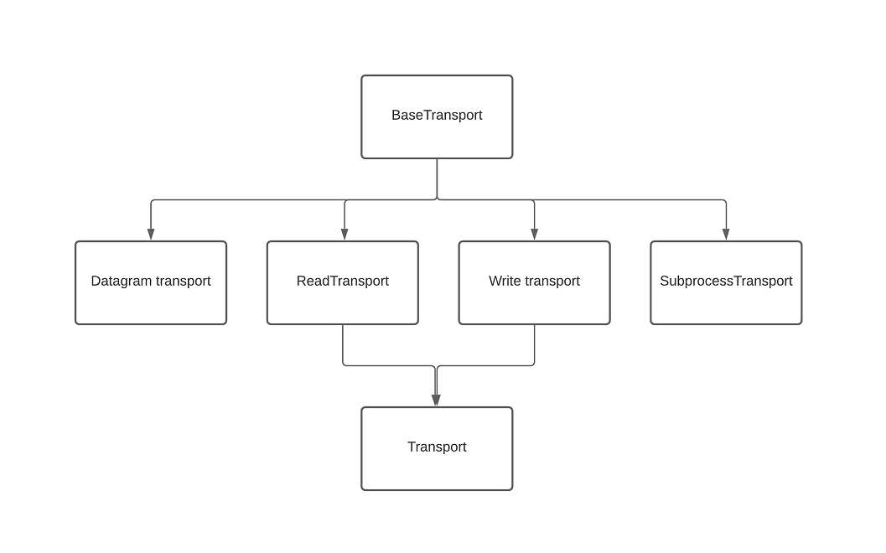
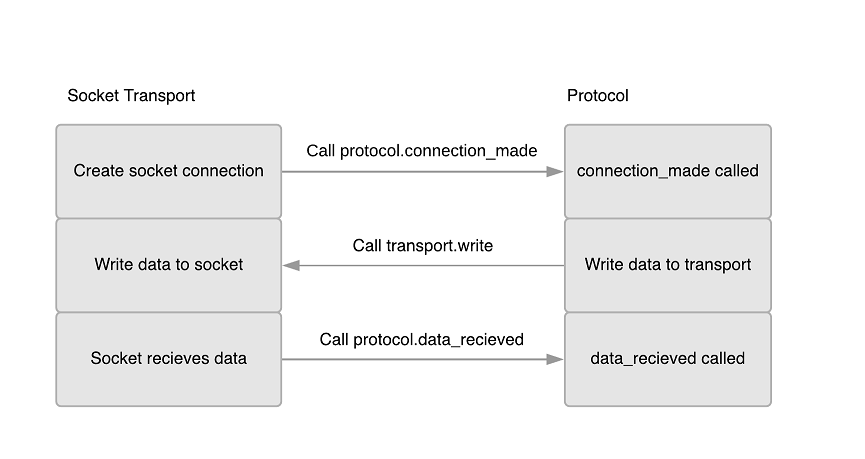
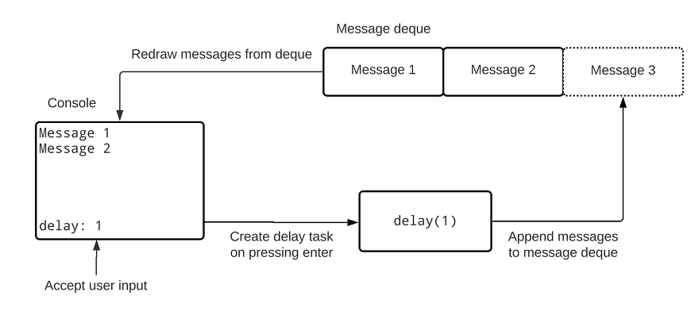

# 数据流

本章涵盖

- 传输和协议
- 使用流进行网络连接
- 异步处理命令行输入
- 使用流创建客户端/服务器应用程序

在编写网络应用程序时，例如前面章节中的 echo 客户端，我们使用了 socket 库来读取和写入我们的客户端。虽然在构建低级网络库时直接使用套接字很有用，但它们最终是复杂的生物，其细微差别超出了本书的范围。也就是说，套接字的许多用例依赖于一些概念上简单的操作，例如启动服务器、等待客户端连接以及向客户端发送数据。 asyncio 的设计者意识到了这一点，并构建了网络流 API 来为我们抽象处理套接字的细微差别。这些更高级别的 API 比套接字更容易使用，使得任何客户端-服务器应用程序都比我们自己使用套接字更容易构建和更健壮。使用流是在 asyncio 中构建基于网络的应用程序的推荐方法。

在本章中，我们将首先通过构建一个简单的 HTTP 客户端来学习使用较低级别的传输和协议 API。了解这些 API 将为我们了解更高级别的流 API 如何在后台工作奠定基础。然后，我们将使用这些知识来了解流读取器和写入器，并使用它们来构建非阻塞命令行 SQL 客户端。该应用程序将异步处理用户输入，允许我们从命令行同时运行多个查询。最后，我们将学习如何使用 asyncio 的服务器 API 创建客户端和服务器应用程序，构建功能性聊天服务器和聊天客户端。

## 8.1 引入流
在 asyncio 中，流是一组高级的类和函数，用于创建和管理网络连接和通用数据流。使用它们，我们可以创建客户端连接来读取和写入服务器，甚至可以创建服务器并自己管理它们。这些 API 抽象了很多关于管理套接字的知识，例如处理 SSL 或丢失的连接，使我们作为开发人员的生活更轻松一些。

流 API 构建在称为传输和协议的一组较低级别的 API 之上。这些 API 直接包装了我们在前几章中使用的套接字（通常是任何通用数据流），为我们提供了一个干净的 API 来读取和写入数据到套接字。

这些 API 的结构与其他 API 稍有不同，因为它们使用回调样式设计。与我们之前所做的那样主动等待来自套接字的数据不同，当数据可用时，我们会调用我们实现的类上的方法。然后，我们根据需要处理我们在此方法中收到的数据。要开始学习这些基于回调的 API 是如何工作的，让我们首先看看如何通过构建一个基本的 HTTP 客户端来使用较低级别的传输和协议 API。

## 8.2 传输和协议
在高层次上，传输是与任意数据流进行通信的抽象。当我们与套接字或任何数据流（如标准输入）通信时，我们使用一组熟悉的操作。我们从源读取数据或向源写入数据，当我们完成对它的处理时，我们关闭它。套接字完全符合我们定义这种传输抽象的方式；也就是说，我们读取和写入数据，一旦完成，我们就关闭它。简而言之，传输提供了向源发送和从源接收数据的定义。传输有多种实现，具体取决于我们使用的源类型。我们主要关注 ReadTransport、WriteTransport 和 Transport，尽管还有其他一些用于处理 UDP 连接和子进程通信。图 8.1 说明了传输的类层次结构。



图 8.1 传输的类层次结构

向和从套接字传输数据只是方程式的一部分。那么套接字的生命周期呢？我们建立连接；我们写入数据，然后处理我们得到的任何响应。这些是协议拥有的一组操作。请注意，此处的协议仅指 Python 类，而不是 HTTP 或 FTP 之类的协议。传输管理数据传输并在事件发生时调用协议上的方法，例如建立连接或准备处理数据，如图 8.2 所示。



图 8.2 当事件发生时，传输调用协议上的方法。协议可以将数据写入传输。

为了了解传输和协议如何协同工作，我们将构建一个基本应用程序来运行单个 HTTP GET 请求。我们需要做的第一件事是定义一个扩展 asyncio.Protocol 的类。我们将从基类中实现一些方法来发出请求、从请求中接收数据并处理连接中的任何错误。

我们需要实现的第一个协议方法是 connection_made。当底层套接字与 HTTP 服务器成功连接时，传输将调用此方法。此方法使用 Transport 作为参数，我们可以使用它与服务器进行通信。在这种情况下，我们将使用传输立即发送 HTTP 请求。

我们需要实现的第二种方法是 data_received。传输在接收数据时调用此方法，并将其作为字节传递给我们。这个方法可以被多次调用，所以我们需要创建一个内部缓冲区来存储数据。

现在的问题变成了，我们如何判断我们的响应何时完成？为了回答这个问题，我们将实现一个名为 eof_received 的方法。当我们收到文件结尾时调用此方法，在套接字的情况下，当服务器关闭连接时发生。一旦调用了这个方法，我们保证 data_received 永远不会被再次调用。 eof_received 方法返回一个布尔值，该值确定如何关闭传输（在此示例中关闭客户端套接字）。返回 False 确保传输将自行关闭，而 True 意味着我们编写的协议实现将关闭一切。在这种情况下，由于我们不需要在关闭时执行任何特殊逻辑，因此我们的方法应该返回 False，因此我们不需要自己处理关闭传输。

根据我们所描述的，我们只有一种将事物存储在内部缓冲区中的方法。那么，一旦请求完成，我们协议的消费者如何获得结果呢？为此，我们可以在内部创建一个 Future 来保存完成时的结果。然后，在 eof_received 方法中，我们将未来的结果设置为 HTTP 响应的结果。然后，我们将定义一个协程，我们将其命名为 get_response，它将等待未来。

让我们把上面描述的内容作为我们自己的协议来实现。我们将其称为 HTTPGetClientProtocol。

清单 8.1 使用传输和协议运行 HTTP 请求

```python
import asyncio
from asyncio import Transport, Future, AbstractEventLoop
from typing import Optional
 
 
class HTTPGetClientProtocol(asyncio.Protocol):
 
    def __init__(self, host: str, loop: AbstractEventLoop):
        self._host: str = host
        self._future: Future = loop.create_future()
        self._transport: Optional[Transport] = None
        self._response_buffer: bytes = b''
 
    async def get_response(self):                                  ❶
        return await self._future
 
    def _get_request_bytes(self) -> bytes:                         ❷
        request = f"GET / HTTP/1.1\r\n" \
                  f"Connection: close\r\n" \
                  f"Host: {self._host}\r\n\r\n"
        return request.encode()
 
    def connection_made(self, transport: Transport):
        print(f'Connection made to {self._host}')
        self._transport = transport
        self._transport.write(self._get_request_bytes())           ❸
 
    def data_received(self, data):
        print(f'Data received!')
        self._response_buffer = self._response_buffer + data       ❹
 
    def eof_received(self) -> Optional[bool]:
        self._future.set_result(self._response_buffer.decode())    ❺
        return False
 
    def connection_lost(self, exc: Optional[Exception]) -> None:   ❻
        if exc is None:
            print('Connection closed without error.')
        else:
            self._future.set_exception(exc)
```

❶ 等待内部的future，直到我们得到服务器的响应。

❷ 创建 HTTP 请求。

❸ 建立连接后，使用传输器发送请求。

❹ 获得数据后，将其保存到我们的内部缓冲区。

❺ 一旦连接关闭，用缓冲区完成future。

❻ 如果连接正常关闭，什么也不做；否则，以异常完成future。

现在我们已经实现了我们的协议，让我们用它来发出一个真正的请求。为此，我们需要在名为 create_connection 的异步事件循环上学习一种新的协程方法。此方法将创建到给定主机的套接字连接并将其包装在适当的传输中。除了主机和端口之外，它还包含一个协议工厂。协议工厂是创建协议实例的函数；在我们的例子中，是我们刚刚创建的 HTTPGetClientProtocol 类的一个实例。当我们调用这个协程时，我们会返回协程创建的传输以及工厂创建的协议实例。

清单 8.2 使用协议

```python
import asyncio
from asyncio import AbstractEventLoop
from chapter_08.listing_8_1 import HTTPGetClientProtocol
 
 
async def make_request(host: str, port: int, loop: AbstractEventLoop) -> str:
    def protocol_factory():
        return HTTPGetClientProtocol(host, loop)
 
    _, protocol = await loop.create_connection(protocol_factory, host=host, port=port)
 
    return await protocol.get_response()
 
 
async def main():
    loop = asyncio.get_running_loop()
    result = await make_request('www .example .com', 80, loop)
    print(result)
 
 
asyncio.run(main())
```

我们首先定义一个 make_request 方法，它接收我们想要向其发出请求的主机和端口，以及服务器的响应。在这个方法中，我们为我们的协议工厂创建了一个内部方法，该方法创建了一个新的 HTTPGetClientProtocol。然后我们使用主机和端口调用 create_connection，返回传输和我们工厂创建的协议。我们不需要传输，我们忽略它，但我们需要协议，因为我们想要使用 get_response 协程；因此，我们将在协议变量中跟踪它。最后，我们等待协议的 get_response 协程，该协程将等待 HTTP 服务器响应结果。在我们的主协程中，我们等待 make_request 并打印响应。执行此操作，你应该会看到如下所示的 HTTP 响应（为简洁起见，我们省略了 HTML 正文）：

```html
Connection made to www .example .com
Data received!
HTTP/1.1 200 OK
Age: 193241
Cache-Control: max-age=604800
Content-Type: text/html; charset=UTF-8
Connection closed without error.
```

我们已经学会了使用传输和协议。这些 API 是较低级别的，因此不推荐在 asyncio 中使用流。让我们看看如何使用流，这是一种扩展了传输和协议的更高级别的抽象。

## 8.3 流读取器和流写入器
传输和协议是较低级别的 API，最适合当我们需要直接控制发送和接收数据时发生的事情时。例如，如果我们正在设计网络库或 Web 框架，我们可能会考虑传输和协议。对于大多数应用程序，我们不需要这种级别的控制，并且使用传输和协议将涉及我们编写一堆重复的代码。

asyncio 的设计者意识到了这一点并创建了更高级别的流 API。该 API 将传输和协议的标准用例封装成易于理解和使用的两个类：StreamReader 和 StreamWriter。你可以猜到，它们分别处理对流的读取和写入。使用这些类是在 asyncio 中开发网络应用程序的推荐方法。

为了了解如何使用这些 API，让我们以发出 HTTP GET 请求并将其转换为流的示例为例。 asyncio 没有直接实例化 StreamReader 和 StreamWriter 实例，而是提供了一个名为 open_connection 的库协程函数，它将为我们创建它们。这个协程接受我们将连接到的主机和端口，并以元组的形式返回 StreamReader 和 StreamWriter。我们的计划是使用 StreamWriter 发送 HTTP 请求并使用 StreamReader 读取响应。 StreamReader 方法很容易理解，我们有一个方便的 readline 协程，它会一直等到我们有一行数据。或者，我们也可以使用 StreamReader 的读取协程等待指定数量的字节到达。

StreamWriter 稍微复杂一些。正如我们所期望的那样，它有一个 write 方法，但它是一个普通方法而不是协程。在内部，流写入器尝试立即写入套接字的输出缓冲区，但此缓冲区可能已满。如果套接字的写入缓冲区已满，则数据将存储在内部队列中，以后可以进入缓冲区。这带来了一个潜在的问题，即调用 write 不一定会立即发送数据。这可能会导致潜在的内存问题。想象一下我们的网络连接变慢了，每秒可以发送 1 KB，但我们的应用程序每秒写入 1 MB。在这种情况下，我们的应用程序的写入缓冲区将以比我们将数据发送到套接字缓冲区的速度快得多的速度填充，最终我们将开始达到机器上的内存限制，从而引发崩溃。

我们如何才能等到所有数据都正确发送出去？为了解决这个问题，我们有一个协程方法叫做 drain。这个协程将阻塞，直到所有排队的数据都发送到套接字，确保我们在继续之前已经写完所有内容。我们在调用 write 之后想要使用函数的模式，我们总是等待调用 drain。从技术上讲，不必在每次写入后调用 drain，但有助于防止错误是一个好主意。

清单 8.3 带有流读取器和写入器的 HTTP 请求

```python
import asyncio
from asyncio import StreamReader
from typing import AsyncGenerator
 
 
async def read_until_empty(stream_reader: StreamReader) -> AsyncGenerator[str, None]:
    while response := await stream_reader.readline():                                                  ❶
        yield response.decode()
 
 
async def main():
    host: str = 'www .example .com'
    request: str = f"GET / HTTP/1.1\r\n" \
                   f"Connection: close\r\n" \
                   f"Host: {host}\r\n\r\n"
 
    stream_reader, stream_writer = await asyncio.open_connection('www .example .com', 80)
 
    try:
        stream_writer.write(request.encode())                                                          ❷
        await stream_writer.drain()
 
        responses = [response async for response in read_until_empty(stream_reader)]                   ❸
 
        print(''.join(responses))
    finally:
        stream_writer.close()                                                                          ❹
        await stream_writer.wait_closed()
 
 
asyncio.run(main())
```

❶ 读取一行并对其进行解码，直到我们没有任何剩余。

❷ 写 http 请求，把 writer 排干。

❸ 读取每一行，并将其存储在一个列表中。

❹ 关闭写入器，等待它完成关闭。

在前面的清单中，我们首先创建了一个便利的异步生成器来从 StreamReader 读取所有行，将它们解码为字符串，直到我们没有任何剩余要处理。然后，在我们的主协程中，我们打开一个到 example.com 的连接，在这个过程中创建一个 StreamReader 和 StreamWriter 实例。然后我们分别使用 write 和 drain 写入请求并耗尽流写入器。一旦我们写了我们的请求，我们使用我们的异步生成器从响应中获取每一行，将它们存储在响应列表中。最后，我们通过调用 close 关闭 StreamWriter 实例，然后等待 wait_closed 协程。为什么我们需要在这里调用一个方法和一个协程？原因是当我们调用 close 时会发生一些事情，例如取消注册套接字和调用底层传输的 connection_lost 方法。这些都是在事件循环的后续迭代中异步发生的，这意味着在我们调用 close 之后，我们的连接直到稍后的某个时间才会关闭。如果你需要等待连接关闭才能继续操作，或者担心关闭时可能发生的任何异常，最好调用 wait_closed 。

我们现在已经通过发出 Web 请求了解了有关流 API 的基础知识。这些类的用处超出了基于 Web 和网络的应用程序。接下来，我们将了解如何利用流阅读器来创建非阻塞命令行应用程序。

## 8.4 非阻塞命令行输入
传统上，在 Python 中，当我们需要获取用户输入时，我们使用 input 函数。此函数将停止执行流程，直到用户提供输入并按 Enter。如果我们想在后台运行代码同时保持对输入的响应呢？例如，我们可能想让用户同时启动多个长时间运行的任务，例如长时间运行的 SQL 查询。对于命令行聊天应用程序，我们可能希望用户能够在接收来自其他用户的消息时键入消息。

由于 asyncio 是单线程的，在 asyncio 应用程序中使用输入意味着我们停止运行事件循环，直到用户提供输入，从而停止我们的整个应用程序。即使使用任务在后台启动操作也行不通。为了演示这一点，让我们尝试创建一个应用程序，在该应用程序中用户输入应用程序的睡眠时间。我们希望能够在接受用户输入的同时同时运行多个这些睡眠操作，因此我们将询问睡眠的秒数并在循环中创建一个延迟任务。

清单 8.4 尝试后台任务

```python
import asyncio
from util import delay
 
 
async def main():
    while True:
        delay_time = input('Enter a time to sleep:')
        asyncio.create_task(delay(int(delay_time)))
 
 
asyncio.run(main())
```

如果这段代码按照我们的预期工作，在我们输入一个数字后，我们希望看到 sleep for n seconds(s) 打印出来，然后在 n seconds 后完成 sleep for n seconds(s)。然而，情况并非如此，除了提示输入睡眠时间外，我们什么也看不到。这是因为我们的代码中没有等待，因此任务永远没有机会在事件循环上运行。我们可以通过将 await asyncio.sleep(0) 放在将安排任务的 create_task 行之后来解决这个问题（这被称为“屈服于事件循环”，将在第 14 章中介绍）。即使有了这个技巧，当它停止整个线程时，输入调用仍然会阻止我们创建的任何后台任务从运行到完成。

我们真正想要的是将输入函数改为协程，因此我们可以编写类似 delay_time = await input('Enter a time to sleep:') 的东西。如果我们能做到这一点，我们的任务将正确调度并在等待用户输入时继续运行。不幸的是，输入没有协程变体，所以我们需要做点别的。

这是协议和流阅读器可以帮助我们的地方。回想一下，流阅读器有 readline 协程，这是我们正在寻找的协程类型。如果我们有办法将流读取器连接到标准输入，那么我们就可以使用这个协程进行用户输入。

asyncio 在事件循环上有一个名为 connect_read_pipe 的协程方法，它将协议连接到类似文件的对象，这几乎是我们想要的。这个协程方法接受一个协议工厂和一个管道。协议工厂只是一个创建协议实例的函数。管道是一个类似文件的对象，它被定义为一个对象，上面有读写等方法。 connect_read_pipe 协程然后将管道连接到工厂创建的协议，从管道中获取数据并将其发送到协议。

就标准控制台输入而言，sys.stdin 符合我们可以传递给 connect_read_pipe 的类文件对象的要求。一旦我们调用了这个协程，我们就会得到一个我们的工厂函数创建的协议元组和一个 ReadTransport。现在的问题是我们应该在我们的工厂中创建什么协议，以及我们如何将它与具有我们想要使用的 readline 协程的 StreamReader 连接起来？

asyncio 提供了一个名为 StreamReaderProtocol 的实用程序类，用于将流读取器的实例连接到协议。当我们实例化这个类时，我们传入一个流读取器的实例。然后协议类委托给我们创建的流阅读器，允许我们使用流阅读器从标准输入中读取数据。将所有这些部分放在一起，我们可以创建一个在等待用户输入时不会阻塞事件循环的命令行应用程序。

> 对于 Windows 用户
>
> 不幸的是，在 Windows 上，connect_read_pipe 不适用于 sys.stdin。这是由于 Windows 实现文件描述符的方式导致的未修复错误。要在 Windows 上运行，你需要使用我们在第 7 章中探讨的技术在单独的线程中调用 sys.stdin.readline()。你可以在 https://bugs.python.org/ 阅读有关此问题的更多信息问题26832。

由于我们将在本章的其余部分重用阅读器中的异步标准，让我们在它自己的文件中创建它，listing_8_5.py。然后我们将在本章的其余部分导入它。

清单 8.5 一个异步标准输入阅读器

```python
import asyncio
from asyncio import StreamReader
import sys
 
 
async def create_stdin_reader() -> StreamReader:
    stream_reader = asyncio.StreamReader()
    protocol = asyncio.StreamReaderProtocol(stream_reader)
    loop = asyncio.get_running_loop()
    await loop.connect_read_pipe(lambda: protocol, sys.stdin)
    return stream_reader
```

在前面的清单中，我们创建了一个名为 create_stdin_reader 的可重用协程，它创建了一个 StreamReader，我们将使用它来异步读取标准输入。我们首先创建一个流读取器实例并将其传递给流读取器协议。然后我们调用 connect_read_pipe，将协议工厂作为 lambda 函数传入。这个 lambda 返回我们之前创建的流读取器协议。我们还通过 sys.stdin 将标准输入连接到我们的流阅读器协议。由于我们不需要它们，因此我们忽略了 connect_read_pipe 返回的传输和协议。我们现在可以使用此函数从标准输入异步读取并构建我们的应用程序。

清单 8.6 使用流阅读器进行输入

```python
import asyncio
from chapter_08.listing_8_5 import create_stdin_reader
from util import delay
 
 
async def main():
    stdin_reader = await create_stdin_reader()
    while True:
        delay_time = await stdin_reader.readline()
        asyncio.create_task(delay(int(delay_time)))
 
 
asyncio.run(main())
```

在我们的主协程中，我们调用 create_stdin_reader 并永远循环，等待来自具有 readline 协程的用户的输入。一旦用户在键盘上按下 Enter，这个协程就会传递输入的文本。一旦我们从用户那里得到输入，我们就将它转换成一个整数（注意，对于一个真正的应用程序，我们应该添加代码来处理错误的输入，因为如果我们现在传入一个字符串，我们会崩溃）并创建一个延迟任务。运行它，你将能够在输入命令行输入的同时同时运行多个延迟任务。例如，分别输入 5、4 和 3 秒的延迟，你应该会看到以下输出：

```python
5
sleeping for 5 second(s)
4
sleeping for 4 second(s)
3
sleeping for 3 second(s)
finished sleeping for 5 second(s)
finished sleeping for 4 second(s)
finished sleeping for 3 second(s)
```

这行得通，但这种方法有一个严重的缺陷。如果在我们输入输入延迟时间时控制台上出现一条消息会发生什么？为了测试这一点，我们将输入 3 秒的延迟时间，然后开始快速按 1。这样做，我们将看到如下内容：

```python
3
sleeping for 3 second(s)
111111finished sleeping for 3 second(s)
11
```

在我们打字的时候，延迟任务的信息会打印出来，打断我们的输入行并迫使它在下一行继续。此外，输入缓冲区现在只有 11 个，这意味着如果我们按 Enter 键，我们将在该时间段内创建一个延迟任务，丢失前几条输入。这是因为，默认情况下，终端以熟模式运行。在这种模式下，终端将用户输入回显到标准输出，并处理特殊键，例如 Enter 和 CTRL-C。出现此问题是因为延迟协程在终端回显输出的同时写入标准输出，从而导致竞争条件。

屏幕上还有一个标准输出写入的位置。这被称为光标，很像你在文字处理器中看到的光标。当我们输入输入时，光标停留在我们的键盘输入打印出来的那一行。这意味着来自其他协程的任何输出消息都将打印在与我们的输入相同的行上，因为这是光标所在的位置，从而导致奇怪的行为。

为了解决这些问题，我们需要两种解决方案的组合。第一个是将来自终端的输入回显带入我们的 Python 应用程序。这将确保在回显来自用户的输入时，我们不会从其他协程写入任何输出消息，因为我们是单线程的。第二种是在我们编写输出消息时在屏幕上移动光标，确保我们不会将输出消息写在与输入相同的行上。我们可以通过操作终端的设置和使用转义序列来做到这一点。

### 8.4.1 终端原始模式和读取协程
因为我们的终端在熟模式下运行，它会在我们的应用程序之外为我们处理在 readline 上回显用户输入。我们如何将这种处理引入到我们的应用程序中，这样我们就可以避免我们之前看到的竞争条件？

答案是将终端切换到原始模式。在原始模式下，不是终端为我们进行缓冲、预处理和回显，而是将每次击键发送到应用程序。然后由我们根据需要进行回显和预处理。虽然这意味着我们必须做额外的工作，但这也意味着我们可以对标准输出的写入进行细粒度控制，从而为我们提供避免竞争条件所需的能力。

Python 允许我们将终端更改为原始模式，但也允许使用 cbreak 模式。这种模式的行为类似于原始模式，不同之处在于像 CTRL-C 这样的击键仍然会为我们解释，从而为我们节省了一些工作。我们可以使用 tty 模块和 setcbreak 函数进入原始模式，如下所示：

```python
import tty
import sys
tty.setcbreak(sys.stdin)
```

一旦我们进入 cbreak 模式，我们就需要重新考虑我们是如何设计我们的应用程序的。 readline 协程将不再工作，因为它不会在原始模式下为我们回显任何输入。相反，我们希望一次读取一个字符并将其存储在我们自己的内部缓冲区中，回显输入的每个字符。我们创建的标准输入流阅读器有一个名为 read 的方法，它需要读取多个字节流。调用 read(1) 将一次读取一个字符，然后我们可以将其存储在缓冲区中并回显到标准输出。

我们现在有两个难题来解决这个问题，进入 cbreak 模式并一次读取一个输入字符，将其回显到标准输出。我们需要考虑如何显示延迟协程的输出，这样才不会干扰我们的输入。

让我们定义一些要求，以使我们的应用程序更加用户友好，并解决输出写入与输入在同一行的问题。然后，我们将让这些要求告知我们如何实现事物：

1. 用户输入字段应始终保留在屏幕底部。
2. 协程输出应该从屏幕顶部开始向下移动。
3. 当屏幕上的消息多于可用行时，现有消息应向上滚动。

鉴于这些要求，我们如何显示延迟协程的输出？鉴于我们希望在消息多于可用行数时向上滚动消息，使用 print 直接写入标准输出将证明是棘手的。我们将采取的方法不是这样做，而是保留我们想要写入标准输出的消息的双端队列（双端队列）。我们将双端队列中的最大元素数设置为终端屏幕上的行数。当双端队列已满时，这将为我们提供我们想要的滚动行为，因为双端队列后面的项目将被丢弃。当新消息附加到双端队列时，我们将移动到屏幕顶部并重绘每条消息。这将使我们获得我们想要的滚动行为，而不必保留有关标准状态的大量信息。这使我们的应用程序流程如图 8.3 所示。



图 8.3 延迟控制台应用程序

我们的应用程序游戏计划将如下：

将光标移动到屏幕底部，当按下某个键时，将其附加到我们的内部缓冲区，并将按键回显到标准输出。

当用户回车时，创建一个延迟任务。我们不会将输出消息写入标准输出，而是将它们附加到一个最大元素数等于控制台上的行数的双端队列。

一旦消息进入双端队列，我们将在屏幕上重绘输出。我们首先将光标移动到屏幕的左上角。然后我们打印出双端队列中的所有消息。完成后，我们将光标返回到之前的输入行和列。

要以这种方式实现应用程序，我们首先需要学习如何在屏幕上移动光标。我们可以使用 ANSI 转义码来做到这一点。这些是我们可以写入标准输出的特殊代码，用于执行更改文本颜色、上下移动光标和删除行等操作。转义序列首先使用转义码引入；在 Python 中，我们可以通过将 \033 打印到控制台来做到这一点。我们需要使用的许多转义序列都是由控制序列引入器引入的，它们以打印 \033[ 开始。为了更好地理解这一点，让我们看看如何将光标移动到当前位置下方的五行。

```python
sys.stdout.write('\033[5E')
```

这个转义序列从控制序列引入器开始，然后是 5E。 5 表示从当前光标行开始我们要向下移动的行数，E 是“将光标向下移动该行数”的代码。转义序列很简洁，有点难以理解。在下一个清单中，我们将创建几个具有明确名称的函数来解释每个转义码的作用，我们将在以后的清单中导入它们。如果你想了解有关 ANSI 转义序列及其工作原理的更多说明，请参阅有关该主题的 Wikipedia 文章，网址为 https://en.wikipedia.org/wiki/ANSI_escape_code。

让我们考虑一下我们需要如何在屏幕上移动光标来确定我们需要实现哪些功能。首先，我们需要将光标移动到屏幕底部以接受用户输入。然后，一旦用户按下 Enter，我们需要清除他们输入的所有文本。要从屏幕顶部打印协程输出消息，我们需要能够移动到屏幕的第一行。我们还需要保存和恢复光标的当前位置，因为当我们从协程中输入消息时，它可能会打印一条消息，这意味着我们需要将其移回正确的位置。我们可以使用以下转义码函数来做到这一点：

清单 8.7 转义序列便利函数

```python
import sys
import shutil
 
def save_cursor_position():
    sys.stdout.write('\0337')
 
 
def restore_cursor_position():
    sys.stdout.write('\0338')
 
 
def move_to_top_of_screen():
    sys.stdout.write('\033[H')
 
 
def delete_line():
    sys.stdout.write('\033[2K')
 
 
def clear_line():
    sys.stdout.write('\033[2K\033[0G')
 
 
def move_back_one_char():
    sys.stdout.write('\033[1D')
 
def move_to_bottom_of_screen() -> int:
    _, total_rows = shutil.get_terminal_size()
    input_row = total_rows - 1
    sys.stdout.write(f'\033[{input_row}E')
    return total_rows
```

现在我们有了一组可重用的函数来在屏幕上移动光标，让我们实现一个可重用的协同程序，一次读取标准输入一个字符。我们将使用 read 协程来执行此操作。一旦我们读取了一个字符，我们会将它写入标准输出，将字符存储在内部缓冲区中。由于我们还想处理用户按下 Delete 键，因此我们将关注 Delete 键。当用户按下它时，我们将从缓冲区和标准输出中删除该字符。

清单 8.8 一次读取输入一个字符

```python
import sys
from asyncio import StreamReader
from collections import deque
from chapter_08.listing_8_7 import move_back_one_char, clear_line
 
 
async def read_line(stdin_reader: StreamReader) -> str:
    def erase_last_char():                                     ❶
        move_back_one_char()
        sys.stdout.write(' ')
        move_back_one_char()
 
    delete_char = b'\x7f'
    input_buffer = deque()
    while (input_char := await stdin_reader.read(1)) != b'\n':
        if input_char == delete_char:                          ❷
            if len(input_buffer) > 0:
                input_buffer.pop()
                erase_last_char()
                sys.stdout.flush()
        else:
            input_buffer.append(input_char)                    ❸
            sys.stdout.write(input_char.decode())
            sys.stdout.flush()
    clear_line()
    return b''.join(input_buffer).decode()
```

❶ 从标准输出中删除前一个字符的便捷功能

❷ 如果输入字符是退格，删除最后一个字符。

❸ 如果输入字符不是退格符，则将其附加到缓冲区并回显。

我们的协程接受我们附加到标准输入的流阅读器。然后我们定义一个方便的函数来从标准输出中删除前一个字符，因为当用户按下 Delete 键时我们将需要它。然后，我们输入一个 while 循环，逐个字符读取，直到用户按 Enter。如果用户按下 Delete 键，我们会从缓冲区和标准输出中删除最后一个字符。否则，我们将其附加到缓冲区并回显它。一旦用户按下 Enter，我们清除输入行并返回缓冲区的内容。

接下来，我们需要定义存储要打印到标准输出的消息的队列。由于我们希望在附加消息时重绘输出，因此我们将定义一个包装双端队列并接收可等待回调的类。我们传入的回调将负责重绘输出。我们还将向我们的类添加一个 append 协程方法，该方法会将项目附加到双端队列，并使用双端队列中的当前项目集调用回调。

清单 8.9 消息存储

```python
from collections import deque
from typing import Callable, Deque, Awaitable
 
 
class MessageStore:
    def __init__(self, callback: Callable[[Deque], Awaitable[None]], max_size: int):
        self._deque = deque(maxlen=max_size)
        self._callback = callback
 
    async def append(self, item):
        self._deque.append(item)
        await self._callback(self._deque)
```

现在，我们拥有创建应用程序的所有部分。我们将重写我们的延迟协程以将消息添加到消息存储中。然后，在我们的主协程中，我们将创建一个辅助协程来将我们的双端队列中的消息重绘为标准输出。这是我们将传递给 MessageStore 的回调。然后，我们将使用我们之前实现的 read_line 协程来接受用户输入，当用户按下 Enter 时创建一个延迟任务。

清单 8.10 异步延迟应用程序

```python
import asyncio
import os
import tty
from collections import deque
from chapter_08.listing_8_5 import create_stdin_reader
from chapter_08.listing_8_7 import *
from chapter_08.listing_8_8 import read_line
from chapter_08.listing_8_9 import MessageStore
 
 
async def sleep(delay: int, message_store: MessageStore):
    await message_store.append(f'Starting delay {delay}')    ❶
    await asyncio.sleep(delay)
    await message_store.append(f'Finished delay {delay}')
 
 
async def main():
    tty.setcbreak(sys.stdin)
    os.system('clear')
    rows = move_to_bottom_of_screen()
 
    async def redraw_output(items: deque):                   ❷
        save_cursor_position()
        move_to_top_of_screen()
        for item in items:
            delete_line()
            print(item)
        restore_cursor_position()
 
    messages = MessageStore(redraw_output, rows - 1)
 
    stdin_reader = await create_stdin_reader()
 
    while True:
        line = await read_line(stdin_reader)
        delay_time = int(line)
        asyncio.create_task(sleep(delay_time, messages))
 
 
asyncio.run(main())
```

❶ 将输出消息附加到消息存储。

❷ 回调将光标移动到屏幕顶部；重绘输出并将光标移回。

运行此程序，你将能够创建延迟并观察输入写入控制台，即使在你键入时也是如此。虽然它比我们的第一次尝试更复杂，但我们已经构建了一个应用程序，避免了我们之前遇到的写入标准输出的问题。

我们为延迟协程构建的东西，但是更真实的东西呢？我们刚刚定义的部分足够强大，我们可以通过重用它们来制作更有用的应用程序。例如，让我们思考如何创建一个命令行 SQL 客户端。某些查询可能需要很长时间才能执行，但我们可能希望同时运行其他查询或取消正在运行的查询。使用我们刚刚构建的内容，我们可以创建这种类型的客户端。让我们使用第 5 章中之前的电子商务产品数据库构建一个，其中我们创建了一个包含一组服装品牌、产品和 SKU 的模式。我们将创建一个连接池来连接到我们的数据库，并且我们将重用前面示例中的代码来接受和运行查询。我们将把查询的基本信息输出到控制台——现在只是返回的行数。

清单 8.11 一个异步命令行 sql 客户端

```python
import asyncio
import asyncpg
import os
import tty
from collections import deque
from asyncpg.pool import Pool
from chapter_08.listing_8_5 import create_stdin_reader
from chapter_08.listing_8_7 import *
from chapter_08.listing_8_8 import read_line
from chapter_08.listing_8_9 import MessageStore
 
 
async def run_query(query: str, pool: Pool, message_store: MessageStore):
    async with pool.acquire() as connection:
        try:
            result = await connection.fetchrow(query)
            await message_store.append(f'Fetched {len(result)} rows from: {query}')
        except Exception as e:
            await message_store.append(f'Got exception {e} from: {query}')
 
 
async def main():
    tty.setcbreak(0)
    os.system('clear')
    rows = move_to_bottom_of_screen()
 
    async def redraw_output(items: deque):
        save_cursor_position()
        move_to_top_of_screen()
        for item in items:
            delete_line()
            print(item)
        restore_cursor_position()
 
    messages = MessageStore(redraw_output, rows - 1)
 
    stdin_reader = await create_stdin_reader()
 
    async with asyncpg.create_pool(host='127.0.0.1',
                                   port=5432,
                                   user='postgres',
                                   password='password',
                                   database='products',
                                   min_size=6,
                                   max_size=6) as pool:
 
        while True:
            query = await read_line(stdin_reader)
            asyncio.create_task(run_query(query, pool, messages))
 
 
asyncio.run(main())
```

我们的代码与之前几乎相同，不同之处在于我们创建了一个 run_query 协程，而不是延迟协程。这不是仅仅休眠任意时间，而是运行用户输入的查询，该查询可能需要任意时间。这让我们可以在其他人仍在运行时从命令行发出新的查询；它还可以让我们看到已完成的输出，即使我们正在输入新的查询。

我们现在知道如何创建可以在其他代码执行和写入控制台时处理输入的命令行客户端。接下来，我们将学习如何使用更高级别的 asyncio API 创建服务器。

## 8.5 创建服务器
当我们构建服务器时，例如我们的 echo 服务器，我们创建了一个服务器套接字，将其绑定到一个端口并等待传入的连接。虽然这可行，但 asyncio 允许我们在更高的抽象级别上创建服务器，这意味着我们可以创建它们而无需担心管理套接字。以这种方式创建服务器简化了我们需要使用套接字编写的代码，因此，使用这些更高级别的 API 是使用 asyncio 创建和管理服务器的推荐方法。

我们可以使用 asyncio.start_server 协程创建一个服务器。这个协程接受几个可选参数来配置诸如 SSL 之类的东西，但我们感兴趣的主要参数是主机、端口和 client_connected_cb。主机和端口就像我们之前看到的一样：服务器套接字将侦听连接的地址。更有趣的部分是 client_connected_cb，它要么是一个回调函数，要么是一个在客户端连接到服务器时将运行的协程。此回调将 StreamReader 和 StreamWriter 作为参数，让我们可以读取和写入连接到服务器的客户端。

当我们等待 start_server 时，它会返回一个 AbstractServer 对象。这个类缺少许多我们需要使用的有趣方法，除了 serve_forever，它永远运行服务器，直到我们终止它。这个类也是一个异步上下文管理器。这意味着我们可以使用带有 async with 语法的实例来让服务器在退出时正确关闭。

为了处理创建服务器，让我们再次创建一个回显服务器，但让它更高级一点。我们将显示有关连接了多少其他客户端的信息，而不仅仅是回显输出。当客户端与服务器断开连接时，我们还将显示信息。为了管理这一点，我们将创建一个名为 ServerState 的类来管理连接的用户数量。一旦用户连接，我们会将他们添加到服务器状态并通知其他客户端他们已连接。

清单 8.12 创建一个带有服务器对象的回显服务器

```python
import asyncio
import logging
from asyncio import StreamReader, StreamWriter
 
 
class ServerState:
 
    def __init__(self):
        self._writers = []
 
    async def add_client(self, reader: StreamReader, writer: StreamWriter):  ❶
        self._writers.append(writer)
        await self._on_connect(writer)
        asyncio.create_task(self._echo(reader, writer))
 
    async def _on_connect(self, writer: StreamWriter):                       ❷
        writer.write(f'Welcome! {len(self._writers)} user(s) are online!\n'.encode())
        await writer.drain()
        await self._notify_all('New user connected!\n')
 
    async def _echo(self, reader: StreamReader, writer: StreamWriter):       ❸
        try:
            while (data := await reader.readline()) != b'':
                writer.write(data)
                await writer.drain()
            self._writers.remove(writer)
            await self._notify_all(f'Client disconnected. {len(self._writers)} user(s) are online!\n')
        except Exception as e:
            logging.exception('Error reading from client.', exc_info=e)
            self._writers.remove(writer)
 
    async def _notify_all(self, message: str):                               ❹
        for writer in self._writers:
            try:
                writer.write(message.encode())
                await writer.drain()
            except ConnectionError as e:
                logging.exception('Could not write to client.', exc_info=e)
                self._writers.remove(writer)
 
 
async def main():
    server_state = ServerState()
 
    async def client_connected(reader: StreamReader, writer:                 ❺
     StreamWriter) -> None:                                 
        await server_state.add_client(reader, writer)
 
    server = await asyncio.start_server(client_connected, '127.0.0.1', 8000) ❻
 
    async with server:
        await server.serve_forever()
 
 
asyncio.run(main())
```

❶ 将客户端添加到服务器状态，并创建回显任务。

❷ 在新连接上，告诉客户端有多少用户在线，并通知其他用户有新用户。

❸ 当客户端断开连接时处理回显用户输入，并通知其他用户断开连接。

❹ 向所有其他用户发送消息的辅助方法。如果消息发送失败，请删除该用户。

❺ 当客户端连接时，将该客户端添加到服务器状态。

❻ 启动服务器，永远开始服务。

当用户连接到我们的服务器时，我们的 client_connected 回调会响应该用户的读取器和写入器，进而调用服务器状态的 add_client 协程。在 add_client 协程中，我们存储了 StreamWriter，因此我们可以向所有连接的客户端发送消息，并在客户端断开连接时将其删除。然后我们调用 _on_connect，它会向客户端发送一条消息，通知他们有多少其他用户已连接。在 _on_connect 中，我们还通知任何其他已连接的客户端新用户已连接。

The_echo 协程类似于我们过去所做的，不同之处在于当用户断开连接时，我们会通知任何其他连接的客户端有人断开连接。运行此程序时，你应该有一个正常运行的回显服务器，它可以让每个单独的客户端知道新用户何时与服务器连接和断开连接。

我们现在已经看到了如何创建一个比我们之前所做的更高级的异步服务器。接下来，让我们在这些知识的基础上创建一个聊天服务器和聊天客户端——更高级的东西。

## 8.6 创建聊天服务器和客户端
我们现在知道如何创建服务器和处理异步命令行输入。我们可以结合我们在这两个领域的知识来创建两个应用程序。第一种是聊天服务器，同时接受多个聊天客户端，第二种是聊天客户端，连接服务器，收发聊天消息。

在我们开始设计我们的应用程序之前，让我们从一些有助于我们做出正确设计选择的要求开始。首先，对于我们的服务器：

聊天客户端在提供用户名时应该能够连接到服务器。

一旦用户连接，他们应该能够向服务器发送聊天消息，并且每条消息都应该发送给连接到服务器的每个用户。

为了防止空闲用户占用资源，如果用户空闲超过一分钟，服务器应该断开他们的连接。

其次，对于我们的客户：

当用户启动应用程序时，客户端应提示输入用户名并尝试连接到服务器。

连接后，用户将看到来自其他客户端的任何消息从屏幕顶部向下滚动。

用户应该在屏幕底部有一个输入字段。当用户按 Enter 键时，输入中的文本应发送到服务器，然后发送到所有其他连接的客户端。

鉴于这些要求，让我们首先考虑一下客户端和服务器之间的通信应该是什么样子。首先，我们需要使用我们的用户名从客户端向服务器发送一条消息。我们需要从消息发送中消除与用户名连接的歧义，因此我们将引入一个简单的命令协议来指示我们正在发送用户名。为简单起见，我们将只传递一个带有名为 CONNECT 的命令名称的字符串，后跟用户提供的用户名。例如，CONNECT MissIslington 将是我们发送到服务器的消息，用于连接用户名为“MissIslington”的用户。

连接后，我们将直接向服务器发送消息，然后服务器会将消息发送给所有连接的客户端（包括我们自己；根据需要，你可以对其进行优化）。对于更健壮的应用程序，你可能需要考虑服务器发送回客户端以确认已收到消息的命令，但为简洁起见，我们将跳过此步骤。

考虑到这一点，我们已经足够开始设计我们的服务器了。我们将创建一个 ChatServerState 类，类似于我们在上一节中所做的。一旦客户端连接，我们将等待他们使用 CONNECT 命令提供用户名。假设他们提供了它，我们将创建一个任务来监听来自客户端的消息并将它们写入所有其他连接的客户端。为了跟踪连接的客户端，我们将连接用户名的字典保存到它们的 StreamWriter 实例。如果连接的用户空闲超过一分钟，我们将断开他们的连接并将他们从字典中删除，向其他用户发送他们离开聊天的消息。

清单 8.13 一个聊天服务器

```python
import asyncio
import logging
from asyncio import StreamReader, StreamWriter
 
 
class ChatServer:
 
    def __init__(self):
        self._username_to_writer = {}
 
    async def start_chat_server(self, host: str, port: int):
        server = await asyncio.start_server(self.client_connected, host, port)
 
        async with server:
            await server.serve_forever()
 
    async def client_connected(self, reader: StreamReader, writer: StreamWriter):❶
        command = await reader.readline()
        print(f'CONNECTED {reader} {writer}')
        command, args = command.split(b' ')
        if command == b'CONNECT':
            username = args.replace(b'\n', b'').decode()
            self._add_user(username, reader, writer)
            await self._on_connect(username, writer)
        else:
            logging.error('Got invalid command from client, disconnecting.')
            writer.close()
            await writer.wait_closed()
 
    def _add_user(self, username: str, reader:                                   ❷
     StreamReader, writer: StreamWriter):                                        ❷
        self._username_to_writer[username] = writer
        asyncio.create_task(self._listen_for_messages(username, reader))
 
    async def _on_connect(self, username: str, writer: StreamWriter):            ❸
        writer.write(f'Welcome! {len(self._username_to_writer)} user(s) are online!\n'.encode())
        await writer.drain()
        await self._notify_all(f'{username} connected!\n')
 
    async def _remove_user(self, username: str):
        writer = self._username_to_writer[username]
        del self._username_to_writer[username]
        try:
            writer.close()
            await writer.wait_closed()
        except Exception as e:
            logging.exception('Error closing client writer, ignoring.', exc_info=e)
 
    async def _listen_for_messages(self,
                                   username: str,
                                   reader: StreamReader):                        ❹
        try:
            while (data := await asyncio.wait_for(reader.readline(), 60)) != b'':
                await self._notify_all(f'{username}: {data.decode()}')
            await self._notify_all(f'{username} has left the chat\n')
        except Exception as e:
            logging.exception('Error reading from client.', exc_info=e)
            await self._remove_user(username)
 
    async def _notify_all(self, message: str):                                   ❺
        inactive_users = []
        for username, writer in self._username_to_writer.items():
            try:
                writer.write(message.encode())
                await writer.drain()
            except ConnectionError as e:
                logging.exception('Could not write to client.', exc_info=e)
                inactive_users.append(username)
 
        [await self._remove_user(username) for username in inactive_users]
 
 
async def main():
    chat_server = ChatServer()
    await chat_server.start_chat_server('127.0.0.1', 8000)
 
 
asyncio.run(main())
```

❶ 等待客户端提供有效的用户名命令；否则，断开它们。

❷ 存储用户的流写入器实例并创建一个任务来监听消息。

❸ 用户连接后，通知所有其他人他们已连接。

❹ 监听来自客户端的消息并将它们发送给所有其他客户端，最多等待一分钟的消息。

❺ 向所有连接的客户端发送消息，删除任何断开连接的用户。

我们的 ChatServer 类将有关聊天服务器的所有内容封装在一个干净的接口中。主要入口点是 start_chat_server 协程。这个协程在指定的主机和端口上启动一个服务器，并调用 serve_forever。对于我们服务器的客户端连接回调，我们使用我们的 client_connected 协程。这个协程等待客户端的第一行数据，如果接收到有效的CONNECT命令，就调用_add_user和then_on_connect；否则，它将终止连接。

_add_user 函数将用户名和用户的流写入器存储在内部字典中，然后创建一个任务来监听来自用户的聊天消息。 _on_connect 协程向客户端发送一条消息，欢迎他们进入聊天室，然后通知所有其他已连接的客户端该用户已连接。

当我们调用 _add_user 时，我们为 _listen_for_messages 协程创建了一个任务。这个协程是我们应用程序的核心所在。我们永远循环，从客户端读取消息，直到我们看到一个空行，表明客户端断开连接。收到消息后，我们调用 _notify_all 将聊天消息发送给所有连接的客户端。为了满足客户端在空闲一分钟后应该断开连接的要求，我们将 readline 协程包装在 wait_for 中。如果客户端空闲超过一分钟，这将引发 TimeoutError。在这种情况下，我们有一个广泛的异常子句来捕获 TimeoutError 和任何其他抛出的异常。我们通过从 _username_to_writer 字典中删除客户端来处理任何异常，因此我们停止向它们发送消息。

我们现在有一个完整的服务器，但是如果没有客户端连接到它，服务器就毫无意义。我们将与我们之前编写的命令行 SQL 客户端类似地实现客户端。我们将创建一个协程来监听来自服务器的消息并将它们附加到消息存储中，当有新消息进入时重绘屏幕。我们还将输入放在屏幕底部，当用户按下时输入，我们将消息发送到聊天服务器。

清单 8.14 聊天客户端

```python
import asyncio
import os
import logging
import tty
from asyncio import StreamReader, StreamWriter
from collections import deque
from chapter_08.listing_8_5 import create_stdin_reader
from chapter_08.listing_8_7 import *
from chapter_08.listing_8_8 import read_line
from chapter_08.listing_8_9 import MessageStore
 
 
async def send_message(message: str, writer: StreamWriter):
    writer.write((message + '\n').encode())
    await writer.drain()
 
 
async def listen_for_messages(reader: StreamReader,
                              message_store: MessageStore):                      ❶
    while (message := await reader.readline()) != b'':
        await message_store.append(message.decode())
    await message_store.append('Server closed connection.')
 
 
async def read_and_send(stdin_reader: StreamReader,
                        writer: StreamWriter):                                   ❷
    while True:
        message = await read_line(stdin_reader)
        await send_message(message, writer)
 
 
async def main():
    async def redraw_output(items: deque):
        save_cursor_position()
        move_to_top_of_screen()
        for item in items:
            delete_line()
            sys.stdout.write(item)
        restore_cursor_position()
 
    tty.setcbreak(0)
    os.system('clear')
    rows = move_to_bottom_of_screen()
 
    messages = MessageStore(redraw_output, rows - 1)
 
    stdin_reader = await create_stdin_reader()
    sys.stdout.write('Enter username: ')
    username = await read_line(stdin_reader)
 
    reader, writer = await asyncio.open_connection('127.0.0.1', 8000)            ❸
 
    writer.write(f'CONNECT {username}\n'.encode())
    await writer.drain()
 
    message_listener = asyncio.create_task(listen_for_messages(reader, messages))❹
    input_listener = asyncio.create_task(read_and_send(stdin_reader, writer))
 
    try:
        await asyncio.wait([message_listener, input_listener], return_when=asyncio.FIRST_COMPLETED)
    except Exception as e:
        logging.exception(e)
        writer.close()
        await writer.wait_closed()
 
 
asyncio.run(main())
```

❶ 监听来自服务器的消息，将它们附加到消息存储中。

❷ 读取用户的输入，并将其发送到服务器。

❸ 打开与服务器的连接，并使用用户名发送连接消息。

❹ 创建一个任务来监听消息，监听输入；等到一个完成。

我们首先向用户询问他们的用户名，一旦我们有了用户名，我们就会将 CONNECT 消息发送到服务器。然后，我们创建了两个任务：一个是监听来自服务器的消息，另一个是持续读取聊天消息并将它们发送到服务器。然后我们接受这两个任务，并通过将它们包装在 asyncio.wait 中来等待先完成的任务。我们这样做是因为服务器可能会断开我们的连接，或者输入侦听器可能会抛出异常。如果我们只是独立地等待每个任务，我们可能会发现自己陷入困境。例如，如果服务器断开了我们的连接，如果我们先等待该任务，我们将无法停止输入侦听器。使用等待协程可以防止这个问题，因为如果消息侦听器或输入侦听器完成，我们的应用程序将退出。如果我们想在这里有更健壮的逻辑，我们可以通过检查完成和挂起的集合等待返回来做到这一点。例如，如果输入监听器抛出异常，我们可以取消消息监听器任务。

如果你首先运行服务器，然后运行几个聊天客户端，你将能够像普通聊天应用程序一样在客户端中发送和接收消息。例如，连接到聊天的两个用户可能会产生如下输出：

```
Welcome! 1 user(s) are online!
MissIslington connected!
SirBedevere connected!
SirBedevere: Is that your nose?
MissIslington: No, it's a false one!
```

我们构建了一个聊天服务器和客户端，可以处理多个用户同时连接到一个线程。这个应用程序可能会更加健壮。例如，你可能需要考虑在失败时重试消息发送或协议以确认客户端收到消息。使它成为一个有价值的应用程序是相当复杂的，并且超出了本书的范围，尽管这对读者来说可能是一个有趣的练习，因为有许多失败点需要思考。使用与我们在此示例中探索的概念类似的概念，你将能够创建强大的客户端和服务器应用程序以满足你的需求。

## 概括

- 我们已经学习了如何使用较低级别的传输和协议 API 来构建一个简单的 HTTP 客户端。这些 API 是高级流 asyncio 流 API 的基础，一般不推荐用于一般用途。
- 我们已经学习了如何使用 StreamReader 和 StreamWriter 类来构建网络应用程序。这些更高级别的 API 是在 asyncio 中使用流的推荐方法。
- 我们已经学习了如何使用流来创建非阻塞命令行应用程序，这些应用程序可以在后台运行任务时保持对用户输入的响应。
- 我们已经学习了如何使用 start_server 协程创建服务器。这种方法是在 asyncio 中创建服务器的推荐方法，而不是直接使用套接字。
- 我们已经学习了如何使用流和服务器创建响应式客户端和服务器应用程序。利用这些知识，我们可以创建基于网络的应用程序，例如聊天服务器和客户端。