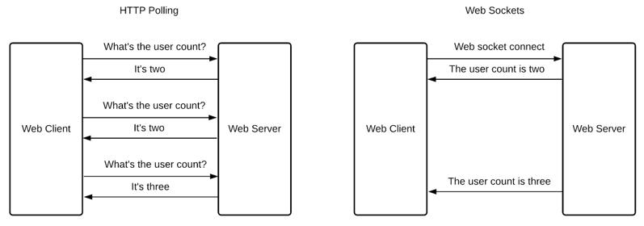
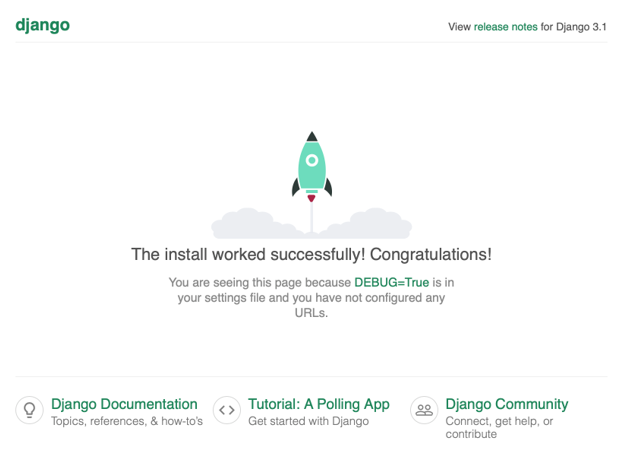
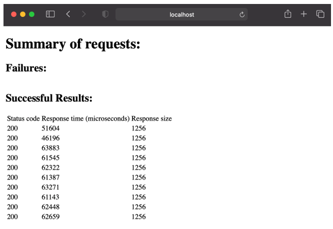

# 网络应用程序

本章涵盖

- 使用 aiohttp 创建 Web 应用程序
- 异步服务器网关接口 (ASGI)
- 使用 Starlette 创建 ASGI Web 应用程序
- 使用 Django 的异步视图

Web 应用程序为我们今天在 Internet 上使用的大多数网站提供支持。如果你曾在一家拥有互联网业务的公司担任开发人员，那么你可能在职业生涯的某个阶段从事过 Web 应用程序。在同步 Python 的世界中，这意味着你使用过诸如 Flask、Bottle 或非常流行的 Django 之类的框架。除了更新版本的 Django 之外，这些 Web 框架并不是为开箱即用的 asyncio 而构建的。因此，当我们的 Web 应用程序执行可以并行化的工作时，例如查询数据库或调用其他 API，我们没有多线程或多处理之外的选项。这意味着我们需要探索与 asyncio 兼容的新框架。

在本章中，我们将学习一些流行的支持异步的 Web 框架。我们将首先了解如何使用我们已经处理过的框架 aiohttp 来构建异步 RESTful API。然后，我们将了解异步服务器网关接口或 ASGI，它是 WSGI（Web 服务器网关接口）的异步替代品，并且是运行多少 Web 应用程序。将 ASGI 与 Starlette 结合使用，我们将构建一个支持 WebSocket 的简单 REST API。我们还将研究如何使用 Django 的异步视图。扩展时，Web 应用程序的性能始终是一个考虑因素，因此我们还将通过使用负载测试工具进行基准测试来查看性能数据。

## 9.1 使用 aiohttp 创建 REST API
以前，我们使用 aiohttp 作为 HTTP 客户端向 Web 应用程序发出数千个并发 Web 请求。 aiohttp 不仅支持作为 HTTP 客户端，而且还具有创建 asyncio-ready Web 应用程序服务器的功能。

### 9.1.1 什么是 REST？
REST 是代表性状态转移的缩写。它是现代 Web 应用程序开发中广泛使用的范例，尤其是与具有 React 和 Vue 等框架的单页应用程序结合使用时。 REST 为我们提供了一种独立于客户端技术的无状态、结构化方式来设计我们的 Web API。 REST API 应该能够与从手机到浏览器的任意数量的客户端进行互操作，并且只需要更改数据的客户端表示即可。

REST 中的关键概念是资源。资源通常是可以用名词表示的任何东西。例如，客户、产品或帐户可以是 RESTful 资源。我们刚刚列出的资源引用了单个客户或产品。资源也可以是集合，例如，"客户"或"产品"具有我们可以通过一些唯一标识符访问的单例。单例也可能有子资源。客户可以有一个最喜欢的产品列表作为示例。让我们看一下几个 REST API 以更好地理解：

```
customers
customers/{id}
customers/{id}/favorites
```

我们在这里有三个 REST API 端点。我们的第一个端点，客户，引用了一组客户。作为这个 API 的消费者，我们希望它返回一个客户列表（这可能是分页的，因为它可能是一个很大的集合）。我们的第二个端点引用了一个客户并将 id 作为参数。如果我们使用整数 ID 唯一标识客户，则调用 customers/1 将为我们提供 ID 为 1 的客户的数据。我们的最终端点是子实体的示例。客户可以拥有最喜欢的产品列表，使收藏列表成为客户的子实体。调用 customers/1/favorites 将返回 id 为 1 的客户的收藏列表。

我们将设计我们的 REST API 以返回 JSON，因为这是典型的，尽管我们可以选择任何适合我们需要的格式。 REST API 有时可以通过 HTTP 标头的内容协商来支持多种数据表示。

虽然正确了解 REST 的所有细节超出了本书的范围，但 REST 博士论文的创建者是了解这些概念的好地方。可在 http://mng.bz/1jAg 获得。

### 9.1.2 aiohttp 服务器基础
让我们开始使用 aiohttp 创建一个简单的"hello world"风格的 API。我们将从创建一个简单的 GET 端点开始，它将为我们提供一些关于时间和日期的 JSON 格式的基本数据。我们将调用我们的端点 /time 并期望它返回月、日和当前时间。

aiohttp 在 web 模块中提供 web 服务器功能。一旦我们导入它，我们就可以使用 RouteTableDef 定义端点（在 aiohttp 中称为路由）。 RouteTableDef 提供了一个装饰器，让我们可以指定请求类型（GET、POST 等）和表示端点名称的字符串。然后，我们可以使用 RouteTableDef 装饰器来装饰在调用该端点时将执行的协程。在这些修饰的协程中，我们可以执行我们想要的任何应用程序逻辑，然后将数据返回给客户端。

然而，自己创建这些端点没有任何作用，我们仍然需要启动 Web 应用程序来提供路由。为此，我们首先创建一个 Application 实例，从 RouteTableDef 添加路由并运行应用程序。

清单 9.1 当前时间端点

```python
from aiohttp import web
from datetime import datetime
from aiohttp.web_request import Request
from aiohttp.web_response import Response
 
routes = web.RouteTableDef()
 
 
@routes.get('/time')                    ❶
async def time(request: Request) -> Response:
    today = datetime.today()
 
    result = {
        'month': today.month,
        'day': today.day,
        'time': str(today.time())
    }
 
    return web.json_response(result)    ❷
 
 
app = web.Application()                 ❸
app.add_routes(routes)
web.run_app(app)
```

❶ 创建时间 GET 端点；当客户端调用此端点时，时间协程将运行。
❷ 获取结果字典，并将其转换为 JSON 响应。
❸ 创建 Web 应用程序，注册路由并运行应用程序。
在前面的清单中，我们首先创建了一个时间端点。 @routes.get('/time') 指定当客户端针对 /time URI 执行 HTTP GET 请求时，将执行装饰协程。在我们的时间协程中，我们获取月、日和时间并将其存储在字典中。然后我们调用 web.json_response，它获取字典并将其序列化为 JSON 格式。它还配置我们发回的 HTTP 响应。特别是，它将状态代码设置为 200，将内容类型设置为"application/json"。

然后我们创建 Web 应用程序并启动它。首先，我们创建一个 Application 实例并调用 add_routes。这将注册我们使用 Web 应用程序创建的所有装饰器。然后我们调用 run_app，它会启动 Web 服务器。默认情况下，这会在 localhost 端口 8080 上启动 Web 服务器。

当我们运行它时，我们可以通过在 Web 浏览器中访问 localhost:8080/time 或使用命令行实用程序（例如 cURL 或 Wget）来测试它。让我们使用 cURL 对其进行测试，通过运行 curl -i localhost:8080/time 查看完整的响应。你应该会看到如下内容：

```html
HTTP/1.1 200 OK
Content-Type: application/json; charset=utf-8
Content-Length: 51
Date: Mon, 23 Nov 2020 16:35:32 GMT
Server: Python/3.9 aiohttp/3.6.2
 
{"month": 11, "day": 23, "time": "11:35:32.033271"}
```

这表明我们已经成功地使用 aiohttp 创建了我们的第一个端点！你可能从我们的代码清单中注意到的一件事是，我们的时间协程有一个名为 request 的参数。虽然我们不需要在这个例子中使用它，但它很快就会变得很重要。此数据结构包含有关客户端发送的 Web 请求的信息，例如正文、查询参数等。要查看请求中的标头，请在时间协程内的某处添加 print(request.headers)，你应该会看到类似以下内容：

```python
<CIMultiDictProxy('Host': 'localhost:8080', 'User-Agent': 'curl/7.64.1', 'Accept': '*/*')>
```

### 9.1.3 连接数据库并返回结果
虽然我们的时间端点向我们展示了基础知识，但大多数 Web 应用程序并非如此简单。我们通常需要连接到 Postgres 或 Redis 等数据库，并且可能需要与其他 REST API 通信，例如，如果我们查询或更新我们使用的供应商 API。

为了了解如何做到这一点，我们将从第 5 章开始围绕我们的电子商务店面数据库构建一个 REST API。具体来说，我们将设计一个 REST API 来从我们的数据库中获取现有产品并创建新产品。

我们需要做的第一件事是创建与数据库的连接。由于我们希望我们的应用程序将有许多并发用户，因此使用连接池而不是单个连接是最有意义的。问题变成了：我们可以在哪里创建和存储连接池，以便我们的应用程序端点使用？

要回答我们可以在哪里存储连接池的问题，我们首先需要回答更广泛的问题，即我们可以在 aiohttp 应用程序中的哪里存储共享应用程序数据。然后，我们将使用此机制来保存对连接池的引用。

为了存储共享数据，aiohttp 的 Application 类充当字典。例如，如果我们有一些共享字典，我们希望我们的所有路由都可以访问，我们可以将它存储在我们的应用程序中，如下所示：

```python
app = web.Application()
app['shared_dict'] = {'key' : 'value'}
```

我们现在可以通过执行 app['shared_dict'] 来访问共享字典。接下来，我们需要弄清楚如何从路由中访问应用程序。我们可以将应用实例设为全局，但 aiohttp 通过 Request 类提供了更好的方法。我们的路由获得的每个请求都将通过 app 字段引用应用程序实例，从而使我们能够轻松访问任何共享数据。例如，获取共享字典并将其作为响应返回可能如下所示：

```python
@routes.get('/')
async def get_data(request: Request) -> Response:
    shared_data = request.app['shared_dict']
    return web.json_response(shared_data)
```

一旦我们创建它，我们将使用这个范例来存储和检索我们的数据库连接池。现在我们决定创建连接池的最佳位置。当我们创建应用程序实例时，我们不能轻易做到这一点，因为这发生在任何协程意义之外，而且我们不能使用所需的 await 表达式。

aiohttp 在应用程序实例上提供了一个信号处理程序来处理像这样称为 on_startup 的设置任务。你可以将其视为启动应用程序时将执行的协程列表。我们可以通过调用 app.on_startup.append(coroutine) 添加协程以在启动时运行。我们附加到 on_startup 的每个协程都有一个参数：应用程序实例。一旦我们实例化它，我们就可以将我们的数据库池存储在传递给这个协程的应用程序实例中。

我们还需要考虑当我们的 Web 应用程序关闭时会发生什么。我们想在关闭的时候主动关闭和清理数据库连接；否则，我们可能会留下悬空连接，给我们的数据库带来不必要的压力。 aiohttp 还提供了第二个信号处理程序：on_cleanup。这个处理程序中的协程将在我们的应用程序关闭时运行，为我们提供一个关闭连接池的简单位置。它的行为类似于 on_startup 处理程序，因为我们只需调用 append 和我们想要运行的协程。

将所有这些部分放在一起，我们可以创建一个 Web 应用程序，它为我们的产品数据库创建一个连接池。为了测试这一点，让我们创建一个端点来获取我们数据库中的所有品牌数据。这将是一个名为 /brands 的 GET 端点。

清单 9.2 连接到产品数据库

```python
import asyncpg
from aiohttp import web
from aiohttp.web_app import Application
from aiohttp.web_request import Request
from aiohttp.web_response import Response
from asyncpg import Record
from asyncpg.pool import Pool
from typing import List, Dict
 
routes = web.RouteTableDef()
DB_KEY = 'database'
 
 
async def create_database_pool(app: Application):          ❶
    print('Creating database pool.')
    pool: Pool = await asyncpg.create_pool(
        host='127.0.0.1',
        port=5432,
        user='postgres',
        password='password',
        database='products',
        min_size=6,
        max_size=6
    )
    app[DB_KEY] = pool
 
 
async def destroy_database_pool(app: Application):         ❷
    print('Destroying database pool.')
    pool: Pool = app[DB_KEY]
    await pool.close()
 
 
@routes.get('/brands')
async def brands(request: Request) -> Response:            ❸
    connection: Pool = request.app[DB_KEY]
    brand_query = 'SELECT brand_id, brand_name FROM brand'
    results: List[Record] = await connection.fetch(brand_query)
    result_as_dict: List[Dict] = [dict(brand) for brand in results]
    return web.json_response(result_as_dict)
 
 
app = web.Application()
app.on_startup.append(create_database_pool)                ❹
app.on_cleanup.append(destroy_database_pool)
 
app.add_routes(routes)
web.run_app(app)
```

❶ 创建数据库池，并将其存储在应用程序实例中。
❷ 销毁应用实例中的池。
❸ 查询所有品牌并返回结果给客户。
❹ 将创建和销毁池协程添加到启动和清理中。
我们首先定义两个协程来创建和销毁连接池。在 create_database_pool 中，我们创建一个池并将其存储在应用程序中的 DB_KEY 下。然后，在destroy_database_pool 中，我们从应用程序实例中获取池并等待它关闭。当我们启动我们的应用程序时，我们将这两个协程分别附加到 on_startup 和 on_cleanup 信号处理程序中。

接下来，我们定义我们的品牌路线。我们首先从请求中获取数据库池并运行查询以获取数据库中的所有品牌。然后我们遍历每个品牌，将它们输入字典。这是因为 aiohttp 不知道如何序列化 asyncpg Record 实例。运行此应用程序时，你应该能够在浏览器中访问 localhost:8080/brands 并查看数据库中显示为 JSON 列表的所有品牌，为你提供如下内容：

```python
[{"brand_id": 1, "brand_name": "his"}, {"brand_id": 2, "brand_name": "he"}, {"brand_id": 3, "brand_name": "at"}]
```

我们现在已经创建了我们的第一个 RESTful 集合 API 端点。接下来，让我们看看如何创建端点来创建和更新单例资源。我们将实现两个端点：一个通过特定 ID 检索产品的 GET 端点和一个创建新产品的 POST 端点。

让我们从产品的 GET 端点开始。这个端点将接受一个整数 ID 参数，这意味着我们会调用 /products/1 来获取 ID 为 1 的产品。我们如何创建一个包含参数的路由？ aiohttp 允许我们通过将任何参数包裹在大括号中来参数化我们的路由，因此我们的产品路由将是 /products/{id}。当我们像这样进行参数化时，我们会在请求的 match_info 字典中看到一个条目。在这种情况下，用户传递给 id 参数的任何内容都将在 request.match_info['id'] 中作为字符串可用。

由于我们可以为 ID 传递无效字符串，因此我们需要添加一些错误处理。客户也可能要求提供不存在的 ID，因此我们也需要适当地处理"未找到"的情况。对于这些错误情况，我们将返回 HTTP 400 状态代码以指示客户端发出了错误请求。对于产品不存在的情况，我们将返回 HTTP 404 状态码。为了表示这些错误情况，aiohttp 为每个 HTTP 状态代码提供了一组异常。在错误情况下，我们可以直接引发它们，客户端将收到相应的状态码。

清单 9.3 获取特定产品

```python
import asyncpg
from aiohttp import web
from aiohttp.web_app import Application
from aiohttp.web_request import Request
from aiohttp.web_response import Response
from asyncpg import Record
from asyncpg.pool import Pool
 
routes = web.RouteTableDef()
DB_KEY = 'database'
 
 
@routes.get('/products/{id}')
async def get_product(request: Request) -> Response:
    try:
        str_id = request.match_info['id']                               ❶
        product_id = int(str_id)
       
        query = """
            SELECT
            product_id,
            product_name,
            brand_id
            FROM product
            WHERE product_id = $1
            """
 
        connection: Pool = request.app[DB_KEY]
        result: Record = await connection.fetchrow(query, product_id)   ❷
 
        if result is not None:                                          ❸
            return web.json_response(dict(result))
        else:
            raise web.HTTPNotFound()
    except ValueError:
        raise web.HTTPBadRequest()
 
 
async def create_database_pool(app: Application):
    print('Creating database pool.')
    pool: Pool = await asyncpg.create_pool(
        host='127.0.0.1',
        port=5432,
        user='postgres',
        password='password',
        database='products',
        min_size=6,
        max_size=6
    )
    app[DB_KEY] = pool
 
 
async def destroy_database_pool(app: Application):
    print('Destroying database pool.')
    pool: Pool = app[DB_KEY]
    await pool.close()
 
 
app = web.Application()
app.on_startup.append(create_database_pool)
app.on_cleanup.append(destroy_database_pool)
 
app.add_routes(routes)
web.run_app(app)
```

❶ 从 URL 中获取 product_id 参数。
❷ 运行单个产品的查询。
❸ 如果我们有结果，将其转换为 JSON 并发送给客户端；否则，发送"404 not found"。
接下来，让我们看看如何创建 POST 端点以在数据库中创建新产品。我们将在请求正文中以 JSON 字符串的形式发送我们想要的数据，然后将其转换为插入查询。我们需要在这里做一些错误检查以查看 JSON 是否有效，如果不是，则向客户端发送一个错误的请求错误。

清单 9.4 创建产品端点

```python
import asyncpg
from aiohttp import web
from aiohttp.web_app import Application
from aiohttp.web_request import Request
from aiohttp.web_response import Response
from chapter_09.listing_9_2 import create_database_pool, destroy_database_pool
 
routes = web.RouteTableDef()
DB_KEY = 'database'
 
 
@routes.post('/product')
async def create_product(request: Request) -> Response:
    PRODUCT_NAME = 'product_name'
    BRAND_ID = 'brand_id'
 
    if not request.can_read_body:
        raise web.HTTPBadRequest()
 
    body = await request.json()
 
    if PRODUCT_NAME in body and BRAND_ID in body:
        db = request.app[DB_KEY]
        await db.execute(
            '''INSERT INTO product(product_id, product_name, brand_id) VALUES(DEFAULT, $1, $2)''',
            body[PRODUCT_NAME],
            int(body[BRAND_ID])
        )
        return web.Response(status=201)
    else:
        raise web.HTTPBadRequest()
 
 
app = web.Application()
app.on_startup.append(create_database_pool)
app.on_cleanup.append(destroy_database_pool)
 
app.add_routes(routes)
web.run_app(app)
```

我们首先检查是否有一个带有 request.can_read_body 的正文，如果没有，我们很快就会返回一个错误的响应。然后，我们使用 json 协程将请求正文作为字典获取。为什么这是协程而不是普通方法？如果我们有一个特别大的请求体，结果可能会被缓冲并且可能需要一些时间来读取。我们不是阻塞我们的处理程序等待所有数据进入，而是等待所有数据都在那里。然后，我们将记录插入到产品表中，并将 HTTP 201 创建状态返回给客户端。

使用 cURL，你应该能够执行类似以下的操作以将产品插入数据库，并获得 HTTP 201 响应。

```bash
curl -i -d '{"product_name":"product_name", "brand_id":1}' localhost:8080/product
HTTP/1.1 201 Created
Content-Length: 0
Content-Type: application/octet-stream
Date: Tue, 24 Nov 2020 13:27:44 GMT
Server: Python/3.9 aiohttp/3.6.2
```

虽然这里的错误处理应该更加健壮（如果品牌 ID 是字符串而不是整数或 JSON 格式不正确，会发生什么情况？），这说明了如何处理 postdata 以将记录插入我们的数据库。

### 9.1.4 aiohttp 与 Flask 的比较
使用 aiohttp 和支持 asyncio 的 Web 框架为我们提供了使用诸如 asyncpg 之类的库的好处。除了使用 asyncio 库之外，使用 aiohttp 之类的框架与 Flask 等类似的同步框架相比有什么好处吗？

虽然它高度依赖于服务器配置、数据库硬件和其他因素，但基于 asyncio 的应用程序可以用更少的资源获得更好的吞吐量。在同步框架中，每个请求处理程序从头到尾不间断地运行。在异步框架中，当我们的 await 表达式暂停执行时，它们让框架有机会处理其他工作，从而提高效率。

为了测试这一点，让我们为我们的品牌端点构建一个 Flask 替代品。我们假设你基本熟悉 Flask 和同步数据库驱动程序，尽管即使你不知道这些，你也应该能够遵循代码。首先，我们将使用以下命令安装 Flask 和 psycopg2，这是一个同步 Postgres 驱动程序：

```sh
pip install -Iv flask==2.0.1
pip install -Iv psycopg2==2.9.1
```

对于 psycopg，你可能会在安装时遇到编译错误。如果这样做，你可能需要安装 Postgres 工具，并打开 SSL 或其他库。带有你的错误的网络搜索应该会产生答案。现在，让我们实现我们的端点。我们将首先创建到数据库的连接。然后，在我们的请求处理程序中，我们将重用前面示例中的品牌查询，并将结果作为 JSON 数组返回。

清单 9.5 检索品牌的 Flask 应用程序

```python
from flask import Flask, jsonify
import psycopg2
 
app = Flask(__name__)
 
conn_info = "dbname=products user=postgres password=password host=127.0.0.1"
db = psycopg2.connect(conn_info)
 
 
@app.route('/brands')
def brands():
    cur = db.cursor()
    cur.execute('SELECT brand_id, brand_name FROM brand')
    rows = cur.fetchall()
    cur.close()
    return jsonify([{'brand_id': row[0], 'brand_name': row[1]} for row in rows])
```

现在，我们需要运行我们的应用程序。 Flask 带有一个开发服务器，但它不是生产就绪的，也不是一个公平的比较，特别是因为它只能运行一个进程，这意味着我们一次只能处理一个请求。我们需要使用生产 WSGI 服务器来测试它。我们将在此示例中使用 Gunicorn，尽管你可以选择很多。让我们从使用以下命令安装 Gunicorn 开始：

```sh
pip install -Iv gunicorn==20.1.0
```

我们将在 8 核机器上对此进行测试，因此我们将使用 Gunicorn 生成 8 个工人。运行 gunicorn -w 8 chapter_09.listing_9_5:app，你应该会看到 8 个 worker 启动：

```shell
[2020-11-24 09:53:39 -0500] [16454] [INFO] Starting gunicorn 20.0.4
[2020-11-24 09:53:39 -0500] [16454] [INFO] Listening at: http:/ /127.0.0.1:8000 (16454)
[2020-11-24 09:53:39 -0500] [16454] [INFO] Using worker: sync
[2020-11-24 09:53:39 -0500] [16458] [INFO] Booting worker with pid: 16458
[2020-11-24 09:53:39 -0500] [16459] [INFO] Booting worker with pid: 16459
[2020-11-24 09:53:39 -0500] [16460] [INFO] Booting worker with pid: 16460
[2020-11-24 09:53:39 -0500] [16461] [INFO] Booting worker with pid: 16461
[2020-11-24 09:53:40 -0500] [16463] [INFO] Booting worker with pid: 16463
[2020-11-24 09:53:40 -0500] [16464] [INFO] Booting worker with pid: 16464
[2020-11-24 09:53:40 -0500] [16465] [INFO] Booting worker with pid: 16465
[2020-11-24 09:53:40 -0500] [16468] [INFO] Booting worker with pid: 16468
```

这意味着我们已经创建了八个到数据库的连接，并且可以同时处理八个请求。现在，我们需要一个工具来对 Flask 和 aiohttp 之间的性能进行基准测试。命令行负载测试器将用于快速测试。虽然这不是最准确的图片，但它会给我们一个关于性能的方向性概念。我们将使用一个名为 wrk 的负载测试器，尽管任何负载测试器，例如 Apache Bench 或 Hey，都可以工作。你可以在 https://github.com/wg/wrk 查看 wrk 的安装说明。

让我们首先在 Flask 服务器上运行 30 秒的负载测试。我们将使用一个线程和 200 个连接，模拟 200 个并发用户尽可能快地访问我们的应用程序。在 8 核 2.4 Ghz 机器上，你可以看到类似于以下的结果：

```sh
Running 30s test @ http:/ /localhost:8000/brands
  1 threads and 200 connections
  16534 requests in 30.02s, 61.32MB read
  Socket errors: connect 0, read 1533, write 276, timeout 0
Requests/sec:    550.82
Transfer/sec:    2.04MB
```

我们每秒处理大约 550 个请求——结果还不错。让我们用 aiohttp 重新运行它并比较结果：

```sh
Running 30s test @ http:/ /localhost:8080/brands
  1 threads and 200 connections
  46774 requests in 30.01s, 191.45MB read
Requests/sec:   1558.46
Transfer/sec:   6.38MB
```

使用 aiohttp，我们每秒能够处理超过 1,500 个请求，这大约是我们使用 Flask 能够处理的三倍。更重要的是，我们只使用了一个进程，Flask 总共需要八个进程来处理三分之一的请求！你可以通过将 NGINX 放在它前面并启动更多工作进程来进一步提高 aiohttp 的性能。

我们现在知道了如何使用 aiohttp 构建数据库支持的 Web 应用程序的基础知识。在 Web 应用的世界中，aiohttp 与大多数的不同之处在于它本身就是一个 Web 服务器，它不符合 WSGI，可以独立存在。正如我们在 Flask 中看到的，通常情况并非如此。接下来，让我们了解 ASGI 的工作原理，看看如何将它与一个名为 Starlette 的符合 ASGI 的框架一起使用。

## 9.2 异步服务器网关接口
当我们在前面的示例中使用 Flask 时，我们使用 Gunicorn WSGI 服务器来为我们的应用程序提供服务。 WSGI 是一种将 Web 请求转发到 Web 框架（例如 Flask 或 Django）的标准化方法。虽然有许多 WSGI 服务器，但它们并非旨在支持异步工作负载，因为 WSGI 规范早于 asyncio。随着异步 Web 应用程序的使用越来越广泛，一种从服务器抽象框架的方法被证明是必要的。因此，创建了异步服务器网关接口或 ASGI。 ASGI 是互联网领域的一个相对较新的人，但已经有几个支持它的流行实现和框架，包括 Django。

### 9.2.1 ASGI 与 WSGI 相比如何？
WSGI 诞生于 Web 应用程序框架的碎片化格局。在 WSGI 之前，选择一个框架可能会限制 Web 服务器可用接口的种类，因为两者之间没有标准化的接口。 WSGI 通过为 Web 服务器提供一个简单的 API 来与 Python 框架对话来解决这个问题。 WSGI 在 2004 年随着 PEP-333（Python 增强提案；https://www.python.org/dev/peps/pep-0333/）的接受而被 Python 生态系统正式接受，现在是 Web 的事实标准应用部署。

然而，当涉及到异步工作负载时，WSGI 不起作用。 WSGI 规范的核心是一个简单的 Python 函数。例如，让我们看看我们可以构建的最简单的 WSGI 应用程序。

清单 9.6 一个 WSGI 应用程序

```python
def application(env, start_response):
    start_response('200 OK', [('Content-Type','text/html')])
    return [b"WSGI hello!"]
```

我们可以通过运行 gunicorn chapter_09.listing_9_6 来使用 Gunicorn 运行此应用程序，并使用 curl http://127.0.0.1:8000 对其进行测试。如你所见，我们没有任何地方可以使用 await。此外，WSGI 只支持响应/请求生命周期，这意味着它不能与长寿命的连接协议一起使用，例如 WebSockets。 ASGI 通过重新设计 API 以使用协程来解决此问题。让我们将 WSGI 示例转换为 ASGI。

清单 9.7 一个简单的 ASGI 应用程序

```python
async def application(scope, receive, send):
    await send({
        'type': 'http.response.start',
        'status': 200,
        'headers': [[b'content-type', b'text/html']]
    })
    await send({'type': 'http.response.body', 'body': b'ASGI hello!'})
```

ASGI 应用程序函数具有三个参数：作用域字典、接收协程和发送协程，它们分别允许我们发送和接收数据。在我们的示例中，我们发送 HTTP 响应的开头，然后是正文。

现在，我们如何为上述应用程序提供服务？有一些可用的 ASGI 实现，但我们将使用一种流行的称为 Uvicorn (https://www.uvicorn.org/) 的实现。 Uvicorn 建立在 uvloop 和 httptools 之上，它们是 asyncio 事件循环的快速 C 实现（我们实际上并不依赖于 asyncio 附带的事件循环，我们将在第 14 章了解更多信息）和 HTTP 解析。我们可以通过运行以下命令来安装 Uvicorn：

```sh
pip install -Iv uvicorn==0.14.0
```

现在，我们可以使用以下命令运行我们的应用程序：

```sh
uvicorn chapter_09.listing_9_7:application
```

如果我们访问 http://localhost:8000，我们应该会看到打印出的"hello"消息。虽然我们在这里直接使用 Uvicorn 进行测试，但最好将 Uvicorn 与 Gunicorn 一起使用，因为 Gunicorn 将有逻辑为我们在崩溃时重启工作人员。我们将在 9.4 节中看到如何用 Django 做到这一点。

我们应该记住，虽然 WSGI 是公认的 PEP，但 ASGI 尚未被接受，并且在撰写本文时它仍然相对较新。期待 ASGI 如何随着异步环境的变化而发展和变化的细节。

现在，我们了解了 ASGI 的基础知识以及它与 WSGI 的比较。但是，我们学到的东西非常低级。我们想要一个框架来为我们处理 ASGI！有几个符合 ASGI 的框架，让我们看一个流行的。

## 9.3 ASGI 与 Starlette
Starlette 是一个小型的 ASGI 兼容框架，由 Uvicorn 和其他流行库（如 Django REST 框架）的创建者 Encode 创建。它提供了相当令人印象深刻的性能（在撰写本文时）、WebSocket 支持等等。你可以在 https://www.starlette.io/ 查看其文档。让我们看看如何使用它来实现简单的 REST 和 WebSocket 端点。首先，让我们先使用以下命令安装它：

```sh
pip install -Iv starlette==0.15.0
```

### 9.3.1 带有 Starlette 的 REST 端点
让我们通过重新实现前面部分中的品牌端点来开始学习 Starlette。我们将通过创建 Starlette 类的实例来创建我们的应用程序。这个类有一些我们会感兴趣的参数：一个路由对象列表和一个在启动和关闭时运行的协程列表。路由对象是从字符串路径（在我们的例子中是品牌）到协程或另一个可调用对象的映射。很像 aiohttp，这些协程有一个参数代表请求，它们返回一个响应，所以我们的路由句柄看起来和我们的 aiohttp 版本非常相似。稍有不同的是我们如何处理共享数据库池。我们仍然将它存储在我们的 Starlette 应用程序实例中，但它是在一个状态对象中。

清单 9.8 Starlette 品牌端点

```python
import asyncpg
from asyncpg import Record
from asyncpg.pool import Pool
from starlette.applications import Starlette
from starlette.requests import Request
from starlette.responses import JSONResponse, Response
from starlette.routing import Route
from typing import List, Dict
 
 
async def create_database_pool():
    pool: Pool = await asyncpg.create_pool(
        host='127.0.0.1',
        port=5432,
        user='postgres',
        password='password',
        database='products',
        min_size=6,
        max_size=6
    )
    app.state.DB = pool
 
 
async def destroy_database_pool():
    pool = app.state.DB
    await pool.close()
 
 
async def brands(request: Request) -> Response:
    connection: Pool = request.app.state.DB
    brand_query = 'SELECT brand_id, brand_name FROM brand'
    results: List[Record] = await connection.fetch(brand_query)
    result_as_dict: List[Dict] = [dict(brand) for brand in results]
    return JSONResponse(result_as_dict)
 
 
app = Starlette(
    routes=[Route('/brands', brands)],
    on_startup=[create_database_pool],
    on_shutdown=[destroy_database_pool]
)
```

现在我们有了品牌端点，让我们使用 Uvicorn 来启动它。和之前一样，我们将使用以下命令启动 8 个 worker：

```sh
uvicorn --workers 8 --log-level error chapter_09.listing_9_8:app
```

你应该能够像以前一样在 localhost:8000/brands 访问此端点并查看品牌表的内容。现在我们已经运行了我们的应用程序，让我们运行一个快速基准测试来看看它与 aiohttp 和 Flask 的比较。我们将使用与之前相同的 wrk 命令，在 30 秒内有 200 个连接：

```sh
Running 30s test @ http:/ /localhost:8000/brands
  1 threads and 200 connections
Requests/sec:   4365.37
Transfer/sec:   16.07MB
```

我们每秒处理了超过 4,000 个请求，大大超过了 Flask 甚至 aiohttp！由于我们之前只运行了一个 aiohttp 工作进程，所以这并不是一个公平的比较（我们会得到相似的数字，NGINX 后面有八个 aiohttp worker），但这显示了异步框架提供的吞吐能力。

### 9.3.2 带有 Starlette 的 WebSockets
在传统的 HTTP 请求中，客户端向服务器发送一个请求，服务器返回一个响应，这就是事务的结束。如果我们想构建一个无需用户刷新即可更新的网页怎么办？例如，我们可能有一个实时计数器来显示网站上当前有多少用户。我们可以通过 HTTP 使用一些轮询端点的 JavaScript 来执行此操作，告诉我们网站上有多少用户。我们可以每隔几秒点击一次端点，用最新的结果更新页面。

虽然这会起作用，但它也有缺点。主要缺点是我们在 Web 服务器上创建了额外的负载，每个请求和响应周期都需要时间和资源。这尤其令人震惊，因为我们的用户数可能不会在请求之间发生变化，从而导致我们的系统因没有新信息而承受压力（我们可以通过缓存来缓解这种情况，但重点仍然存在，并且缓存引入了其他复杂性和开销）。 HTTP 轮询相当于汽车后座上的孩子反复询问"我们到了吗？"

WebSockets 提供了 HTTP 轮询的替代方案。我们建立了一个持久套接字，而不是像 HTTP 那样的请求/响应循环。然后，我们只是通过该套接字自由发送数据。这个套接字是双向的，这意味着我们既可以向服务器发送数据也可以从服务器接收数据，而不必每次都经历 HTTP 请求生命周期。将此应用于显示最新用户计数的示例，一旦我们连接到 WebSocket，服务器就可以告诉我们何时有新的用户计数。如图 9.1 所示，我们不需要重复询问、创建额外的负载并可能接收到不新鲜的数据。



图 9.1 与 WebSockets 相比的 HTTP 轮询检索数据

Starlette 使用易于理解的界面为 WebSockets 提供开箱即用的支持。为了看到这一点，我们将构建一个简单的 WebSocket 端点，它会告诉我们有多少用户同时连接到一个 WebSocket 端点。要开始，我们首先需要安装 WebSocket 支持：

```sh
pip install -Iv websockets==9.1
```

接下来，我们需要实现我们的 WebSocket 端点。我们的游戏计划是保留所有已连接客户端 WebSocket 的内存列表。当新客户端连接时，我们会将它们添加到列表中，并将新的用户计数发送给列表中的所有客户端。当客户端断开连接时，我们会将它们从列表中删除，并更新其他客户端用户数量的变化。我们还将添加一些基本的错误处理。如果发送这些消息之一导致异常，我们将从列表中删除客户端。

在 Starlette 中，我们可以继承 WebSocketEndpoint 来创建一个端点来处理 WebSocket 连接。这个类有一些我们需要实现的协程。第一个是 on_connect，它在客户端连接到我们的套接字时被触发。在 on_connect 中，我们将客户端的 WebSocket 存储在一个列表中，并将列表的长度发送到所有其他套接字。第二个协程是 on_receive；当客户端连接向服务器发送消息时会触发此事件。在我们的例子中，我们不需要实现这个，因为我们不希望客户端向我们发送任何数据。最后一个协程是 on_disconnect，它在客户端断开连接时运行。在这种情况下，我们将从连接的 WebSockets 列表中删除客户端，并使用最新的用户计数更新其他连接的客户端。

清单 9.9 Starlette WebSocket 端点

```python
import asyncio
from starlette.applications import Starlette
from starlette.endpoints import WebSocketEndpoint
from starlette.routing import WebSocketRoute
 
 
class UserCounter(WebSocketEndpoint):
    encoding = 'text'
    sockets = []
 
    async def on_connect(self, websocket):                  ❶
        await websocket.accept()
        UserCounter.sockets.append(websocket)
        await self._send_count()
 
    async def on_disconnect(self, websocket, close_code):   ❷
        UserCounter.sockets.remove(websocket)
        await self._send_count()
 
    async def on_receive(self, websocket, data):
        pass
 
    async def _send_count(self):                            ❸
        if len(UserCounter.sockets) > 0:
            count_str = str(len(UserCounter.sockets))
            task_to_socket = {asyncio.create_task(websocket.send_text(count_str)): websocket
                              for websocket
                              in UserCounter.sockets}
 
            done, pending = await asyncio.wait(task_to_socket)
 
            for task in done:
                if task.exception() is not None:
                    if task_to_socket[task] in UserCounter.sockets:
                        UserCounter.sockets.remove(task_to_socket[task])
 
 
app = Starlette(routes=[WebSocketRoute('/counter', UserCounter)])
```


❶ 当客户端连接时，将其添加到套接字列表并通知其他用户新的计数。
❷ 当客户端断开连接时，将其从套接字列表中删除，并通知其他用户新的计数。
❸ 通知其他用户连接了多少用户。如果发送时出现异常，请将其从列表中删除。
现在，我们需要定义一个页面来与我们的 WebSocket 交互。我们将添加创建一个基本脚本来连接到我们的 WebSocket 端点。当我们收到消息时，我们将使用最新值更新页面上的计数器。

清单 9.10 使用 WebSocket 端点

```html
<!DOCTYPE html>
<html lang="">
<head>
    <title>Starlette Web Sockets</title>
    <script>
        document.addEventListener("DOMContentLoaded", () => {
            let socket = new WebSocket("ws:/ /localhost:8000/counter");
 
            socket.onmessage = (event) => {
                const counter = document.querySelector("#counter");
                counter.textContent = event.data;
            };
        });
    </script>
</head>
<body>
    <span>Users online: </span>
    <span id="counter"></span>
</body>
</html>
```

在前面的清单中，脚本是大部分工作发生的地方。我们首先连接到我们的端点，然后定义一个 onmessage 回调。当服务器向我们发送数据时，此回调运行。在这个回调中，我们从 DOM 中获取一个特殊元素并将其内容设置为我们收到的数据。请注意，在我们的脚本中，直到 DOMContentLoaded 事件之后我们才会执行此代码，否则在脚本执行时我们的计数器元素可能不存在。

如果你用 uvicorn --workers 1 chapter_09.listing_9_9:app 启动服务器并打开网页，你应该会看到页面上显示的 1。如果你在单独的选项卡中多次打开该页面，你应该会在所有选项卡上看到计数增量。关闭选项卡时，你应该会看到所有其他打开的选项卡的计数减少。请注意，我们在这里只使用了一个 worker，因为我们在内存中共享了状态（套接字列表）；如果我们使用多个工人，每个工人将有自己的套接字列表。要正确部署，你需要一些持久性存储，例如数据库。

我们现在可以同时使用 aiohttp 和 Starlette 来为 REST 和 WebSocket 端点创建基于异步的 Web 应用程序。虽然这些框架很受欢迎，但它们的受欢迎程度与 Django（重达 1,000 磅的 Python Web 框架大猩猩）相比并不接近。

## 9.4 Django 异步视图
Django 是最流行和广泛使用的 Python 框架之一。它具有丰富的开箱即用功能，从处理数据库的 ORM（对象关系映射器）到可定制的管理控制台。在 3.0 版之前，Django 应用程序支持单独部署为 WSGI 应用程序，并且对通道库之外的 asyncio 几乎没有支持。 3.0 版引入了对 ASGI 的支持，并开始了使 Django 完全异步的过程。最近，3.1 版获得了对异步视图的支持，允许你直接在 Django 视图中使用 asyncio 库。在撰写本文时，对 Django 的异步支持是新的，整体功能集仍然缺乏（例如，ORM 是完全同步的，但支持异步是在未来）。随着 Django 变得更加具有异步意识，预计对此的支持会增长和发展。

让我们通过构建一个在视图中使用 aiohttp 的小应用程序来学习如何使用异步视图。想象一下，我们正在与外部 REST API 集成，并且我们想要构建一个实用程序来同时运行几个请求，以查看响应时间、正文长度以及我们有多少失败（异常）。我们将构建一个视图，将 URL 和请求计数作为查询参数并调用此 URL 并聚合结果，以表格格式返回它们。

让我们开始确保我们安装了适当版本的 Django：

```sh
pip install -Iv django==3.2.8
```

现在，让我们使用 Django 管理工具为我们的应用程序创建骨架。我们将调用我们的项目 async_views：

```sh
django-admin startproject async_views
```

运行此命令后，你应该会看到使用以下结构创建的名为 async_views 的目录：

```sh
async_views/
    manage.py
    async_views/
        __init__.py
        settings.py
        urls.py
        asgi.py
        wsgi.py
```

请注意，我们有一个 wsgi.py 和一个 asgi.py 文件，这表明我们可以部署到这两种类型的网关接口。你现在应该能够使用 Uvicorn 来提供基本的 Django hello world 页面。从顶级 async_views 目录运行以下命令：

```sh
gunicorn async_views.asgi:application -k uvicorn.workers.UvicornWorker
```

然后，当你访问 localhost:8000 时，你应该会看到 Django 欢迎页面（图 9.2）。



图 9.2 Django 欢迎页面

接下来，我们需要创建我们的应用程序，我们将其称为 async_api。在 async_views 目录中，运行 python manage.py startapp async_api。这将为 async_api 应用程序构建模型、视图和其他文件。

现在，我们拥有了创建第一个异步视图所需的一切。在 async_api 目录中应该有一个 views.py 文件。在其中，我们可以通过简单地将视图声明为协程来将其指定为异步视图。在这个文件中，我们将添加一个异步视图来同时发出 HTTP 请求并在 HTML 表中显示它们的状态代码和其他数据。

清单 9.11 一个 Django 异步视图

```python
import asyncio
from datetime import datetime
from aiohttp import ClientSession
from django.shortcuts import render
import aiohttp
 
 
async def get_url_details(session: ClientSession, url: str):
    start_time = datetime.now()
    response = await session.get(url)
    response_body = await response.text()
    end_time = datetime.now()
    return {
        'status': response.status,
        'time': (end_time - start_time).microseconds,
        'body_length': len(response_body)
    }
 
 
async def make_requests(url: str, request_num: int):
    async with aiohttp.ClientSession() as session:
        requests = [get_url_details(session, url) for _ in range(request_num)]
        results = await asyncio.gather(*requests, return_exceptions=True)
        failed_results = [str(result) for result in results if isinstance(result, Exception)]
        successful_results = [result for result in results if not isinstance(result, Exception)]
        return {'failed_results': failed_results, 'successful_results': successful_results}
 
 
async def requests_view(request):
    url: str = request.GET['url']
    request_num: int = int(request.GET['request_num'])
    context = await make_requests(url, request_num)
    return render(request, 'async_api/requests.html', context)
```

在上面的清单中，我们首先创建了一个协程来发出请求并返回一个包含响应状态、请求总时间和响应正文长度的字典。接下来，我们定义一个名为 requests_view 的异步视图协程。此视图从查询参数中获取 URL 和请求计数，然后通过 get_url_details 与收集同时发出请求。最后，我们从任何失败中过滤出成功的响应，并将结果放入上下文字典中，然后我们将其传递给渲染以构建响应。请注意，我们还没有为响应构建我们的模板，并且只是暂时传入 async_views/requests.html。接下来，让我们构建模板，以便我们查看结果。

首先，我们需要在 async_api 目录下创建一个模板目录，然后在模板目录中我们需要创建一个 async_api 文件夹。一旦我们有了这个目录结构，我们就可以在 async_api/templates/async_api 中添加一个视图。我们将此视图命名为 requests.html，我们将从视图中遍历上下文字典，将结果以表格格式放置。

清单 9.12 请求视图

```html
<!DOCTYPE html>
<html lang="en">
<head>
    <meta charset="UTF-8">
    <title>Request Summary</title>
</head>
<body>
<h1>Summary of requests:</h1>
<h2>Failures:</h2>
<table>
    
    <tr>
        <td>{{failure}}</td>
    </tr>
    
</table>
<h2>Successful Results:</h2>
<table>
    <tr>
        <td>Status code</td>
        <td>Response time (microseconds)</td>
        <td>Response size</td>
    </tr>
    
    <tr>
        <td>{{result.status}}</td>
        <td>{{result.time}}</td>
        <td>{{result.body_length}}</td>
    </tr>
    
</table>
</body>
</html>
```

在我们看来，我们创建了两个表：一个显示我们遇到的任何异常，另一个显示我们能够获得的成功结果。虽然这不会是有史以来最漂亮的网页，但它会包含我们想要的所有相关信息。

接下来，我们需要挂钩我们的模板并查看一个 URL，这样当我们在浏览器中点击它时它就会运行。在 async_api 文件夹中，使用以下内容创建一个 url.py 文件：

清单 9.13 async_api/url.py 文件

```python
from django.urls import path
from . import views
 
app_name = 'async_api'
 
urlpatterns = [
    path('', views.requests_view, name='requests'),
]
```

现在，我们需要在 Django 应用程序中包含 async_api 应用程序的 URL。在 async_views/async_views 目录中，你应该已经有一个 urls.py 文件。在此文件中，你需要修改 urlpatterns 列表以引用 async_api，完成后应如下所示：

```python
from django.contrib import admin
from django.urls import path, include
urlpatterns = [
    path('admin/', admin.site.urls),
    path('requests/', include('async_api.urls'))
]
```

最后，我们需要将 async_views 应用程序添加到已安装的应用程序中。在 async_views/async_views/settings.py 中，修改 INSTALLED_APPS 列表以包含 async_api；一旦完成，它应该如下所示：

```python
INSTALLED_APPS = [
    'django.contrib.admin',
    'django.contrib.auth',
    'django.contrib.contenttypes',
    'django.contrib.sessions',
    'django.contrib.messages',
    'django.contrib.staticfiles',
    'async_api'
]
```

现在，我们终于拥有了运行应用程序所需的一切。你可以使用我们第一次创建 Django 应用程序时使用的相同 gunicorn 命令启动应用程序。现在，你可以访问我们的端点并发出请求。例如，要同时访问 example.com 10 次并获取结果，请转到：

```
http:/ /localhost:8000/requests/?url=http://example.com&request_num=10
```

虽然你的机器上的数字会有所不同，但你应该会看到如图 9.3 所示的页面。



图 9.3 请求异步视图

我们现在已经构建了一个 Django 视图，它可以通过使用 ASGI 托管它来同时发出任意数量的 HTTP 请求，但是如果你处于无法选择 ASGI 的情况怎么办？也许你正在使用依赖它的旧应用程序；你还能托管异步视图吗？我们可以通过使用 wsgi.py 中的 WSGI 应用程序在 Gunicorn 下运行我们的应用程序来尝试这一点，并使用以下命令使用同步工作者：

```sh
gunicorn async_views.wsgi:application
```

你仍然应该能够访问请求端点，并且一切正常。那么这是如何工作的呢？当我们作为 WSGI 应用程序运行时，每次点击异步视图时都会创建一个新的事件循环。我们可以通过在视图中的某处添加几行代码来向自己证明这一点：

```python
loop = asyncio.get_running_loop()
print(id(loop))
```

id 函数将返回一个整数，该整数保证在对象的生命周期内是唯一的。当作为 WSGI 应用程序运行时，每次点击请求端点时，都会打印一个不同的整数，表明我们基于每个请求创建一个新的事件循环。在作为 ASGI 应用程序运行时保持相同的代码，并且每次都会看到打印相同的整数，因为 ASGI 对整个应用程序只有一个事件循环。

这意味着即使作为 WSGI 应用程序运行，我们也可以获得异步视图和并发运行事物的好处。但是，除非你将其部署为 ASGI 应用程序，否则任何需要事件循环才能跨越多个请求的东西都将无法工作。

### 9.4.1 在异步视图中运行阻塞工作
在异步视图中阻止工作怎么样？我们仍然处于一个许多库是同步的世界中，但这与单线程并发模型不兼容。 ASGI 规范有一个名为sync_to_async 的函数来处理这些情况。

在第 7 章中，我们看到我们可以在线程池执行器中运行同步 API，并取回我们可以与 asyncio 一起使用的等待对象。 sync_to_async 函数本质上是这样做的，但有一些值得注意的警告。

第一个警告是 sync_to_async 具有线程敏感性的概念。在许多情况下，具有共享状态的同步 API 并非设计为从多个线程调用，这样做可能会导致竞争条件。为了解决这个问题，sync_to_async 默认为"线程敏感"模式（具体来说，此函数有一个默认为 True 的 thread_sensitive 标志）。这使得我们传入的任何同步代码都在 Django 的主线程中运行。这意味着我们在这里所做的任何阻塞都会阻塞整个 Django 应用程序（好吧，如果我们正在运行多个，则至少有一个 WSGI/ASGI 工作程序），从而使我们失去异步堆栈的一些好处。

如果我们处于线程敏感性不是问题的情况下（换句话说，当没有共享状态，或者共享状态不依赖于特定线程时），我们可以将 thread_sensitive 更改为 False。这将使每次调用都在一个新线程中运行，给我们一些不会阻塞 Django 主线程的东西，并保留异步堆栈的更多好处。

为了看到这一点，让我们创建一个新视图来测试 sync_to_async 的变化。我们将创建一个使用 time.sleep 使线程进入睡眠状态的函数，并将其传递给 sync_to_async。我们将向端点添加一个查询参数，以便我们可以轻松地在线程敏感模式之间切换以查看影响。首先，将以下定义添加到 async_views/async_api/views.py：

清单 9.14 sync_to_async 视图

```python
from functools import partial
from django.http import HttpResponse
from asgiref.sync import sync_to_async
 
 
def sleep(seconds: int):
    import time
    time.sleep(seconds)
 
 
async def sync_to_async_view(request):
    sleep_time: int = int(request.GET['sleep_time'])
    num_calls: int = int(request.GET['num_calls'])
    thread_sensitive: bool = request.GET['thread_sensitive'] == 'True'
    function = sync_to_async(partial(sleep, sleep_time), thread_sensitive=thread_sensitive)
    await asyncio.gather(*[function() for _ in range(num_calls)])
    return HttpResponse('')
```

接下来，将以下内容添加到 async_views/async_api/urls.py 到 urlpatterns 列表中以连接视图：

```python
path('sync_to_async', views.sync_to_async_view)
```

现在，你将能够到达终点。为了测试这一点，让我们在线程不敏感模式下使用以下 URL 休眠 5 秒 5 次：

```python
http://127.0.0.1:8000/requests/sync_to_async?sleep_time=5&num_calls=5&thread_sensitive=False
```

你会注意到，这只需 5 秒即可完成，因为我们正在运行多个线程。你还会注意到，如果你多次点击此 URL，每个请求仍然只需要 5 秒，这表明请求没有相互阻塞。现在，让我们将 thread_sensitive url 参数更改为 True，你会看到完全不同的行为。首先，视图需要 25 秒才能返回，因为它按顺序进行了 5 次 5 秒调用。其次，如果你多次点击 URL，每个都会阻塞直到另一个完成，因为我们阻塞了 Django 的主线程。 sync_to_async 函数为我们提供了多种使用现有代码和异步视图的选项，但你需要了解正在运行的程序的线程敏感性，以及这可能对异步性能优势造成的限制。

### 9.4.2 在同步视图中使用异步代码
下一个合乎逻辑的问题是，"如果我有一个同步视图，但我想使用异步库怎么办？" ASGI 规范还有一个名为 async_to_sync 的特殊函数。该函数接受协程并在事件循环中运行它，以同步方式返回结果。如果没有事件循环（如 WSGI 应用程序中的情况），则会在每次请求时为我们创建一个新的；否则，这将在当前事件循环中运行（就像我们作为 ASGI 应用程序运行时的情况一样）。为了尝试这个，让我们创建一个新版本的请求端点作为同步视图，同时仍然使用我们的异步请求功能。

清单 9.15 在同步视图中调用异步代码

```python
from asgiref.sync import async_to_sync
 
 
def requests_view_sync(request):
    url: str = request.GET['url']
    request_num: int = int(request.GET['request_num'])
    context = async_to_sync(partial(make_requests, url, request_num))()
    return render(request, 'async_api/requests.html', context)
```

接下来，将以下内容添加到 urls.py 中的 urlpatterns 列表中：

```python
path('async_to_sync', views.requests_view_sync)
```

然后，你将能够点击以下 url 并看到与我们在第一个异步视图中看到的相同的结果：

```
http://localhost:8000/requests/async_to_sync?url=http://example.com&request_num=10
```

即使在同步的 WSGI 世界中，sync_to_async 也能让我们在不完全异步的情况下获得异步堆栈的一些性能优势。

## 概括

- 我们已经学习了如何创建基本的 RESTful API，这些 API 使用 aiohttp 和 asyncpg 连接到数据库。
- 我们已经学习了如何使用 Starlette 创建符合 ASGI 的 Web 应用程序。
- 我们已经学习了如何使用带有 Starlette 的 WebSockets 来构建具有最新信息的 Web 应用程序，而无需 HTTP 轮询。
- 我们已经学习了如何在 Django 中使用异步视图，还学习了如何在同步视图中使用异步代码，反之亦然。