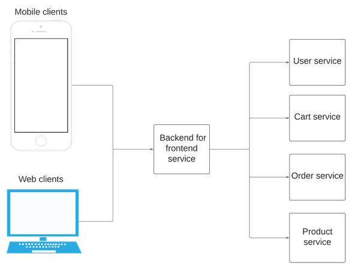
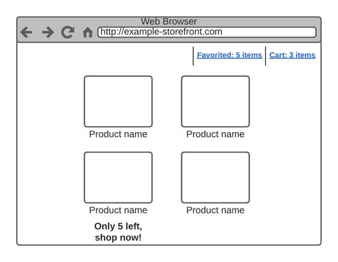
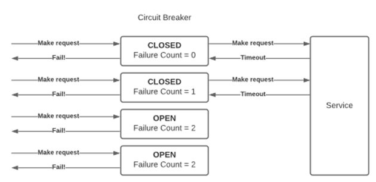

# 微服务

本章涵盖

- 微服务基础
- 后端换前端模式
- 使用 asyncio 处理微服务通信
- 使用 asyncio 处理失败和重试

许多 Web 应用程序被构建为单体应用程序。单体应用通常是指包含多个模块的大中型应用程序，这些模块作为一个单元独立部署和管理。虽然这种模型本质上没有任何问题（单体应用程序非常好，甚至更可取，因为它们通常更简单），但它确实有其缺点。

例如，如果你对单体应用程序进行小幅更改，则需要部署整个应用程序，甚至是可能不受你的更改影响的部分。例如，一个单一的电子商务应用程序可能在一个应用程序中具有订单管理和产品列表端点，这意味着对产品端点的调整需要重新部署订单管理代码。微服务架构可以帮助解决这些痛点。我们可以为订单和产品创建单独的服务，然后一项服务的更改不会影响另一项服务。

在本章中，我们将更多地了解微服务及其背后的动机。我们将学习一种称为 backend-for-frontend 的模式，并将其应用于电子商务微服务架构。然后我们将使用 aiohttp 和 asyncpg 实现这个 API，学习如何使用并发来帮助我们提高应用程序的性能。我们还将学习如何正确处理故障并使用断路器模式重试以构建更强大的应用程序。

## 10.1 为什么是微服务？
首先，让我们定义什么是微服务。这是一个相当棘手的问题，因为没有标准化的定义，根据你问的人，你可能会得到不同的答案。通常，微服务遵循一些指导原则：

它们是松散耦合且可独立部署的。
他们有自己独立的堆栈，包括数据模型。
它们通过 REST 或 gRPC 等协议相互通信。
他们遵循"单一责任"原则；也就是说，一个微服务应该"做一件事，把它做好"。
让我们将这些原则应用于电子商务店面的具体示例。像这样的应用程序有用户向我们假设的组织提供运输和支付信息，然后他们购买我们的产品。在单体架构中，我们有一个应用程序和一个数据库来管理用户数据、帐户数据（例如他们的订单和运输信息）以及我们可用的产品。在微服务架构中，我们将有多个服务，每个服务都有自己的数据库来处理不同的问题。我们可能有一个带有自己的数据库的产品 API，它只处理产品周围的数据。我们可能有一个带有自己的数据库的用户 API，它处理用户帐户信息等。

为什么我们会选择这种架构风格而不是单体架构？单体对于大多数应用来说都非常好；它们更易于管理。进行代码更改，并运行所有测试套件以确保你看似很小的更改不会影响系统的其他区域。运行测试后，将应用程序部署为一个单元。你的应用程序在负载下是否表现不佳？在这种情况下，你可以水平或垂直扩展，部署更多应用程序实例或部署到更强大的机器以处理额外用户。虽然管理单体在操作上更简单，但这种简单性也有可能很重要的缺点，具体取决于你想要做出的权衡。

### 10.1.1 代码复杂度
随着应用程序的增长和获得新功能，它的复杂性也在增加。数据模型可能变得更加耦合，导致无法预料和难以理解的依赖关系。技术债务越来越大，使开发变得更慢、更复杂。虽然任何成长中的系统都是如此，但具有多个关注点的大型代码库可能会加剧这种情况。

### 10.1.2 可扩展性
在单体架构中，如果你需要扩展，则需要添加整个应用程序的更多实例，这可能会导致技术成本效率低下。在电子商务应用程序的上下文中，你获得的订单通常比浏览产品的人少得多。在单体架构中，要扩大规模以处理更多查看你产品的人，你还需要扩大你的订单能力。在微服务架构中，如果没有问题，你可以只扩展产品服务并保持订单服务不变。

### 10.1.3 团队和堆栈独立性
随着开发团队的壮大，新的挑战也随之出现。想象一下，你有五个团队在同一个单一的代码库上工作，每个团队每天提交几次代码。合并冲突将成为每个人都需要处理的日益严重的问题，跨团队协调部署也是如此。对于独立的、松散耦合的微服务，这不再是一个问题。如果一个团队拥有一项服务，他们可以在很大程度上独立地处理和部署它。如果需要，这也允许团队使用不同的技术堆栈，一种服务可以使用 Java，另一种使用 Python。

### 10.1.4 asyncio 如何提供帮助？
微服务通常需要通过 REST 或 gRPC 等协议相互通信。由于我们可能同时与多个微服务通信，这开启了并发运行请求的可能性，创造了我们在同步应用程序中没有的效率。

除了我们从异步堆栈中获得的资源效率优势之外，我们还获得了异步 API 的错误处理优势，例如等待和收集，它允许我们从一组协程或任务中聚合异常。如果一组特定的请求花费的时间太长或者该组的一部分出现异常，我们可以优雅地处理它们。现在我们了解了微服务背后的基本动机，让我们学习一种常见的微服务架构模式并看看如何实现它。

## 10.2 介绍后端换前端模式
当我们在微服务架构中构建 UI 时，我们通常需要从多个服务中获取数据来创建特定的 UI 视图。例如，如果我们正在构建用户订单历史 UI，我们可能必须从订单服务中获取用户的订单历史并将其与来自产品服务的产品数据合并。根据要求，我们可能还需要来自其他服务的数据。

这给我们的前端客户带来了一些挑战。首先是用户体验问题。对于独立服务，我们的 UI 客户端必须通过 Internet 对每项服务进行一次调用。这带来了加载 UI 的延迟和时间问题。我们不能假设我们所有的用户都会有良好的互联网连接或快速的计算机；有些可能在接收信号较差的地区的手机上，有些可能在较旧的计算机上，有些可能在根本无法访问高速互联网的发展中国家。如果我们对 5 个服务发出 5 个慢速请求，那么可能会导致比发出一个慢速请求更多的问题。

除了网络延迟挑战之外，我们还面临与良好软件设计原则相关的挑战。想象一下，我们既有基于 Web 的 UI，也有 iOS 和 Android 移动 UI。如果我们直接调用每个服务并合并生成的响应，我们需要在三个不同的客户端之间复制逻辑来执行此操作，这是多余的，并且会使我们面临客户端之间逻辑不一致的风险。



图 10.1 后端换前端模式

虽然有许多微服务设计模式，但可以帮助我们解决上述问题的一种是后端换前端模式。在这个设计模式中，我们创建了一个新的服务来进行这些调用并聚合响应，而不是我们的 UI 直接与我们的服务通信。这解决了我们的问题，我们可以只提出一个请求，而不是提出多个请求，从而减少我们在互联网上的往返行程。我们还可以在此服务中嵌入与故障转移或重试相关的任何逻辑，从而为我们的客户节省重复相同逻辑的工作，并在需要更改逻辑时引入一个地方供我们更新逻辑。这也为不同类型的客户端启用了多种后端换前端服务。我们需要与之通信的服务可能需要根据我们是移动客户端还是基于 Web 的 UI 而有所不同。如图 10.1 所示。现在我们了解了 backend-for-frontend 设计模式及其解决的问题，让我们应用它来为电子商务店面构建 backend-for-frontend 服务。

## 10.3 实现产品列表API
让我们为电子商务店面桌面体验的所有产品页面实现后端换前端模式。此页面显示我们网站上的所有可用产品，以及有关我们用户购物车和菜单栏中收藏项目的基本信息。为了增加销售额，当只有少数商品可用时，该页面会发出低库存警告。此页面顶部还有一个导航栏，其中包含有关我们用户最喜欢的产品的信息以及他们购物车中的数据。图 10.2 展示了我们的 UI。



图 10.2 产品列表页面模型

给定一个具有多个独立服务的微服务架构，我们需要从每个服务请求适当的数据并将它们拼接在一起以形成一个有凝聚力的响应。让我们首先定义我们需要的基本服务和数据模型。

### 10.3.1 用户喜爱的服务
该服务跟踪从用户到他们放在收藏夹列表中的产品 ID 的映射。接下来，我们需要实现这些服务来支持我们的后端换前端产品、库存、用户购物车和用户收藏。

> 用户购物车服务
>
> 这包含从用户 ID 到他们放入购物车的产品 ID 的映射；数据模型与用户喜欢的服务相同。

> 库存服务
>
> 这包含从产品 ID 到该产品的可用库存的映射。

> 产品服务
>
> 这包含产品信息，例如描述和 SKU。这类似于我们在第 9 章中围绕产品数据库实现的服务。

### 10.3.2 实现基础服务
让我们从为我们的库存服务实现一个 aiohttp 应用程序开始，因为我们将把它作为我们最简单的服务。对于这项服务，我们不会创建单独的数据模型；相反，我们只返回一个 0 到 100 之间的随机数来模拟可用库存。我们还将添加一个随机延迟来模拟我们的服务间歇性变慢，我们将使用它来演示如何处理我们的产品列表服务中的超时。出于开发目的，我们将在端口 8001 上托管此服务，因此它不会干扰我们在第 9 章中运行在端口 8000 上的产品服务。

清单 10.1 库存服务

```python
import asyncio
import random
from aiohttp import web
from aiohttp.web_response import Response
 
routes = web.RouteTableDef()
 
 
@routes.get('/products/{id}/inventory')
async def get_inventory(request: Request) -> Response:
    delay: int = random.randint(0, 5)
    await asyncio.sleep(delay)
    inventory: int = random.randint(0, 100)
    return web.json_response({'inventory': inventory})
 
 
app = web.Application()
app.add_routes(routes)
web.run_app(app, port=8001)
```

接下来，让我们实现用户购物车和用户喜爱的服务。这两者的数据模型相同，因此服务几乎相同，不同之处在于表名。让我们从"用户购物车"和"用户收藏"这两个数据模型开始。我们还将在这些表中插入一些记录，因此我们有一些数据可以开始。首先，我们将从用户购物车表开始。

清单 10.2 用户购物车表

```sql
CREATE TABLE user_cart(
    user_id    INT NOT NULL,
    product_id INT NOT NULL
);
 
INSERT INTO user_cart VALUES (1, 1);
INSERT INTO user_cart VALUES (1, 2);
INSERT INTO user_cart VALUES (1, 3);
INSERT INTO user_cart VALUES (2, 1);
INSERT INTO user_cart VALUES (2, 2);
INSERT INTO user_cart VALUES (2, 5);
```

接下来，我们将创建用户最喜欢的表并插入一些值；这看起来与上一张表非常相似。

清单 10.3 用户最喜欢的表格

```sql
CREATE TABLE user_favorite
(
    user_id    INT NOT NULL,
    product_id INT NOT NULL
);
 
INSERT INTO user_favorite VALUES (1, 1);
INSERT INTO user_favorite VALUES (1, 2);
INSERT INTO user_favorite VALUES (1, 3);
INSERT INTO user_favorite VALUES (3, 1);
INSERT INTO user_favorite VALUES (3, 2);
INSERT INTO user_favorite VALUES (3, 3);
```

为了模拟多个数据库，我们需要在各自的 Postgres 数据库中创建这些表。回想第 5 章，我们可以使用 psql 命令行实用程序运行任意 SQL，这意味着我们可以使用以下两个命令为用户收藏夹和用户购物车创建两个数据库：

```sh
sudo -u postgres psql -c "CREATE DATABASE cart;"
sudo -u postgres psql -c "CREATE DATABASE favorites;"
```

由于我们现在需要设置和断开与多个不同数据库的连接，让我们在我们的服务中创建一些可重用的代码来创建 asyncpg 连接池。我们将在我们的 aiohttp on_startup 和 on_cleanup 钩子中重用它。

清单 10.4 创建和拆除数据库池

```python
import asyncpg
from aiohttp.web_app import Application
from asyncpg.pool import Pool
 
DB_KEY = 'database'
 
 
async def create_database_pool(
        app: Application,
        host: str,
        port: int,
        user: str,
        database: str,
        password: str):
    pool: Pool = await asyncpg.create_pool(
        host=host,
        port=port,
        user=user,
        password=password,
        database=database,
        min_size=6,
        max_size=6
    )
    app[DB_KEY] = pool
 
 
async def destroy_database_pool(app: Application):
    pool: Pool = app[DB_KEY]
    await pool.close()
```

前面的清单应该类似于我们在第 5 章中编写的用于建立数据库连接的代码。在 create_database_pool 中，我们创建一个连接池，然后将其放入我们的 Application 实例中。在destroy_database_pool 中，我们从应用程序实例中获取连接池并关闭它。

接下来，让我们创建服务。在 REST 术语中，收藏夹和购物车都是特定用户的子实体。这意味着每个端点的根都将是用户，并将接受用户 ID 作为输入。例如，/users/3/favorites 将为用户 id 3 获取最喜欢的产品。首先，我们将创建用户最喜欢的服务：

清单 10.5 用户最喜欢的服务

```python
import functools
from aiohttp import web
from aiohttp.web_request import Request
from aiohttp.web_response import Response
from chapter_10.listing_10_4 import DB_KEY, create_database_pool, destroy_database_pool
 
routes = web.RouteTableDef()
 
 
@routes.get('/users/{id}/favorites')
async def favorites(request: Request) -> Response:
    try:
        str_id = request.match_info['id']
        user_id = int(str_id)
        db = request.app[DB_KEY]
        favorite_query = 'SELECT product_id from user_favorite where user_id = $1'
        result = await db.fetch(favorite_query, user_id)
        if result is not None:
            return web.json_response([dict(record) for record in result])
        else:
            raise web.HTTPNotFound()
    except ValueError:
        raise web.HTTPBadRequest()
 
 
app = web.Application()
app.on_startup.append(
    functools.partial(
        create_database_pool,
        host='127.0.0.1',
        port=5432,
        user='postgres',
        password='password',
        database='favorites'
    )
)
app.on_cleanup.append(destroy_database_pool)
 
app.add_routes(routes)
web.run_app(app, port=8002)
```

接下来，我们将创建用户购物车服务。这段代码看起来与我们之前的服务非常相似，主要区别在于我们将与 user_cart 表进行交互。

清单 10.6 用户购物车服务

```python
import functools
from aiohttp import web
from aiohttp.web_request import Request
from aiohttp.web_response import Response
from chapter_10.listing_10_4 import DB_KEY, create_database_pool, destroy_database_pool
 
routes = web.RouteTableDef()
 
 
@routes.get('/users/{id}/cart')
async def time(request: Request) -> Response:
    try:
        str_id = request.match_info['id']
        user_id = int(str_id)
        db = request.app[DB_KEY]
        favorite_query = 'SELECT product_id from user_cart where user_id = $1'
        result = await db.fetch(favorite_query, user_id)
        if result is not None:
            return web.json_response([dict(record) for record in result])
        else:
            raise web.HTTPNotFound()
    except ValueError:
        raise web.HTTPBadRequest()
 
 
app = web.Application()
app.on_startup.append(
    functools.partial(
        create_database_pool,
        host='127.0.0.1',
        port=5432,
        user='postgres',
        password='password',
        database='cart'
    )
)
app.on_cleanup.append(destroy_database_pool)
 
app.add_routes(routes)
web.run_app(app, port=8003)
```

最后，我们将实现产品服务。这将类似于我们在第 9 章中构建的 API，不同之处在于我们将从数据库中获取所有产品，而不仅仅是一个。通过以下清单，我们创建了四项服务来支持我们的理论电子商务店面！

清单 10.7 产品服务

```python
import functools
from aiohttp import web
from aiohttp.web_request import Request
from aiohttp.web_response import Response
from chapter_10.listing_10_4 import DB_KEY, create_database_pool, destroy_database_pool
 
routes = web.RouteTableDef()
 
 
@routes.get('/products')
async def products(request: Request) -> Response:
    db = request.app[DB_KEY]
    product_query = 'SELECT product_id, product_name FROM product'
    result = await db.fetch(product_query)
    return web.json_response([dict(record) for record in result])
 
 
app = web.Application()
app.on_startup.append(
    functools.partial(
        create_database_pool,
        host='127.0.0.1',
        port=5432,
        user='postgres',
        password='password',
        database='products'
    )
)
app.on_cleanup.append(destroy_database_pool)
 
app.add_routes(routes)
web.run_app(app, port=8000)
```

### 10.3.3 实现后端换前端服务
接下来，让我们构建 backend-for-frontend 服务。我们将首先根据 UI 的需求对我们的 API 提出一些要求。产品加载时间对我们的应用程序至关重要，因为我们的用户必须等待的时间越长，他们继续浏览我们网站的可能性就越小，他们购买我们产品的可能性就越小。这使得我们的要求集中在尽快向用户提供最少的可行数据：

API 不应等待产品服务超过 1 秒。如果时间超过 1 秒，我们应该响应超时错误（HTTP 代码 504），因此 UI 不会无限期挂起。
用户购物车和收藏夹数据是可选的。如果我们能在 1 秒内搞定，那就太好了！如果没有，我们应该只返回我们拥有的产品数据。
产品的库存数据也是可选的。如果我们不能得到它，只需返回产品数据。
有了这些要求，我们为自己提供了一些方法来绕过慢速服务或崩溃或有其他网络问题的服务。这使我们的服务以及使用它的用户界面更具弹性。虽然它可能并不总是拥有所有数据来提供完整的用户体验，但它足以创造一种可用的体验。即使结果是产品服务的灾难性失败，我们也不会让用户无限期地挂在忙碌的微调器或其他一些糟糕的用户体验中。

接下来，让我们定义我们希望我们的响应看起来像什么。导航栏所需的只是购物车和收藏夹列表中的商品数量，因此我们的响应只是将它们表示为标量值。由于我们的购物车或喜爱的服务可能会超时或出现错误，我们将允许此值为 null。对于我们的产品数据，我们只希望我们的普通产品数据增加库存值，因此我们将把这些数据添加到产品数组中。这意味着我们将收到类似于以下内容的响应：

```json
{
 "cart_items": 1,
 "favorite_items": null,
 "products": [
     {"product_id": 4, "inventory": 4},
     {"product_id": 3, "inventory": 65}
 ]
}
```

在这种情况下，用户的购物车中有一件商品。他们可能有最喜欢的项目，但结果为空，因为到达最喜欢的服务时出现问题。最后，我们有两种产品要展示，分别有 4 件和 65 件库存商品。

那么我们应该如何开始实现这个功能呢？我们需要通过 HTTP 与我们的 REST 服务进行通信，因此 aiohttp 的 Web 客户端功能是一个自然的选择，因为我们已经在使用该框架的 Web 服务器。接下来，我们提出什么请求，我们如何对它们进行分组和管理超时？首先，我们应该考虑我们可以同时运行的最多请求。我们可以同时运行的越多，理论上我们可以越快地向我们的客户返回响应。在我们的例子中，我们不能在获得产品 ID 之前询问库存，因此我们不能同时运行它，但是我们的产品、购物车和喜爱的服务并不相互依赖。这意味着我们可以使用诸如等待之类的异步 API 同时运行它们。使用带有超时的等待将为我们提供一个完成集，我们可以在其中检查哪些请求以错误完成，哪些请求在超时后仍在运行，让我们有机会处理任何失败。然后，一旦我们有了产品 ID 以及潜在的用户喜爱和购物车数据，我们就可以开始将我们的最终响应拼接在一起并将其发送回客户端。

我们将创建一个端点 /products/all 来执行此操作，以返回此数据。通常，我们希望在 URL、请求标头或 cookie 中的某处接受当前登录用户的 ID，因此我们可以在向下游服务发出请求时使用它。在这个例子中，为了简单起见，我们只是将这个 ID 硬编码给我们已经为其插入数据到数据库中的用户。

清单 10.8 产品后端换前端

```python
import asyncio
from asyncio import Task
import aiohttp
from aiohttp import web, ClientSession
from aiohttp.web_request import Request
from aiohttp.web_response import Response
import logging
from typing import Dict, Set, Awaitable, Optional, List
 
routes = web.RouteTableDef()
 
PRODUCT_BASE = 'http:/ /127.0.0.1:8000'
INVENTORY_BASE = 'http:/ /127.0.0.1:8001'
FAVORITE_BASE = 'http:/ /127.0.0.1:8002'
CART_BASE = 'http:/ /127.0.0.1:8003'
 
 
@routes.get('/products/all')
async def all_products(request: Request) -> Response:
    async with aiohttp.ClientSession() as session:
        products = asyncio.create_task(session.get(f'{PRODUCT_BASE}/products'))
        favorites = asyncio.create_task(session.get(f'{FAVORITE_BASE}/users/3/favorites'))
        cart = asyncio.create_task(session.get(f'{CART_BASE}/users/3/cart'))
 
        requests = [products, favorites, cart]
        done, pending = await asyncio.wait(requests, timeout=1.0)                     ❶
 
        if products in pending:                                                       ❷
            [request.cancel() for request in requests]
            return web.json_response({'error': 'Could not reach products service.'}, status=504)
        elif products in done and products.exception() is not None:
            [request.cancel() for request in requests]
            logging.exception('Server error reaching product service.', exc_info=products.exception())
            return web.json_response({'error': 'Server error reaching products service.'}, status=500)
        else:
            product_response = await products.result().json()                         ❸
            product_results: List[Dict] = await get_products_with_inventory(session, product_response)
 
            cart_item_count: Optional[int] = await get_response_item_count(
                cart,
                done,
                pending,
                'Error getting user cart.'
            )
            favorite_item_count: Optional[int] = await get_response_item_count(
                favorites,
                done,
                pending,
                'Error getting user favorites.'
            )
            return web.json_response(
                {
                    'cart_items': cart_item_count,
                    'favorite_items': favorite_item_count,
                    'products': product_results
                }
            )
 
 
async def get_products_with_inventory(session: ClientSession, product_response) -> List[Dict]:    ❹
    def get_inventory(session: ClientSession, product_id: str) -> Task:
        url = f"{INVENTORY_BASE}/products/{product_id}/inventory"
        return asyncio.create_task(session.get(url))
 
    def create_product_record(product_id: int, inventory: Optional[int]) -> Dict:
        return {'product_id': product_id, 'inventory': inventory}
 
    inventory_tasks_to_product_id = {
        get_inventory(session, product['product_id']): product['product_id'] for product in product_response
    }
 
    inventory_done, inventory_pending = await asyncio.wait(inventory_tasks_to_product_id.keys(), timeout=1.0)
 
    product_results = []
 
    for done_task in inventory_done:
        if done_task.exception() is None:
            product_id = inventory_tasks_to_product_id[done_task]
            inventory = await done_task.result().json()
            product_results.append(create_product_record(product_id, inventory['inventory']))
        else:
            product_id = inventory_tasks_to_product_id[done_task]
            product_results.append(create_product_record(product_id, None))
            logging.exception(
                f'Error getting inventory for id {product_id}',
                exc_info=inventory_tasks_to_product_id[done_task].exception()
            )
 
    for pending_task in inventory_pending:
        pending_task.cancel()
        product_id = inventory_tasks_to_product_id[pending_task]
        product_results.append(create_product_record(product_id, None))
 
    return product_results
 
 
async def get_response_item_count(
    	task: Task,
        done: Set[Awaitable],
        pending: Set[Awaitable],
        error_msg: str) -> Optional[int]:                   ❺
    if task in done and task.exception() is None:
        return len(await task.result().json())
    elif task in pending:
        task.cancel()
    else:
        logging.exception(error_msg, exc_info=task.exception())
    return None
 
 
app = web.Application()
app.add_routes(routes)
web.run_app(app, port=9000)
```

❶ 创建任务来查询我们拥有的三个服务并同时运行它们。
❷ 如果产品请求超时，返回错误，我们无法继续。
❸ 从产品响应中提取数据，并使用它来获取库存数据。
❹ 给定产品响应，请求库存。
❺ 获取 JSON 数组响应中项目数的便捷方法
在前面的清单中，我们首先定义了一个名为 all_products 的路由处理程序。在 all_products 中，我们同时向我们的产品、购物车和喜爱的服务发送请求，给这些请求 1 秒等待完成。一旦它们全部完成，或者我们已经等待了 1 秒钟，我们就开始处理结果。

由于产品响应很关键，我们首先检查其状态。如果它仍然挂起或有异常，我们取消任何挂起的请求并向客户端返回错误。如果出现异常，我们会以 HTTP 500 错误响应，表明服务器存在问题。如果超时，我们会返回 504 错误，表明我们无法访问该服务。这种特殊性为我们的客户提供了他们是否应该再试一次的提示，也为我们提供了对我们可能进行的任何监控和更改有用的更多信息（例如，我们可以有专门用于观察 504 响应率的警报）。

如果我们从产品服务获得了成功的响应，我们现在可以开始处理它并询问库存编号。我们在一个名为 get_products_with_inventory 的辅助函数中完成这项工作。在这个辅助函数中，我们从响应正文中提取产品 ID，并使用它们来构造对库存服务的请求。由于我们的库存服务一次只接受一个产品 ID（理想情况下，你可以将它们批处理到一个请求中，但我们会假设管理库存服务的团队对这种方法有问题），我们将创建为每个产品请求库存的任务列表。我们将再次将它们传递给等待协程，给它们 1 秒的时间来完成。

由于库存数量是可选的，一旦我们的超时时间到了，我们就会开始处理已完成和待处理的库存请求集中的所有内容。如果我们从库存服务获得成功响应，我们将创建一个字典，其中包含产品信息以及库存编号。如果出现异常或请求仍在待处理集中，我们将创建一条记录，其中库存为 None，表示我们无法检索它。当我们将响应转换为 JSON 时，使用 None 会给我们一个空值。

最后，我们检查购物车和最喜欢的回复。对于这两个请求，我们需要做的就是计算返回的项目数。由于这两个服务的逻辑几乎相同，我们创建了一个帮助方法来计算名为 get_response_item_count 的项目。在 get_response_item_count 中，如果我们从购物车或收藏服务中获得成功的结果，它将是一个 JSON 数组，因此我们计算并返回该数组中的项目数。如果出现异常或请求花费的时间超过 1 秒，我们将结果设置为 None，因此我们在 JSON 响应中得到一个空值。

这种实现为我们提供了一种相当稳健的方式来处理我们的非关键服务的故障和超时，确保我们即使在下游问题的结果中也能快速给出合理的响应。对下游服务的单个请求不会花费超过 1 秒的时间，这为我们的服务有多慢创建了一个近似上限。然而，虽然我们已经创建了一些相当强大的东西，但仍有一些方法可以使它对问题更具弹性。

### 10.3.4 重试失败的请求
我们第一个实现的一个问题是，它悲观地假设如果我们从服务中获得异常，我们会假设我们无法获得结果并继续前进。虽然这是有道理的，但服务问题可能是暂时的。例如，可能存在很快消失的网络故障，我们正在使用的任何负载均衡器可能存在临时问题，或者可能存在任何其他临时问题。

在这些情况下，重试几次并在重试之间稍作延迟是有意义的。如果我们对失败感到悲观，这使错误有机会清除，并且可以为我们的用户提供更多数据。这当然伴随着让我们的用户等待更长时间的权衡，可能只是为了看到他们本来会遇到的同样的失败。

要实现这个功能，wait_for 协程函数是一个完美的候选。它会引发我们得到的任何异常，并让我们指定超时。如果我们超过该超时，它会引发 TimeoutException 并取消我们开始的任务。让我们尝试创建一个可重用的重试协程来为我们执行此操作。我们将创建一个重试协程函数，该函数接收协程以及重试次数。如果我们传入的协程失败或超时，我们将重试到我们指定的次数。

清单 10.9 重试协程

```python
import asyncio
import logging
from typing import Callable, Awaitable
 
 
class TooManyRetries(Exception):
    pass
 
 
async def retry(coro: Callable[[], Awaitable], max_retries: int, timeout: float, retry_interval: float):
    for retry_num in range(0, max_retries):
        try:
            return await asyncio.wait_for(coro(), timeout=timeout)                                           ❶
        except Exception as e:
            logging.exception(f'Exception while waiting (tried {retry_num} times), retrying.', exc_info=e)   ❷
            await asyncio.sleep(retry_interval)
    raise TooManyRetries()                                                                                   ❸
```

❶ 等待指定超时的响应。
❷ 如果我们得到一个异常，记录它并在重试间隔内休眠。
❸ 如果我们失败了太多次，提出一个异常来表明这一点。
在前面的清单中，我们首先创建了一个自定义异常类，当我们在最大重试次数后仍然失败时将引发该异常类。这将让任何调用者捕捉到这个异常并在他们认为合适的时候处理这个特定问题。重试协程接受一些参数。第一个参数是一个可调用的，它返回一个可等待的；这是我们将重试的协程。第二个参数是我们想要重试的次数，最后一个参数是超时时间和失败后等待重试的时间间隔。我们创建一个循环，将协程包装在 wait_for 中，如果成功完成，我们返回结果并退出函数。如果出现错误、超时或其他情况，我们会捕获异常，记录它，并在指定的间隔时间内休眠，在我们休眠后再次重试。如果我们的循环在没有对我们的协程进行无错误调用的情况下完成，我们会引发一个 TooManyRetries 异常。

我们可以通过创建几个展示我们想要处理的失败行为的协程来测试这一点。第一，总是抛出异常，第二，总是超时。

清单 10.10 测试重试协程

```python
import asyncio
from chapter_10.listing_10_9 import retry, TooManyRetries
 
 
async def main():
    async def always_fail():
        raise Exception("I've failed!")
 
    async def always_timeout():
        await asyncio.sleep(1)
 
    try:
        await retry(always_fail, max_retries=3, timeout=.1, retry_interval=.1)
    except TooManyRetries:
        print('Retried too many times!')
 
    try:
        await retry(always_timeout, max_retries=3, timeout=.1, retry_interval=.1)
    except TooManyRetries:
        print('Retried too many times!')
 
 
asyncio.run(main())
```

对于两次重试，我们将超时和重试间隔定义为 100 毫秒，最大重试量为 3。这意味着我们给协程 100 毫秒的时间来完成，如果它在这段时间内没有完成，或者失败，我们会等待 100 毫秒，然后再试一次。运行这个清单，你应该看到每个协程尝试运行 3 次，最后打印 Retried too many times!，导致类似于以下的输出（为简洁起见省略了回溯）：

```sh
ERROR:root:Exception while waiting (tried 1 times), retrying.
Exception: I've failed!
ERROR:root:Exception while waiting (tried 2 times), retrying.
Exception: I've failed!
ERROR:root:Exception while waiting (tried 3 times), retrying.
Exception: I've failed!
Retried too many times!
ERROR:root:Exception while waiting (tried 1 times), retrying.
ERROR:root:Exception while waiting (tried 2 times), retrying.
ERROR:root:Exception while waiting (tried 3 times), retrying.
Retried too many times!
```

使用它，我们可以为我们的产品后端添加一些简单的重试逻辑。例如，假设我们想重试对产品、购物车和收藏服务的初始请求几次，然后再考虑它们的错误不可恢复。我们可以通过将每个请求包装在重试协程中来做到这一点，如下所示：

```python
product_request = functools.partial(session.get, f'{PRODUCT_BASE}/products')
favorite_request = functools.partial(session.get, f'{FAVORITE_BASE}/users/5/favorites')
cart_request = functools.partial(session.get, f'{CART_BASE}/users/5/cart')
 
products = asyncio.create_task(
    retry(
        product_request,
        max_retries=3,
        timeout=.1,
        retry_interval=.1
    )
)
 
favorites = asyncio.create_task(
    retry(
        favorite_request,
        max_retries=3,
        timeout=.1,
        retry_interval=.1
    )
)
 
cart = asyncio.create_task(
    retry(
        cart_request,
        max_retries=3,
        timeout=.1,
        retry_interval=.1
    )
)
 
requests = [products, favorites, cart]
done, pending = await asyncio.wait(requests, timeout=1.0)
```

在此示例中，我们最多尝试每个服务 3 次。这使我们能够从可能是暂时的服务问题中恢复过来。虽然这是一种改进，但还有另一个潜在问题可能会损害我们的服务。例如，如果我们的产品服务总是超时怎么办？

### 10.3.5 断路器模式
我们在实现中仍然存在的一个问题是，当一项服务始终足够慢以至于它总是超时时，就会发生这种情况。当下游服务负载不足、发生其他网络问题或大量其他应用程序或网络错误时，可能会发生这种情况。

你可能会问："好吧，我们的应用程序优雅地处理了超时；用户在看到错误或获取部分数据之前不会等待超过 1 秒，所以有什么问题？"你问的没错。然而，虽然我们将系统设计得稳健且有弹性，但请考虑用户体验。例如，如果购物车服务遇到问题，总是需要 1 秒才能超时，这意味着所有用户都将等待 1 秒来等待服务的结果。

在这种情况下，由于购物车服务的这个问题可能会持续一段时间，当我们知道这个问题很可能发生时，任何点击我们后端换前端的人都会被卡住等待 1 秒。有没有办法让可能失败的呼叫短路，以免给用户造成不必要的延迟？

有一个恰当命名的模式来处理这个问题，称为断路器模式。由 Michael Nygard 的书 Release It (The Pragmatic Bookshelf, 2017) 推广，这种模式让我们"翻转断路器"，当我们在每个时间段内出现指定数量的错误时，我们可以使用它来绕过慢速服务，直到它的问题得到了解决，确保我们对用户的响应保持尽可能快。

与电气断路器非常相似，基本断路器模式有两种与之相关的状态，与电气面板上的普通断路器相同：打开状态和关闭状态。封闭状态是一条幸福的道路；我们向服务发出请求，它正常返回。开路状态发生在电路跳闸时。在这种状态下，我们不会费心去调用服务，因为我们知道它有问题；相反，我们立即返回一个错误。断路器模式阻止我们向糟糕的服务供电。除了这两种状态之外，还有一种"半开"状态。当我们在某个时间间隔后处于打开状态时，就会发生这种情况。在这种状态下，我们发出一个请求以检查服务问题是否已修复。如果是，我们关闭断路器，如果不是，我们保持打开状态。为了使我们的示例简单，我们将跳过半开状态，只关注关闭和打开状态，如图 10.3 所示。



图 10.3 在两次故障后打开的断路器。一旦打开，所有请求都会立即失败。

让我们实现一个简单的断路器来了解它是如何工作的。我们将允许断路器的用户指定时间窗口和最大故障次数。如果在时间窗口内发生的错误超过最大数量，我们将打开断路器并使任何其他调用失败。我们将使用一个类来执行此操作，该类接受我们希望运行的协程并跟踪我们是处于打开还是关闭状态。

清单 10.11 一个简单的断路器

```python
import asyncio
from datetime import datetime, timedelta
 
 
class CircuitOpenException(Exception):
    pass
 
 
class CircuitBreaker:
 
    def __init__(
            self,
            callback,
            timeout: float,
            time_window: float,
            max_failures: int,
            reset_interval: float):
        self.callback = callback
        self.timeout = timeout
        self.time_window = time_window
        self.max_failures = max_failures
        self.reset_interval = reset_interval
        self.last_request_time = None
        self.last_failure_time = None
        self.current_failures = 0
 
    async def request(self, *args, **kwargs):                   ❶
        if self.current_failures >= self.max_failures:
            if datetime.now() > self.last_request_time + timedelta(seconds=self.reset_interval):
                self._reset('Circuit is going from open to closed, resetting!')
                return await self._do_request(*args, **kwargs)
            else:
                print('Circuit is open, failing fast!')
                raise CircuitOpenException()
        else:
            if self.last_failure_time and datetime.now() > self.last_failure_time + timedelta(seconds=self.time_window):
                self._reset('Interval since first failure elapsed, resetting!')
            print('Circuit is closed, requesting!')
            return await self._do_request(*args, **kwargs)
 
    def _reset(self, msg: str):                                ❷
        print(msg)
        self.last_failure_time = None
        self.current_failures = 0
 
    async def _do_request(self, *args, **kwargs):              ❸
        try:
            print('Making request!')
            self.last_request_time = datetime.now()
            return await asyncio.wait_for(self.callback(*args, **kwargs), timeout=self.timeout)
        except Exception as e:
            self.current_failures = self.current_failures + 1
            if self.last_failure_time is None:
                self.last_failure_time = datetime.now()
            raise
```

❶ 提出请求，如果我们超过了失败次数，则快速失败。
❷ 重置我们的计数器和上次失败时间。
❸ 提出请求，记录我们有多少次失败以及上次发生的时间。
我们的断路器类接受五个构造函数参数。前两个是我们希望与断路器一起运行的回调和一个超时，它表示在超时失败之前我们将允许回调运行多长时间。接下来的三个与处理故障和重置有关。 max_failure 参数是我们在打开电路之前的 time_window 秒内允许的最大故障数。 reset_interval 参数是在发生 max_failure 故障后，我们等待将断路器从打开状态重置为关闭状态的秒数。

然后我们定义一个协程方法请求，它调用我们的回调并跟踪我们有多少失败，如果没有错误则返回回调的结果。当我们遇到故障时，我们会在计数器 failure_count 中跟踪它。如果失败计数超过我们在指定时间间隔内设置的 max_failure 阈值，则任何进一步的 request 调用都会引发 CircuitOpenException。如果重置间隔已过，我们将 failure_count 重置为零并再次开始发出请求（如果我们的断路器已关闭，则可能未关闭）。

现在，让我们通过一个简单的示例应用程序来看看我们的断路器。我们将创建一个只休眠 2 秒的 slow_callback 协程。然后我们将在断路器中使用它，设置一个短暂的超时，让我们轻松地跳闸断路器。

清单 10.12 正在运行的断路器

```python
import asyncio
from chapter_10.listing_10_11 import CircuitBreaker
async def main():
    async def slow_callback():
        await asyncio.sleep(2)
 
    cb = CircuitBreaker(
        slow_callback,
        timeout=1.0,
        time_window=5,
        max_failures=2,
        reset_interval=5
    )
 
    for _ in range(4):
        try:
            await cb.request()
        except Exception as e:
            pass
 
    print('Sleeping for 5 seconds so breaker closes...')
    await asyncio.sleep(5)
 
    for _ in range(4):
        try:
            await cb.request()
        except Exception as e:
            pass
 
 
asyncio.run(main())
```

在前面的清单中，我们创建了一个具有 1 秒超时时间的断路器，它允许在 5 秒间隔内发生两次故障，并在断路器打开后 5 秒后重置。然后我们尝试快速向断路器发出四个请求。前两个应该在超时失败之前需要 1 秒，然后每个后续调用都会在断路器打开时立即失败。然后我们睡 5 秒；这让断路器的 reset_interval 过去了，所以它应该回到关闭状态并再次开始调用我们的回调。运行这个，你应该看到如下输出：

```sh
Circuit is closed, requesting!
Circuit is closed, requesting!
Circuit is open, failing fast!
Circuit is open, failing fast!
Sleeping for 5 seconds so breaker closes...
Circuit is going from open to closed, requesting!
Circuit is closed, requesting!
Circuit is open, failing fast!
Circuit is open, failing fast!
```

现在我们有了一个简单的实现，我们可以将它与我们的重试逻辑结合起来，并在我们的后端换前端中使用它。由于我们故意使库存服务变慢以模拟真实的遗留服务，因此这是添加断路器的自然场所。我们将设置 500 毫秒的超时并在 1 秒内容忍 5 次失败，之后我们将设置 30 秒的重置间隔。我们需要将我们的 get_inventory 函数重写为一个协程来执行此操作：

```python
async def get_inventory(session: ClientSession, product_id: str):
    url = f"{INVENTORY_BASE}/products/{product_id}/inventory"
    return await session.get(url)
 
 
inventory_circuit = CircuitBreaker(get_inventory, timeout=.5, time_window=5.0, max_failures=3, reset_interval=30)
```

然后，在我们的 all_products 协程中，我们需要更改创建库存服务请求的方式。我们将创建一个调用库存断路器而不是 get_inventory 协程的任务：

```python
inventory_tasks_to_pid = {
  asyncio.create_task(inventory_circuit.request(session, product['product_id'])): product['product_id']
  for product in product_response
}
 
inventory_done, inventory_pending = await asyncio.wait(inventory_tasks_to_pid.keys(), timeout=1.0)
```

一旦我们进行了这些更改，你应该会在几次调用后看到产品的后端对前端的调用时间减少。由于我们正在模拟一个在负载下运行缓慢的库存服务，我们最终会在几次超时后触发断路器，然后任何后续调用都不会再向库存服务发出任何请求，直到断路器重置。面对缓慢且容易出错的库存服务，我们的后端换前端服务现在更加强大。如果需要增加这些调用的稳定性，我们也可以将其应用于所有其他调用。

在这个例子中，我们实现了一个非常简单的断路器来演示它是如何工作的以及如何使用 asyncio 构建它。这种模式有几个现有的实现以及许多其他功能来调整你的特定需求。如果你正在考虑这种模式，请在自己实现之前花一些时间研究可用的断路器库。

## 概括

- 与单体相比，微服务有几个好处，包括但不限于独立的可扩展性和可部署性。
- backend-for-frontend 模式是一种微服务模式，它聚合了来自多个下游服务的调用。我们已经学习了如何将微服务架构应用到电子商务用例中，使用 aiohttp 创建多个独立的服务。
- 我们使用了 asyncio 实用功能（例如等待）来确保我们的后端换前端服务保持弹性并对下游服务的故障做出响应。
- 我们创建了一个实用程序来使用 asyncio 和 aiohttp 管理 HTTP 请求的重试。
- 我们已经实现了一个基本的断路器模式，以确保服务故障不会对其他服务产生负面影响。