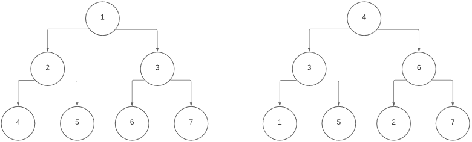

# 异步队列

本章涵盖

- 异步队列
- 为生产者-消费者工作流使用队列
- 在 Web 应用程序中使用队列
- 异步优先级队列
- 异步 LIFO 队列

在设计应用程序来处理事件或其他类型的数据时，我们经常需要一种机制来存储这些事件并将它们分发给一组工作人员。然后，这些工作人员可以根据这些事件同时执行我们需要执行的任何操作，从而节省时间，而不是按顺序处理事件。 asyncio 提供了一个异步队列实现，让我们可以做到这一点。我们可以将数据块添加到队列中，并让多个工作人员同时运行，从队列中提取数据并在可用时对其进行处理。

这些通常被称为生产者-消费者工作流。某些东西会产生我们需要处理的数据或事件；处理这些工作项可能需要很长时间。队列还可以帮助我们传输长时间运行的任务，同时保持响应式用户界面。我们将一个项目放在队列中以供以后处理，并通知用户我们已经在后台开始了这项工作。异步队列还有一个额外的好处是提供了一种限制并发的机制，因为每个队列通常允许有限数量的工作任务。这可以用于我们需要以类似于我们在第 11 章中看到的信号量的方式限制并发的情况。

在本章中，我们将学习如何使用异步队列来处理生产者-消费者工作流。我们将首先通过建立一个以收银员为消费者的示例杂货店队列来掌握基础知识。然后，我们将把它应用到订单管理 Web API，演示如何在让队列进程在后台工作的同时快速响应用户。我们还将学习如何按优先级顺序处理任务，这在一个任务更重要时首先处理时很有用，尽管稍后将其放入队列中。最后，我们将研究 LIFO（后进先出）队列并了解异步队列的缺点。

## 12.1 异步队列基础
队列是一种先进先出的数据结构。换句话说，当我们请求下一个元素时，队列中的第一个元素是第一个离开队列的元素。它们与你在杂货店结账时所在的队列没有太大区别。你在最后加入队伍，等待收银员检查你面前的任何人。一旦他们检查了某人，你就会在队列中移动，而在你之后加入的人会在你身后等待。然后，当你排在队列的第一个位置时，你会结账并完全离开队列。

正如我们所描述的，结帐队列是一个同步工作流。一名收银员一次结账一名顾客。如果我们重新设计队列以更好地利用并发性并更像超市收银台会怎样？将有多个收银员和一个队列，而不是一个收银员。只要有收银员，他们就可以将下一个人带到收银台。这意味着除了多个收银员同时结帐客户外，还有多个收银员同时从队列中引导客户。

这是异步队列让我们做的核心。我们将多个等待处理的工作项添加到队列中。然后，我们让多个工作人员在可用于执行任务时从队列中提取项目。

让我们通过构建我们的超市示例来探索这一点。我们会将我们的工人任务视为收银员，而我们的"工作项目"将是客户结账。我们将为客户提供收银员需要扫描的单独产品列表。有些项目比其他项目需要更长的时间来扫描；例如，香蕉必须称重并输入其 SKU 代码。酒精饮料需要经理检查客户的身份证。

对于我们的超市结账场景，我们将实现一些数据类来表示产品，用整数表示收银员结账所需的时间（以秒为单位）。我们还将建立一个客户类别，其中包含他们想购买的随机产品集。然后，我们将这些客户放入 asyncio 队列中，以代表我们的结帐行。我们还将创建几个工作任务来代表我们的收银员。这些任务将从队列中拉出客户，循环浏览他们的所有产品，并在结账所需的时间睡觉，以模拟结账过程。

清单 12.1 超市结账队列

```python
import asyncio
from asyncio import Queue
from random import randrange
from typing import List
 
 
class Product:
    def __init__(self, name: str, checkout_time: float):
        self.name = name
        self.checkout_time = checkout_time
 
 
class Customer:
    def __init__(self, customer_id: int, products: List[Product]):
        self.customer_id = customer_id
        self.products = products
 
 
async def checkout_customer(queue: Queue, cashier_number: int):
    while not queue.empty():                                              ❶
        customer: Customer = queue.get_nowait()
        print(
            f'Cashier {cashier_number} '
            f'checking out customer '
            f'{customer.customer_id}'
        )
        for product in customer.products:                                 ❷
            print(
                f"Cashier {cashier_number} "
                f"checking out customer "
                f"{customer.customer_id}'s {product.name}"
            )
            await asyncio.sleep(product.checkout_time)
        print(
            f'Cashier {cashier_number} '
            f'finished checking out customer '
            f'{customer.customer_id}'
        )
        queue.task_done()
 
 
async def main():
    customer_queue = Queue()
 
    all_products = [
        Product('beer', 2),
        Product('bananas', .5),
        Product('sausage', .2),
        Product('diapers', .2)
    ]
 
    for i in range(10):                                                   ❸
        products = [all_products[randrange(len(all_products))] for _ in range(randrange(10))]
        customer_queue.put_nowait(Customer(i, products))
    cashiers = [asyncio.create_task(checkout_customer(customer_queue, i)) for i in range(3)]            ❹
    await asyncio.gather(customer_queue.join(), *cashiers)
 
asyncio.run(main())
```

❶ 继续检查客户是否排队。
❷检查每个客户的产品。
❸ 用随机产品创建 10 个客户。
❹ 创建三个"收银员"或工人任务来结账客户。
在前面的清单中，我们创建了两个数据类：一个用于产品，一个用于超市客户。产品由产品名称和收银员在收银机中输入该项目所需的时间（以秒为单位）组成。客户有许多产品要带到收银台购买。我们还定义了一个 checkout_customer 协程函数，它完成了结账客户的工作。虽然我们的队列中有客户，但它使用 queue.get_nowait() 从队列的前面拉出一个客户，并使用 asyncio.sleep 模拟扫描产品的时间。客户签出后，我们调用 queue.task_done。这向队列发出信号，表明我们的工作人员已完成其当前工作项。在 Queue 类内部，当我们从队列中获取项目时，计数器会加一以跟踪剩余未完成任务的数量。当我们调用 task_done 时，我们告诉队列我们已经完成了，并且它会将这个计数减一（当我们谈论 join 时，我们需要这样做的原因很快就会变得有意义）。

在我们的主要协程函数中，我们创建一个可用产品列表并生成 10 个客户，每个客户都有随机产品。我们还为 checkout_customer 协程创建了三个工作任务，这些任务存储在一个名为收银员的列表中，类似于在我们想象中的超市工作的三个人类收银员。最后，我们等待收银员 checkout_customer 任务与 customer_queue.join() 协程一起使用收集完成。我们使用聚集，以便我们的收银员任务中的任何异常都会上升到我们的主要协程函数。加入协程阻塞，直到队列为空并且所有客户都已签出。当待处理工作项的内部计数器达到零时，该队列被认为是空的。因此，在你的工作人员中调用 task_done 很重要。如果你不这样做，join 协程可能会收到错误的队列视图，并且可能永远不会终止。

虽然客户的商品是随机生成的，但你应该会看到类似于以下内容的输出，表明每个工作任务（收银员）正在同时从队列中签出客户：

```sh
Cashier 0 checking out customer 0
Cashier 0 checking out customer 0's sausage
Cashier 1 checking out customer 1
Cashier 1 checking out customer 1's beer
Cashier 2 checking out customer 2
Cashier 2 checking out customer 2's bananas
Cashier 0 checking out customer 0's bananas
Cashier 2 checking out customer 2's sausage
Cashier 0 checking out customer 0's sausage
Cashier 2 checking out customer 2's bananas
Cashier 0 finished checking out customer 0
Cashier 0 checking out customer 3
```

我们的三位收银员同时开始从队列中结账。一旦他们检查完一位顾客，他们就会从队列中拉出另一位顾客，直到队列为空。

你可能会注意到，我们将项目放入队列并检索它们的方法的名称很奇怪：get_nowait 和 put_nowait。为什么每个方法的末尾都有一个 nowait ？从队列中获取和检索项目有两种方法：一种是协程和阻塞，另一种是非阻塞并且是常规方法。 get_nowait 和 put_nowait 变体立即执行非阻塞方法调用并返回。为什么我们需要阻塞队列插入或检索？

答案在于我们希望如何处理队列的上限和下限。这描述了当队列中有太多项目时发生的情况（上限）以及队列中没有项目时发生的情况（下限）。

回到我们的超市队列示例，让我们使用 get 和 put 的协程版本来解决两个不太现实的问题。

我们不太可能只有一行 10 位顾客同时出现，一旦线路空了，收银员就会完全停止工作。
我们的客户队列可能不应该是无限的；比如说，最新的理想游戏机刚刚问世，而你是镇上唯一一家可以携带它的商店。自然地，随之而来的是大规模的歇斯底里，你的商店里挤满了顾客。我们可能无法在商店里容纳 5,000 名顾客，因此我们需要一种方法将他们拒之门外或让他们在外面等候。
对于第一个问题，假设我们想重构我们的应用程序，以便我们每隔几秒随机生成一些客户来模拟一个真实的超市队列。在我们当前的 checkout_customer 实现中，我们在队列不为空时循环并使用 get_nowait 获取客户。由于我们的队列可能是空的，我们不能在 not queue.empty 上循环，因为即使没有人排队，我们的收银员也会有空，所以我们需要在工作协程中设置一个 while True。那么在这种情况下，当我们调用 get_nowait 并且队列为空时会发生什么？这很容易用几行代码测试出来；我们只需创建一个空队列并调用相关方法：

```python
import asyncio
from asyncio import Queue
 
 
async def main():
    customer_queue = Queue()
    customer_queue.get_nowait()
 
asyncio.run(main())
```

我们的方法将抛出 asyncio.queues.QueueEmpty 异常。虽然我们可以将其包装在 try catch 中并忽略此异常，但这并不完全有效，因为每当队列为空时，我们都会使我们的工作任务受 CPU 限制、旋转和捕获异常。在这种情况下，我们可以使用 get 协程方法。这将阻塞（以非 CPU 绑定的方式），直到一个项目在队列中进行处理并且不会引发异常。这相当于工人任务空闲，等待一些客户进入队列，让他们在收银台工作。

为了解决我们的第二个问题，即成千上万的客户试图同时排队，我们需要考虑我们队列的界限。默认情况下，队列是无界的，它们可以增长以存储无限量的工作项。理论上这是可以接受的，但在现实世界中，系统有内存限制，因此在我们的队列上设置一个上限以防止内存不足是一个好主意。在这种情况下，我们需要考虑当我们的队列已满时我们希望我们的行为是什么。让我们看看当我们创建一个只能容纳一个项目的队列并尝试使用 put_nowait 添加第二个时会发生什么：

```python
import asyncio
from asyncio import Queue
 
 
async def main():
    queue = Queue(maxsize=1)
 
    queue.put_nowait(1)
    queue.put_nowait(2)
 
asyncio.run(main())
```

在这种情况下，与 get_nowait 非常相似，put_nowait 会引发 asyncio.queues.QueueFull 类型的异常。和 get 一样，还有一个协程方法叫做 put。此方法将阻塞，直到队列中有空间。考虑到这一点，让我们重构我们的客户示例以使用 get 和 put 的协程变体。

清单 12.2 使用协程队列方法

```python
import asyncio
from asyncio import Queue
from random import randrange
 
 
class Product:
    def __init__(self, name: str, checkout_time: float):
        self.name = name
        self.checkout_time = checkout_time
 
 
class Customer:
    def __init__(self, customer_id, products):
        self.customer_id = customer_id
        self.products = products
 
 
async def checkout_customer(queue: Queue, cashier_number: int):
    while True:
        customer: Customer = await queue.get()
        print(
            f'Cashier {cashier_number} '
            f'checking out customer '
            f'{customer.customer_id}'
        )
        for product in customer.products:
            print(
                f"Cashier {cashier_number} "
                f"checking out customer "
                f"{customer.customer_id}'s {product.name}"
            )
            await asyncio.sleep(product.checkout_time)
        print(
            f'Cashier {cashier_number} '
            f'finished checking out customer '
            f'{customer.customer_id}'
        )
        queue.task_done()
 
 
def generate_customer(customer_id: int) -> Customer:    ❶
    all_products = [
        Product('beer', 2),
        Product('bananas', .5),
        Product('sausage', .2),
        Product('diapers', .2)
    ]
    products = [all_products[randrange(len(all_products))] for _ in range(randrange(10))]
    return Customer(customer_id, products)
 
 
async def customer_generator(queue: Queue):             ❷
    customer_count = 0
 
    while True:
        customers = [generate_customer(i) for i in range(customer_count, customer_count + randrange(5))]
        for customer in customers:
            print('Waiting to put customer in line...')
            await queue.put(customer)
            print('Customer put in line!')
        customer_count = customer_count + len(customers)
        await asyncio.sleep(1)
 
 
async def main():
    customer_queue = Queue(5)
 
    customer_producer = asyncio.create_task(customer_generator(customer_queue))
 
    cashiers = [asyncio.create_task(checkout_customer(customer_queue, i)) for i in range(3)]
 
    await asyncio.gather(customer_producer, *cashiers)
 
 
asyncio.run(main())
```

❶ 随机生成一个客户。
❷每秒产生几个随机客户。
在前面的清单中，我们创建了一个 generate_customer 协程，它使用随机的产品列表创建一个客户。除此之外，我们创建了一个 customer_generator 协程函数，该函数每秒生成一到五个随机客户，并使用 put 将它们添加到队列中。因为我们使用协程 put，如果我们的队列已满，customer_generator 将阻塞，直到队列有空闲空间。具体来说，这意味着如果队列中有五个客户并且生产者尝试添加第六个，则队列将阻塞，允许该客户进入队列，直到收银员检查某人腾出空间。我们可以将 customer_generator 视为我们的生产者，因为它产生客户供我们的收银员结账。

我们还将 checkout_customer 重构为永远运行，因为当队列为空时，我们的收银员仍待命。然后我们重构 checkout_customer 以使用队列获取协程，如果队列中没有客户，协程将阻塞。然后，在我们的主协程中，我们创建一个队列，一次允许五个客户排队，并创建三个同时运行的 checkout_customer 任务。我们可以将收银员视为我们的消费者；他们消费客户从队列中结帐。

此代码随机生成客户，但在某些时候，队列应该填满，使得收银员处理客户的速度不如生产者创建客户的速度。因此，我们将看到类似于以下内容的输出，其中生产者等待将客户添加到行中，直到客户完成结帐：

```sh
Waiting to put customer in line...
Cashier 1 checking out customer 7's sausage
Cashier 1 checking out customer 7's diapers
Cashier 1 checking out customer 7's diapers
Cashier 2 finished checking out customer 5
Cashier 2 checking out customer 9
Cashier 2 checking out customer 9's bananas
Customer put in line!
```

我们现在了解了异步队列如何工作的基础知识，但是由于我们通常不会在日常工作中构建超市模拟，让我们看一些真实世界的场景，看看我们如何将其应用到我们真正可能构建的应用程序中。

#### 12.1.1 Web 应用程序中的队列
当我们有一个可以在后台运行的潜在耗时的操作时，队列在 Web 应用程序中很有用。如果我们在 Web 请求的主协程中运行此操作，我们将阻止对用户的响应，直到操作完成，可能会给最终用户留下一个缓慢、无响应的页面。

想象一下，我们是电子商务组织的一部分，并且我们使用缓慢的订单管理系统进行操作。处理订单可能需要几秒钟的时间，但我们不想让用户等待他们的订单已经下达的响应。此外，订单管理系统不能很好地处理负载，所以我们想限制我们同时向它发出的请求数。在这种情况下，队列可以解决这两个问题。正如我们之前看到的，在添加更多块或引发异常之前，队列可以拥有我们允许的最大元素数量。这意味着，如果我们有一个有上限的队列，我们最多可以有许多我们创建的并发运行的消费者任务。这为并发性提供了自然限制。

队列还解决了用户等待响应时间过长的问题。将元素放入队列会立即发生，这意味着我们可以立即通知用户他们的订单已经下达，从而提供快速的用户体验。当然，在现实世界中，这可能会导致后台任务在没有通知用户的情况下失败，因此你需要某种形式的数据持久性和逻辑来解决这个问题。

为了尝试这个，让我们使用 aiohttp 创建一个简单的 Web 应用程序，它使用队列来运行后台任务。我们将使用 asyncio.sleep 模拟与慢速订单管理系统的交互。在现实世界的微服务架构中，你可能会通过 REST 与 aiohttp 或类似的库进行通信，但为了简单起见，我们将使用 sleep。

我们将创建一个 aiohttp 启动钩子来创建我们的队列以及一组将与慢速服务交互的工作任务。我们还将创建一个 HTTP POST 端点/订单，它将在队列中下订单（在这里，我们将为我们的工作任务生成一个随机数以休眠以模拟慢速服务）。将订单放入队列后，我们将返回 HTTP 200 和指示已下订单的消息。

我们还将在 aiohttp 关闭挂钩中添加一些优雅的关闭逻辑，因为如果我们的应用程序关闭，我们可能仍有一些订单正在处理。在关闭钩子中，我们将等到所有忙碌的工作人员完成。

清单 12.3 带有 Web 应用程序的队列

```python
import asyncio
from asyncio import Queue, Task
from typing import List
from random import randrange
from aiohttp import web
from aiohttp.web_app import Application
from aiohttp.web_request import Request
from aiohttp.web_response import Response
 
routes = web.RouteTableDef()
 
QUEUE_KEY = 'order_queue'
TASKS_KEY = 'order_tasks'
 
 
async def process_order_worker(worker_id: int, queue: Queue):       ❶
    while True:
        print(f'Worker {worker_id}: Waiting for an order...')
        order = await queue.get()
        print(f'Worker {worker_id}: Processing order {order}')
        await asyncio.sleep(order)
        print(f'Worker {worker_id}: Processed order {order}')
        queue.task_done()
 
 
@routes.post('/order')
async def place_order(request: Request) -> Response:
    order_queue = app[QUEUE_KEY]
    await order_queue.put(randrange(5))                            ❷
    return Response(body='Order placed!')
async def create_order_queue(app: Application):                    ❸
    print('Creating order queue and tasks.')
    queue: Queue = asyncio.Queue(10)
    app[QUEUE_KEY] = queue
    app[TASKS_KEY] = [asyncio.create_task(process_order_worker(i, queue)) for i in range(5)]
 
 
async def destroy_queue(app: Application):                         ❹
    order_tasks: List[Task] = app[TASKS_KEY]
    queue: Queue = app[QUEUE_KEY]
    print('Waiting for pending queue workers to finish....')
    try:
        await asyncio.wait_for(queue.join(), timeout=10)
    finally:
        print('Finished all pending items, canceling worker tasks...')
        [task.cancel() for task in order_tasks]
 
 
app = web.Application()
app.on_startup.append(create_order_queue)
app.on_shutdown.append(destroy_queue)
 
app.add_routes(routes)
web.run_app(app)
```

❶ 从队列中获取一个订单，然后处理它。
❷ 将订单放入队列，立即响应用户。
❸ 创建一个最多10个元素的队列，创建5个worker任务。
❹ 等待任何繁忙的任务完成。
在前面的清单中，我们首先创建了一个 process_order_worker 协程。这会从队列中拉出一个项目，在本例中是一个整数，然后休眠一段时间以模拟使用缓慢的订单管理系统。这个协程永远循环，不断地从队列中拉出项目并处理它们。

然后我们创建协程来分别设置和拆除队列 create_order_queue 和 destroy_order_queue。创建队列很简单，因为我们创建了一个最多包含 10 个元素的异步队列，我们创建了五个工作任务，将它们存储在我们的应用程序实例中。

销毁队列有点复杂。我们首先使用 Queue.join 等待队列完成对其所有元素的处理。由于我们的应用程序正在关闭，它将不再提供任何 HTTP 请求，因此没有其他订单可以进入我们的队列。这意味着任何已经在队列中的东西都将由一个工作人员处理，并且工作人员当前正在处理的任何事情也将完成。我们还将 join 包裹在 wait_ for 中，超时时间也为 10 秒。这是一个好主意，因为我们不希望一个失控的任务花费很长时间来阻止我们的应用程序关闭。

最后，我们定义我们的应用程序路线。我们在 /order 创建一个 POST 端点。该端点创建一个随机延迟并将其添加到队列中。将订单添加到队列后，我们会使用 HTTP 200 状态代码和一条短消息来响应用户。请注意，我们使用了 put 的协程变体，这意味着如果我们的队列已满，则请求将阻塞，直到消息在队列中，这可能需要一些时间。你可能希望使用 put_nowait 变体，然后以 HTTP 500 错误或其他错误代码进行响应，要求调用者稍后再试。在这里，我们对可能需要一些时间的请求进行了权衡，以便我们的订单始终排在队列中。你的应用程序可能需要"快速失败"行为，因此当队列已满时响应错误可能是你的用例的正确行为。

使用此队列，只要队列未满，我们的订单端点将在下订单时几乎立即响应。这为最终用户提供了快速流畅的订购体验——希望能让他们回头购买更多商品。

在 Web 应用程序中使用异步队列时要记住的一件事是队列的故障模式。如果我们的一个 API 实例由于某种原因崩溃了，比如内存不足，或者我们需要重新启动服务器以重新部署我们的应用程序，该怎么办？在这种情况下，我们将丢失队列中所有未处理的订单，因为它们只存储在内存中。有时，在队列中丢失物品并不是什么大问题，但对于客户订单，它可能是。

异步队列没有提供任务持久性或队列持久性的开箱即用概念。如果我们希望队列中的任务对这些类型的故障具有鲁棒性，我们需要在某处引入一种方法来保存我们的任务，例如数据库。然而，更正确的是，在支持任务持久性的 asyncio 之外使用单独的队列。 Celery 和 RabbitMQ 是可以持久保存到磁盘的任务队列的两个示例。

当然，使用单独的架构队列会增加复杂性。在具有持久任务的持久队列的情况下，它还带来了需要持久存储到磁盘的性能挑战。要为你的应用程序确定最佳架构，你需要仔细权衡仅内存中的异步队列与单独的架构组件之间的权衡。

#### 12.1.2 网络爬虫队列

如果我们的消费者产生更多的工作来放入队列，消费者任务也可以是生产者。以访问特定页面上所有链接的网络爬虫为例。你可以想象一名工作人员下载并扫描页面以获取链接。一旦工作人员找到链接，它就可以将它们添加到队列中。这允许其他可用的工作人员将链接拉入队列并同时访问它们，将他们遇到的任何链接添加回队列。

让我们构建一个执行此操作的爬虫。我们将创建一个无界队列（如果你担心内存溢出，你可能希望对其进行绑定）来保存 URL 以供下载。然后，我们的工作人员将从队列中提取 URL 并使用 aiohttp 下载它们。下载它们后，我们将使用流行的 HTML 解析器 Beautiful Soup 来提取链接以放回队列中。

至少对于这个应用程序，我们不想扫描整个互联网，所以我们只会扫描远离根页面的一组页面。我们称之为"最大深度"；如果我们的最大深度设置为三，这意味着我们只会跟随距离根目录三页的链接。

首先，让我们使用以下命令安装 Beautiful Soup 4.9.3 版：

```sh
pip install -Iv beautifulsoup4==4.9.3
```

我们将假设对 Beautiful Soup 有一些了解。你可以在 https://www.crummy.com/software/BeautifulSoup/bs4/doc 的文档中阅读更多内容。

我们的计划是创建一个工作协程，它将从队列中拉出一个页面并使用 aiohttp 下载它。完成此操作后，我们将使用 Beautiful Soup 从页面中获取表单 \<a href="url"> 的所有链接，并将它们添加回队列。

清单 12.4 一个基于队列的爬虫

```python
import asyncio
import aiohttp
import logging
from asyncio import Queue
from aiohttp import ClientSession
from bs4 import BeautifulSoup
 
 
class WorkItem:
    def __init__(self, item_depth: int, url: str):
        self.item_depth = item_depth
        self.url = url
 
 
async def worker(worker_id: int, queue: Queue, session: ClientSession, max_depth: int):
    print(f'Worker {worker_id}')
    while True:                                                                                     ❶
        work_item: WorkItem = await queue.get()
        print(f'Worker {worker_id}: Processing {work_item.url}')
        await process_page(work_item, queue, session, max_depth)
        print(f'Worker {worker_id}: Finished {work_item.url}')
        queue.task_done()
 
 
async def process_page(work_item: WorkItem, queue: Queue, session: ClientSession, max_depth: int):  ❷
    try:
        response = await asyncio.wait_for(session.get(work_item.url), timeout=3)
        if work_item.item_depth == max_depth:
            print(f'Max depth reached, for {work_item.url}')
        else:
            body = await response.text()
            soup = BeautifulSoup(body, 'html.parser')
            links = soup.find_all('a', href=True)
            for link in links:
                queue.put_nowait(WorkItem(work_item.item_depth + 1, link['href']))
    except Exception as e:
        logging.exception(f'Error processing url {work_item.url}')
 
 
async def main():                                                                                   ❸
    start_url = 'http:/ /example.com'
    url_queue = Queue()
    url_queue.put_nowait(WorkItem(0, start_url))
    async with aiohttp.ClientSession() as session:
        workers = [asyncio.create_task(worker(i, url_queue, session, 3)) for i in range(100)]
        await url_queue.join()
        [w.cancel() for w in workers]
 
 
asyncio.run(main())
```

❶ 从队列中抓取一个 URL 进行处理，然后开始下载。
❷ 下载 URL 内容，并解析页面中的所有链接，将它们放回队列中。
❸ 创建一个队列和 100 个工作任务来处理 URL。
在前面的清单中，我们首先定义了一个 WorkItem 类。这是一个简单的数据类，用于保存 URL 和该 URL 的深度。然后我们定义我们的工作者，它从队列中拉出一个 WorkItem 并调用 process_page。如果可以的话，process_page 协程函数会下载 URL 的内容（可能会发生超时或异常，我们只是记录并忽略）。然后它使用 Beautiful Soup 获取所有链接并将它们添加回队列以供其他工作人员处理。

在我们的主协程中，我们创建队列并使用我们的第一个 WorkItem 引导它。在这个例子中，我们硬编码 example.com，因为它是我们的根页面，所以它的深度为 0。然后我们创建一个 aiohttp 会话并创建 100 个工作人员，这意味着我们可以同时下载 100 个 URL，我们将其最大深度设置为 3。然后我们等待队列清空，并且所有工作人员都使用 Queue.join 完成。队列完成处理后，我们取消所有工作任务。当你运行此代码时，你应该会看到 100 个工作任务启动并开始从它下载的每个 URL 中查找链接，为你提供如下输出：

```sh
Found 1 links from http://example .com
Worker 0: Finished http://example .com
Worker 0: Processing https://www.iana.org/domains/example
Found 68 links from https://www.iana.org/domains/example
Worker 0: Finished https://www.iana.org/domains/example
Worker 0: Processing /
Worker 2: Processing /domains
Worker 3: Processing /numbers
Worker 4: Processing /protocols
Worker 5: Processing /about
Worker 6: Processing /go/rfc2606
Worker 7: Processing /go/rfc6761
Worker 8: Processing http://www.icann.org/topics/idn/
Worker 9: Processing http://www.icann.org/
```

工作人员将继续下载页面并处理链接，将它们添加到队列中，直到达到我们指定的最大深度。

我们现在已经通过构建一个虚假的超市结账线以及构建一个订单管理 API 和一个网络爬虫来了解异步队列的基础知识。到目前为止，我们的工人对队列中的每个元素都给予了同等的重视，他们只是把排在最前面的人拉出来工作。如果我们希望一些任务尽快发生，即使它们排在队列的后面怎么办？让我们看一下优先级队列，看看如何做到这一点。

## 12.2 优先队列

我们之前的队列示例以 FIFO 或先进先出的顺序处理项目。谁先排队，谁先处理。这在许多情况下都很有效，无论是在软件工程中还是在生活中。

然而，在某些应用程序中，将所有任务视为平等并不总是可取的。想象一下，我们正在构建一个数据处理管道，其中每个任务都是一个长时间运行的查询，可能需要几分钟。假设两个任务大致同时进入。第一个任务是低优先级的数据查询，而第二个任务是任务关键的数据更新，应该尽快处理。使用简单的队列，将处理第一个任务，让第二个更重要的任务等待第一个任务完成。想象一下第一个任务需要几个小时，或者如果我们所有的工人都很忙，我们的第二个任务可能会等待很长时间。

我们可以使用优先队列来解决这个问题，让我们的工作人员首先处理我们最重要的任务。在内部，优先级队列由堆（使用 heapq 模块）支持，而不是像简单队列那样的 Python 列表。为了创建一个 asyncio 优先级队列，我们创建了一个 asyncio.PriorityQueue 的实例。

我们不会在这里过多地讨论数据结构细节，但堆是一棵二叉树，其属性是每个父节点的值都小于其所有子节点的值（见图 12.1）。这与通常用于排序和搜索问题的二叉搜索树不同，二叉搜索树的唯一属性是节点的左侧子节点小于其父节点，而节点的右侧子节点更大。我们利用的堆的特性是最顶部的节点总是树中的最小元素。如果我们总是让最小的节点成为我们最高优先级的节点，那么高优先级的节点将永远是队列中的第一个。



图 12.1 左边是一棵满足堆属性的二叉树；右边是不满足堆属性的二叉搜索树

我们放入队列中的工作项不太可能是纯整数，因此我们需要某种方法来构造具有合理优先级规则的工作项。一种方法是使用元组，其中第一个元素是表示优先级的整数，第二个元素是任何任务数据。默认队列实现查看元组的第一个值来决定具有最高优先级的最低数字的优先级。让我们看一个将元组作为工作项的示例，以了解优先级队列如何工作的基础知识。

清单 12.5 带有元组的优先级队列

```python
import asyncio
from asyncio import Queue, PriorityQueue
from typing import Tuple
 
 
async def worker(queue: Queue):
    while not queue.empty():
        work_item: Tuple[int, str] = await queue.get()
        print(f'Processing work item {work_item}')
        queue.task_done()
 
 
async def main():
    priority_queue = PriorityQueue()
 
    work_items = [
        (3, 'Lowest priority'),
        (2, 'Medium priority'),
        (1, 'High priority')
    ]
 
    worker_task = asyncio.create_task(worker(priority_queue))
 
    for work in work_items:
        priority_queue.put_nowait(work)
 
    await asyncio.gather(priority_queue.join(), worker_task)
 
 
asyncio.run(main())
```

在前面的清单中，我们创建了三个工作项：一个具有高优先级，一个具有中等优先级，一个具有低优先级。然后我们以相反的优先级顺序将它们添加到优先级队列中，这意味着我们首先插入最低优先级的项目，最后插入最高优先级的项目。在普通队列中，这意味着我们将首先处理优先级最低的项目，但如果我们运行此代码，我们将看到以下输出：

```sh
Processing work item (1, 'High priority')
Processing work item (2, 'Medium priority')
Processing work item (3, 'Lowest priority')
```

这表明我们按优先级顺序处理工作项，而不是按它们插入队列的方式。元组适用于简单的情况，但如果我们的工作项中有大量数据，元组可能会变得混乱和混乱。有没有办法让我们创建一个可以按照我们想要的方式处理堆的类？事实上，我们可以做到这一点，最简单的方法是使用数据类（如果不能选择数据类，我们也可以实现适当的 dunder 方法 \_\_lt\_\_、\_\_le\_\_、\_\_gt\_\_ 和 \_\_ge\_\_）。

清单 12.6 具有数据类的优先级队列

```python
import asyncio
from asyncio import Queue, PriorityQueue
from dataclasses import dataclass, field
 
 
@dataclass(order=True)
class WorkItem:
    priority: int
    data: str = field(compare=False)
 
 
async def worker(queue: Queue):
    while not queue.empty():
        work_item: WorkItem = await queue.get()
        print(f'Processing work item {work_item}')
        queue.task_done()
 
 
async def main():
    priority_queue = PriorityQueue()
 
    work_items = [
        WorkItem(3, 'Lowest priority'),
        WorkItem(2, 'Medium priority'),
        WorkItem(1, 'High priority')
    ]
 
    worker_task = asyncio.create_task(worker(priority_queue))
 
    for work in work_items:
        priority_queue.put_nowait(work)
 
    await asyncio.gather(priority_queue.join(), worker_task)
 
 
asyncio.run(main())
```

在前面的清单中，我们创建了一个有序设置为 True 的数据类。然后我们添加一个优先级整数和一个字符串数据字段，将其排除在比较之外。这意味着当我们将这些工作项添加到队列中时，它们将仅按优先级字段排序。运行上面的代码，我们可以看到这是按正确的顺序处理的：

```sh
Processing work item WorkItem(priority=1, data='High priority')
Processing work item WorkItem(priority=2, data='Medium priority')
Processing work item WorkItem(priority=3, data='Lowest priority')
```

现在我们了解了优先级队列的基础知识，让我们将其转换回我们的订单管理 API 的早期示例。想象一下，我们有一些"超级用户"客户在我们的电子商务网站上花了很多钱。我们希望确保他们的订单始终首先得到处理，以确保为他们提供最佳体验。让我们修改前面的示例，为这些用户使用优先级队列。

清单 12.7 Web 应用程序中的优先级队列

```python
import asyncio
from asyncio import Queue, Task
from dataclasses import field, dataclass
from enum import IntEnum
from typing import List
from random import randrange
from aiohttp import web
from aiohttp.web_app import Application
from aiohttp.web_request import Request
from aiohttp.web_response import Response
 
routes = web.RouteTableDef()
 
QUEUE_KEY = 'order_queue'
TASKS_KEY = 'order_tasks'
 
 
class UserType(IntEnum):
    POWER_USER = 1
    NORMAL_USER = 2
 
 
@dataclass(order=True)                                        ❶
class Order:
    user_type: UserType
    order_delay: int = field(compare=False)
 
 
async def process_order_worker(worker_id: int, queue: Queue):
    while True:
        print(f'Worker {worker_id}: Waiting for an order...')
        order = await queue.get()
        print(f'Worker {worker_id}: Processing order {order}')
        await asyncio.sleep(order.order_delay)
        print(f'Worker {worker_id}: Processed order {order}')
        queue.task_done()
 
 
@routes.post('/order')
async def place_order(request: Request) -> Response:
    body = await request.json()
    user_type = UserType.POWER_USER if body['power_user'] == 'True' else UserType.NORMAL_USER
    order_queue = app[QUEUE_KEY]
    await order_queue.put(Order(user_type, randrange(5)))     ❷
    return Response(body='Order placed!')
 
 
async def create_order_queue(app: Application): 
    print('Creating order queue and tasks.')
    queue: Queue = asyncio.PriorityQueue(10)
    app[QUEUE_KEY] = queue
    app[TASKS_KEY] = [asyncio.create_task(process_order_worker(i, queue)) for i in range(5)]
 
 
async def destroy_queue(app: Application):
    order_tasks: List[Task] = app[TASKS_KEY]
    queue: Queue = app[QUEUE_KEY]
    print('Waiting for pending queue workers to finish....')
    try:
        await asyncio.wait_for(queue.join(), timeout=10)
    finally:
        print('Finished all pending items, canceling worker tasks...')
        [task.cancel() for task in order_tasks]
 
 
app = web.Application()
app.on_startup.append(create_order_queue)
app.on_shutdown.append(destroy_queue)
 
app.add_routes(routes)
web.run_app(app)
```

❶ 一个订单类，代表我们的工作项目，根据用户类型具有优先级。
❷ 将请求解析为订单。
前面的清单看起来非常类似于我们与慢速订单管理系统交互的初始 API，不同之处在于我们使用优先级队列并创建一个 Order 类来表示传入的订单。当我们收到一个传入订单时，我们现在希望它有一个有效负载，其中"超级用户"标志设置为对 VIP 用户设置为 True，对其他用户设置为 False。我们可以像这样用 cURL 命中这个端点

```sh
curl -X POST -d '{"power_user":"False"}' localhost:8080/order
```

传入所需的超级用户值。如果用户是高级用户，他们的订单将始终由任何可用的工作人员在普通用户之前处理。

可以提出优先级队列的一个有趣的极端情况是，当你一个接一个地添加具有相同优先级的两个工作项时会发生什么。工人是否按照插入的顺序处理它们？让我们做一个简单的例子来测试一下。

清单 12.8 工作项优先级关系

```python
import asyncio
from asyncio import Queue, PriorityQueue
from dataclasses import dataclass, field
 
 
@dataclass(order=True)
class WorkItem:
    priority: int
    data: str = field(compare=False)
 
 
async def worker(queue: Queue):
    while not queue.empty():
        work_item: WorkItem = await queue.get()
        print(f'Processing work item {work_item}')
        queue.task_done()

async def main():
    priority_queue = PriorityQueue()
 
    work_items = [
        WorkItem(3, 'Lowest priority'),
        WorkItem(3, 'Lowest priority second'),
        WorkItem(3, 'Lowest priority third'),
        WorkItem(2, 'Medium priority'),
        WorkItem(1, 'High priority')
    ]
 
    worker_task = asyncio.create_task(worker(priority_queue))
 
    for work in work_items:
        priority_queue.put_nowait(work)
 
    await asyncio.gather(priority_queue.join(), worker_task)
 
 
asyncio.run(main())
```

在前面的清单中，我们首先将三个低优先级任务放入队列中。我们可能希望这些按插入顺序进行处理，但是当我们运行它时，我们并没有完全得到这种行为：

```sh
Processing work item WorkItem(priority=1, data='High priority')
Processing work item WorkItem(priority=2, data='Medium priority')
Processing work item WorkItem(priority=3, data='Lowest priority third')
Processing work item WorkItem(priority=3, data='Lowest priority second')
Processing work item WorkItem(priority=3, data='Lowest priority')
```

事实证明，我们以插入它们的相反顺序处理低优先级项目。发生这种情况是因为底层堆排序算法不是稳定的排序算法，因为不能保证相等的项目处于相同的插入顺序。有优先级时的排序可能不是问题，但如果你关心它，你需要添加一个 tie-breaker 键，为你提供你想要的排序。执行此操作并保留插入顺序的一种简单方法是将项目计数添加到工作项，尽管有很多方法可以做到这一点。

清单 12.9 打破优先级队列中的关系

```python
import asyncio
from asyncio import Queue, PriorityQueue
from dataclasses import dataclass, field
 
 
@dataclass(order=True)
class WorkItem:
    priority: int
    order: int
    data: str = field(compare=False)
 
 
async def worker(queue: Queue):
    while not queue.empty():
        work_item: WorkItem = await queue.get()
        print(f'Processing work item {work_item}')
        queue.task_done()
 
 
async def main():
    priority_queue = PriorityQueue()
 
    work_items = [
        WorkItem(3, 1, 'Lowest priority'),
        WorkItem(3, 2, 'Lowest priority second'),
        WorkItem(3, 3, 'Lowest priority third'),
        WorkItem(2, 4, 'Medium priority'),
        WorkItem(1, 5, 'High priority')
    ]
 
    worker_task = asyncio.create_task(worker(priority_queue))
 
    for work in work_items:
        priority_queue.put_nowait(work)
 
    await asyncio.gather(priority_queue.join(), worker_task)
 
 
asyncio.run(main())
```

在前面的清单中，我们向 WorkItem 类添加了一个订单字段。然后，当我们插入工作项时，我们添加一个整数，表示我们将其插入队列的顺序。当优先级相同时，这将是我们订购的领域。在我们的例子中，这为我们提供了低优先级项目所需的插入顺序：

```sh
Processing work item WorkItem(priority=1, order=5, data='High priority')
Processing work item WorkItem(priority=2, order=4, data='Medium priority')
Processing work item WorkItem(priority=3, order=1, data='Lowest priority')
Processing work item WorkItem(priority=3, order=2, data='Lowest priority second')
Processing work item WorkItem(priority=3, order=3, data='Lowest priority third')
```

我们现在已经了解了如何以 FIFO 队列顺序和优先队列顺序处理工作项。如果我们想首先处理最近添加的工作项怎么办？接下来，让我们看看如何使用 LIFO 队列来执行此操作。

## 12.3 LIFO 队列
LIFO 队列在计算机科学界更常被称为堆栈。我们可以把这些想象成一堆扑克筹码：当你下注时，你从筹码顶部取出筹码（或"弹出"它们），当你希望赢得手牌时，你将筹码放回筹码顶部（或"推"他们）。当我们希望我们的工作人员首先处理最近添加的项目时，这些很有用。

我们只会构建一个简单的示例来演示工人处理元素的顺序。至于何时使用 LIFO 队列，这取决于你的应用程序需要处理队列中的项目的顺序。是否需要先处理队列中最近插入的项目？在这种情况下，你需要使用 LIFO 队列。

清单 12.10 一个 LIFO 队列

```python
import asyncio
from asyncio import Queue, LifoQueue
from dataclasses import dataclass, field
 
 
@dataclass(order=True)
class WorkItem:
    priority: int
    order: int
    data: str = field(compare=False)
 
 
async def worker(queue: Queue):
    while not queue.empty():
        work_item: WorkItem = await queue.get()           ❶
        print(f'Processing work item {work_item}')
        queue.task_done()
 
 
async def main():
    lifo_queue = LifoQueue()
 
    work_items = [
        WorkItem(3, 1, 'Lowest priority first'),
        WorkItem(3, 2, 'Lowest priority second'),
        WorkItem(3, 3, 'Lowest priority third'),
        WorkItem(2, 4, 'Medium priority'),
        WorkItem(1, 5, 'High priority')
    ]
 
    worker_task = asyncio.create_task(worker(lifo_queue))
 
    for work in work_items:
        lifo_queue.put_nowait(work)                       ❷
 
    await asyncio.gather(lifo_queue.join(), worker_task)
 
 
asyncio.run(main())
```

❶ 从队列中获取一个项目，或者从堆栈中"弹出"它。
❷ 将一个项目放入队列中，或将其"推"到堆栈上。
在前面的清单中，我们创建了一个 LIFO 队列和一组工作项。然后我们将它们一个接一个地插入队列中，将它们拉出并处理它们。运行它，你将看到以下输出：

```sh
Processing work item WorkItem(priority=1, order=5, data='High priority')
Processing work item WorkItem(priority=2, order=4, data='Medium priority')
Processing work item WorkItem(priority=3, order=3, data='Lowest priority third')
Processing work item WorkItem(priority=3, order=2, data='Lowest priority second')
Processing work item WorkItem(priority=3, order=1, data='Lowest priority first')
```

请注意，我们以与将它们插入队列相反的顺序处理队列中的项目。因为这是一个堆栈，所以这是有道理的，因为我们首先处理最近添加到队列中的工作项。

我们现在已经看到了异步队列库必须提供的所有队列风格。使用这些队列有什么陷阱吗？我们可以在应用程序中需要队列时使用它们吗？我们将在第 13 章讨论这个问题。

## 概括

- 异步队列是任务队列，在工作流中很有用，在这些工作流中，我们有生成数据的协程和负责处理该数据的协程。
- 队列将数据生成与数据处理分离，因为我们可以让生产者将项目放入队列中，然后多个工作人员可以独立并同时处理。
- 我们可以使用优先级队列为某些任务赋予优先级。这对于某些工作比其他工作更重要并且应始终首先处理的情况很有用。
- 异步队列不是分布式的，不是持久的，也不是持久的。如果你需要这些品质中的任何一种，则需要寻找一个单独的架构组件，例如 Celery 或 RabbitMQ。